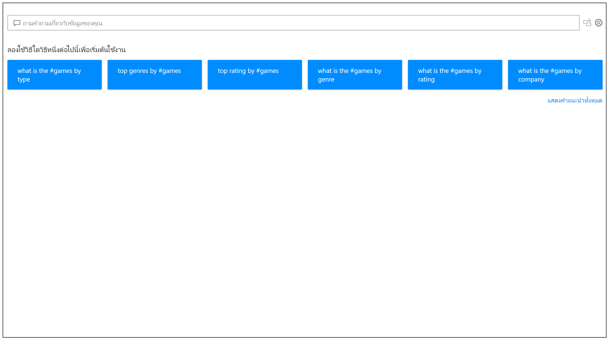
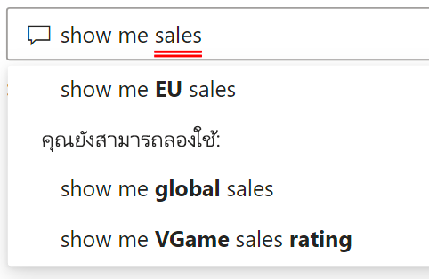
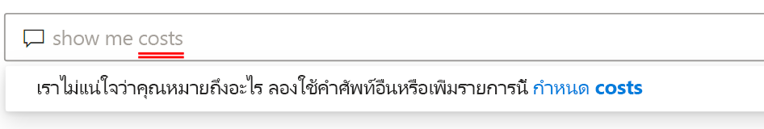
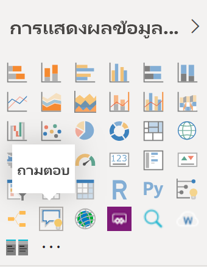
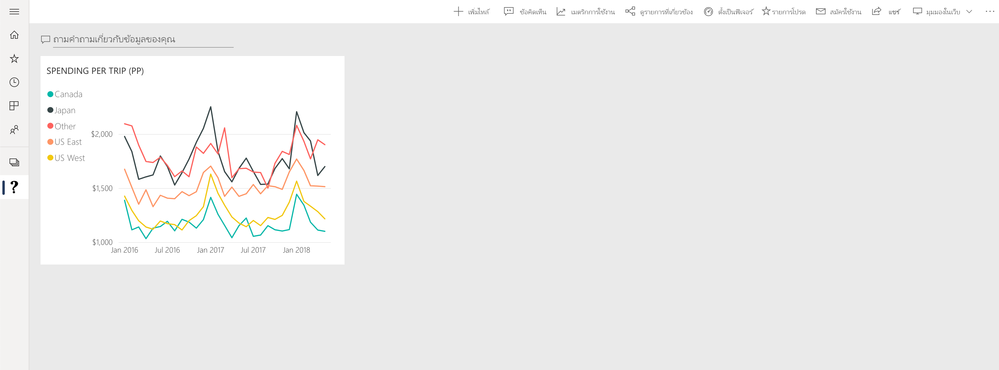

# ข้อมูลเบื้องต้นเกี่ยวกับระบบถามตอบของ Power BI

บางครั้งวิธีที่เร็วที่สุดในการให้ได้คำตอบจากข้อมูลของคุณคือการค้นหาข้อมูลของคุณโดยใช้ภาษาธรรมชาติ คุณลักษณะระบบถามตอบใน Power BI ช่วยให้คุณสามารถสำรวจข้อมูลของคุณด้วยคำพูดของคุณเองโดยใช้ภาษาธรรมชาติ ระบบถามตอบเป็นระบบแบบโต้ตอบ แถมยังสนุกด้วย บ่อยครั้งที่คำถามหนึ่งนำไปสู่อีกคำถามหนึ่งเนื่องจากการแสดงข้อมูลด้วยภาพแสดงให้เห็นเส้นทางที่น่าสนใจในการติดตาม การถามคำถามเป็นเพียงการเริ่มต้น สำรวจข้อมูลของคุณ เพื่อปรับแต่งหรือขยายคำถามของคุณ ค้นพบข้อมูลใหม่ หรือให้ความสำคัญกับรายละเอียดและซูมออกเพื่อให้ได้มุมมองที่กว้างขึ้น ประสบการณ์การใช้งานเป็นแบบโต้ตอบและรวดเร็วโดยใช้การจัดเก็บในหน่วยความจำ 

ระบบถามตอบของ Power BI เป็นระบบฟรีและพร้อมใช้งานสำหรับผู้ใช้ทุกคน ใน Power BI Desktop ผู้ออกแบบรายงานสามารถใช้ระบบถามตอบ เพื่อสำรวจข้อมูลและสร้างการแสดงผลข้อมูลด้วยภาพ ในบริการของ Power BI ทุกคนสามารถสำรวจข้อมูลของพวกเขาได้ด้วยระบบถามตอบ แอปมือถือของเรารองรับ Q&A ด้วย ซึ่งมาพร้อมกับผู้ช่วย Q&A เสมือนใน iOS และวิชวล Q&A บนอุปกรณ์ Android ถ้าคุณมีสิทธิ์ในการแก้ไขแดชบอร์ดหรือรายงาน คุณยังสามารถปักหมุดผลลัพธ์ของระบบถามตอบได้อีกด้วย

## วิธีการใช้ระบบถามตอบ

ถึงแม้ว่าคุณยังไม่เริ่มพิมพ์ ถามตอบจะแสดงหน้าจอใหม่ ด้วยคำแนะนำเพื่อช่วยคุณสร้างคำถามของคุณ เริ่มจากคำถามที่แนะนำหนึ่งคำถามหรือไม่ก็พิมพ์คำถามของคุณเอง ระบบถามตอบรองรับคำถามที่หลากหลาย รวมถึงแต่ไม่จำกัดเพียง:

- **ถามคำถามที่เป็นธรรมชาติ** ยอดขายใดมีรายได้สูงสุด?
- **ใช้การกรองวันที่ที่เกี่ยวข้อง** แสดงยอดขายของฉันในปีที่แล้ว
- **ส่งกลับเฉพาะผลิตภัณฑ์ยอดนิยม N รายการ** ผลิตภัณฑ์ 10 อันดับแรกตามยอดขาย
- **ระบุตัวกรอง** แสดงยอดขายในสหรัฐอเมริกา
- **ระบุเงื่อนไขที่ซับซ้อน** แสดงยอดขายที่หมวดหมู่ผลิตภัณฑ์คือหมวดหมู่ 1 หรือหมวดหมู่ 2
- **ส่งกลับวิชวลที่เฉพาะเจาะจง** แสดงยอดขายตามผลิตภัณฑ์เป็นแผนภูมิวงกลม
- **ใช้การรวมที่ซับซ้อน** แสดงมัธยฐานของยอดขายตามผลิตภัณฑ์
- **เรียงลำดับผลลัพธ์** แสดงรายชื่อประเทศที่มียอดขายสูงสุด 10 ประเทศโดยเรียงตามรหัสประเทศ
- **เปรียบเทียบข้อมูล** แสดงวันที่ตามยอดขายทั้งหมดเทียบกับต้นทุนทั้งหมด
- **ดูแนวโน้ม** แสดงยอดขายเมื่อเวลาผ่านไป

### เติมข้อความอัตโนมัติ

ในขณะที่คุณพิมพ์คำถามของคุณ ระบบถามตอบของ Power BI จะแสดงคำแนะนำที่เกี่ยวข้องและตามบริบทเพื่อช่วยให้คุณทำงานได้อย่างรวดเร็วด้วยภาษาธรรมชาติ ขณะที่คุณพิมพ์ คุณจะได้รับผลป้อนกลับและผลลัพธ์ทันที การใช้งานจะคล้ายกับการพิมพ์ในเครื่องมือค้นหา

### ขีดเส้นใต้สีแดง/น้ำเงิน

ระบบถามตอบจะแสดงคำพร้อมขีดเส้นใต้เพื่อช่วยให้คุณเห็นว่าคำใดที่ระบบเข้าใจหรือไม่รู้จัก ขีดเส้นใต้สีน้ำเงินทึบแสดงว่าระบบได้จับคู่คำกับเขตข้อมูลหรือค่าในแบบจำลองข้อมูลเรียบร้อยแล้ว ตัวอย่างด้านล่างแสดงว่าระบบถามตอบรู้จักคำว่า *ยอดขายใน EU*

บ่อยครั้งที่คุณพิมพ์คำลงในระบบถามตอบ แล้วระบบจะทำเครื่องหมายด้วยการขีดเส้นใต้สีแดง ขีดเส้นใต้สีแดงสามารถบ่งชี้ว่าอาจมีปัญหาหนึ่งในสองปัญหาเหล่านี้เกิดขึ้น ปัญหาประเภทแรกจะจัดประเภทเป็น *ความมั่นใจต่ำ* ถ้าคุณพิมพ์คำที่คลุมเครือหรือไม่ชัดเจน เขตข้อมูลจะถูกขีดเส้นใต้เป็นสีแดง ตัวอย่างอาจเป็นคำว่า 'ยอดขาย' อาจมีหลายเขตข้อมูลที่มีคำว่า 'ยอดขาย' ดังนั้นระบบจะใช้ขีดเส้นใต้สีแดงเพื่อพร้อมท์ให้คุณเลือกเขตข้อมูลที่คุณหมายถึง อีกตัวอย่างหนึ่งของปัญหาประเภทความมั่นใจต่ำ อาจเกิดขึ้นได้ถ้าคุณพิมพ์คำว่า 'พื้นที่' แต่คอลัมน์ที่จับคู่ด้วยคือ 'ภูมิภาค' ระบบถามตอบของ Power BI รู้จักคำที่มีความหมายเหมือนกันเนื่องจากมีการรวมเข้าด้วยกันด้วย Bing และ Office ระบบถามตอบจะขีดเส้นใต้คำเป็นสีแดงเพื่อให้คุณรู้ว่าไม่ใช่การจับคู่โดยตรง

ปัญหาประเภทที่สองคือเมื่อระบบถามตอบไม่รู้จักคำใดเลย คุณอาจพบปัญหานี้ได้จากการใช้คำเฉพาะโดเมนที่ไม่เคยกล่าวถึงในที่ใดเลยบนข้อมูล หรือมีการตั้งชื่อเขตข้อมูลไม่ถูกต้อง ตัวอย่างอาจเป็นการใช้คำว่า 'ต้นทุน' แต่ทว่าคำนี้ไม่เคยปรากฎอยู่ในที่ใดเลยบนข้อมูล คำมีอยู่ในพจนานุกรมภาษาอังกฤษ แต่ระบบถามตอบจะทำเครื่องหมายคำนี้ด้วยการขีดเส้นใต้สีแดง

> [!NOTE]
> คุณสามารถปรับแต่งสีของเส้นใต้เป็นสีน้ำเงิน/แดงได้ในบานหน้าต่าง **การจัดรูปแบบวิชวล** ของระบบถามตอบ นอกจากนี้ บทความ [การใช้เครื่องมือถามตอบ](q-and-a-tooling-teach-q-and-a.md) ยังอธิบายถึง *การสอนระบบถามตอบ* ซึ่งคุณใช้เพื่อกำหนดคำศัพท์ที่ระบบถามตอบไม่รู้จัก

### ผลลัพธ์ของการแสดงผลข้อมูลด้วยภาพ

ในขณะที่คุณพิมพ์คำถามของคุณ ระบบถามตอบจะพยายามตีความและแสดงคำตอบทันที เนื่องจากเป็นส่วนหนึ่งของการอัปเดตล่าสุด ตอนนี้ระบบถามตอบจะพยายามตีความคำถามและลงจุดเขตข้อมูลไปยังแกนที่ถูกต้องโดยอัตโนมัติ ตัวอย่างเช่น ถ้าคุณพิมพ์ 'ยอดขายตามปี' ระบบถามตอบจะตรวจจับว่าปีนั้นเป็นเขตข้อมูลวันที่ และจะจัดลำดับความสำคัญให้เขตข้อมูลนี้อยู่ในแกน X เสมอ ถ้าคุณต้องการเปลี่ยนชนิดการแสดงผลข้อมูลด้วยภาพ ให้พิมพ์ 'เป็น *ชนิดแผนภูมิ*' หลังคำถาม ในขณะนี้ ระบบถามตอบรองรับการแสดงผลข้อมูลด้วยภาพชนิดต่าง ๆ ดังต่อไปนี้:

- แผนภูมิเส้น
- แผนภูมิแท่ง
- เมทริกซ์
- ตาราง
- การ์ด
- พื้นที่
- Pie chart
- แผนภูมิกระจาย/ฟอง
 

## เพิ่มระบบถามตอบไปยังรายงาน

คุณสามารถเพิ่มระบบถามตอบไปยังรายงานใน Power BI Desktop หรือบริการของ Power BI ด้วยวิธีที่ต่างกันสองวิธี:

- เพิ่มวิชวลระบบถามตอบ
- เพิ่มปุ่มถามตอบ

เมื่อต้องการเพิ่มวิชวลระบบถามตอบไปยังรายงาน ให้เลือกไอคอน **ถามตอบ** ใหม่ จากนั้นเลือกวิชวลระบบถามตอบใหม่ในบานหน้าต่างการแสดงผลข้อมูลด้วยภาพ อีกวิธีหนึ่งคือดับเบิลคลิกที่ใดก็ได้บนพื้นที่รายงานเพื่อแทรกวิชวลระบบถามตอบ

หากต้องการเพิ่มปุ่ม ให้เลือก**ปุ่ม** > **ถามตอบ** บนริบบอน **หน้าหลัก** ซึ่งคุณสามารถปรับแต่งรูปภาพปุ่มถามตอบได้อย่างสมบูรณ์

> [!NOTE]
> เมื่อคุณเริ่มต้นระบบถามตอบจากปุ่ม ระบบจะยังคงใช้ระบบถามตอบ แบบเก่าอยู่ Power BI ในเวอร์ชันที่เผยแพร่ออกมาทีหลังจะเปลี่ยนแปลงไปแล้ว

## ใช้ระบบถามตอบสำหรับแดชบอร์ด

ตามค่าเริ่มต้น คุณสามารถใช้งานระบบถามตอบได้จากด้านบนของแดชบอร์ด หากต้องการใช้ระบบถามตอบ ให้พิมพ์ในกล่อง **ถามคำถามกับข้อมูลของคุณ**

## ขั้นตอนถัดไป

คุณสามารถผสานรวมภาษาธรรมชาติในรายงานของคุณได้หลายวิธี สำหรับข้อมูลเพิ่มเติม โปรดดูบทความเหล่านี้:

* [วิชวลระบบถามตอบ](../visuals/power-bi-visualization-q-and-a.md)
* [แนวทางปฏิบัติที่ดีที่สุดของระบบถามตอบ](q-and-a-best-practices.md)
