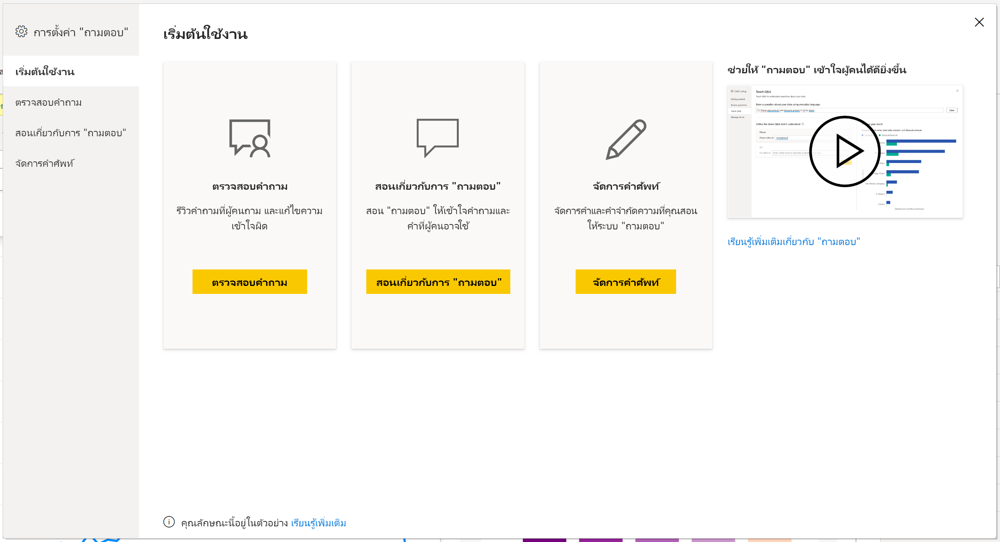
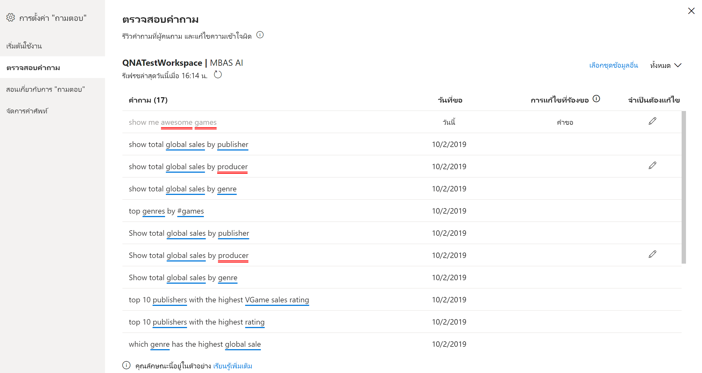
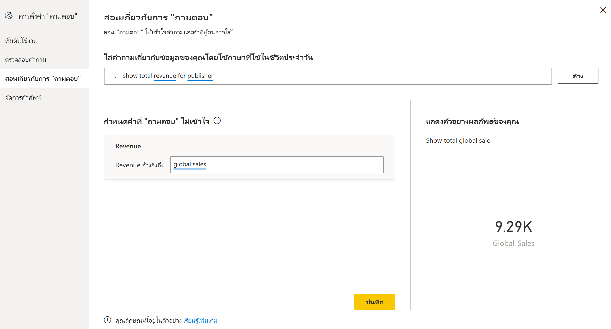
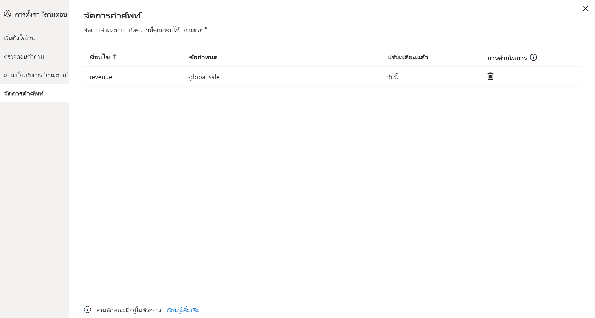

# แนะนำการใช้เครื่องมือระบบถามตอบ เพื่อสอนระบบถามของ Power BI (ตัวอย่าง)

คุณสามารถปรับปรุงประสบการณ์การใช้งานภาษาธรรมชาติสำหรับผู้ใช้ของคุณได้ด้วย*การใช้เครื่องมือ*ถามตอบของ Power BI ในฐานะผู้ออกแบบหรือผู้ดูแลระบบ คุณโต้ตอบกับกลไกจัดการภาษาธรรมชาติและทำการปรับปรุงให้ดีขึ้นในสามส่วน: 

- ตรวจสอบคำถามที่ผู้ใช้ของคุณถามเข้ามา
- สอนระบบถามตอบเพื่อให้เข้าใจคำถาม
- จัดการคำศัพท์ที่คุณได้สอนระบบถามตอบ

นอกเหนือจากความสามารถในการใช้เครื่องมือเฉพาะเหล่านี้แล้ว แท็บ **การสร้างแบบจำลอง** ใน Power BI Desktop ยังมีตัวเลือกเพิ่มเติมอีก:  

- คำเหมือน
- ป้ายชื่อแถว
- ซ่อนจากระบบถามตอบ
- การกำหนดค่าของรูปแบบภาษา (ขั้นสูง)

## เริ่มต้นด้วยการใช้เครื่องมือถามตอบ

การใช้เครื่องมือถามตอบมีอยู่ใน Power BI Desktop เท่านั้น และขณะนี้รองรับเฉพาะโหมดการนำเข้าเท่านั้น

1. เปิด Power BI Desktop และใช้ระบบถามตอบเพื่อสร้างวิชวล 
2. ให้เลือกไอคอนรูปเฟืองจากมุมของวิชวล 

    

    หน้าเริ่มต้นใช้งานจะเปิดขึ้น  

    

### ตรวจสอบคำถาม

เลือก **ตรวจสอบคำถาม** เพื่อดูรายการของชุดข้อมูลที่ใช้ในบริการ Power BI สำหรับผู้เช่าของคุณ หน้า **ตรวจสอบคำถาม** ยังแสดงเจ้าของชุดข้อมูล พื้นที่ทำงาน และวันที่รีเฟรชครั้งล่าสุด จากที่นี่คุณสามารถเลือกชุดข้อมูล และดูว่าคำถามใดที่ผู้ใช้ถาม ข้อมูลยังแสดงให้เห็นถึงคำที่ไม่รู้จักอีกด้วย ข้อมูลทั้งหมดที่แสดงที่นี่เป็นช่วง 28 วันที่ผ่านมา

### สอนเกี่ยวกับการ "ถามตอบ"

ส่วน**การสอนระบบถามตอบ** ช่วยให้คุณสามารถสอนระบบถามตอบให้รู้จำคำศัพท์ได้ ให้พิมพ์คำถามที่ประกอบด้วยคำศัพท์หนึ่งคำหรือหลายคำที่ระบบถามตอบยังไม่รู้จัก ระบบถามตอบจะพร้อมท์ให้คุณทราบสำหรับคำจำกัดความของคำศัพท์นั้น ให้ป้อนตัวกรองหรือชื่อเขตข้อมูลที่สอดคล้องกับคำที่แสดง จากนั้นระบบถามตอบจะแปลคำถามเดิมซ้ำอีกครั้ง ถ้าคุณพอใจกับผลลัพธ์ คุณสามารถบันทึกการป้อนข้อมูลของคุณได้ หากต้องการเรียนรู้เพิ่มเติม โปรดดู [การสอนระบบถามตอบ](q-and-a-tooling-teach-q-and-a.md)

### จัดการคำศัพท์

สิ่งใดก็ตามที่คุณบันทึกจากส่วนการสอนระบบถามตอบจะปรากฏที่นี่ ดังนั้นคุณสามารถตรวจสอบหรือลบคำศัพท์ที่คุณกำหนดไว้ได้ ในปัจจุบันคุณยังไม่สามารถแก้ไขคำจำกัดความที่มีอยู่ได้ ดังนั้นหากต้องการกำหนดคำศัพท์ใหม่ คุณต้องลบและสร้างคำศัพท์นั้นขึ้นใหม่อีกครั้ง

## การตั้งค่าอื่น ๆ ของระบบถามตอบ

### คำพ้องความหมายจำนวนมาก

แท็บ**การสร้างแบบจำลอง**ของ Power BI Desktop มีตัวเลือกเพิ่มเติมสำหรับการปรับปรุงประสบการณ์การใช้งานระบบถามตอบ 

1. ให้เลือกมุมมองการสร้างแบบจำลองใน Power BI Desktop

2. เลือกเขตข้อมูลหรือตารางเพื่อแสดงบานหน้าต่าง **คุณสมบัติ**  บานหน้าต่างนี้แสดงอยู่ทางด้านขวาของพื้นที่ทำงานและแสดงการดำเนินการของระบบถามตอบหลายรายการ หนึ่งในตัวเลือกเหล่านั้นคือ **คำพ้องความหมาย** ในกล่อง **คำพ้องความหมาย** คุณสามารถกำหนดทางเลือกสำหรับตารางหรือเขตข้อมูลที่คุณเลือกได้อย่างรวดเร็ว คุณยังสามารถกำหนดคำพ้องความหมายในส่วน **การสอนระบบถามตอบ** ของกล่องโต้ตอบการใช้เครื่องมือได้ ซึ่งโดยทั่วไปแล้วค่อนข้างรวดเร็วกว่าที่จะกำหนดคำพ้องที่นี่สำหรับเขตข้อมูลในตารางจำนวนมาก

    

3. หากต้องการกำหนดคำพ้องความหมายหลายคำสำหรับเขตข้อมูลเดียว ให้ใช้เครื่องหมายจุลภาคเพื่อแสดงคำพ้องความหมายคำถัดไป

### ซ่อนจากระบบถามตอบ

นอกจากนี้ คุณยังสามารถซ่อนเขตข้อมูลและตารางเพื่อไม่ให้ปรากฏในผลลัพธ์ของระบบถามตอบได้อีกด้วย 

1. ให้เลือกมุมมองการสร้างแบบจำลองใน Power BI Desktop

2. เลือกเขตข้อมูลหรือตารางเพื่อแสดงบานหน้าต่าง **คุณสมบัติ** และเปลี่ยน **ถูกซ่อน** เป็น **เปิด**

    ระบบถามตอบจะให้ความสำคัญกับการตั้งค่าและทำให้มั่นใจว่าระบบถามตอบไม่ได้รู้จำเขตข้อมูล ตัวอย่างเช่น คุณอาจต้องการซ่อนเขตข้อมูล ID และคีย์นอก (foreign key) เพื่อหลีกเลี่ยงเขตข้อมูลซ้ำที่มีชื่อเหมือนกันโดยไม่จำเป็น แม้ว่าคุณจะซ่อนเขตข้อมูลแล้ว แต่คุณยังสามารถใช้งานเขตข้อมูลใน Power BI Desktop ได้ในวิชวลนอกเหนือระบบถามตอบ

### ตั้งค่าป้ายชื่อแถว

ป้ายชื่อแถวช่วยให้คุณสามารถกำหนดว่าคอลัมน์ (หรือ *เขตข้อมูล*) ใดระบุตัวตนแถวเดียวในตารางได้ดีที่สุด ตัวอย่างเช่น สำหรับตารางที่เรียกว่า 'ลูกค้า' ป้ายชื่อแถวมักจะเป็น ' ชื่อที่แสดง' การจัดให้มีเมตาดาต้าเพิ่มเติมนี้ช่วยให้ระบบถามตอบสามารถลงจุดข้อมูลวิชวลที่เป็นประโยชน์มากขึ้นเมื่อผู้ใช้พิมพ์ใน 'แสดงยอดขายตามลูกค้า' แทนที่จะใช้ข้อมูล 'ลูกค้า' แสดงในตาราง ก็สามารถใช้ 'ชื่อที่แสดง' แทน และแสดงเป็นแผนภูมิแท่งที่แสดงยอดขายของลูกค้าแต่ละราย คุณสามารถตั้งค่ามุมมองการสร้างแบบจำลองของป้ายชื่อแถวได้เท่านั้น 

1. ให้เลือกมุมมองการสร้างแบบจำลองใน Power BI Desktop

2. เลือกตารางเพื่อแสดงบานหน้าต่าง **คุณสมบัติ**

3. ในกล่อง**ป้ายชื่อแถว** ให้เลือกเขตข้อมูล

## กำหนดค่าของรูปแบบภาษา (ขั้นสูง)

ใน Power BI คุณสามารถสอนและปรับปรุงประสิทธิภาพกลไกจัดการภาษาธรรมชาติภายในระบบถามตอบ รวมถึงการเปลี่ยนแปลง การให้คะแนน และการถ่วงน้ำหนักของผลลัพธ์ภาษาธรรมชาติพื้นฐาน หากต้องการเรียนรู้วิธีการ โปรดดู [แก้ไขรูปแบบภาษาและเพิ่มการใช้ถ้อยคำของระบบถามตอบ](q-and-a-tooling-advanced.md)

## ขั้นตอนถัดไป

มีแนวปฏิบัติที่ดีที่สุดหลายประการสำหรับการพัฒนากลไกจัดการภาษาธรรมชาติ สำหรับข้อมูลเพิ่มเติม โปรดดูบทความต่อไปนี้:

* [แนวทางปฏิบัติที่ดีที่สุดของระบบถามตอบ](q-and-a-best-practices.md)
