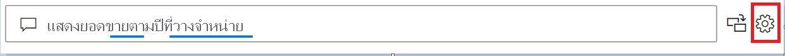

# แนะนำการใช้เครื่องมือระบบถามตอบ เพื่อสอนระบบถามของ Power BI (ตัวอย่าง)

คุณสามารถปรับปรุงประสบการณ์การใช้งานภาษาธรรมชาติสำหรับผู้ใช้ของคุณได้ด้วย*การใช้เครื่องมือ*ถามตอบของ Power BI ในฐานะผู้ออกแบบหรือผู้ดูแลระบบ คุณโต้ตอบกับกลไกจัดการภาษาธรรมชาติและทำการปรับปรุงให้ดีขึ้นในสามส่วน: 

- ตรวจสอบคำถามที่ผู้ใช้ของคุณถามเข้ามา
- สอนระบบถามตอบเพื่อให้เข้าใจคำถาม
- จัดการคำศัพท์ที่คุณได้สอนระบบถามตอบ

นอกเหนือจากความสามารถในการใช้เครื่องมือเฉพาะเหล่านี้แล้ว แท็บ **การสร้างแบบจำลอง** ใน Power BI Desktop ยังมีตัวเลือกเพิ่มเติมอีก:  

- คำเหมือน
- ป้ายชื่อแถว
- ซ่อนจากระบบถามตอบ
- การกำหนดค่าของรูปแบบภาษา (ขั้นสูง)

## เริ่มต้นด้วยการใช้เครื่องมือถามตอบ

การใช้เครื่องมือถามตอบมีอยู่ใน Power BI Desktop เท่านั้น และขณะนี้รองรับเฉพาะโหมดการนำเข้าเท่านั้น

1. เปิด Power BI Desktop และใช้ระบบถามตอบเพื่อสร้างวิชวล 
2. ให้เลือกไอคอนรูปเฟืองจากมุมของวิชวล 

    

    หน้าเริ่มต้นใช้งานจะเปิดขึ้น  

    

### คำเหมือนของเขตข้อมูล

เลือก**คำเหมือนของเขตข้อมูล**เพื่อดูตารางและคอลัมน์ทั้งหมดที่เป็นของโมเดล มุมมองนี้ช่วยให้คุณสามารถเพิ่มชื่อสำรองให้ตรงกับคอลัมน์เพื่อช่วยให้ผู้ใช้ทำงานได้ง่ายยิ่งขึ้น คุณยังสามารถเลือกว่าจะซ่อนคอลัมน์หรือตารางจากคำถามและคำตอบหรือไม่ได้อีกด้วย

คลิกที่ตารางใดตารางหนึ่งเพื่อขยายและคุณจะเห็นกล่องโต้ตอบที่คล้ายกับที่แสดงด้านล่างนี้

กล่องโต้ตอบจะแสดงคอลัมน์และตารางทั้งหมด รวมถึงคำและคำพ้องที่เกี่ยวข้องซึ่งผู้ใช้สามารถใช้ได้เมื่อถามคำถามต่อชุดข้อมูล คุณสามารถดูคำทั้งหมดในที่เดียวได้อย่างรวดเร็ว และยังเพิ่มหรือลบคำออกจากหลาย ๆ คอลัมน์ได้ 

- เพิ่มคำ - หากคุณมีเขตข้อมูลที่มีชื่อว่า ยอดขาย คุณสามารถเพิ่มคำว่า รายได้ เพื่อให้ผู้ใช้สามารถใช้คำดังกล่าวแทนที่จะต้องใช้คำว่า ยอดขาย ได้ คลิกเครื่องหมายบวกเพื่อเพิ่มคำใหม่อย่างรวดเร็ว

- รวมในคำถามและคำตอบ - ตัวเลือกนี้ใช้เมื่อไม่ต้องการแสดงคอลัมน์หรือตารางไว้ในคำถามและคำตอบ ซึ่งระบบจะไม่แสดงคอลัมน์หรือตารางและผลลัพธ์ของคอลัมน์ที่เลือก กรณีที่คุณอาจไม่ต้องการรวมคอลัมน์ไว้ในผลการแสดงคือเมื่อต้องจัดการกับวันที่ ถ้ามีเขตข้อมูลวันที่ หรือ Foreign keys เป็นจำนวนมาก คุณอาจต้องการลบข้อมูลทั้งหมดยกเว้นเขตข้อมูลวันที่เพื่อเก็บคอลัมน์วันที่ที่ถูกต้องไว้ใช้เมื่อผู้ใช้ถามคำถามที่เกี่ยวข้องกับวันที่

- คำที่แนะนำ - คำถามและคำตอบจะแนะนำคำที่ได้รับจากโปรแกรมการแนะนำของเราเพื่อช่วยคุณเพิ่มคำ/คำเหมือนได้อย่างรวดเร็ว ถ้าไม่มีการเพิ่มคำแนะนำเหล่านั้น ระบบจะยังคงทำงานอยู่แต่จะแสดงเส้นประสีส้มให้ผู้ใช้ทราบเพื่อแสดงว่าระบบคำถามและคำตอบคิดว่ามีคำตอบแต่ไม่แน่ใจ ถ้าคำเหมือนที่แนะนำถูกต้อง ให้คลิกที่ไอคอน + เพื่อให้ระบบสามารถใช้คำดังกล่าวเป็นคำเหมือนได้ ถ้าคำแนะนำไม่ถูกต้อง ให้คลิก x เพื่อลบคำดังแล่าวและสั่งให้ระบบไม่ใช้เป็นคำ/เหมือนและจะไม่ทำงานภายในระบบคำถามและคำตอบ การแนะนำคำนั้นสนับสนุนโดยพจนานุกรม Office และบางส่วนยังมาจากการเปลี่ยนชื่อที่พบภายในรายงานด้วย

### ตรวจสอบคำถาม

เลือก **ตรวจสอบคำถาม** เพื่อดูรายการของชุดข้อมูลที่ใช้ในบริการ Power BI สำหรับผู้เช่าของคุณ หน้า **ตรวจสอบคำถาม** ยังแสดงเจ้าของชุดข้อมูล พื้นที่ทำงาน และวันที่รีเฟรชครั้งล่าสุด จากที่นี่คุณสามารถเลือกชุดข้อมูล และดูว่าคำถามใดที่ผู้ใช้ถาม ข้อมูลยังแสดงให้เห็นถึงคำที่ไม่รู้จักอีกด้วย ข้อมูลทั้งหมดที่แสดงที่นี่เป็นช่วง 28 วันที่ผ่านมา

### สอนเกี่ยวกับการ "ถามตอบ"

ส่วน**การสอนระบบถามตอบ** ช่วยให้คุณสามารถสอนระบบถามตอบให้รู้จำคำศัพท์ได้ ให้พิมพ์คำถามที่ประกอบด้วยคำศัพท์หนึ่งคำหรือหลายคำที่ระบบถามตอบยังไม่รู้จัก ระบบถามตอบจะพร้อมท์ให้คุณทราบสำหรับคำจำกัดความของคำศัพท์นั้น ให้ป้อนตัวกรองหรือชื่อเขตข้อมูลที่สอดคล้องกับคำที่แสดง จากนั้นระบบถามตอบจะแปลคำถามเดิมซ้ำอีกครั้ง ถ้าคุณพอใจกับผลลัพธ์ คุณสามารถบันทึกการป้อนข้อมูลของคุณได้ หากต้องการเรียนรู้เพิ่มเติม โปรดดู [การสอนระบบถามตอบ](q-and-a-tooling-teach-q-and-a.md)

### จัดการคำศัพท์

สิ่งใดก็ตามที่คุณบันทึกจากส่วนการสอนระบบถามตอบจะปรากฏที่นี่ ดังนั้นคุณสามารถตรวจสอบหรือลบคำศัพท์ที่คุณกำหนดไว้ได้ ในปัจจุบันคุณยังไม่สามารถแก้ไขคำจำกัดความที่มีอยู่ได้ ดังนั้นหากต้องการกำหนดคำศัพท์ใหม่ คุณต้องลบและสร้างคำศัพท์นั้นขึ้นใหม่อีกครั้ง

### แนะนำคำถาม

โดยไม่ต้องทำการตั้งค่าใด ๆ วิชวลการถามตอบจะแนะนำคำถามหลายคำถามเพื่อเริ่มต้น คำถามเหล่านี้จะถูกสร้างขึ้นโดยอัตโนมัติตามรูปแบบข้อมูลของคุณ ใน**แนะนำคำถาม** คุณสามารถเขียนทับคำถามที่สร้างขึ้นโดยอัตโนมัติด้วยคำถามของคุณเองได้

หากต้องการเริ่มต้น ให้พิมพ์คำถามที่คุณต้องการเพิ่มลงในกล่องข้อความ ในส่วนการแสดงตัวอย่าง คุณจะเห็นว่าผลลัพธ์มีลักษณะอย่างไรในวิชวลการถามตอบ 

:::image type="content" source="media/q-and-a-tooling-intro/power-bi-qna-suggest-questions.png" alt-text="แนะนำคำถามสำหรับการถามตอบ":::
 
เลือกปุ่ม **เพิ่ม** เพื่อเพิ่มคำถามนี้ไปยัง **คำถามที่แนะนำของคุณ** คำถามเพิ่มเติมทุกข้อจะเพิ่มไปยังส่วนท้ายของรายการนี้ คำถามจะปรากฏในวิชวลการถามตอบเหมือนกับลำดับที่ปรากฏในรายการนี้ 

:::image type="content" source="media/q-and-a-tooling-intro/power-bi-qna-save-suggest-questions.png" alt-text="บันทึกคำถามที่แนะนำ":::
 
ตรวจสอบให้แน่ใจว่าคุณได้เลือก **บันทึก** เพื่อแสดงรายการคำถามที่แนะนำของคุณในวิชวลการถามตอบ 

> [!NOTE]
> ระบบจะแสดงคำถามที่แนะนำสำหรับอินสแตนซ์ทั้งหมดของวิชวลระบบคำถามและคำตอบ ไม่สามารถสร้างชุดการแนะนำแบบแยกสำหรับวิชวลระบบคำถามและคำตอบแต่ละรายการได้
> 
> 

## การตั้งค่าอื่น ๆ ของระบบถามตอบ

### ตั้งค่าป้ายชื่อแถว

ป้ายชื่อแถวช่วยให้คุณสามารถกำหนดว่าคอลัมน์ (หรือ *เขตข้อมูล*) ใดระบุตัวตนแถวเดียวในตารางได้ดีที่สุด ตัวอย่างเช่น สำหรับตารางที่เรียกว่า 'ลูกค้า' ป้ายชื่อแถวมักจะเป็น ' ชื่อที่แสดง' การจัดให้มีเมตาดาต้าเพิ่มเติมนี้ช่วยให้ระบบถามตอบสามารถลงจุดข้อมูลวิชวลที่เป็นประโยชน์มากขึ้นเมื่อผู้ใช้พิมพ์ใน 'แสดงยอดขายตามลูกค้า' แทนที่จะใช้ข้อมูล 'ลูกค้า' แสดงในตาราง ก็สามารถใช้ 'ชื่อที่แสดง' แทน และแสดงเป็นแผนภูมิแท่งที่แสดงยอดขายของลูกค้าแต่ละราย คุณสามารถตั้งค่ามุมมองการสร้างแบบจำลองของป้ายชื่อแถวได้เท่านั้น 

1. ให้เลือกมุมมองการสร้างแบบจำลองใน Power BI Desktop

2. เลือกตารางเพื่อแสดงบานหน้าต่าง **คุณสมบัติ**

3. ในกล่อง**ป้ายชื่อแถว** ให้เลือกเขตข้อมูล

## กำหนดค่าของรูปแบบภาษา (ขั้นสูง)

ใน Power BI คุณสามารถสอนและปรับปรุงประสิทธิภาพกลไกจัดการภาษาธรรมชาติภายในระบบถามตอบ รวมถึงการเปลี่ยนแปลง การให้คะแนน และการถ่วงน้ำหนักของผลลัพธ์ภาษาธรรมชาติพื้นฐาน หากต้องการเรียนรู้วิธีการ โปรดดู [แก้ไขรูปแบบภาษาและเพิ่มการใช้ถ้อยคำของระบบถามตอบ](q-and-a-tooling-advanced.md)

## ขั้นตอนถัดไป

มีแนวปฏิบัติที่ดีที่สุดหลายประการสำหรับการพัฒนากลไกจัดการภาษาธรรมชาติ สำหรับข้อมูลเพิ่มเติม โปรดดูที่ [แนวทางปฏิบัติที่ดีที่สุดสำหรับการถามตอบ](q-and-a-best-practices.md)
