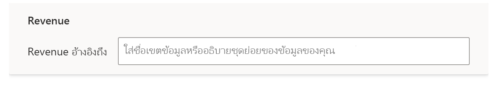
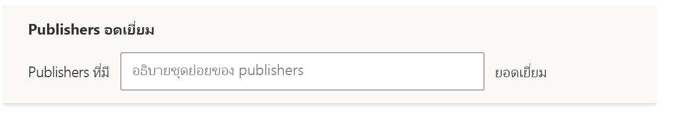

# การสอนระบบถามตอบเพื่อให้เข้าใจคำถามและคำศัพท์ในระบบถามตอบของ Power BI

ในส่วน **การสอนระบบถามตอบ** ของการตั้งค่าระบบถามตอบ คุณสามารถสอนให้ระบบถามตอบเข้าใจคำถามและคำศัพท์ภาษาธรรมชาติที่ยังไม่รู้จัก หากต้องการเริ่มต้น ให้คุณส่งคำถามที่ประกอบด้วยคำเดี่ยวหรือหลายคำที่ระบบถามตอบยังไม่รู้จัก จากนั้นระบบถามตอบจะพร้อมท์ให้คุณกำหนดคำศัพท์นั้น คุณป้อนตัวกรองหรือชื่อเขตข้อมูลที่สอดคล้องกับคำที่แสดง จากนั้นระบบถามตอบจะแปลคำถามเดิมอีกครั้ง ถ้าคุณพอใจกับผลลัพธ์ ให้คุณบันทึกข้อมูลเหล่านั้น

> [!NOTE]
> ฟังก์ชันการสอนระบบถามตอบจะรองรับโหมดการนำเข้าเท่านั้น นอกจากนี้ยังไม่รองรับการเชื่อมต่อไปยังแหล่งข้อมูลภายในองค์กรหรือ Azure Analysis Services ข้อจำกัดนี้ควรถูกลบออกจาก Power BI ในรุ่นที่ออกมาภายหลัง

## เริ่มต้นสอนระบบถามตอบ

1. ใน Power BI Desktop บนแถบริบบอน **การสร้างแบบจำลอง** ให้เลือก **การตั้งค่าระบบถามตอบ** > **การสอนระบบถามตอบ**

    

2. พิมพ์ประโยคด้วยคำที่ระบบถามตอบไม่เข้าใจ และเลือก **ส่ง**

3. เลือกคำที่ขีดเส้นใต้สีแดง 

    ระบบถามตอบจะนำเสนอข้อเสนอแนะและพร้อมท์ให้คุณป้อนคำจำกัดความที่ถูกต้องของคำศัพท์ 
    
3. ภายใต้ **กำหนดคำศัพท์ที่ระบบถามตอบไม่เข้าใจ** ให้ระบุคำจำกัดความ

    

4. เลือก **บันทึก** เพื่อแสดงตัวอย่างวิชวลที่อัปเดตแล้ว

5. ป้อนคำถามถัดไป หรือเลือก **X** เพื่อปิดหน้าต่าง

ผู้ใช้รายงานของคุณจะไม่เห็นการเปลี่ยนแปลงนี้จนกว่าคุณจะเผยแพร่รายงานกลับไปที่บริการ

## กำหนดคำนามและคำคุณศัพท์

คุณสามารถสอนระบบถามตอบได้ด้วยคำศัพท์สองชนิดได้แก่:

- คำนาม
- คำคุณศัพท์

### กำหนดคำพ้องความหมายที่เป็นคำนาม

เมื่อทำงานกับข้อมูล คุณมักจะมีชื่อของเขตข้อมูลที่สามารถอ้างอิงกับชื่อสำรองได้ ตัวอย่างอาจเป็น 'ยอดขาย' คำหรือวลีจำนวนมากสามารถอ้างอิงไปยังยอดขาย เช่น 'รายได้' ถ้าตั้งชื่อคอลัมน์ว่า 'ยอดขาย' และผู้ใช้รายงานพิมพ์คำว่า 'รายได้' ดังนั้นระบบถามตอบอาจไม่สามารถเลือกคอลัมน์ที่ถูกต้องเพื่อตอบคำถามได้อย่างเหมาะสม ในกรณีนี้ คุณต้องการบอกระบบถามตอบว่า 'ยอดขาย' และ 'รายได้' อ้างอิงถึงสิ่งเดียวกัน

ระบบถามตอบจะตรวจจับโดยอัตโนมัติเมื่อคำที่ไม่รู้จักเป็นคำนามโดยใช้ความรู้จาก Microsoft Office ถ้าระบบถามตอบตรวจพบคำนาม ระบบจะพร้อมท์คุณในวิธีต่อไปนี้:

- <your term> **อ้างอิงไปยัง** 

คุณกรอกคำศัพท์จากข้อมูลของคุณลงในกล่อง

หากคุณให้สิ่งอื่นที่ไม่ใช่เขตข้อมูลจากแบบจำลองข้อมูล คุณอาจได้รับผลลัพธ์ที่ไม่พึงประสงค์

### กำหนดเงื่อนไขของตัวกรองคำคุณศัพท์

บางครั้งคุณอาจต้องการกำหนดคำศัพท์ที่ทำหน้าที่เป็นเงื่อนไขในข้อมูลพื้นฐาน ตัวอย่างอาจเป็น 'ผู้เผยแพร่ที่ยอดเยี่ยม' 'ที่ยอดเยี่ยม' อาจเป็นเงื่อนไขที่เลือกเฉพาะผู้เผยแพร่ที่มีการเผยแพร่ผลิตภัณฑ์จำนวน X รายการเท่านั้น ระบบถามตอบจะพยายามตรวจหาคำคุณศัพท์ ด้วยการแสดงพร้อมท์ที่แตกต่างกัน:

- <field name> **ที่มี**  

คุณจะระบุเงื่อนไขลงในกล่อง

ตัวอย่างเงื่อนไขบางอย่างที่คุณสามารถกำหนดได้คือ:

- 'ประเทศ' ซึ่งคือ 'สหรัฐอเมริกา'
- 'ประเทศ' ซึ่งไม่ใช่ 'สหรัฐอเมริกา'
- 'น้ำหนัก' > 2000
- 'น้ำหนัก' = 2000
- 'น้ำหนัก' < 2000

คุณสามารถกำหนดได้เพียงเงื่อนไขเดียวเฉพาะในการใช้เครื่องมือ หากต้องการกำหนดเงื่อนไขที่ซับซ้อนมากขึ้น ให้ใช้ DAX เพื่อสร้างคอลัมน์จากการคำนวณ จากนั้นใช้ส่วนการใช้เครื่องมือเพื่อสร้างเงื่อนไขเดียวสำหรับคอลัมน์จากการคำนวณ ไม่รองรับหน่วยวัด ใช้คอลัมน์จากการคำนวณแทน

## จัดการคำศัพท์

หลังจากที่คุณให้คำจำกัดความแล้ว คุณสามารถกลับไปดูการแก้ไขทั้งหมดที่คุณทำและแก้ไขหรือลบได้ 

1. ใน **การตั้งค่าระบบถามตอบ** ให้ไปที่ส่วน **จัดการคำศัพท์**

2. ลบคำศัพท์ใดก็ตามที่คุณไม่ต้องการอีกต่อไป ในขณะนี้ คุณไม่สามารถแก้ไขคำศัพท์ได้ หากต้องการกำหนดคำศัพท์ใหม่ ให้ลบคำศัพท์และกำหนดใหม่

    

## ขั้นตอนถัดไป

มีแนวปฏิบัติที่ดีที่สุดหลายประการสำหรับการพัฒนากลไกจัดการภาษาธรรมชาติ สำหรับข้อมูลเพิ่มเติม โปรดดูบทความต่อไปนี้:

* [แนวทางปฏิบัติที่ดีที่สุดของระบบถามตอบ](q-and-a-best-practices.md)
