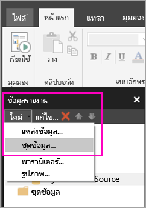
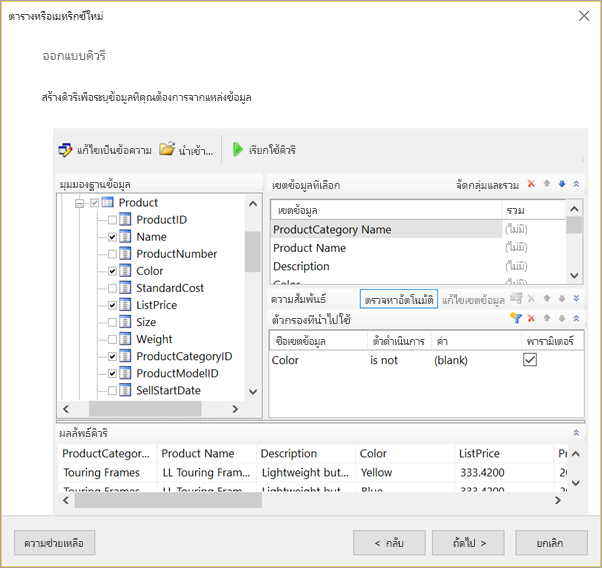
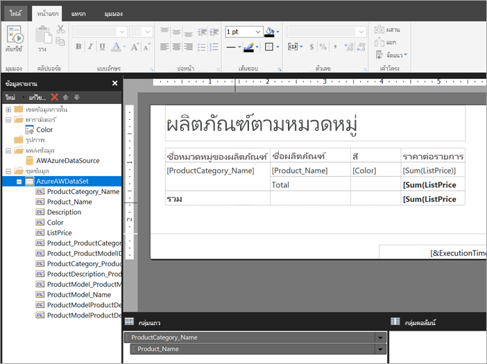

# สร้างชุดข้อมูลแบบฝังตัวสำหรับรายงานแบบแบ่งหน้าในบริการของ Power BI (ดูตัวอย่าง)

ในบทความนี้ คุณจะได้เรียนรู้วิธีการสร้างชุดข้อมูลแบบฝังตัว โดยอ้างอิงจากแหล่งข้อมูลแบบฝังตัว สำหรับรายงานแบบแบ่งหน้าในบริการของ Power BI ชุดข้อมูลแบบฝังตัวนั้นอยู่ในรายงานแบบแบ่งหน้าแต่ละอัน สำหรับใช้ในรายงานนั้นๆ ในตอนนี้ รายงานแบบแบ่งหน้าที่เผยแพร่ไปยังบริการของ Power BI ต้องใช้ชุดข้อมูลแบบฝังตัวและแหล่งข้อมูลแบบฝังตัว คุณอาจสร้างแหล่งข้อมูลแบบฝังตัวและชุดข้อมูลได้ในตัวสร้างรายงาน ขณะที่คุณสร้างรายงาน 

ก่อนที่คุณจะสร้างชุดข้อมูลได้ คุณต้องสร้างแหล่งข้อมูลก่อน โปรดดู [แหล่งข้อมูลแบบฝังตัวสำหรับรายงานแบบแบ่งหน้า](paginated-reports-embedded-data-source.md) ในบริการของ Power BI เพื่อเรียนรู้วิธี
  
## สร้างชุดข้อมูลแบบฝังตัว
  
1. ที่แผงข้อมูลรายงานในตัวสร้างรายงาน ให้คุณเลือก**ชุดข้อมูล** > **ใหม่**

1. ในแท็บ**คิวรี**ของกล่องโต้ตอบ**คุณสมบัติชุดข้อมูล** ให้คุณตั้งชื่อให้ชุดข้อมูล แหล่งข้อมูลแบบฝังตัวอยู่ในกล่อง**แหล่งข้อมูล**อยู่แล้ว หรือคุณอาจเลือก **ใหม่** เพื่อสร้างแหล่งข้อมูลแบบฝังตัวอื่นได้
 
     

3. ที่ใต้**ชนิดคิวรี** ให้คุณเลือกชนิดคำสั่งหรือคิวรีที่จะใช้กับชุดข้อมูล 
    - **ข้อความ**จะเรียกใช้คิวรีให้ดึงข้อมูลจากฐานข้อมูล ซึ่งเป็นค่าเริ่มต้นและใช้กับคิวรีส่วนมาก พิมพ์คิวรีหรือนำเข้าคิวรีที่มีอยู่ก่อนโดยการเลือก**นำเข้า** เลือก**ตัวออกแบบคิวรี** เพื่อสร้างคิวรีโดยใช้กราฟิก ถ้าคุณใช้ตัวออกแบบคิวรีเพื่อสร้างคิวรี ข้อความของคิวรีนั้นจะปรากฏในกล่องนี้ เลือกปุ่ม**นิพจน์** (**fx**) เพื่อใช้นิพจน์ในการสร้างคิวรีแบบไดนามิก 
    - **ตาราง**จะเลือกเขตข้อมูลทั้งหมดภายในตาราง ใส่ชื่อของตารางที่คุณต้องการใช้เป็นชุดข้อมูล
    - **Stored Procedure**จะเรียกใช้ขั้นตอนที่เก็บไว้จากชื่อ

4. ในตัวออกแบบคิวรี คุณจะเห็นและได้โต้ตอบกับตารางและเขตข้อมูลในชุดข้อมูล รวมถึงนำเข้าคิวรีหรือแก้ไขในรูปแบบข้อความ คุณยังสามารถเพิ่มตัวกรองและพารามิเตอร์ได้ที่นี่ 

    

5. ในตัวออกแบบคิวรี ให้คุณเลือก **เรียกใช้คิวรี** เพื่อทดสอบ จากนั้นเลือก **ตกลง**

1. กลับไปดูที่กล่องโต้ตอบคุณสมบัติชุดข้อมูล ในกล่อง**การหมดเวลา (เป็นวินาที)** ให้คุณพิมพ์จำนวนวินาทีก่อนที่คิวรีจะหมดเวลา ค่าเริ่มต้นคือ 30 วินาที ค่าสำหรับ**การหมดเวลา**ต้องว่างเปล่าหรือมากกว่าศูนย์ ถ้าค่าว่างเปล่า คิวรีจะไม่หมดเวลา

7.  คุณสามารถตั้งค่าคุณสมบัติอื่นๆ สำหรับชุดข้อมูลได้ที่แท็บอื่น:
    - สร้างเขตข้อมูลที่คำนวณที่แท็บ**เขตข้อมูล**
    - ตั้งค่าตัวเลือกขั้นสูงที่แท็บ**ตัวเลือก**
    - เพิ่มหรืออัปเดต**ตัวกรอง**และ**พารามิเตอร์** ที่แท็บที่เกี่ยวข้อง

8. เลือก**ตกลง**
 
   รายงานจะเปิดขึ้นในมุมมองการออกแบบรายงาน แหล่งข้อมูล ชุดข้อมูล และคอลเลกชันเขตข้อมูลของชุดข้อมูลจะปรากฏในแผงข้อมูลรายงาน และคุณสามารถออกแบบรายงานแบบแบ่งหน้าต่อได้  

     
 
## ขั้นตอนถัดไป 

- [รายงานแบบแบ่งหน้าใน Power BI Premium คืออะไร (ตัวอย่าง)](paginated-reports-report-builder-power-bi.md)  
- [บทช่วยสอน: สร้างรายงานแบบแบ่งหน้าและอัปโหลดไปยังบริการของ Power BI](paginated-reports-quickstart-aw.md)
- [เผยแพร่รายงานแบบแบ่งหน้าไปยังบริการของ Power BI](paginated-reports-save-to-power-bi-service.md)

