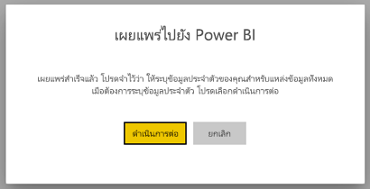
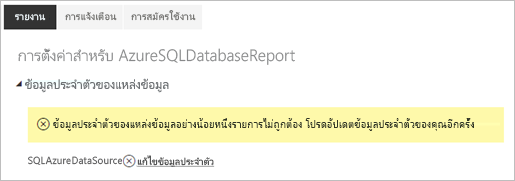
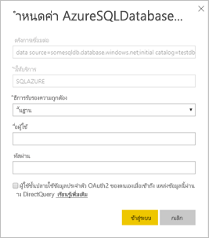

# แหล่งข้อมูลที่ได้รับการสนับสนุนสำหรับรายงานที่มีการแบ่งหน้าของ Power BI

บทความนี้จะขยายความแหล่งข้อมูลที่ได้รับการสนับสนุนสำหรับรายงานที่มีการแบ่งหน้าในบริการของ Power BI และวิธีการเชื่อมต่อกับแหล่งข้อมูล Azure SQL Database แหล่งข้อมูลบางส่วนได้รับการสนับสนุนในแบบดั้งเดิม คุณสามารถเชื่อมต่อกับผู้อื่นได้โดยวิธีการของเกตเวย์ข้อมูล

## แหล่งข้อมูลที่ได้รับการสนับสนุนในแบบดั้งเดิม

รายงานที่มีการแบ่งหน้าจะสนับสนุนรายการแหล่งข้อมูลต่อไปนี้ในแบบดั้งเดิม:

| แหล่งข้อมูล | การรับรองความถูกต้อง | บันทึกย่อ |
| --- | --- | --- |
| ฐานข้อมูล Azure SQL  คลังข้อมูล Azure SQL | ลงชื่อเข้าระบบครั้งเดียว (SSO) เบื้องต้น, OAuth2 |   |
| อินสแตนซ์ที่จัดการแล้วของ Azure SQL | พื้นฐาน | ผ่านจุดสิ้นสุดสาธารณะโดยใช้นามสกุลไฟล์ฐานข้อมูล Azure SQL  |
| Azure Analysis Services | SSO, OAuth2 |   |
| ชุดข้อมูล Power BI | SSO | ชุดข้อมูล Power BI แบบพรีเมียมและแบบไม่พรีเมี่ยม ต้องมีสิทธิ์ในการอ่าน |
| ชุดข้อมูล Power BI แบบพรีเมียม (XMLA) | SSO |   |
| ป้อนข้อมูล | N/A | ข้อมูลถูกฝังไว้ในรายงาน |

ยกเว้นสำหรับ Azure SQL Database แหล่งข้อมูลทั้งหมดจะพร้อมใช้งานหลังจากที่คุณอัปโหลดรายงานไปยังบริการของ Power BI แหล่งข้อมูลสามารถข้ามการใช้การลงชื่อเข้าระบบครั้งเดียว (SSO) ได้ตามความเหมาะสม สำหรับ Azure Analysis Services คุณสามารถเปลี่ยนชนิดการรับรองความถูกต้องเป็น OAuth2 ได้

สำหรับแหล่งข้อมูล Azure SQL Database คุณจำเป็นต้องใส่ข้อมูลเพิ่มเติมตามที่อธิบายไว้ในส่วน [การรับรองความถูกต้องของ Azure SQL Database](#azure-sql-database-authentication)

## แหล่งข้อมูลอื่นๆ

นอกเหนือจากแหล่งข้อมูลที่ได้รับการสนับสนุนในแบบดั้งเดิม แหล่งข้อมูลต่อไปนี้สามารถเข้าถึงได้ผ่านทาง[เกตเวย์ข้อมูล Power BI](service-gateway-onprem.md):

- SQL Server
- SQL Server Analysis Services
- Oracle
- Teradata

สำหรับรายงานที่มีการแบ่งหน้า, Azure SQL Database และ Azure Analysis Services ไม่สามารถเข้าถึงผ่านทางเกตเวย์ข้อมูล Power BI ได้ในขณะนี้

## การรับรองความถูกต้องของ Azure SQL Database

สำหรับแหล่งข้อมูล Azure SQL Database คุณจำเป็นต้องตั้งค่าชนิดการรับรองความถูกต้องก่อนที่คุณจะเรียกใช้รายงาน ซึ่งใช้เฉพาะเมื่อคุณใช้แหล่งข้อมูลเป็นครั้งแรกในพื้นที่ทำงาน ในครั้งแรก คุณจะเห็นข้อความต่อไปนี้:

ถ้าคุณไม่ใส่ข้อมูลประจำตัวใด ๆ ข้อผิดพลาดจะเกิดขึ้นเมื่อคุณเรียกใช้รายงาน เลือก**ดำเนินการต่อ** เพื่อไปที่หน้า **ข้อมูลประจำตัวของแหล่งข้อมูล** สำหรับรายงานที่คุณเพิ่งอัปโหลด:

เลือกลิงก์**แก้ไขข้อมูลประจำตัว**สำหรับแหล่งข้อมูลที่กำหนดไว้เพื่อเปิดกล่องโต้ตอบ**การกำหนดค่า**:

สำหรับแหล่งข้อมูล Azure SQL Database ต่อไปนี้คือชนิดการรับรองความถูกต้องที่ได้รับการสนับสนุน:

- พื้นฐาน (ชื่อผู้ใช้และรหัสผ่าน)
- SSO (การลงชื่อเข้าระบบครั้งเดียว)
- OAuth2 (โทเค็น AAD ที่จัดเก็บไว้)

สำหรับ SSO และ OAuth2 ในการทำงานอย่างถูกต้อง เซิร์ฟเวอร์ Azure SQL Databas ที่แหล่งข้อมูลกำลังเชื่อมต่อต้องเปิดใช้งาน[การสนับสนุนการรับรองความถูกต้อง AAD](https://docs.microsoft.com/azure/sql-database/sql-database-aad-authentication-configure) สำหรับวิธีการรับรองความถูกต้อง OAuth2 AAD จะสร้างโทเค็นและจัดเก็บไว้สำหรับการเข้าถึงแหล่งข้อมูลในอนาคต หากต้องการใช้ [วิธีการรับรองความถูกต้อง SSO](https://docs.microsoft.com/power-bi/service-azure-sql-database-with-direct-connect#single-sign-on) แทน ให้เลือกตัวเลือก SSO ที่เหมาะสมด้านล่างนี้ **ผู้ใช้จะใช้ข้อมูลประจำตัว OAuth2 ของตนเองเมื่อเข้าถึงแหล่งข้อมูลนี้ผ่านทาง DirectQuery**
  
## ขั้นตอนถัดไป

[ดูรายงานแบบแบ่งหน้าในบริการของ Power BI](consumer/paginated-reports-view-power-bi-service.md)

มีคำถามเพิ่มเติมหรือไม่ [ลองไปที่ชุมชน Power BI](https://community.powerbi.com/)
