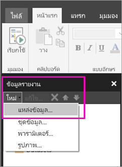

# สร้างแหล่งข้อมูลแบบฝังตัวสำหรับรายงานแบบแบ่งหน้าในบริการของ Power BI

ในบทความนี้ คุณจะได้เรียนรู้วิธีการสร้างและปรับเปลี่ยนแหล่งข้อมูลแบบฝังตัวสำหรับรายงานแบบแบ่งหน้าในบริการของ Power BI คุณอาจกำหนดแหล่งข้อมูลแบบฝังตัวได้ในรายงาน และใช้เฉพาะในรายงานนั้น ในตอนนี้ รายงานแบบแบ่งหน้าที่เผยแพร่ไปยังบริการของ Power BI ต้องใช้ชุดข้อมูลแบบฝังตัวและแหล่งข้อมูลแบบฝังตัว และสามารถเชื่อมต่อกับแหล่งข้อมูลเหล่านี้ได้:

- ฐานข้อมูล Azure SQL และคลังข้อมูล
- SQL Server
- SQL Server Analysis Services
- Oracle 
- Teradata 

สำหรับแหล่งข้อมูลต่อไปนี้ ให้ใช้ตัวเลือก[การเชื่อมต่อ SQL Server Analysis Services](service-premium-connect-tools.md):

- Azure Analysis Services
- ชุดข้อมูล Power BI Premium

รายงานแบบแบ่งหน้าจะเชื่อมต่อกับแหล่งข้อมูลในองค์กรโดยใช้[เกตเวย์ของ Power BI](service-gateway-getting-started.md) คุณสามารถตั้งค่าเกตเวย์ได้หลังจากที่เผยแพร่รายงานไปยังบริการของ Power BI แล้ว

ดู[ข้อมูลรายงานในตัวสร้างรายงาน Power BI](report-builder-data.md) สำหรับรายละเอียดเพิ่มเติม

## สร้างแหล่งข้อมูลแบบฝังตัว
  
1. เกิดตัวสร้างรายงาน Power BI

1. ที่แถบเครื่องมือในแผงข้อมูลรายงาน ให้คุณเลือก**แหล่งข้อมูล** > **ใหม่** กล่องโต้ตอบ**คุณสมบัติแหล่งข้อมูล** จะเปิดขึ้น

    
  
2.  ในกล่องข้อความ**ชื่อ** พิมพ์ชื่อสำหรับแหล่งข้อมูลหรือยอมรับค่าเริ่มต้น  
  
3.  เลือก**ใช้การเชื่อมต่อที่ฝังอยู่ในรายงานของฉัน**  
  
1.  เลือกชนิดแหล่งข้อมูลจากรายการ**เลือกชนิดการเชื่อมต่อ** 

1.  ระบุสตริงเชื่อมต่อโดยใช้วิธีการใดวิธีการหนึ่งต่อไปนี้:  
  
    -   พิมพ์สตริงเชื่อมต่อลงในกล่องข้อความ**สตริงการเชื่อมต่อ**โดยตรง 
  
    -   เลือกปุ่มนิพจน์ (**fx)** เพื่อสร้างนิพจน์ที่ประเมินสตริงเชื่อมต่อ ในกล่องโต้ตอบ**นิพจน์** ให้คุณพิมพ์นิพจน์ในแผงนิพจน์ เลือก**ตกลง** 
  
    -   เลือก**สร้าง**เพื่อเปิดกล่องโต้ตอบ**คุณสมบัติการเชื่อมต่อ**สำหรับแหล่งข้อมูลที่คุณเลือกในขั้นตอนที่ 2  
  
        กรอกเขตข้อมูลลงในกล่องโต้ตอบ**คุณสมบัติการเชื่อมต่อ**ตามที่เหมาะสมกับชนิดของแหล่งข้อมูล คุณสมบัติการเชื่อมต่อประกอบไปด้วยชนิดของแหล่งข้อมูล ชื่อของแหล่งข้อมูล และข้อมูลประจำตัวที่ใช้ หลังจากที่คุณระบุค่าในกล่องโต้ตอบนี้แล้ว ให้เลือก**ทดสอบการเชื่อมต่อ**เพื่อยืนยันว่าแหล่งข้อมูลพร้อมใช้งานและข้อมูลประจำตัวที่คุณระบุนั้นถูกต้อง  
  
4.  เลือก **ข้อมูลประจำตัว**  
  
     ระบุข้อมูลประจำตัวเพื่อใช้กับแหล่งข้อมูลนี้ เจ้าของแหล่งข้อมูลจะเลือกชนิดของข้อมูลประจำตัวที่รองรับ สำหรับข้อมูลเพิ่มเติม โปรดดู [ระบุข้อมูลประจำตัวและข้อมูลการเชื่อมต่อสำหรับแหล่งข้อมูลรายงาน](https://docs.microsoft.com/sql/reporting-services/report-data/specify-credential-and-connection-information-for-report-data-sources)
  
5.  เลือก**ตกลง**  
  
     แหล่งข้อมูลจะปรากฏขึ้นในแผงข้อมูลรายงาน  

## ขั้นตอนถัดไป

- [สร้างชุดข้อมูลแบบฝังตัวสำหรับรายงานแบบแบ่งหน้าในบริการของ Power BI](paginated-reports-create-embedded-dataset.md)
- [รายงานแบบแบ่งหน้าใน Power BI Premium คืออะไร](paginated-reports-report-builder-power-bi.md)
