# บทช่วยสอน: สร้างรายงานแบบแบ่งหน้าและอัปโหลดไปยังบริการของ Power BI

ในบทช่วยสอนนี้ คุณจะได้เชื่อมต่อกับฐานข้อมูลตัวอย่าง Azure SQL จากนั้นคุณจะได้ใช้วิซาร์ดในตัวสร้างรายงาน Power BI เพื่อสร้างรายงานแบบแบ่งหน้าพร้อมตารางที่ครอบคลุมพื้นที่หลายหน้า และคุณจะได้อัปโหลดรายงานแบบแบ่งหน้าไปยังพื้นที่ทำงานในบริการของ Power BI ด้วยความจุพรีเมียม

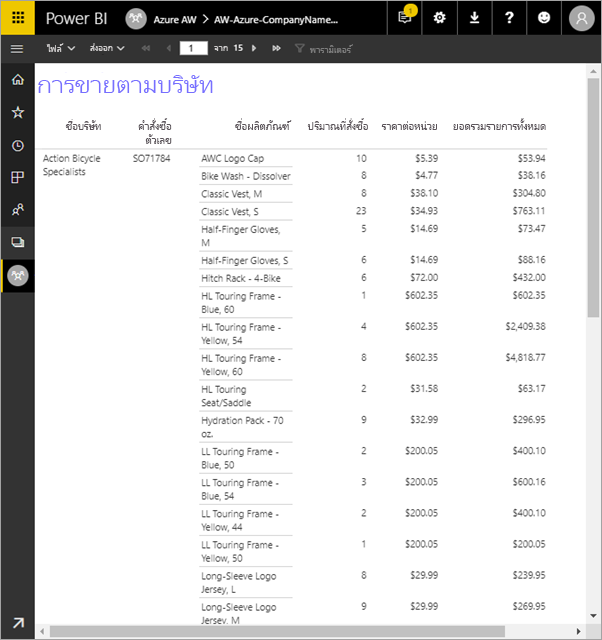

โปรดใช้ขั้นตอนต่อไปนี้เพื่อทำตามบทช่วยสอน:

> [!div class="checklist"]
> * สร้างฐานข้อมูลตัวอย่าง Azure
> * สร้างเมทริกซ์ในตัวสร้างรายงาน Power BI โดยใช้วิซาร์ดช่วย
> * จัดรูปแบบรายงานให้สวยงามด้วยการเพิ่มชื่อเรื่อง หมายเลขหน้าและหัวคอลัมน์ในแต่ละหน้า
> * จัดรูปแบบสกุลเงิน
> * อัปโหลดรายงานเข้าบริการของ Power BI

ถ้าคุณยังไม่มีการสมัครใช้งาน Azure สร้าง[บัญชีฟรี](https://azure.microsoft.com/free/?WT.mc_id=A261C142F)ก่อนที่คุณจะเริ่ม
 
## ข้อกำหนดเบื้องต้น  

โปรดดูข้อกำหนดเบื้องต้นในการสร้างรายงานแบบแบ่งหน้า:

- ติดตั้ง[ตัวสร้างรายงาน Power BI จากศูนย์ดาวน์โหลด Microsoft](https://go.microsoft.com/fwlink/?linkid=2086513) 

- ทำตามการเริ่มต้นด่วน[สร้างฐานข้อมูลตัวอย่าง Azure SQL ในพอร์ทัล Azure](https://docs.microsoft.com/azure/sql-database/sql-database-get-started-portal) คัดลอก และบันทึกค่าในกล่อง**ชื่อเซิร์ฟเวอร์**ในแท็บ**ภาพรวม** โปรดจดจำชื่อผู้ใช้และรหัสผ่านที่คุณสร้างใน Azure

โปรดดูข้อกำหนดเบื้องต้นในการอัปโหลดรายงานแบบแบ่งหน้าไปยังบริการของ Power BI:

- คุณต้องมี[สิทธิ์การใช้งาน Power BI Pro](service-admin-power-bi-pro-in-your-organization.md)
- คุณต้องมีพื้นที่ทำงานบนบริการใน[ความจุ Power BI Premium](service-premium-what-is.md) มีไอคอนรูปข้าวหลามตัดที่หมายถึงอยู่ถัดจากชื่อของพื้นที่ทำงาน

## ใช้วิซาร์ดสร้างเมทริกซ์
  
1.  เริ่มตัวสร้างรายงาน Power BI จากคอมพิวเตอร์ของคุณ  
  
     กล่องโต้ตอบ **เริ่มต้นใช้งาน** จะเปิดขึ้น  
  
     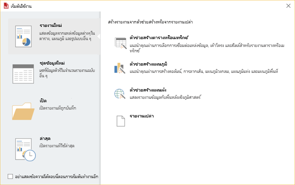
  
1.  ดูที่แผงข้างซ้ายและยืนยันว่าได้เลือก **รายงานใหม่** แล้ว จากนั้นดูที่แผงข้างขวาและเลือก **ตารางหรือวิซาร์ดเมทริกซ์**  
  
4.  ในหน้า **เลือกชุดข้อมูล** ให้คุณเลือก**สร้างชุดข้อมูล** > **ถัดไป**  

    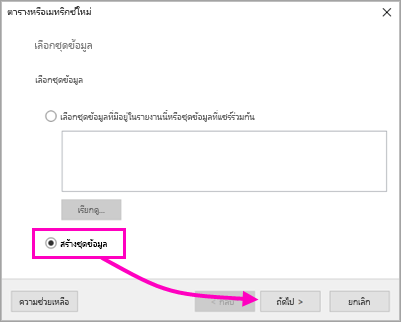
  
5.  ในหน้า**เลือกการเชื่อมต่อไปยังแหล่งข้อมูล** ให้คุณเลือก **ใหม่** 

    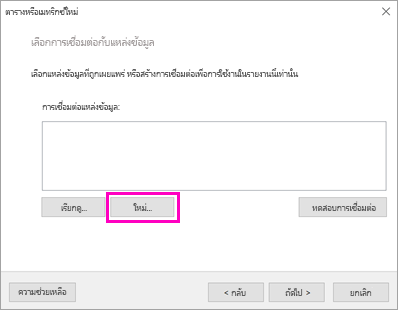
  
     กล่องโต้ตอบ**คุณสมบัติแหล่งข้อมูล** จะเปิดขึ้น  
  
6.  คุณสามารถตั้งชื่อแหล่งข้อมูลได้ตามต้องการ โดยใช้อักขระและเส้นขีดล่าง สำหรับบทช่วยสอนนี้ ให้คุณพิมพ์ **MyAzureDataSource** ในกล่อง**ชื่อ**  
  
7.  ในกล่อง **เลือกชนิดการเชื่อมต่อ** ให้คุณเลือก **Microsoft Azure SQL Database**  
  
8.  เลือก**สร้าง** ที่อยู่ถัดจากกล่อง**สตริงการเชื่อมต่อ** 

    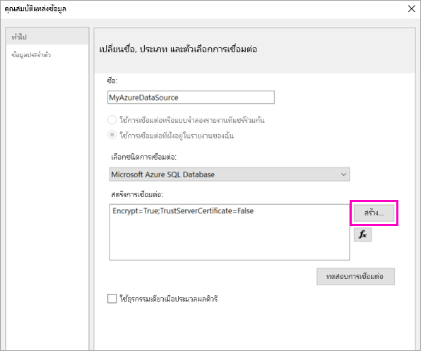

9. **ใน Azure:** ให้คุณย้อนกลับไปที่พอร์ทัล Azure และเลือก**ฐานข้อมูล SQL**

1. เลือกฐานข้อมูล Azure SQL ที่คุณสร้างขึ้นในการเริ่มต้นด่วน "สร้างฐานข้อมูลตัวอย่าง Azure SQL ในพอร์ทัล Azure" ในส่วน**ข้อกำหนดเบื้องต้น**ของบทความนี้

1. ที่แท็บ **ภาพรวม** ให้คุณคัดลอกค่าในกล่อง **ชื่อเซิร์ฟเวอร์**

2. **ในตัวสร้างรายงาน**: ในกล่องโต้ตอบ **คุณสมบัติการเชื่อมต่อ** ให้วางชื่อเซิร์ฟเวอร์ที่คุณคัดลอกไว้ใต้ช่อง **ชื่อเซิร์ฟเวอร์** 

1. ในการ**เข้าสู่เซิร์ฟเวอร์** โปรดแน่ใจว่าได้เลือก **ใช้การตรวจสอบสิทธิ์เซิร์ฟเวอร์ SQL** จากนั้นให้คุณพิมพ์ชื่อผู้ใช้และรหัสผ่านที่สร้างไว้ใน Azure เพื่อใช้กับฐานข้อมูลตัวอย่าง

1. ที่ด้านล่างของ **เชื่อมต่อไปยังฐานข้อมูล** ให้คุณเลือกลูกศรดรอปดาวน์และเลือกชื่อฐานข้อมูลที่สร้างไว้ใน Azure
 
    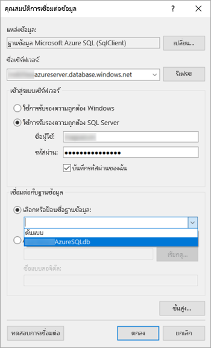

1. เลือก **ทดสอบการเชื่อมต่อ** คุณจะเห็นข้อความ**ผลการทดสอบ**แสดงว่า**การทดสอบการเชื่อมต่อสำเร็จ**

1. เลือก**ตกลง** > **ตกลง** 

   ขณะนี้ตัวสร้างรายงานจะแสดงสตริงการเชื่อมต่อที่เพิ่งสร้างไว้ในกล่อง **สตริงการเชื่อมต่อ** 

    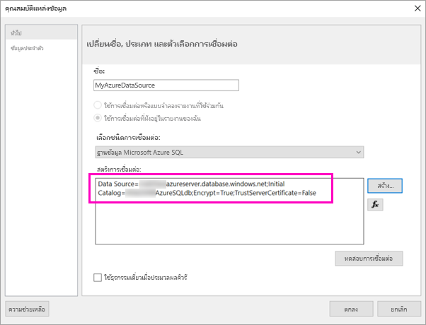

1. เลือก**ตกลง**
  
9. ในหน้า**เลือกการเชื่อมต่อไปยังแหล่งข้อมูล** คุณจะเห็นคำว่า "(ในรายงานนี้)" อยู่ใต้การเชื่อมต่อกับแหล่งข้อมูลที่เพิ่งสร้าง เลือกแหล่งข้อมูลนั้น > **ถัดไป**  

    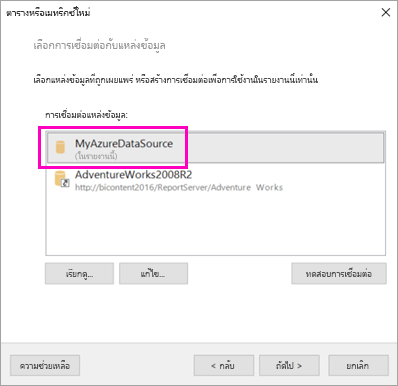

10. พิมพ์ชื่อผู้ใช้และรหัสผ่านเดียวกันนั้นลงในกล่อง 
  
10. ในหน้า**ออกแบบคิวรี** ให้คุณขยาย SaleIT และตาราง จากนั้นเลือกตารางเหล่านี้:

    - ที่อยู่
    - ลูกค้า
    - ผลิตภัณฑ์
    - ประเภทของผลิตภัณฑ์
    - SalesOrderDetail
    - SalesOrderHeader

     หากมีการเลือก**ตรวจจับอัตโนมัติ**เพื่อหา**ความสัมพันธ์** >  ตัวสร้างรายงานจะตรวจจับความสัมพันธ์ระหว่างตารางเหล่านี้ 
    
    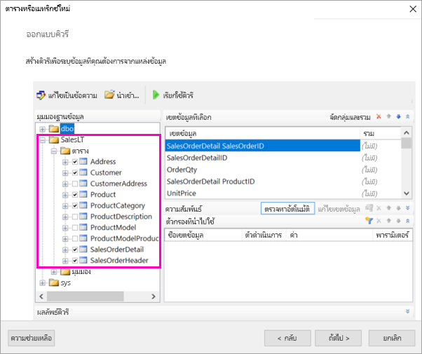
 
1.  เลือก**เรียกใช้คิวรี** ตัวสร้างรายงานจะแสดง **ผลลัพธ์คิวรี** 
 
     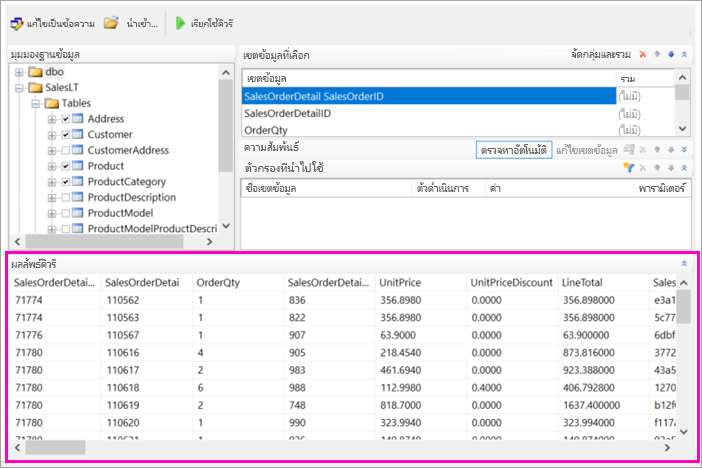

18. เลือก**ถัดไป** 

19. ในหน้า **เลือกชุดข้อมูล** ให้คุณเลือกชุดข้อมูลที่คุณเพิ่งสร้าง > **ถัดไป**

    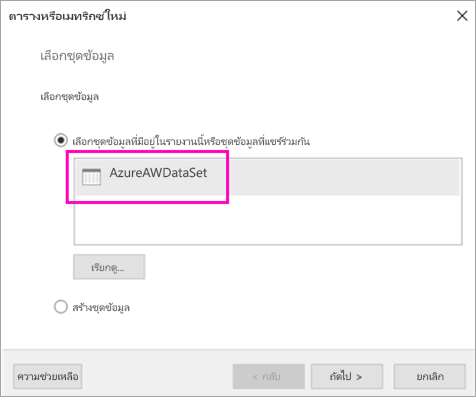

1. ในหน้า**จัดเรียงเขตข้อมูล** ให้คุณลากเขตข้อมูลเหล่านี้จากกล่อง**เขตข้อมูลพร้อมใช้งาน** ไปยังกล่อง**กลุ่มแถว**:

    - CompanyName
    - SalesOrderNumber
    - Product_Name

1. ลากเขตข้อมูลเหล่านี้จากกล่อง**เขตข้อมูลพร้อมใช้งาน** ไปยังกล่อง**ค่า**:

    - OrderQty
    - UnitPrice
    - LineTotal

    ตัวสร้างรายงานได้สร้างเขตข้อมูลเหล่านี้ไว้ในผลรวมกล่อง**ค่า** โดยอัตโนมัติ

    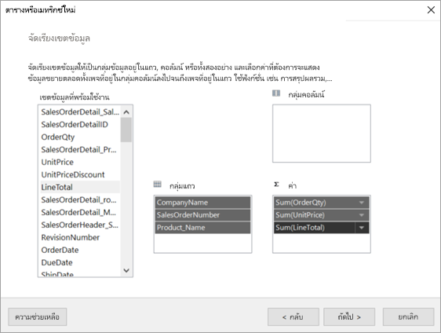

24. ในหน้า **เลือกเค้าโครง** ให้คุณเก็บการตั้งค่าเริ่มต้นทั้งหมดเอาไว้ แต่ให้ล้าง **กลุ่มขยาย/ยุบ** โดยทั่วไปแล้ว ฟีเจอร์กลุ่มขยาย/ยุบใช้งานได้ดีมาก แต่ในครั้งนี้คุณต้องการให้ตารางครอบคลุมพื้นที่หลายหน้า

1. เลือก**ถัดไป** > **เสร็จสิ้น** ตารางแสดงอยู่ในพื้นผิวการออกแบบ
 
## สิ่งที่คุณได้สร้างไว้

ลองดูผลลัพธ์ของวิซาร์ดกันสักครู่

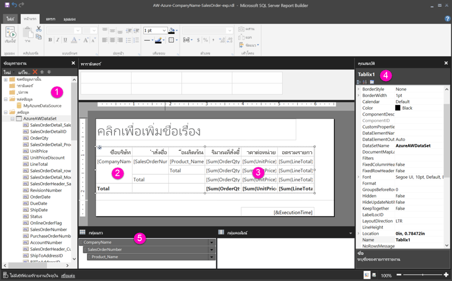

1. ในแผงข้อมูลรายงาน คุณจะเห็นแหล่งข้อมูล Azure ที่ฝังตัวและชุดข้อมูลที่ฝังตัวที่อ้างอิงตามแหล่งข้อมูลนั้น ซึ่งคุณสร้างทั้งสองสิ่งนี้ไว้ 

2. พื้นผิวออกแบบมีความกว้างประมาณ 6 นิ้ว ที่พื้นผิวออกแบบ คุณจะเห็นเมทริกซ์แสดงหัวคอลัมน์และค่าพื้นที่ที่สำรองไว้ โดยเมทริกซ์มีคอลัมน์หกอันและดูเหมือนจะมีความสูงแค่ห้าแถว 

3. ปริมาณการสั่งซื้อ ราคาต่อหน่วย และผลรวมต่อบรรทัด ทั้งหมดที่กล่าวมานี้แสดงเป็นยอดรวม และมีผลรวมย่อยอยู่ในแต่ละกลุ่มแถว 

    คุณจะยังไม่เห็นค่าข้อมูลจริง เมื่อต้องการดูค่าข้อมูลจริง ให้คุณเรียกใช้รายงาน

4. ในแผงคุณสมบัติ เมทริกซ์ที่เลือกไว้นั้นเรียกว่า Tablix1 *Tablix* ในตัวสร้างรายงานคือขอบเขตข้อมูลที่จะแสดงข้อมูลในแถวและคอลัมน์ ซึ่งอาจเป็นได้ทั้งตารางหรือเมทริกซ์

5. ในแผงจัดกลุ่ม คุณจะเห็นกลุ่มสามแถวที่คุณสร้างไว้ในวิซาร์ด: 

    - CompanyName
    - คำสั่งซื้อ
    - ชื่อผลิตภัณฑ์

    เมทริกซ์นี้ไม่มีกลุ่มคอลัมน์ใดๆ

### เรียกใช้รายงาน:

คุณต้องเรียกใช้รายงานเพื่อดูค่าจริง

1. เลือก**เรียกใช้**ในแถบเครื่องมือ**หน้าหลัก**

   ในตอนนี้คุณดูค่าได้แล้ว เมทริกซ์มีแถวมากกว่าที่คุณเห็นได้ในมุมมองออกแบบ! โปรดทราบว่า ตัวสร้างรายงานบอกว่าเป็นหน้า **1** จาก **2?** ตัวสร้างรายงานจะโหลดรายงานโดยเร็วที่สุด ดังนั้นระบบจะดึงข้อมูลได้เพียงพอสำหรับแค่สองหรือสามหน้าเท่านั้น เครื่องหมายปรัศนีบ่งชี้ว่า ตัวสร้างรายงานยังโหลดข้อมูลทั้งหมดไม่เสร็จ

   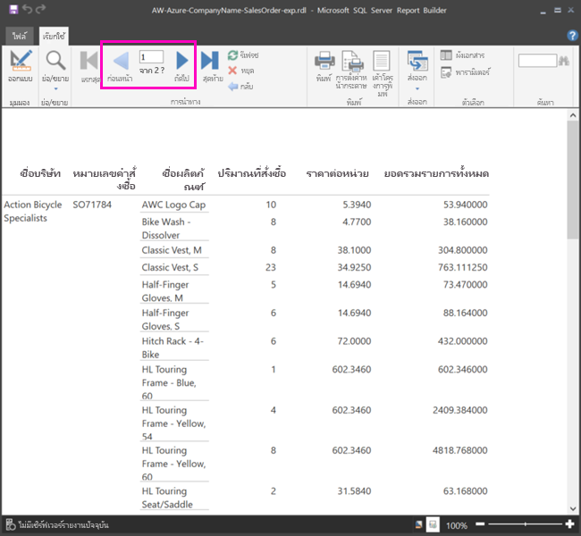

2. เลือก**เค้าโครงการพิมพ์** รายงานจะอยู่ในรูปแบบนี้เมื่อทำการพิมพ์ ตอนนี้ตัวสร้างรายงานรู้แล้วว่ารายงานมีทั้งหมด 33 หน้า และได้เพิ่มสแตมป์วันที่และเวลาไว้ที่ส่วนท้ายแล้วโดยอัตโนมัติ

## จัดรูปแบบรายงาน

ในตอนนี้คุณก็มีรายงานพร้อมเมทริกซ์ที่ครอบคลุมทั้ง 33 หน้าแล้ว มาเพิ่มฟีเจอร์อื่นๆ แล้วปรับปรุงหน้าตาของรายงานกันเถอะ คุณสามารถเรียกใช้รายงานได้หลังจากทำขั้นตอนครบทุกขั้นตอน หากคุณต้องการดูผลว่าเป็นเช่นไร

- ในแท็บ**เรียกใช้**ของริบบิ้น ให้คุณเลือก**การออกแบบ** เพื่อให้สามารถแก้ไขต่อได้  

### ตั้งความกว้างหน้าของหน้า

โดยทั่วไปแล้วจะมีการจัดรูปแบบรายงานแบบแบ่งหน้าไว้เพื่อการพิมพ์ และขนาดหน้าโดยปกติคือ 8 1/2 x 11 นิ้ว 

1. ลากไม้บรรทัดเพื่อปรับให้พื้นผิวออกแบบกว้าง 7 นิ้ว ระยะขอบเริ่มต้นของแต่ละด้านคือ 1 นิ้ว ดังนั้นขอบด้านข้างจึงต้องแคบกว่านี้

1. คลิกในพื้นที่สีเทารอบๆ พื้นผิวการออกแบบเพื่อแสดงคุณสมบัติ**รายงาน**

    ถ้าคุณไม่เห็นแผงคุณสมบัติ ให้คลิกที่แท็บ **มุมมอง** > **คุณสมบัติ**

2. ขยาย**ระยะขอบ**และเปลี่ยนขอบ**ซ้าย**และ**ขวา**จาก 1 นิ้วเป็น 0.75 นิ้ว 

    
  
### เพิ่มชื่อรายงาน  

1. เลือกคำว่า **คลิกเพื่อเพิ่มชื่อเรื่อง** ที่ด้านบนของหน้า แล้วพิมพ์ว่า **ยอดขายแยกตามบริษัท**  

2. เลือกข้อความชื่อเรื่อง และเปลี่ยน**สี**เป็น**สีฟ้า** โดยเลือกที่แผงคุณสมบัติด้านล่าง**ตัวอักษร**
  
### เพิ่มหมายเลขหน้า

คุณจะสังเกตเห็นว่ารายงานมีสแตมป์วันที่และเวลาอยู่ที่ส่วนท้ายหน้า คุณสามารถเพิ่มหมายเลขหน้าที่ส่วนท้ายหน้าได้เช่นกัน

1. ที่ด้านล่างของพื้นผิวการออกแบบ คุณจะเห็น [&ExecutionTime] ที่ด้านขวาในส่วนท้ายหน้า 

2. ในแผงข้อมูลรายงาน ให้คุณขยายโฟลเดอร์เขตข้อมูลภายใน ลาก **หมายเลขหน้า** ไปยังด้านซ้ายของส่วนท้ายหน้า โดยให้อยู่ที่ความสูงเดียวกันกับ [&ExecutionTime]

3. ลากด้านขวาของกล่อง [&PageNumber] เพื่อทำให้เป็นสี่เหลี่ยม

4. ที่แท็บ **แทรก** ให้คุณเลือก **กล่องข้อความ**

5. คลิกที่ด้านขวาของ [&PageNumber] แล้วพิมพ์ "ของ" จากนั้นทำให้กล่องข้อความเป็นสี่เหลี่ยม

6. ลาก **หน้าทั้งหมดโดยรวม** ไปที่ส่วนท้ายหน้า ที่ด้านขวาของ "ของ" จากนั้นลากด้านขวานั้นให้เป็นสี่เหลี่ยมเช่นกัน

    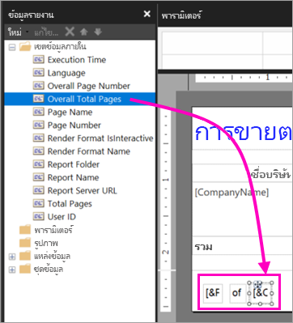

### ทำให้ตารางกว้างขึ้น  

ในตอนนี้คุณสามารถสร้างเมทริกซ์ได้กว้างพอที่จะเติมเต็มความกว้างของหน้า และทำให้คอลัมน์ข้อความกว้างขึ้นเพื่อให้ไม่ต้องเลื่อนดูชื่อมากนัก 
 
1. เลือกเมทริกซ์ จากนั้นเลือกคอลัมน์ชื่อบริษัท

3. เลื่อนเมาส์ไปเหนือแถบสีเทาที่ด้านบนของเมทริกซ์ที่ขอบข้างขวาของคอลัมน์ "ชื่อบริษัท" ลากไปทางขวา จนคอลัมน์ได้ขนาด 1 3/8 นิ้ว 

    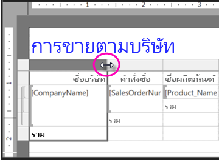

4. ลากขอบข้างขวาของ "ชื่อผลิตภัณฑ์" จนกระทั่งคอลัมน์ได้ขนาด 3 3/4 นิ้ว   

ตอนนี้เมทริกซ์ก็กว้างเกือบเท่ากับพื้นที่การพิมพ์แล้ว

### จัดรูปแบบสกุลเงิน

ถ้าคุณสังเกตเห็นว่าขณะที่เรียกใช้รายงานนั้น จำนวนเงินดอลลาร์ยังไม่ได้จัดรูปแบบ

1. เลือกเซลล์ [Sum(OrderQty)] ที่มุมซ้ายบน จากนั้นกดปุ่ม Shift ค้างไว้ แล้วเลือกเซลล์ [Sum(LineTotal)] ที่มุมขวาล่าง

    

2. ที่แท็บ **หน้าหลัก** ให้คุณเลือกสัญลักษณ์สกุลเงินดอลลาร์ ( **$** ) จากนั้นเลือกลูกศรข้างๆ **สไตล์พื้นที่ที่สำรองไว้** > **ค่าตัวอย่าง**
 
    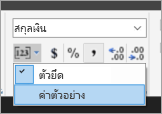

    ในตอนนี้คุณจะเห็นว่าค่านั้นจัดรูปแบบเป็นสกุลเงินแล้ว

    

### เพิ่มหัวคอลัมน์ในแต่ละหน้า

การปรับปรุงการจัดรูปแบบอีกอย่างหนึ่งก่อนการเผยแพร่รายงานไปยังบริการของ Power BI: การทำให้หัวคอลัมน์แสดงในแต่ละหน้าของรายงาน

1. ที่ตรงขวาสุดของแถบด้านบนในแผง "การจัดกลุ่ม" ให้คุณเลือกลูกศรดรอปดาวน์ > **โหมดขั้นสูง**

    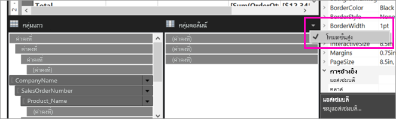

2. เลือกแถบ**สแตติก**ด้านบนใน**กลุ่มแถว** คุณจะเห็นว่ามีการเลือกเซลล์ชื่อบริษัทในเมทริกซ์แล้ว

   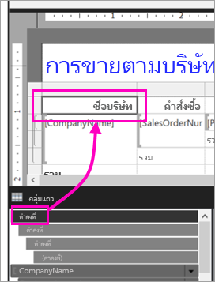

3. ในแผง**คุณสมบัติ** คุณจะเห็นคุณสมบัติสำหรับ **สมาชิก Tablix** ตั้งค่า **KeepWithGroup** เป็น **After** และตั้งค่า **RepeatOnNewPage** เป็น **True**

    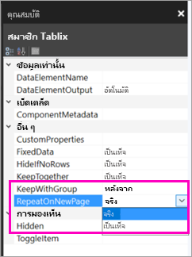

    ได้เวลาเรียกใช้รายงานแล้วดูว่าตอนนี้หน้าตาเป็นอย่างไร

5. เลือก **เรียกใช้** ที่แท็บ **หน้าหลัก**

6. เลือก **เค้าโครงการพิมพ์** ถ้ายังไม่ได้เลือก รายงานมีอยู่ด้วยกัน 29 หน้า เลื่อนผ่านสักสองสามหน้า คุณจะเห็นว่าสกุลเงินจัดรูปแบบแล้ว ทุกหน้ามีหัวคอลัมน์ และรายงานมีส่วนท้ายหน้าที่ระบุหมายเลขหน้าและสแตมป์วันที่และเวลาทุกๆ หน้า
 
    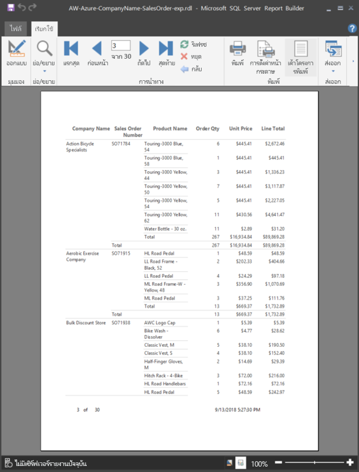

7. บันทึกรายงานลงคอมพิวเตอร์
 
##  อัปโหลดรายงานเข้าส่วนบริการ

ในตอนนี้คุณได้สร้างรายงานแบบแบ่งหน้าแล้ว ได้เวลาอัปโหลดเข้าบริการของ Power BI

1. ในบริการของ Power BI (http://app.powerbi.com) ในหน้าต่างนำทางด้านซ้าย ให้เลือก **พื้นที่ทำงาน** > **สร้างพื้นที่ทำงาน**

2. ตั้งชื่อพื้นที่ทำงานของคุณว่า **Azure AW** หรือชื่อเฉพาะอย่างอื่น ตอนนี้มีเพียงคุณที่เป็นสมาชิก 

3. เลือกลูกศรที่อยู่ถัดจาก **ขั้นสูง** แล้วเปิด **ความจุเฉพาะ** 

    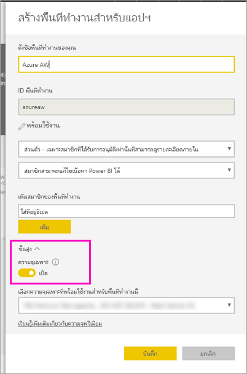

    ถ้าไม่สามารถเปิดได้ คุณต้องขอให้ผู้ดูแลระบบ Power BI ให้อนุญาตคุณในการเพิ่มพื้นที่ทำงานเข้าความจุพรีเมียมเฉพาะ

4. เลือก **ความจุเฉพาะที่พร้อมใช้งานสำหรับพื้นที่ทำงานนี้** หากจำเป็นให้ > **บันทึก**
    
    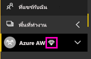

    ถ้าพื้นที่ทำงานไม่ได้อยู่ในความจุพรีเมียม เมื่อคุณลองอัปโหลดรายงาน คุณจะเห็นข้อความ "ไม่สามารถอัปโหลดรายงานแบบแบ่งหน้าได้" โปรดติดต่อผู้ดูแลระบบ Power BI เพื่อย้ายพื้นที่ทำงานนั้น

1. ในพื้นที่ทำงานใหม่ของคุณ ให้เลือก **รับข้อมูล**

2. ในกล่อง **ไฟล์** > **รับ**

3. เลือก **ไฟล์ภายในเครื่อง** ไปยังตำแหน่งที่คุณบันทึกไฟล์ไว้ > **เปิด**

   Power BI จะนำเข้าไฟล์ของคุณ และคุณจะเห็นไฟล์นั้นอยู่ใต้ **รายงาน** ในหน้ารายการแอป

    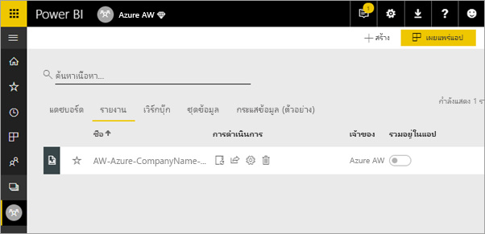

4. เลือกรายงานเพื่อดู

5. ถ้ามีข้อผิดพลาด คุณอาจต้องป้อนข้อมูลประจำตัวใหม่ เลือกไอคอน **จัดการ**

    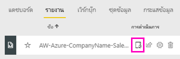

6. เลือก **แก้ไขข้อมูลประจำตัว** แล้วป้อนข้อมูลประจำตัวที่ใช้ใน Azure เมื่อทำการสร้างฐานข้อมูล Azure

    

7. ทีนี้คุณสามารถดูรายงานแบบแบ่งหน้าในบริการของ Power BI ได้แล้ว

    

## ขั้นตอนถัดไป

[รายงานแบบแบ่งหน้าใน Power BI Premium คืออะไร](paginated-reports-report-builder-power-bi.md)

