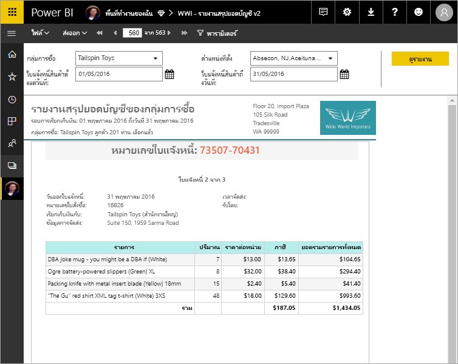

# รายงานแบบแบ่งหน้าใน Power BI Premium คืออะไร

รายงานแบบแบ่งหน้า ในรูปแบบรายงานมาตรฐานใน SQL Server Reporting Services พร้อมใช้งานในบริการของ Power BI แล้ว รายงานเหล่านี้สามารถพิมพ์หรือแชร์ได้ ซึ่งเรียกว่า "แบบแบ่งหน้า" เนื่องจากมีการจัดรูปแบบให้พอดีกับหน้า โดยกำหนดให้แสดงข้อมูลทั้งหมดในตาราง แม้ว่าตารางนั้นต้องใช้พื้นที่หลายหน้า บางครั้งก็เรียกว่า "พิกเซลสมบูรณ์แบบ" เพราะคุณสามารถควบคุมเค้าโครงหน้าของรายงานได้เต็มที่ รายงานแบบแบ่งหน้านั้นมาจากเทคโนโลยีรายงาน RDL ใน SQL Server Reporting Services ตัวสร้างรายงานเป็นเครื่องมือแบบเดี่ยวเพื่อใช้เขียนรายงานแบบแบ่งหน้า 

รายงานแบบแบ่งหน้าสามารถมีหลายหน้าได้ ตัวอย่าง รายงานฉบับนี้มี 563 หน้า แต่ละหน้ามีรูปแบบเหมือนกัน โดยใช้หนึ่งหน้าต่อใบแจ้งหนี้หนึ่งใบ และมีส่วนหัวกับส่วนท้ายหน้าซ้ำกัน

คุณสามารถดูตัวอย่างรายงานของคุณในตัวสร้างรายงาน แล้วเผยแพร่ไปยังบริการของ Power BI ได้ http://app.powerbi.com คุณต้องมีสิทธิ์การใช้งาน Power BI Pro ในการที่จะเผยแพร่รายงานไปยังบริการ คุณสามารถเผยแพร่และแบ่งปันรายงานแบบแบ่งหน้าได้ใน "พื้นที่ทำงานของฉัน" หรือในพื้นที่ทำงานของแอป ตราบเท่าที่พื้นที่ทำงานอยู่ในความจุ Power BI Premium นอกจากนี้ ผู้ดูแลระบบ Power BI ต้องเปิดใช้งานรายงานที่มีการแบ่งหน้าใน[ส่วนความจุแบบพรีเมียม](service-admin-premium-workloads.md#paginated-reports)ของพอร์ทัลผู้ดูแลของ Power BI 

## สร้างรายงานในตัวสร้างรายงานของ Power BI

รายงานที่มีการแบ่งหน้าจะมีเครื่องมือการออกแบบเอง ซึ่งก็คือ ตัวสร้างรายงาน Power BI เป็นเครื่องมือใหม่ที่แชร์พื้นฐานเดียวกันกับเครื่องมือที่คุณเคยใช้ในการสร้างรายงานที่มีการแบ่งหน้าสำหรับเซิร์ฟเวอร์รายงาน Power BI หรือ SQL Server Reporting Services (SSRS) ในทางที่จริงแล้ว รายงานแบบแบ่งหน้าที่คุณสร้างสำหรับ SSRS 2016 และ 2017 หรือสำหรับ เซิร์ฟเวอร์รายงาน Power BI ในองค์กร สามารถเข้ากันได้กับบริการของ Power BI บริการของ Power BI จะรักษาความเข้ากันได้ย้อนหลังไว้ เพื่อให้คุณสามารถใช้รายงานต่อในอนาคตได้ และสามารถอัปเกรดรายงานแบบแบ่งหน้าที่เป็นเวอร์ชันก่อนหน้าได้ คุณลักษณะของรายงานทั้งหมดไม่สามารถใช้งานได้เมื่อเปิดใช้งาน โปรดดู[ข้อจำกัดและข้อควรพิจารณา](#limitations-and-considerations)ในบทความนี้สำหรับรายละเอียด
     
## รายงานจากแหล่งข้อมูลหลายแหล่ง

รายงานแบบแบ่งหน้าหนึ่งรายงานอาจมีแหล่งข้อมูลที่ต่างกันได้จำนวนหนึ่ง จะไม่มีแบบจำลองข้อมูลที่จำเป็น ต่างกับรายงานของ Power BI สำหรับการเผยแพร่รายงานแบบแบ่งหน้าในบริการของ Power BI ขั้นต้น คุณอาจสร้างแหล่งข้อมูลแบบฝังและชุดข้อมูลไว้ในรายงานได้เลย ในตอนนี้ คุณไม่สามารถใช้แหล่งข้อมูลที่ใช้ร่วมกันหรือชุดข้อมูลที่ใช้ร่วมกันได้ คุณสร้างรายงานในตัวสร้างรายงานได้จากคอมพิวเตอร์ของคุณเอง ถ้ารายงานเชื่อมต่อกับข้อมูลในองค์กร หลังจากที่คุณอัปโหลดรายงานไปยังบริการของ Power BI แล้ว คุณต้องสร้างเกตเวย์และเปลี่ยนเส้นทางการเชื่อมต่อข้อมูล ต่อไปนี้คือแหล่งข้อมูลที่คุณสามารถเชื่อมต่อในขณะนี้:

- ฐานข้อมูล Azure SQL และคลังข้อมูล
- Azure Analysis Services (ผ่าน SSO)
- SQL Server ผ่านเกตเวย์
- SQL Server Analysis Services ผ่านเกตเวย์
- ชุดข้อมูล Power BI Premium
- Oracle
- Teradata
- แหล่งข้อมูลเพิ่มเติมตามที่เพิ่ม

## ออกแบบรายงานของคุณ  

### สร้างรายงานแบบแบ่งหน้าด้วยเมทริกซ์ แผนภูมิ และเค้าโครงแบบอิสระ

ตารางรายงานการทำงานที่มีประสิทธิภาพสำหรับข้อมูลที่อ้างอิงตามคอลัมน์ รายงานเมทริกซ์ เช่นข้ามแท็บหรือรายงาน PivotTable เหมาะสำหรับการทำสรุปข้อมูล แผนภูมิรายงานนำเสนอข้อมูลในรูปแบบกราฟิก และแบบอิสระ*รายการ*ของรายงานสามารถนำเสนอเกือบทุกอย่าง เช่น ใบแจ้งหนี้ 
  
คุณสามารถเริ่มได้ที่วิซาร์ดของตัวสร้างรายงาน วิชาร์ดตาราง เมทริกซ์และแผนภูมิจะช่วยให้คุณสร้างการเชื่อมต่อกับแหล่งข้อมูลฝังและชุดข้อมูลฝัง จากนั้นให้คุณลากเขตข้อมูลและวางลงเพื่อสร้างคิวรีชุดข้อมูล เลือกเค้าโครงและสไตล์ แล้วปรับแต่งรายงานของคุณ  
  
ด้วยการใช้วิซาร์ดแมป คุณสามารถสร้างรายงานที่แสดงข้อมูลรวมกับพื้นหลังทางภูมิศาสตร์หรือเรขาคณิตได้ ข้อมูลแผนที่อาจเป็นข้อมูลเชิงพื้นที่ที่ได้จากคิวรี Transact-SQL หรือจาก Environmental Systems Research Institute, Inc. แฟ้มเชปไฟล์ (ESRI) คุณยังสามารถเพิ่มพื้นหลังไทล์แผนที่ของ Microsoft Bing ได้  

### เพิ่มส่วนต่างๆ ให้รายงาน

ปรับเปลี่ยนข้อมูลโดยการกรอง จัดกลุ่มและเรียงลำดับข้อมูล หรือโดยการเพิ่มสูตรหรือนิพจน์ เพิ่มแผนภูมิ ตัววัด เส้นแบบประกายไฟ และตัวบ่งชี้ เพื่อสรุปข้อมูลในรูปแบบการแสดงผลด้วยภาพ  ใช้พารามิเตอร์และตัวกรองเพื่อกรองข้อมูลสำหรับมุมมองแบบกำหนดเอง รูปภาพฝังหรือรูปภาพอ้างอิงและทรัพยากรอื่นๆ รวมทั้งเนื้อหาจากภายนอก  

ทุกอย่างที่อยู่ในรายงานแบบแบ่งหน้า ตั้งแต่ตัวรายงานไปจนถึงกล่องข้อความ รูปภาพ ตาราง และแผนภูมิ จะมีอาร์เรย์ของคุณสมบัติที่คุณสามารถตั้งค่าได้เพื่อให้รายงานมีหน้าตาอย่างที่คุณต้องการ

## การสร้างข้อกำหนดของรายงาน

เมื่อคุณออกแบบรายงานแบบแบ่งหน้า คือการที่คุณสร้าง*ข้อกำหนดของรายงาน* ซึ่งไม่ได้มีข้อมูล แต่จะระบุว่าต้องรับเอาข้อมูลจากที่ใด เอาข้อมูลใด และแสดงข้อมูลอย่างไร เมื่อคุณเรียกดูรายงาน ตัวประมวลผลรายงานจะใช้ข้อกำหนดของรายงานที่คุณได้ระบุไว้ ดึงเอาข้อมูลนั้นมา แล้วรวมเข้ากับเค้าโครงรายงานเพื่อสร้างรายงานขึ้น คุณสามารถอัปโหลดข้อกำหนดของรายงานไปยังบริการของ Power BI ได้ http://app.powerbi.com อาจจะเป็น "พื้นที่ทำงานของฉัน" หรือเป็นพื้นที่ทำงานที่แบ่งปันกับเพื่อนร่วมงาน ถ้าแหล่งข้อมูลของรายงานนั้นอยู่ในองค์กร หลังจากที่คุณอัปโหลดรายงาน ให้คุณเปลี่ยนเส้นทางการเชื่อมต่อแหล่งข้อมูลให้ผ่านเกตเวย์ 

## ดูรายงายแบบแบ่งหน้าของคุณ
คุณสามารถเรียกดูรายงานแบบแบ่งหน้าได้ในบริการของ Power BI ในเบราว์เซอร์ และในแอปพลิเคชันมือถือ Power BI ได้อีกด้วย ในบริการของ Power BI คุณสามารถส่งออกรายงานได้หลากหลายรูปแบบ เช่น HTML, MHTML, PDF, XML, CSV, TIFF, Word และ Excel และคุณยังแบ่งปันไปให้ผู้อื่นได้ด้วย  

## สร้างการสมัครใช้งานกับรายงานของคุณ

ขณะนี้คุณสามารถตั้งค่าการสมัครใช้งานอีเมลสำหรับตัวคุณเองและผู้อื่นสำหรับรายงานที่มีการแบ่งหน้าในบริการของ Power BI โดยทั่วไป กระบวนการจะเหมือนกับการสมัครใช้งานรายงานและแดชบอร์ดในบริการของ Power BI ในการตั้งค่าการสมัครใช้งาน คุณเลือกจำนวนครั้งที่คุณต้องการรับอีเมล: รายวัน รายสัปดาห์ หรือรายชั่วโมง การสมัครใช้งานประกอบด้วยเอกสารแนบเป็น PDF ของผลลัพธ์รายงานทั้งหมด

สำหรับรายละเอียด โปรดดูบทความ [สมัครใช้งานรายงานที่มีการแบ่งหน้าสำหรับตัวคุณเองและผู้อื่นในบริการของ Power BI](paginated-reports-subscriptions.md) 

## ข้อจำกัดและข้อควรพิจารณา

ต่อไปนี้คือฟีเจอร์อื่นๆ ที่ไม่ได้รับการรองรับในการเผยแพร่ขั้นต้น:

- การปักหมุดหน้ารายงานหรือวิชวลไปยังแดชบอร์ด Power BI คุณยังสามารถปักหมุดการแสดงภาพไปยังแดชบอร์ด Power BI จากรายงานที่มีแบ่งหน้าภายในองค์กรบนเซิร์ฟเวอร์รายงาน Power BI หรือเซิร์ฟเวอร์ Reporting Services ดูการ [ปักหมุดรายการ Reporting Services ไปยังแดชบอร์ด Power BI](https://docs.microsoft.com/sql/reporting-services/pin-reporting-services-items-to-power-bi-dashboards) สำหรับรายละเอียดเพิ่มเติม
- คุณลักษณะแบบโต้ตอบ เช่น แผนผังเอกสารและปุ่มแสดง/ซ่อน
- รายงานย่อยและรายงานลงรายละเอียด
- แหล่งข้อมูลที่ใช้ร่วมกันและชุดข้อมูลที่ใช้ร่วมกัน
- วิชวลจากรายงาน Power BI
 
## ขั้นตอนถัดไป

- [ติดตั้งตัวสร้างรายงาน Power BI จากศูนย์ดาวน์โหลด Microsoft](https://go.microsoft.com/fwlink/?linkid=2086513)
- [บทช่วยสอน: สร้างรายงานที่มีการแบ่งหน้า](paginated-reports-quickstart-aw.md)
- [ใส่ข้อมูลในรายงานแบบแบ่งหน้าโดยตรง](paginated-reports-enter-data.md)

  

