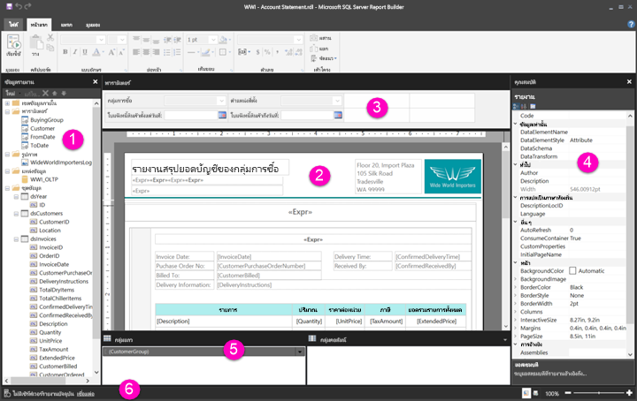

# สำรวจดูรอบๆ ในมุมมองการออกแบบรายงานสำหรับรายงานแบบแบ่งหน้า

มุมมองการออกแบบรายงานในตัวสร้างรายงานเป็นพื้นที่การออกแบบสำหรับสร้างรายงานแบบแบ่งหน้าที่สามารถเผยแพร่ไปยังบริการของ Power BI ได้ พื้นที่การออกแบบนี้อยู่ที่ตรงกลางของตัวสร้างรายงาน พร้อมริบบิ้นและแผงต่างๆ ล้อมรอบ พื้นที่การออกแบบคือที่ที่ให้คุณเพิ่มและจัดการหน่วยข้อมูลของรายงานได้ บทความนี้จะอธิบายถึงแผงต่างๆ ที่ใช้เพื่อเพิ่ม เลือกและจัดระเบียบทรัพยากรของรายงาน และเปลี่ยนคุณสมบัติหน่วยข้อมูลของรายงาน  

1.  [แผนข้อมูลรายงาน](#report-data-pane) 
2.  [พื้นที่ออกแบบรายงาน](#report-design-surface)  
3.  [แผงพารามิเตอร์](#parameters-pane) 
4.  [แผงคุณสมบัติ](#properties-pane) 
5.  [แผงการจัดกลุ่ม](#grouping-pane) 
6.  [แถบสถานะปัจจุบันของรายงาน](#current-report-status-bar)  
  
## 1 แผงข้อมูลรายงาน  
 ที่แผงข้อมูลรายงาน คุณอาจกำหนดข้อมูลรายงานและทรัพยากรรายงานที่คุณต้องการสำหรับรายงานได้ก่อนที่จะออกแบบเค้าโครงรายงาน ตัวอย่างเช่น คุณสามารถเพิ่มแหล่งข้อมูล ชุดข้อมูล เขตข้อมูลที่คำนวณไว้ พารามิเตอร์ของรายงาน และรูปภาพไปยังแผงข้อมูลรายงานได้  
  
 หลังจากที่คุณเพิ่มหน่วยข้อมูลไปยังแผงข้อมูลรายงานแล้ว ให้ลากเขตพื้นที่ไปยังหน่วยข้อมูลของรายงานที่อยู่ในพื้นที่การออกแบบเพื่อควบคุมการที่ข้อมูลปรากฏในรายงาน  
  
> [!TIP]  
>  ถ้าคุณลากเขตข้อมูลจากแผงข้อมูลรายงานไปยังพื้นที่ออกแบบรายงานโดยตรงแทนที่จะวางไว้ในเขตพื้นที่ข้อมูลเช่นตารางหรือแผนภูมิ เมื่อคุณเรียกใช้รายงาน คุณจะเห็นว่ามีเพียงค่าแรกจากข้อมูลเท่านั้นที่อยู่ในเขตข้อมูลนั้น  
  
 คุณยังสามารถลากเขตข้อมูลที่มีอยู่ภายในจากแผงข้อมูลรายงานไปยังพื้นที่ออกแบบรายงานได้ เมื่อแสดง เขตข้อมูลเหล่านี้จะให้ข้อมูลเกี่ยวกับรายงาน เช่น ชื่อรายงาน จำนวนหน้าทั้งหมดในรายงาน และหมายเลขหน้าปัจจุบัน  
  
 จะมีการเพิ่มบางสิ่งไปยังแผงข้อมูลรายงานโดยอัตโนมัติเมื่อคุณเพิ่มบางอย่างในพื้นที่ออกแบบรายงาน ตัวอย่างเช่น หากคุณฝังรูปในรายงาน รูปนั้นจะถูกเพิ่มไปยังโฟลเดอร์รูปภาพในแผงข้อมูลรายงาน  
  
> [!NOTE]  
>  คุณสามารถใช้ปุ่ม**ใหม่**เพื่อเพิ่มหน่วยข้อมูลใหม่ไปยังแผงข้อมูลรายงานได้ คุณสามารถเพิ่มชุดข้อมูลหลายชุดจากแหล่งข้อมูลเดียวกันหรือจากแหล่งข้อมูลอื่นไปยังรายงานได้ เมื่อต้องการเพิ่มชุดข้อมูลใหม่จากแหล่งข้อมูลเดียวกัน ให้คุณคลิกขวาที่แหล่งข้อมูล > **เพิ่มชุดข้อมูล**  
  
## 2 พื้นที่ออกแบบรายงาน  
 พื้นที่ออกแบบรายงานของตัวสร้างรายงานคือพื้นที่ทำงานหลักสำหรับออกแบบรายงานของคุณ ในการวางหน่วยข้อมูลของรายงานเช่นเขตพื้นที่ข้อมูล รายงานย่อย กล่องข้อความ รูปสี่เหลี่ยมผืนผ้า และเส้นบรรทัดในรายงาน ให้คุณเพิ่มจากริบบิ้นหรือแกลลอรีส่วนรายงานลงในพื้นที่ออกแบบ ในพื้นที่นั้น คุณสามารถเพิ่มกลุ่ม นิพจน์ พารามิเตอร์ ตัวกรอง การดำเนินการ การมองเห็น และการจัดรูปแบบให้หน่วยข้อมูลของรายงานได้  
  
 นอกจากนี้คุณยังสามารถเปลี่ยนสิ่งต่อไปนี้ได้:  
  
-   คุณสมบัติของตัวรายงาน เช่นเส้นขอบและการเติมสี โดยการคลิกขวาที่พื้นที่สีขาวของพื้นที่ออกแบบ ด้านนอกหน่วยข้อมูลของรายงานใดก็ได้ แล้วเลือก**คุณสมบัติตัวรายงาน**  
  
-   คุณสมบัติส่วนหัวและส่วนท้าย เช่น เส้นขอบและการเติมสี โดยการคลิกขวาที่พื้นที่สีขาวของพื้นที่ออกแบบในพื้นที่ส่วนหัวหรือส่วนท้าย นอกหน่วยข้อมูลของรายงานใดก็ได้ แล้วเลือก**คุณสมบัติส่วนหัว** หรือ **คุณสมบัติส่วนท้าย**  
  
-   คุณสมบัติของตัวรายงาน เช่น การตั้งค่าหน้า โดยการคลิกขวาที่พื้นที่สีเทารอบๆ พื้นที่ออกแบบ แล้วเลือก**คุณสมบัติรายงาน**  
  
-   คุณสมบัติของหน่วยข้อมูลของรายงาน โดยการคลิกขวาแล้วเลือก**คุณสมบัติ**  
  
### ขนาดพื้นที่ออกแบบและพื้นที่พิมพ์  
ขนาดพื้นที่ออกแบบอาจแตกต่างจากพื้นที่พิมพ์ของขนาดหน้าที่คุณได้เลือกไว้สำหรับพิมพ์รายงาน การเปลี่ยนขนาดของพื้นที่ออกแบบจะไม่เปลี่ยนพื้นที่พิมพ์ของรายงาน ไม่ค่าคุณจะตั้งขนาดพื้นที่พิมพ์ของรายงานไว้เท่าใด ขนาดพื้นที่ออกแบบขนาดเต็มจะไม่เปลี่ยน สำหรับข้อมูลเพิ่มเติม โปรดดูที่ ลักษณะการแสดงภาพ 
  
- เมื่อต้องการแสดงไม้บรรทัด ให้เลือกกล่อง**ไม้บรรทัด** ที่แท็บ**มุมมอง**  
  
## 3 แผงพารามิเตอร์  
 ด้วยพารามิเตอร์ของรายงาน คุณสามารถควบคุมข้อมูลรายงาน เชื่อมต่อรายงานที่เกี่ยวข้องเข้าด้วยกันและสร้างความหลากหลายในการนำเสนอรายงานได้ แผงพารามิเตอร์จะให้เค้าโครงแบบยืดหยุ่นสำหรับพารามิเตอร์ของรายงาน  
  
 อ่านเพิ่มเติมเกี่ยวกับพารามิเตอร์รายงาน   
  
## 4 แผงคุณสมบัติ
 ทุกหน่วยข้อมูลในรายงาน รวมทั้งเขตพื้นที่ข้อมูล รูปภาพ กล่องข้อความ และตัวรายงานเอง จะมีคุณสมบัติที่สัมพันธ์กันอยู่ ตัวอย่างเช่น คุณสมบัติ BorderColor สำหรับกล่องข้อความจะแสดงค่าสีของเส้นขอบกล่องข้อความ และคุณสมบัติ PageSize สำหรับรายงานแสดงขนาดหน้าของรายงาน  
  
 คุณสมบัติเหล่านี้จะแสดงในแผงคุณสมบัติ คุณสมบัติในแผงจะเปลี่ยนตามหน่วยข้อมูลของรายงานที่คุณเลือก  
  
- เมื่อต้องการดูแผงคุณสมบัติ ที่แท็บ**มุมมอง** ในกลุ่ม**แสดง/ซ่อน** > **คุณสมบัติ**  
  
### การเปลี่ยนค่าคุณสมบัติ  
 ในตัวสร้างรายงาน คุณสามารถเปลี่ยนคุณสมบัติสำหรับหน่วยข้อมูลของรายงานได้หลายวิธี:  
  
-   โดยการเลือกปุ่มและรายการที่ริบบิ้น  
  
-   โดยการเปลี่ยนการตั้งค่าภายในกล่องโต้ตอบ  
  
-   โดยการเปลี่ยนค่าคุณสมบัติภายในแผงคุณสมบัติ  
  
 คุณสมบัติที่ใช้บ่อยที่สุดจะพร้อมใช้งานในกล่องโต้ตอบและที่ริบบิ้น  
  
 คุณสามารถตั้งค่าคุณสมบัติจากรายการดรอปดาวน์ พิมพ์ค่า หรือเลือก`<Expression>`เพื่อสร้างนิพจน์ได้ตามแต่คุณสมบัติ  
  
### การเปลี่ยนมุมมองแผงคุณสมบัติ  
 ตามค่าเริ่มต้นแล้ว คุณสมบัติที่แสดงในแผงคุณสมบัติได้รับการจัดระเบียบให้เป็นประเภทกว้างๆ เช่น การดำเนินการ, เส้นขอบ, การเติม, ฟอนต์ และทั่วไป แต่ละประเภทจะมีชุดคุณสมบัติที่สัมพันธ์กัน ตัวอย่างเช่น คุณสมบัติต่อไปนี้ถูกจัดอยู่ในประเภทฟอนต์: Color, FontFamily, FontSize, FontStyle, FontWeight, LineHeight และ TextDecoration คุณสามารถเรียงคุณสมบัติทั้งหมดในแผงได้ตามตัวอักษรถ้าคุณต้องการ ซึ่งจะเป็นการเอาประเภทออกและแสดงรายการคุณสมบัติทั้งหมดตามลำดับตัวอักษร โดยไม่คำนึงถึงประเภท  
  
 แผงคุณสมบัติมีปุ่มสามปุ่มที่ด้านบนของแผง: **ประเภท** **การเรียงตัวอักษร** และ **หน้าคุณสมบัติ** เลือกปุ่มประเภทและการเรียงตัวอักษรเพื่อสลับระหว่างมุมมองแผงคุณสมบัติ เลือกปุ่ม**หน้าคุณสมบัติ**เพื่อเปิดกล่องโต้ตอบคุณสมบัติสำหรับหน่วยข้อมูลของรายงานที่เลือก  
  
  
## 5 แผงการจัดกลุ่ม

 กลุ่มต่างๆ จะใช้เพื่อจัดระเบียบข้อมูลรายงานของคุณให้เป็นลำดับขั้นวิชวลและเพื่อคำนวณผลรวม คุณสามารถดูกลุ่มแถวและคอลัมน์ภายในเขตพื้นที่ข้อมูลที่พื้นที่ออกแบบและในแผงการจัดกลุ่มเช่นกัน แผงการจัดกลุ่มมีสองแผง: กลุ่มแถวและกลุ่มคอลัมน์ เมื่อคุณเลือกเขตพื้นที่ข้อมูล แผงการจัดกลุ่มจะแสดงกลุ่มทั้งหมดภายในเขตพื้นที่ข้อมูลนั้นเป็นรายการลำดับขั้น: กลุ่มลูกจะอยู่เยื้องไปข้างล่างของกลุ่มพ่อแม่  
  
 คุณสามารถสร้างกลุ่มได้โดยการลากเขตข้อมูลจากแผงข้อมูลรายงานและวางที่พื้นที่ออกแบบหรือในแผงการจัดกลุ่ม ในแผงการจัดกลุ่ม คุณสามารถเพิ่มกลุ่มพ่อแม่ กลุ่มติดกัน และกลุ่มลูกได้ และคุณยังเปลี่ยนคุณสมบัติกลุ่มและลบกลุ่มได้  
  
 แผงการจัดกลุ่มแสดงเป็นค่าเริ่มต้น แต่คุณสามารถปิดได้โดยการล้างกล่องกาเครื่องหมายของแผงการจัดกลุ่มที่แท็บมุมมอง แผงการจัดกลุ่มไม่มีให้ใช้กับแผนภูมิหรือเขตพื้นที่ข้อมูลของตัววัด  
  
 สำหรับข้อมูลเพิ่มเติม โปรดดูแผงการจัดกลุ่มและกลุ่มทำความเข้าใจ  
  
## 6 แถบสถานะปัจจุบันของรายงาน

แถบบสถานะปัจจุบันของรายงานจะแสดงชื่อเซิร์ฟเวอร์ที่มีการเชื่อมต่อกับรายงาน หรือแสดงข้อความ "ไม่มีเซิร์ฟเวอร์รายงานปัจจุบัน" คุณสามารถเลือก**เชื่อมต่อ**เพื่อเชื่อมต่อกับเซิร์ฟเวอร์ได้

## ขั้นตอนถัดไป

[รายงานแบบแบ่งหน้าใน Power BI Premium คืออะไร (ตัวอย่าง)](paginated-reports-report-builder-power-bi.md) 

  
  
