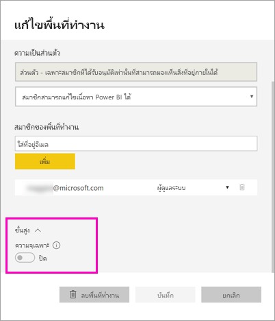
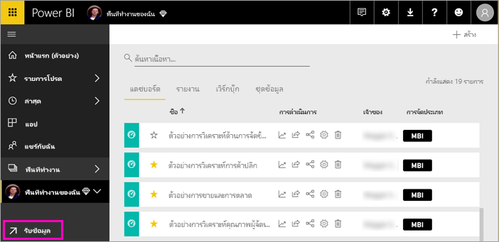
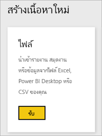
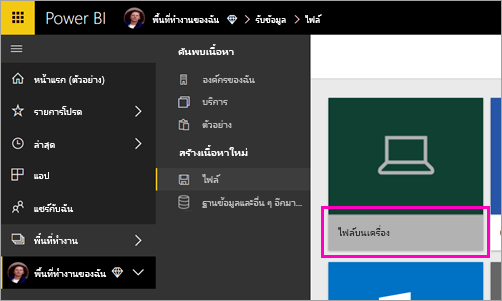
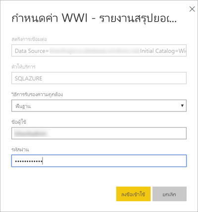
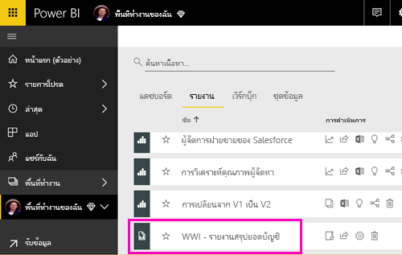
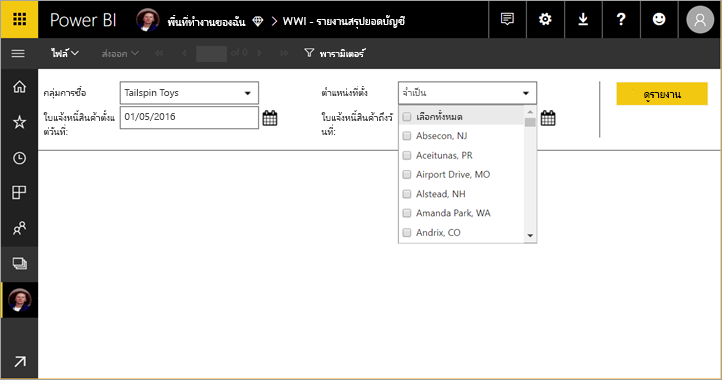

# เผยแพร่รายงานแบบแบ่งหน้าไปยังบริการของ Power BI

ในบทความนี้ คุณจะได้เรียนรู้เกี่ยวกับการเผยแพร่รายงานแบบแบ่งหน้าไปยังบริการของ Power BI โดยการอัปโหลดจากคอมพิวเตอร์ของคุณเอง คุณสามารถอัปโหลดรายงานแบบแบ่งหน้าไปยัง "พื้นที่ทำงานของฉัน" หรือพื้นที่ทำงานอื่นได้ ตราบเท่าที่พื้นที่ทำงานนั้นอยู่ในความจุ Premium มองหาไอคอนรูปข้าวหลามตัด  ถัดจากชื่อพื้นที่ทำงาน 

ถ้าแหล่งข้อมูลของรายงานของคุณอยู่ในองค์กร คุณต้อง[สร้างเกตเวย์](#create-a-gateway-to-an-on-premises-data-source)หลังจากที่อัปโหลดรายงานแล้ว

## เพิ่มพื้นที่ทำงานไปยังความจุพรีเมียม

ถ้าพื้นที่ทำงานไม่มีไอคอนรูปข้าวหลามตัด  อยู่ถัดจากชื่อ คุณต้องเพิ่มพื้นที่ทำงานไปยังความจุพรีเมียม 

1. เลือก**พื้นที่ทำงาน** เลือกจุดไข่ปลา (**...**) ที่อยู่ถัดจากชื่อของพื้นที่ทำงาน จากนั้นเลือก**แก้ไขพื้นที่ทำงาน**

    

1. ในกล่องโต้ตอบ **แก้ไขพื้นที่ทำงาน** ให้คุณขยาย**ขั้นสูง** จากนั้นเลื่อน **ความจุเฉพาะ** ไปยัง **เปิด**

    

   คุณอาจไม่สามารถเปลี่ยนได้ ถ้าเปลี่ยนไม่ได้ โปรดติดต่อผู้ดูแลความจุ Power BI Premium เพื่อให้สิทธิ์ในการกำหนดกับคุณ เพื่อเพิ่มพื้นที่ทำงานไปยังความจุพรีเมียม

## อัปโหลดรายงานแบบแบ่งหน้า

1. สร้างรายงานแบบแบ่งหน้าในตัวสร้างรายงานและบันทึกลงคอมพิวเตอร์ของคุณ

1. เปิดบริการของ Power BI ในเบราเซอร์และเรียกดูพื้นที่ทำงาน Premium ที่คุณต้องการเผยแพร่รายงาน มองหาไอคอนรูปข้าวหลามตัด  ที่อยู่ถัดจากชื่อ 

1. เลือก**รับข้อมูล**

    

1. ในกล่อง**ไฟล์** เลือก**รับ**

    

1. เลือก**ไฟล์ภายในเครื่อง** > เรียกดูรายงานแบบแบ่งหน้า > **เปิด**

    

1. เลือก**ดำเนินการต่อ** > **แก้ไขข้อมูลประจำตัว**

    

1. กำหนดข้อมูลประจำตัว > **ลงชื่อเข้าใช้**

    

   คุณจะเห็นรายงานของคุณอยู่ในรายการรายงาน

    

1. เลือกเพื่อเปิดในบริการของ Power BI ถ้ามีพารามิเตอร์ คุณต้องเลือกก่อนที่คุณจะสามารถดูรายงานได้
 
    

## สร้างเกตเวย์

เช่นเดียวกันกับรายงาน Power BI อื่นๆ หากแหล่งข้อมูลของรายงานอยู่ในองค์กร คุณต้องสร้างหรือเชื่อมต่อเกตเวย์เพื่อเข้าถึงข้อมูล

1. ที่ถัดจากชื่อรายงาน ให้คุณเลือก**จัดการ**

   

1. ดูบทความบริการของ Power BI [ติดตั้งเกตเวย์](service-gateway-install.md) สำหรับรายละเอียดและขั้นตอนถัดไป

### ข้อจำกัดเกตเวย์

ในขณะนี้เกตเวย์ไม่รองรับพารามิเตอร์หลายค่า

## ขั้นตอนถัดไป

- [ดูรายงานแบบแบ่งหน้าในบริการของ Power BI](paginated-reports-view-power-bi-service.md)
- [รายงานแบบแบ่งหน้าใน Power BI Premium คืออะไร (ตัวอย่าง)](paginated-reports-report-builder-power-bi.md)

