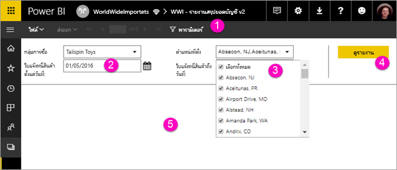

# ดูพารามิเตอร์สำหรับรายงานแบบแบ่งหน้าในบริการของ Power BI (ดูตัวอย่าง)

ในบทความนี้ คุณจะได้เรียนรู้วิธีการโต้ตอบกับพารามิเตอร์สำหรับรายงานแบบแบ่งหน้าในบริการของ Power BI  พารามิเตอร์รายงานจะให้วิธีการกรองข้อมูลรายงาน พารามิเตอร์จะให้รายการค่าที่พร้อมใช้ และคุณสามารถเลือกได้หนึ่งค่าหรือหลายค่า บางครั้งพารามิเตอร์จะมีค่าเริ่มต้น และบางครั้งคุณต้องเลือกค่าก่อนที่คุณจะเห็นรายงาน  

เมื่อคุณดูรายงานที่มีพารามิเตอร์ แถบเครื่องมือตัวแสดงรายงานจะแสดงพารามิเตอร์แต่ละตัว เพื่อให้คุณระบุค่าได้แบบโต้ตอบ ภาพประกอบต่อไปนี้จะแสดงพื้นที่พารามิเตอร์สำหรับรายงานที่มีพารามิเตอร์สำหรับ **กลุ่มการซื้อ**, **พื้นที่**, **จากวันที่** และ **ไปยังวันที่**  

## แผงพารามิเตอร์ในบริการของ Power BI

  
1.  **แผงพารามิเตอร์** แถบเครื่องมือตัวดูรายงานจะแสดงการแจ้งเตือนเช่น "จำเป็น" หรือค่าเริ่มต้นสำหรับพารามิเตอร์แต่ละตัว    
  
2.  **พารามิเตอร์ใบแจ้งหนี้จากวันที่/ถึงวันที่** พารามิเตอร์ข้อมูลสองตัวนี้มีค่าเริ่มต้น พิมพ์วันที่ในกล่องข้อความหรือเลือกวันที่จากปฏิทินเพื่อเปลี่ยนวันที่  
  
3.  **พารามิเตอร์ตำแหน่ง** พารามิเตอร์ตำแหน่งได้รับการตั้งค่าเพื่อให้คุณได้เลือกค่าหนึ่งค่า หลายค่า หรือค่าทั้งหมด 
  
4.  **ดูรายงาน** หลังจากที่คุณใส่หรือเปลี่ยนค่าพารามิเตอร์ ให้คลิกที่ **ดูรายงาน** เพื่อเรียกใช้รายงาน 

5. **ค่าเริ่มต้น** ถ้าพารามิเตอร์ทั้งหมดมีค่าเริ่มต้น รายงานจะทำงานอัตโนมัติในการดูครั้งแรก พารามิเตอร์บางตัวในรายงานนี้ไม่มีค่าเริ่มต้น คุณจึงจะไม่เห็นรายงานจนกว่าคุณจะเลือกค่า  

## ขั้นตอนถัดไป

[สร้างพารามิเตอร์สำหรับรายงานแบบแบ่งหน้าในบริการของ Power BI](paginated-reports-parameters.md)
