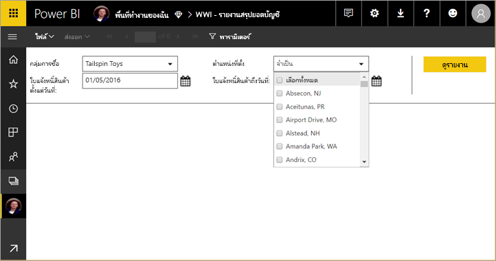
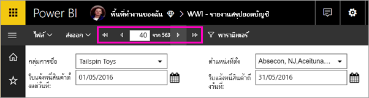
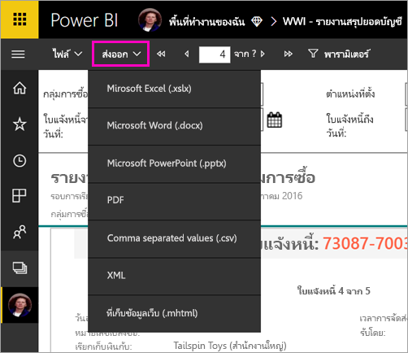

# ดูรายงานแบบแบ่งหน้าในบริการของ Power BI (ดูตัวอย่าง)

ในบทความนี้ คุณจะได้เรียนรู้เกี่ยวกับการดูรายงานแบบแบ่งหน้าในบริการของ Power BI รายงานแบบแบ่งหน้าคือรายงานที่สร้างไว้ในตัวสร้างรายงาน และอัปโหลดไปยังพื้นที่ทำงานที่อยู่ในความจุพรีเมียม มองหาไอคอนรูปข้าวหลามตัด  ถัดจากชื่อพื้นที่ทำงาน 

รายงานแบบแบ่งหน้าจะมีไอคอนเป็นของตัวเอง .

คุณยังสามารถส่งออกรายงานแบบแบ่งหน้าได้ในหลายรูปแบบ: 

- Microsoft Excel
- Microsoft Word
- Microsoft PowerPoint
- PDF
- ค่าที่คั่นด้วยเครื่องหมายจุลภาค
- XML
- ที่เก็บข้อมูลเว็บ (.mhtml)

## ดูรายงานที่มีการแบ่งหน้า

1. เลือกรายงานแบบแบ่งหน้าในพื้นที่ทำงาน

    

2. ถ้ารายงานแบบแบ่งหน้ามีพารามิเตอร์ อย่างเช่นตัวนี้ คุณอาจไม่เห็นรายงานในตอนที่เปิดขึ้นครั้งแรก เลือกพารามิเตอร์ จากนั้นเลือก**ดูรายงาน** 

     

    คุณยังสามารถเปลี่ยนพารามิเตอร์ได้ตลอดเวลา

1. เลื่อนผ่านแต่ละหน้าในรายงานได้โดยเลือกลูกศรที่ด้านบนของหน้า หรือโดยการพิมพ์หมายเลขหน้าลงในกล่อง
    
   

4. เลือก**ส่งออก**เพื่อค้นหารูปแบบที่จะใช้ส่งออกรายงานแบบแบ่งหน้า

    

## ขั้นตอนถัดไป

[รายงานแบบแบ่งหน้าใน Power BI Premium คืออะไร (ตัวอย่าง)](paginated-reports-report-builder-power-bi.md)
