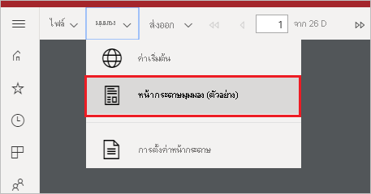
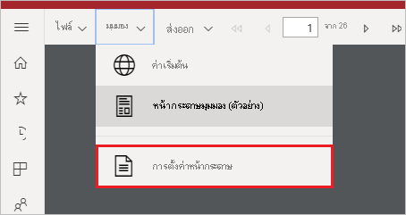

# ตั้งค่ามุมมองรายงานสำหรับรายงานที่มีการแบ่งหน้าในบริการของ Power BI

เมื่อคุณแสดงรายงานที่มีการแบ่งหน้าในบริการของ Power BI มุมมองเริ่มต้นคือมุมมองที่ยึดตาม HTML และโต้ตอบได้ มุมมองรายงานอื่นสำหรับรูปแบบหน้าแบบคงที่เช่น PDF คือตัวเลือกมุมมองหน้าใหม่

**มุมมองแบบโต้ตอบเริ่มต้น**

**มุมมองหน้าเพจ**

ในมุมมองหน้าเพจ รายงานที่แสดงจะมีลักษณะแตกต่างกันเมื่อเปรียบเทียบกับมุมมองเริ่มต้น คุณสมบัติและแนวคิดในรายงานที่มีการแบ่งหน้าจะใช้กับหน้าเพจแบบคงที่เท่านั้น มุมมองจะคล้ายกับเมื่อพิมพ์หรือส่งออกรายงาน คุณยังสามารถเปลี่ยนองค์ประกอบบางอย่างเช่น ค่าพารามิเตอร์ แต่ไม่มีคุณลักษณะแบบโต้ตอบอื่น ๆ เช่น การเรียงลำดับและการสลับคอลัมน์

มุมมองหน้าเพจจะสนับสนุนคุณลักษณะทั้งหมด การสนับสนุนตัวแสดง PDF ของเบราว์เซอร์ เช่น ย่อ ขยาย และพอดีกับหน้า

## สลับไปยังมุมมองหน้าเพจ

เมื่อคุณเปิดรายงานที่มีการแบ่งหน้า จะแสดงในมุมมองแบบโต้ตอบตามค่าเริ่มต้น ถ้ารายงานมีพารามิเตอร์ เลือกพารามิเตอร์แล้วดูรายงาน

1. เลือก **มุมมอง** บนแถบเครื่องมือ > **มุมมองหน้าเพจ**

    

2. คุณสามารถเปลี่ยนการตั้งค่าของมุมมองหน้าเพจได้โดยการเลือก **การตั้งค่าหน้า** ในเมนู**มุมมอง** บนแถบเครื่องมือ 

    
    
    กล่องโต้ตอบ**การตั้งค่าหน้า** มีตัวเลือกในการตั้งค่า**ขนาดหน้า**  และ **การวางแนว** สำหรับมุมมองหน้าเพจ หลังจากที่คุณนำการตั้งค่าหน้าไปใช้แล้ว จะใช้ตัวเลือกเดียวกันเมื่อคุณพิมพ์หน้าในภายหลัง
   
    

3. เมื่อต้องการสลับกลับไปยังมุมมองแบบโต้ตอบ ให้เลือก**ค่าเริ่มต้น**ในกล่องแบบหล่นลง **มุมมอง**

## การสนับสนุนเบราว์เซอร์

มุมมองหน้าเพจได้รับการสนับสนุนในเบราว์เซอร์ Google Chrome และ Microsoft Edge ตรวจสอบให้แน่ใจว่ามีการเปิดใช้งานการดูไฟล์ PDF ในเบราว์เซอร์ ซึ่งเป็นการตั้งค่าเริ่มต้นสำหรับเบราว์เซอร์เหล่านี้

มุมมองหน้าเพจไม่ได้รับการสนับสนุนใน Internet Explorer และ Safari ดังนั้นตัวเลือกจึงถูกปิดใช้งาน นอกจากนี้ยังไม่ได้รับการสนับสนุนในเบราว์เซอร์บนอุปกรณ์เคลื่อนที่ หรือในแอปสำหรับอุปกรณ์เคลื่อนที่ Power BI ดั้งเดิม  

## ขั้นตอนถัดไป

- [ดูรายงานแบบแบ่งหน้าในบริการของ Power BI](../consumer/paginated-reports-view-power-bi-service.md)
- [รายงานแบบแบ่งหน้าใน Power BI Premium คืออะไร](paginated-reports-report-builder-power-bi.md)
