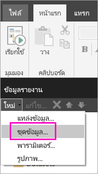
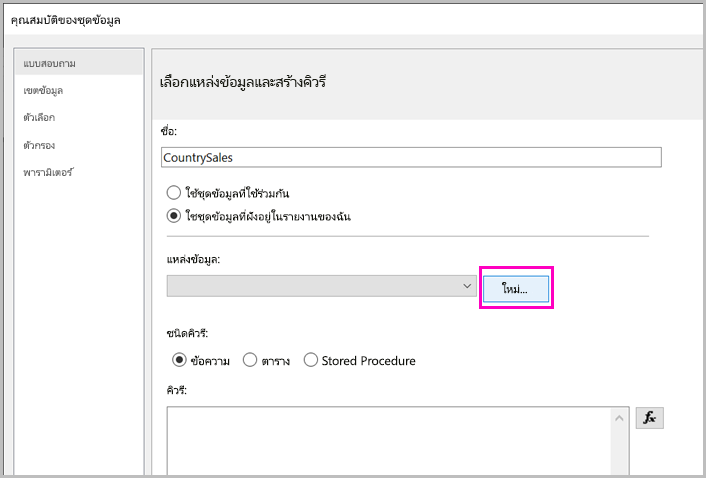
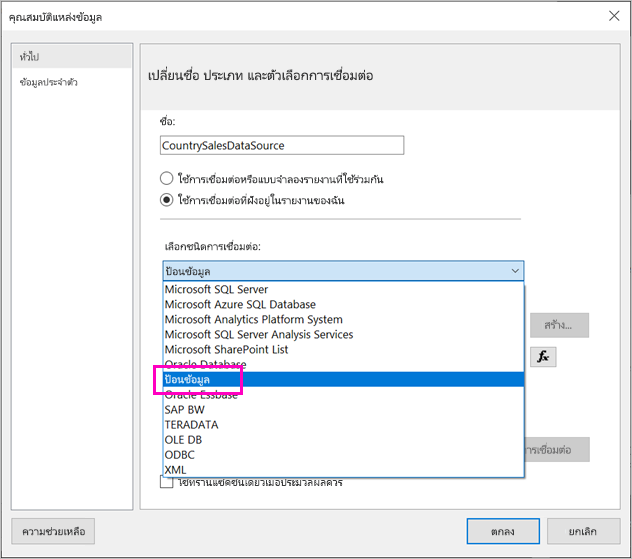
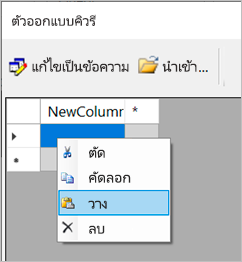
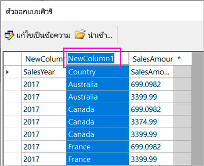
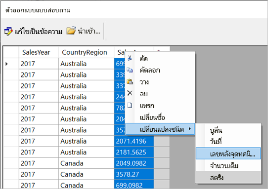
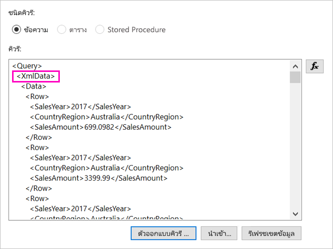
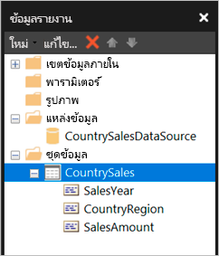

# <a name="enter-data-directly-in-a-paginated-report-in-report-builder---power-bi"></a>ใส่ข้อมูลในรายงานแบบแบ่งหน้าโดยตรงในตัวสร้างรายงาน - Power BI

ในบทความนี้ คุณจะเรียนรู้เกี่ยวกับคุณลักษณะในตัวสร้างรายงาน SQL Server 2016 เวอร์ชันใหม่ซึ่งช่วยให้คุณสามารถป้อนข้อมูลลงในรายงาน RDL เป็นชุดข้อมูลแบบฝังตัวได้โดยตรง  คุณลักษณะนี้คล้ายกับ Power BI Desktop คุณสามารถพิมพ์ข้อมูลลงในชุดข้อมูลในรายงานได้โดยตรง หรือวางจากโปรแกรมอื่น เช่น Microsoft Excel หลังจากที่คุณสร้างชุดข้อมูลโดยการป้อนข้อมูล คุณสามารถใช้ข้อมูลนี้ได้เช่นเดียวกับข้อมูลแบบฝังตัวอื่น ๆ ที่คุณสร้างขึ้น นอกจากนี้คุณยังสามารถเพิ่มตารางมากกว่าหนึ่งตารางและใช้ตารางหนึ่งเป็นตัวกรองตารางอื่นก็ได้ คุณลักษณะนี้มีประโยชน์อย่างยิ่งสำหรับชุดข้อมูลขนาดเล็กแบบคงที่ซึ่งคุณอาจต้องใช้ในรายงานของคุณ เช่น พารามิเตอร์ของรายงาน
 
## <a name="prerequisites"></a>ข้อกำหนดเบื้องต้น

- หากต้องการป้อนข้อมูลโดยตรงในรายงานแบบแบ่งหน้า ให้ติดตั้ง [ตัวสร้างรายงานจาก Microsoft Download Center](https://www.microsoft.com/download/details.aspx?id=53613) เวอร์ชันใหม่ 
- หากต้องการบันทึกรายงานแบบแบ่งหน้าของคุณไปยังบริการ Power BI คุณต้องใช้ [บัญชี Power BI Pro](../fundamentals/service-self-service-signup-for-power-bi.md) และเขียนการเข้าถึงพื้นที่ทำงานใน [ความจุ Power BI Premium](../admin/service-premium-what-is.md)
- หากต้องการบันทึกรายงานแบบแบ่งหน้าของคุณไปยังเซิร์ฟเวอร์รายงาน คุณต้องมีสิทธิ์เพื่อ[แก้ไขไฟล์ RsReportServer.config](#upload-the-paginated-report-to-a-report-server)

## <a name="get-started"></a>เริ่มใช้งาน

หลังจากที่คุณดาวน์โหลดและติดตั้งตัวสร้างรายงานแล้ว คุณทำตามเวิร์กโฟลว์เดียวกันกับที่คุณใช้เพิ่มแหล่งข้อมูลและชุดข้อมูลแบบฝังตัวในรายงานของคุณ ในขั้นตอนต่อไปนี้ ภายใต้ **แหล่งข้อมูล** คุณจะเห็นตัวเลือกใหม่: **ป้อนข้อมูล**  คุณจำเป็นต้องตั้งค่าแหล่งข้อมูลนี้เพียงครั้งเดียวในรายงาน หลังจากนั้นคุณสามารถสร้างตารางข้อมูลที่ป้อนหลายชุดเป็นชุดข้อมูลที่แยกจากกัน โดยใช้แหล่งข้อมูลเดียวทั้งหมด

1. ใน **ข้อมูลรายงาน** ให้เลือก **ชุดข้อมูล** > **ใหม่**

    

1. ในกล่องโต้ตอบ **คุณสมบัติของชุดข้อมูล** เลือก **ใช้ชุดข้อมูลที่ฝังอยู่ในรายงานของฉัน**

1. ถัดจาก **แหล่งข้อมูล** เลือก **ใหม่**

    

1. ในกล่องโต้ตอบ **คุณสมบัติของแหล่งข้อมูล** เลือก **ใช้การเชื่อมต่อที่ฝังอยู่ในรายงานของฉัน**
2. ในกล่อง **เลือกประเภทการเชื่อมต่อ** ให้เลือก **ENTER DATA** > **OK**

    

1. กลับมาในกล่องโต้ตอบ **คุณสมบัติของชุดข้อมูล** เลือก **ตัวออกแบบคิวรี**
2. ในหน้าต่าง **ตัวออกแบบคิวรี** ให้คลิกขวาและวางข้อมูลลงในตาราง

    

1. ในการตั้งชื่อคอลัมน์ ให้ดับเบิลคลิกที่แต่ละ **NewColumn** และพิมพ์ชื่อคอลัมน์

    

1. ถ้าแถวแรกมีส่วนหัวของคอลัมน์จากข้อมูลเดิม ให้คลิกขวาและลบออก
    
9. ตามค่าเริ่มต้น ชนิดข้อมูลสำหรับแต่ละคอลัมน์เป็นสตริง หากต้องการเปลี่ยนชนิดข้อมูล ให้คลิกขวาที่ส่วนหัวของคอลัมน์ > **เปลี่ยนประเภท** และตั้งค่าเป็นประเภทข้อมูลอื่น เช่น Date หรือ Float

    

1. เมื่อคุณสร้างตารางเสร็จแล้ว ให้เลือก **OK**  

    คิวรีที่สร้างขึ้นเหมือนกับที่คุณเห็นกับแหล่งข้อมูล XML ภายใต้หน้าปก เราใช้ XML เป็นผู้ให้บริการข้อมูล  เราได้นำไปใช้ในจุดประสงค์อื่นเพื่อให้สามารถใช้งานสถานการณ์สมมตินี้ได้เช่นกัน

    

12. ในกล่องโต้ตอบ **คุณสมบัติของชุดข้อมูล** เลือก **OK**

13. คุณเห็นแหล่งข้อมูลและชุดข้อมูลในหน้าต่าง **ข้อมูลรายงาน**

    

คุณสามารถใช้ชุดข้อมูลของคุณเป็นพื้นฐานสำหรับการสร้างภาพข้อมูลในรายงานของคุณ นอกจากนี้ คุณยังสามารถเพิ่มชุดข้อมูลอื่นและใช้แหล่งข้อมูลเดียวกันได้

## <a name="upload-the-paginated-report-to-the-power-bi-service"></a>อัปโหลดรายงานแบบแบ่งหน้าไปยังบริการของ Power BI

ขณะนี้รายงานแบบแบ่งหน้าได้รับการสนับสนุนในบริการของ Power BI คุณสามารถอัปโหลดรายงานแบบแบ่งหน้าของคุณไปยังความจุพรีเมียม โปรดดู [อัปโหลดรายงานแบบแบ่งหน้า](paginated-reports-save-to-power-bi-service.md) สำหรับรายละเอียด

## <a name="upload-the-paginated-report-to-a-report-server"></a>อัปโหลดรายงานแบบแบ่งหน้าไปยังเซิร์ฟเวอร์รายงาน

นอกจากนี้คุณยังสามารถอัปโหลดรายงานแบบแบ่งหน้าของคุณไปยังเซิร์ฟเวอร์รายงาน Power BI Report Server หรือ SQL Server Reporting Services 2016 หรือ 2017 ก่อนที่คุณจะทำ คุณต้องเพิ่มรายการต่อไปนี้ลงใน RsReportServer.config ของคุณเป็นส่วนขยายข้อมูลเพิ่มเติม สำรองไฟล์ RsReportServer.config ก่อนที่จะทำการเปลี่ยนแปลงในกรณีที่คุณเรียกใช้เข้าไปในประเด็น

```xml
<Extension Name="ENTERDATA" Type="Microsoft.ReportingServices.DataExtensions.XmlDPConnection,Microsoft.ReportingServices.DataExtensions">
    <Configuration>
        <ConfigName>ENTERDATA</ConfigName>
    </Configuration>
</Extension>
```

หลังจากแก้ไขแล้ว รายละเอียดของผู้ให้บริการข้อมูลในไฟล์กำหนดค่าควรมีลักษณะดังนี้


นั่นคือ - ตอนนี้คุณสามารถเผยแพร่รายงานที่ใช้ฟังก์ชันการทำงานใหม่นี้ไปยังเซิร์ฟเวอร์รายงานของคุณได้แล้ว

## <a name="next-steps"></a>ขั้นตอนถัดไป

- [รายงานแบบแบ่งหน้าใน Power BI Premium คืออะไร](paginated-reports-report-builder-power-bi.md)
- [เซิร์ฟเวอร์รายงาน Power BI คืออะไร](../report-server/get-started.md)
