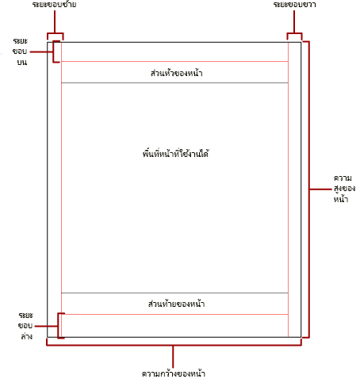
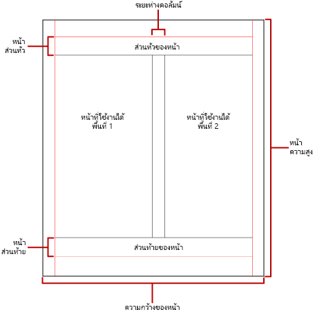

# การแบ่งหน้าในรายงานที่มีการแบ่งหน้าของ Power BI

 *การแบ่งหน้า* จะอ้างอิงตามจำนวนหน้าภายในรายงาน และการจัดเรียงรายการรายงานในหน้าเหล่านั้น การแบ่งหน้าในรายงานที่มีการแบ่งหน้าของ Power BI จะแตกต่างกันโดยขึ้นอยู่กับการขยายการแสดงข้อมูลที่คุณใช้ในการดูและส่งรายงาน เมื่อคุณเรียกใช้รายงานบนเซิร์ฟเวอร์รายงาน รายงานจะใช้การแสดงข้อมูลของ HTML HTML จะทำตามชุดเฉพาะของกฎการแบ่งหน้า หากคุณส่งออกรายงานเดียวกันเป็น PDF ตัวอย่างเช่น คุณกำลังใช้ตัวแสดงผล PDF ซึ่งใช้กฎที่แตกต่างกัน ดังนั้น รายงานจึงแบ่งหน้าแตกต่างกัน คุณจำเป็นต้องทำความเข้าใจกฎที่ใช้ในการควบคุมการแบ่งหน้าในรายงานที่มีการแบ่งหน้าของ Power BI จากนั้นคุณสามารถออกแบบรายงานที่ง่ายต่อการอ่านที่คุณปรับให้เหมาะสมสำหรับตัวแสดงผลที่คุณวางแผนที่จะใช้ในการจัดส่งรายงานของคุณ  
  
 หัวข้อนี้กล่าวถึงผลกระทบของขนาดหน้ากระดาษจริงและโครงร่างรายงานเกี่ยวกับวิธีการที่รูปแบบของตัวแสดงผลแบบบังคับแบ่งหน้าแสดงรายงาน คุณสามารถตั้งค่าคุณสมบัติเพื่อปรับเปลี่ยนขนาดหน้าและระยะขอบจริง และแบ่งรายงานเป็นคอลัมน์ได้ ให้ใช้บานหน้าต่าง **คุณสมบัติของรายงาน** บานหน้าต่าง **คุณสมบัติ** หรือกล่องโต้ตอบ **การตั้งค่าหน้ากระดาษ** เข้าถึงบานหน้าต่าง **คุณสมบัติของรายงาน** โดยการคลิกพื้นที่สีน้ำเงินภายนอกเนื้อความรายงาน เข้าถึงกล่องโต้ตอบ **การตั้งค่าหน้ากระดาษ** โดยการคลิก **เรียกใช้** บนแท็บหน้าแรก จากนั้นคลิก **การตั้งค่าหน้ากระดาษ** บนแท็บเรียกใช้  
  
> [!NOTE]  
>  หากคุณได้ออกแบบรายงานให้มีความกว้างหนึ่งหน้า แต่มีการแสดงผลในหลาย ๆ หน้า ให้ตรวจสอบว่าความกว้างของเนื้อความรายงานรวมถึงระยะขอบนั้นไม่ใหญ่กว่าความกว้างของขนาดหน้ากระดาษจริง เพื่อป้องกันไม่ให้มีการเพิ่มหน้าเปล่าลงในรายงานของคุณ คุณสามารถลดขนาดคอนเทนเนอร์ได้โดยการลากมุมคอนเทนเนอร์ไปด้านซ้าย  

## เนื้อความรายงาน  
 เนื้อความรายงานเป็นคอนเทนเนอร์สี่เหลี่ยมที่แสดงเป็นพื้นที่สีขาวบนพื้นผิวการออกแบบ ซึ่งสามารถขยายหรือลดขนาดเพื่อรองรับรายการรายงานที่มีอยู่ภายใน เนื้อความรายงานไม่แสดงขนาดหน้ากระดาษจริง และในความเป็นจริงเนื้อความรายงานสามารถขยายเกินขอบเขตของขนาดหน้ากระดาษจริงเพื่อขยายหลายหน้ารายงาน การแสดงผลบางอย่างเช่น Microsoft Excel, Word, HTML และ MHTML แสดงรายงานที่ขยายหรือลดขนาดขึ้นอยู่กับเนื้อหาของหน้า รายงานที่แสดงในรูปแบบเหล่านี้ได้รับการปรับให้เหมาะสมสำหรับการดูบนหน้าจอเช่น ในเว็บเบราว์เซอร์ การแสดงผลเหล่านี้จะเพิ่มตัวแบ่งหน้าแนวตั้งเมื่อจำเป็น  
  
 คุณสามารถจัดรูปแบบเนื้อความรายงานด้วยสีเส้นขอบ ลักษณะเส้นขอบ และความกว้างเส้นขอบ นอกจากนี้ คุณยังสามารถเพิ่มสีพื้นหลังและรูปพื้นหลัง  
  
## หน้าจริง  
 ขนาดของหน้าจริงคือขนาดแผ่นกระดาษ ขนาดกระดาษที่คุณระบุสำหรับรายงานจะควบคุมวิธีการแสดงรายงาน รายงานที่แสดงผลในรูปแบบของตัวแสดงผลแบบบังคับแบ่งหน้าจะแทรกตัวแบ่งหน้าในแนวนอนและแนวตั้งตามขนาดหน้าจริง ตัวแบ่งหน้าเหล่านี้มอบประสบการณ์การอ่านที่ดีที่สุดเมื่อพิมพ์หรือดูในรูปแบบไฟล์ที่มีการบังคับแบ่งหน้า รายงานที่แสดงผลในรูปแบบของตัวแสดงผลแบบไม่ได้บังคับแบ่งหน้าจะแทรกตัวแบ่งหน้าในแนวนอนตามขนาดหน้าจริง อีกครั้ง ตัวแบ่งหน้ามอบประสบการณ์การอ่านที่ดีที่สุดเมื่อดูในเว็บเบราว์เซอร์  
  
 ตามค่าเริ่มต้น ขนาดของหน้าคือ 8.5 x 11 นิ้ว แต่คุณสามารถเปลี่ยน แต่คุณสามารถเปลี่ยนขนาดนี้ในบานหน้าต่าง **คุณสมบัติของรายงาน** หรือกล่องโต้ตอบ **การตั้งค่าหน้ากระดาษ** หรือโดยการเปลี่ยนคุณสมบัติ PageHeight และ PageWidth ในบานหน้าต่าง **คุณสมบัติ** ขนาดหน้าจะไม่ขยายหรือลดขนาดเพื่อรองรับเนื้อหาของเนื้อความรายงาน ถ้าคุณต้องการให้รายงานปรากฏบนหน้าเดียว เนื้อหาทั้งหมดภายในเนื้อความรายงานต้องพอดีกับหน้าจริง ถ้าไม่พอดีและคุณใช้รูปแบบการบังคับแบ่งหน้า รายงานจะต้องมีหน้าเพิ่มเติม ถ้าเนื้อความรายงานขยายเกินขอบด้านขวาของหน้าจริงแล้ว ตัวแบ่งหน้าจะถูกแทรกในแนวนอน ถ้าเนื้อความรายงานขยายเกินขอบด้านล่างของหน้าจริงแล้ว ตัวแบ่งหน้าจะถูกแทรกในแนวตั้ง  
  
 ถ้าคุณต้องการแทนที่ขนาดของหน้าจริงที่กำหนดในรายงาน คุณสามารถระบุขนาดหน้าจริงได้โดยใช้การตั้งค่าข้อมูลอุปกรณ์สำหรับการแสดงผลเฉพาะที่คุณกำลังใช้เพื่อส่งออกรายงานได้ สำหรับรายการทั้งหมด ให้ดู [การตั้งค่าข้อมูลอุปกรณ์สำหรับการแสดงส่วนขยาย](https://docs.microsoft.com/sql/reporting-services/device-information-settings-for-rendering-extensions-reporting-services?view=sql-server-2017) ในเอกสารประกอบของ SQL Server Reporting Services  
  
### ระยะขอบ

 ระยะขอบจะถูกดึงจากขอบของมิติหน้าจริงเข้าไปยังการตั้งค่าระยะขอบที่ระบุ ถ้ารายการรายงานขยายเข้าไปพื้นที่ระยะขอบ พื้นที่ดังกล่าวจะถูกตัดเพื่อให้ไม่มีการแสดงพื้นที่ทับซ้อนกัน หากคุณระบุขนาดของระยะขอบที่ทำให้ความกว้างแนวนอนหรือแนวตั้งของหน้าเท่ากับศูนย์ การตั้งค่าระยะขอบจะมีค่าเริ่มต้นเป็นศูนย์ มีการระบุระยะขอบในบานหน้าต่าง **คุณสมบัติของรายงาน** หรือกล่องโต้ตอบ **การตั้งค่าหน้ากระดาษ** หรือโดยการเปลี่ยนแปลงคุณสมบัติ TopMargin, BottomMargin, LeftMargin และ RightMargin ในบานหน้าต่าง **คุณสมบัติ** ถ้าคุณต้องการแทนที่ขนาดของระยะขอบที่กำหนดในรายงาน คุณสามารถระบุขนาดของระยะขอบได้โดยใช้การตั้งค่าข้อมูลอุปกรณ์สำหรับการแสดงผลเฉพาะที่คุณกำลังใช้เพื่อส่งออกรายงานได้  
  
 พื้นที่ของหน้าจริงที่ยังคงเหลืออยู่หลังจากที่มีการจัดสรรพื้นที่ว่างสำหรับระยะขอบ การเว้นวรรคคอลัมน์ และส่วนหัวและส่วนท้ายของหน้ากระดาษเรียกว่า *พื้นที่หน้าที่ใช้งานได้* ระยะขอบจะถูกนำไปใช้เมื่อคุณแสดงและพิมพ์รายงานรูปแบบของตัวแสดงผลแบบบังคับแบ่งหน้า รูปภาพต่อไปนี้แสดงระยะขอบและพื้นที่หน้าที่ใช้งานได้ของหน้าจริง  
  
 
  
### คอลัมน์รูปแบบจดหมายข่าว  

 รายงานของคุณสามารถแบ่งออกเป็นคอลัมน์ได้ เช่น คอลัมน์ในหนังสือพิมพ์ คอลัมน์จะถือว่าเป็นหน้า *แบบลอจิคัล*ที่แสดงบนหน้า*จริง*เดียวกัน หน้าเหล่านั้นจะถูกจัดเรียงจากซ้ายไปขวา บนลงล่าง และคั่นด้วยช่องว่างระหว่างแต่ละคอลัมน์ ถ้ารายงานจะถูกแบ่งออกเป็นมากกว่าหนึ่งคอลัมน์ แต่ละหน้าทางกายจริงจะถูกแบ่งออกตามแนวตั้งเป็นคอลัมน์ และแต่ละคอลัมน์จะถือว่าเป็นหน้าแบบลอจิคัล ตัวอย่างเช่น สมมติว่าคุณมีสองคอลัมน์บนหน้าจริง เนื้อหาของรายงานของคุณจะเติมคอลัมน์แรกและคอลัมน์ที่สอง ถ้ารายงานทั้งหมดไม่พอดีกับภายในสองคอลัมน์แรก รายงานจะเติมคอลัมน์แรกและคอลัมน์ที่สองในหน้าถัดไป มีการเติมคอลัมน์ต่อไป จากซ้ายไปขวา แล้วบนลงล่างจนกว่าจะมีการแสดงรายการรายงานทั้งหมด หากคุณระบุขนาดคอลัมน์ที่ทำให้ความกว้างแนวนอนหรือความกว้างแนวตั้งเท่ากับศูนย์ ระยะห่างระหว่างคอลัมน์จะมีค่าเริ่มต้นเป็นศูนย์  
  
 คุณระบุคอลัมน์ในบานหน้าต่าง **คุณสมบัติของรายงาน** หรือกล่องโต้ตอบ **การตั้งค่าหน้ากระดาษ** หรือโดยการเปลี่ยนแปลงคุณสมบัติ TopMargin, BottomMargin, LeftMargin และ RightMargin ในบานหน้าต่าง **คุณสมบัติ** ถ้าคุณต้องการใช้่ขนาดของระยะขอบที่ไม่ได้ระบุไว้ คุณสามารถระบุขนาดของระยะขอบได้โดยใช้การตั้งค่าข้อมูลอุปกรณ์สำหรับการแสดงผลเฉพาะที่คุณกำลังส่งออกรายงานได้ คอลัมน์จะถูกนำไปใช้เมื่อคุณแสดงและพิมพ์รายงานในรูปแบบไฟล์ PDF หรือไฟล์ภาพ รูปภาพต่อไปนี้แสดงพื้นที่หน้าที่ใช้งานได้ของหน้าที่มีคอลัมน์  
  

  
## ตัวแบ่งหน้าและชื่อหน้า

 รายงานอาจอ่านง่ายขึ้นและข้อมูลสามารถตรวจสอบและส่งออกได้ง่ายขึ้นเมื่อรายงานมีชื่อหน้า Reporting Services มีคุณสมบัติสำหรับรายงาน ตาราง เมทริกซ์ และขอบเขตข้อมูลรายการ กลุ่ม และพื้นที่ในรายงานเพื่อควบคุมการแบ่งหน้า รีเซ็ตหมายเลขหน้า และระบุชื่อหน้ารายงานใหม่เมื่อมีตัวแบ่งหน้า คุณลักษณะเหล่านี้สามารถปรับปรุงรายงานโดยไม่คำนึงถึงรูปแบบที่มีการแสดงรายงาน แต่จะมีประโยชน์อย่างยิ่งเมื่อส่งรายงานไปยังเวิร์กบุ๊ก Excel

> [!NOTE]
> ตาราง เมทริกซ ์และขอบเขตข้อมูลรายการล้วนแต่เป็นขอบเขตข้อมูลประเภทเดียวกันที่อยู่เบื้องหลังฉาก: *tablix* ดังนั้นคุณอาจพบชื่อนั้น 

 คุณสมบัติ InitialPageName แสดงชื่อหน้าเริ่มต้นของรายงาน ถ้ารายงานของคุณไม่มีชื่อหน้าสำหรับตัวแบ่งหน้า ชื่อหน้าเริ่มต้นของรายงานจะถูกนำไปใช้สำหรับหน้าใหม่ทั้งหมดที่สร้างขึ้นโดยตัวแบ่งหน้า คุณไม่จำเป็นต้องใช้ชื่อหน้าเริ่มต้น  
  
 รายงานที่แสดงผลสามารถใส่ชื่อหน้าใหม่สำหรับหน้าใหม่ที่ทำให้มีการแบ่งหน้า หากต้องการกำหนดชื่อหน้า คุณต้องตั้งค่าคุณสมบัติ PageName ของตาราง เมทริกซ์ รายการ กลุ่ม หรือพื้นที่ คุณไม่จำเป็นต้องระบุชื่อหน้าบนตัวแบ่ง ถ้าคุณไม่ได้มี ค่าของ InitialPageName จะถูกนำมาใช้แทน ถ้า InitialPageName ยังว่างเปล่า หน้าใหม่จะไม่มีชื่อ  
  
 ตาราง เมทริกซ์ และขอบเขตข้อมูลรายการ กลุ่ม และพื้นที่รองรับตัวแบ่งหน้า  
  
 ตัวแบ่งหน้ามีคุณสมบัติต่อไปนี้:  
  
- **BreakLocation** ระบุตำแหน่งที่ตั้งของตัวแบ่งสำหรับองค์ประกอบของรายงานที่เปิดใช้งานตัวแบ่งหน้า: ที่จุดเริ่มต้น สิ้นสุด หรือเริ่มต้นและสิ้นสุด ในกลุ่มต่าง ๆ BreakLocation สามารถอยู่ระหว่างกลุ่มได้  
  
- **ปิดใช้งาน**  ระบุว่ามีการใช้ตัวแบ่งหน้ากับองค์ประกอบรายงานหรือไม่ ถ้าคุณสมบัตินี้ประเมินเป็นจริง ตัวแบ่งหน้าจะถูกละเว้น คุณสมบัตินี้จะถูกนำไปใช้เพื่อปิดใช้งานตัวแบ่งหน้าโดยยึดตามนิพจน์เมื่อมีการเรียกใช้รายงาน  
  
- **ResetPageNumber** ระบุว่าควรตั้งค่าหมายเลขหน้าเป็น 1 เมื่อมีตัวแบ่งหน้าเกิดขึ้นหรือไม่ ถ้าคุณสมบัตินี้ประเมินเป็นจริง หมายเลขหน้าจะถูกรีเซ็ต  
  
 คุณสามารถตั้งค่าคุณสมบัติ BreakLocation ในกล่องโต้ตอบ **คุณสมบัติ Tablix** **คุณสมบัติพื้นที่** หรือ **คุณสมบัติกลุ่ม** แต่คุณต้องตั้งค่าคุณสมบัติที่ปิดใช้งาน คุณสมบัติ ResetPageNumber และ PageName ในบานหน้าต่างคุณสมบัติตัวสร้างรายงาน ถ้าคุณสมบัติในบานหน้าต่างคุณสมบัติได้รับการจัดระเบียบตามประเภท คุณจะสามารถค้นหาคุณสมบัติต่าง ๆ ได้ในประเภท **PageBreak** สำหรับกลุ่มต่าง ๆ ประเภท **PageBreak** จะอยู่ภายในประเภท **กลุ่ม**  
  
 คุณสามารถใช้นิพจน์ค่าคงที่และอย่างง่าย หรือซับซ้อนในการกำหนด ค่าของคุณสมบัติที่ปิดใช้งานและคุณสมบัติ ResetPageNumber อย่างไรก็ตาม คุณไม่สามารถใช้นิพจน์ที่มีคุณสมบัติ BreakLocation ได้ สำหรับข้อมูลเพิ่มเติมเกี่ยวกับการเขียนและการใช้นิพจน์ ให้ดู [นิพจน์ในตัวสร้างรายงาน Power BI](report-builder-expressions.md)  
  
 ในรายงานของคุณ คุณสามารถเขียนนิพจน์ที่อ้างอิงชื่อหน้าหรือหมายเลขหน้าปัจจุบันโดยใช้คอลเลกชัน **ส่วนกลาง** สำหรับข้อมูลเพิ่มเติม ให้ดู [ส่วนกลางที่มีอยู่แล้วภายในและการอ้างอิงผู้ใช้](https://docs.microsoft.com/sql/reporting-services/report-design/built-in-collections-built-in-globals-and-users-references-report-builder?view=sql-server-2017) ในตัวสร้างรายงานและเอกสาร Reporting Services
  
### การตั้งชื่อแท็บแผ่นงาน Excel

 คุณสมบัติเหล่านี้จะมีประโยชน์เมื่อคุณส่งออกรายงานไปยังเวิร์กบุ๊ก Excel ใช้คุณสมบัติ InitialPage เพื่อระบุชื่อเริ่มต้นสำหรับชื่อแท็บแผ่นงานเมื่อคุณส่งออกรายงาน และใช้ตัวแบ่งหน้าและคุณสมบัติ PageName เพื่อตั้งชื่อที่แตกต่างกันสำหรับแต่ละแผ่นงาน หน้ารายงานใหม่แต่ละหน้าที่กำหนดโดยตัวแบ่งหน้าจะถูกส่งออกไปยังแผ่นงานอื่นที่ชื่อตามค่าของคุณสมบัติ PageName ถ้า PageName ว่างเปล่าแต่รายงานมีชื่อหน้าเริ่มต้น จากนั้นแผ่นงานทั้งหมดในเวิร์กบุ๊ก Excel จะใช้ชื่อเดียวกัน นั่นคือชื่อหน้าเริ่มต้น  
  
 สำหรับข้อมูลเพิ่มเติมเกี่ยวกับวิธีการทำงานของคุณสมบัติเหล่านี้เมื่อมีการส่งออกรายงานไปยัง Excel ให้ดู [การส่งออกไปยัง Microsoft Excel](https://docs.microsoft.com/sql/reporting-services/report-builder/exporting-to-microsoft-excel-report-builder-and-ssrs) ในตัวสร้างรายงานและเอกสาร Reporting Services  
  
## ขั้นตอนถัดไป

- [ดูรายงานแบบแบ่งหน้าในบริการของ Power BI](../consumer/paginated-reports-view-power-bi-service.md)
- [หลีกเลี่ยงหน้าเปล่าเมื่อพิมพ์รายงานแบบแบ่งหน้า](../guidance/report-paginated-blank-page.md)
- มีคำถามเพิ่มเติมหรือไม่ [ลองไปที่ชุมชน Power BI](https://community.powerbi.com/)
