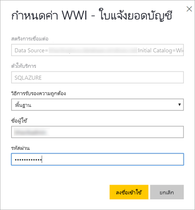

# เผยแพร่รายงานแบบแบ่งหน้าไปยังบริการของ Power BI

ในบทความนี้ คุณจะได้เรียนรู้เกี่ยวกับการเผยแพร่รายงานแบบแบ่งหน้าไปยังบริการของ Power BI โดยการอัปโหลดจากคอมพิวเตอร์ของคุณเอง คุณสามารถอัปโหลดรายงานแบบแบ่งหน้าไปยัง "พื้นที่ทำงานของฉัน" หรือพื้นที่ทำงานอื่นได้ ตราบเท่าที่พื้นที่ทำงานนั้นอยู่ในความจุ Premium มองหาไอคอนรูปข้าวหลามตัด  ถัดจากชื่อพื้นที่ทำงาน 

หากแหล่งข้อมูลของรายงานของคุณอยู่ในองค์กร คุณต้องสร้างเกตเวย์หลังจากที่อัปโหลดรายงานแล้ว ดูที่ส่วน [สร้างเกตเวย์](#create-a-gateway) ในภายหลังในบทความนี้

## เพิ่มพื้นที่ทำงานไปยังความจุพรีเมียม

ถ้าพื้นที่ทำงานไม่มีไอคอนรูปข้าวหลามตัด  อยู่ถัดจากชื่อ คุณต้องเพิ่มพื้นที่ทำงานไปยังความจุพรีเมียม 

1. เลือก**พื้นที่ทำงาน** เลือกจุดไข่ปลา ( **...** ) ที่อยู่ถัดจากชื่อของพื้นที่ทำงาน จากนั้นเลือก**แก้ไขพื้นที่ทำงาน**

    

1. ในกล่องโต้ตอบ **แก้ไขพื้นที่ทำงาน** ให้คุณขยาย**ขั้นสูง** จากนั้นเลื่อน **ความจุเฉพาะ** ไปยัง **เปิด**

    

   คุณอาจไม่สามารถเปลี่ยนได้ ถ้าเปลี่ยนไม่ได้ โปรดติดต่อผู้ดูแลความจุ Power BI Premium เพื่อให้สิทธิ์ในการกำหนดกับคุณ เพื่อเพิ่มพื้นที่ทำงานไปยังความจุพรีเมียม

## จากตัวสร้างรายงาน เผยแพร่รายงานที่มีการแบ่งหน้า

1. สร้างรายงานแบบแบ่งหน้าในตัวสร้างรายงานและบันทึกลงคอมพิวเตอร์ของคุณ

1. บนเมนู **ไฟล์** ของตัวสร้างรายงาน เลือก **บันทึกเป็น**

    

    ถ้าคุณยังไม่ได้ลงชื่อเข้าใช้ Power BI คุณจำเป็นต้องลงชื่อเข้าใช้หรือสร้างบัญชีตอนนี้ ในมุมขวาบนของตัวสร้างรายงาน เลือก **ลงชื่อเข้าใช้** และดำเนินการตามขั้นตอนให้เสร็จสมบูรณ์

2. ในรายการของพื้นที่ทำงานทางด้านซ้าย ให้เลือกพื้นที่ทำงานที่มีไอคอนรูปเพชร  ที่อยู่ถัดจากชื่อ พิมพ์**ชื่อไฟล์** ในกล่อง > **บันทึก** 

    

4. เปิดบริการของ Power BI ในเบราว์เซอร์และเรียกดูไปที่พื้นที่ทำงานแบบ Premium ซึ่งคุณสามารถเผยแพร่รายงานที่มีการแบ่งหน้าได้ บนแท็บ **รายงาน** คุณจะมองเห็นรายงานของคุณ

    

5. เลือกรายงานที่มีการแบ่งหน้าเพื่อเปิดในบริการของ Power BI ถ้ามีพารามิเตอร์ คุณต้องเลือกก่อนที่คุณจะสามารถดูรายงานได้

    

6. หากแหล่งข้อมูลรายงานของคุณอยู่ภายในองค์กร ให้อ่านเกี่ยวกับวิธีการ[สร้างเกตเวย์](#create-a-gateway)ในบทความนี้ เพื่อเข้าถึงแหล่งข้อมูล

## จากบริการของ Power BI อัปโหลดรายงานที่มีการแบ่งหน้า

นอกจากนี้ คุณยังสามารถเริ่มต้นจากบริการของ Power BI และอัปโหลดรายงานที่มีการแบ่งหน้า

1. สร้างรายงานแบบแบ่งหน้าในตัวสร้างรายงานและบันทึกลงคอมพิวเตอร์ของคุณ

1. เปิดบริการของ Power BI ในเบราเซอร์และเรียกดูพื้นที่ทำงาน Premium ที่คุณต้องการเผยแพร่รายงาน มองหาไอคอนรูปข้าวหลามตัด  ที่อยู่ถัดจากชื่อ 

1. เลือก**รับข้อมูล**

    

1. ในกล่อง**ไฟล์** เลือก**รับ**

    

1. เลือก**ไฟล์ภายในเครื่อง** > เรียกดูรายงานแบบแบ่งหน้า > **เปิด**

    

1. เลือก**ดำเนินการต่อ** > **แก้ไขข้อมูลประจำตัว**

    

1. กำหนดข้อมูลประจำตัว > **ลงชื่อเข้าใช้**

    

   บนแท็บ **รายงาน** คุณจะมองเห็นรายงานของคุณ

    

1. เลือกเพื่อเปิดในบริการของ Power BI ถ้ามีพารามิเตอร์ คุณต้องเลือกก่อนที่คุณจะสามารถดูรายงานได้
 
    

6. หากแหล่งข้อมูลรายงานของคุณอยู่ภายในองค์กร ให้อ่านเกี่ยวกับวิธีการ[สร้างเกตเวย์](#create-a-gateway)ในบทความนี้ เพื่อเข้าถึงแหล่งข้อมูล

## สร้างเกตเวย์

เช่นเดียวกันกับรายงาน Power BI อื่นๆ หากแหล่งข้อมูลของรายงานอยู่ในองค์กร คุณต้องสร้างหรือเชื่อมต่อเกตเวย์เพื่อเข้าถึงข้อมูล

1. ที่ถัดจากชื่อรายงาน ให้คุณเลือก**จัดการ**

   

1. ดูบทความบริการของ Power BI [เกตเวย์ข้อมูลภายในองค์กรคืออะไร](../connect-data/service-gateway-onprem.md) สำหรับรายละเอียดและขั้นตอนถัดไป

## ขั้นตอนถัดไป

- [ดูรายงานแบบแบ่งหน้าในบริการของ Power BI](../consumer/paginated-reports-view-power-bi-service.md)
- [รายงานแบบแบ่งหน้าใน Power BI Premium คืออะไร](paginated-reports-report-builder-power-bi.md)
- [บทช่วยสอน: ฝังรายงานที่มีการแบ่งหน้าของ Power BI ในแอปพลิเคชันสำหรับลูกค้าของคุณ](../developer/embed-paginated-reports-customers.md)

