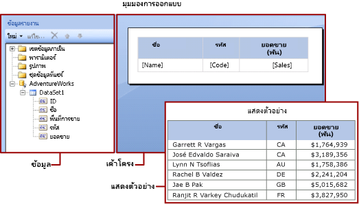

# นิพจน์ในตัวสร้างรายงานใน Power BI
  นิพจน์ถูกใช้อย่างแพร่หลายผ่านรายงานที่มีการแบ่งหน้าของตัวสร้างรายงานใน Power BI เพื่อกู้คืน คำนวณ แสดงผล จัดกลุ่ม เรียงลำดับ กรอง กำหนดค่าพารามิเตอร์ และจัดรูปแบบข้อมูล 
  
  รายการคุณสมบัติของรายงานหลายข้อสามารถตั้งค่าไปที่นิพจน์ได้ นิพจน์ช่วยคุณควบคุมเนื้อหา การออกแบบ และการตอบโต้ของรายงานของคุณ นิพจน์ถูกเขียนในMicrosoft Visual Basic ถูกบันทึกในข้อกำหนดของรายงาน และได้รับการประมวลผลโดยเค้าโครงรายงานเมื่อคุณดูรายงาน  
  
 แตกต่างจากแอปพลิเคชัน เช่น Microsoft Office Excel ที่คุณทำงานในเวิร์กชีตโดยตรง แต่ในรายงานคุณจะได้ทำงานกับนิพจน์ที่เป็นพื้นที่สำรองไว้สำหรับข้อมูล คุณต้องแสดงตัวอย่างรายงานเพื่อดูข้อมูลจริงจากนิพจน์ที่ได้รับการประมวลผลแล้ว เมื่อคุณเรียกดูรายงาน ตัวประมวลผลรายงานจะคำนวณแต่ละนิพจน์ ในขณะที่รวมข้อมูลรายงานและองค์ประกอบเค้าโครงรายงานเข้าด้วยกัน เช่น ตารางและแผนภูมิ  
  
 ในขณะที่คุณออกแบบรายงาน หลายนิพจน์สำหรับหน่วยข้อมูลของรายงานได้ถูกตั้งค่าไว้สำหรับคุณแล้ว ตัวอย่างเช่น เมื่อคุณลากฟิลด์จากบานหน้าต่างข้อมูลไปยังเซลล์ตารางบนพื้นผิวการออกแบบรายงาน ค่ากล่องข้อความจะถูกตั้งค่าไปยังนิพจน์ธรรมดาสำหรับฟิลด์ ในรูปภาพต่อไปนี้ บานหน้าต่าง ข้อมูลรายงาน จะแสดงผลเขตชุดข้อมูล ID, ชื่อ, พื้นที่ขาย, รหัส, และยอดขาย สามฟิลด์ที่ได้ถูกเพิ่มไปยังตาราง: [Name], [Code], และ [Sales]. เครื่องหมายบนพื้นผิวการออกแบบแสดงนิพจน์พื้นฐาน`=Fields!Name.Value`  
  

  
 เมื่อคุณดูรายงาน ตัวประมวลผลรายงานจะรวมขอบเขตข้อมูลตารางเข้ากับข้อมูลจริงจากการเชื่อมต่อข้อมูลและแสดงแถวในตารางสำหรับทุกแถวในชุดผลลัพธ์  
  
 ในการป้อนนิพจน์ด้วยตนเอง ให้เลือกรายการบนพื้นผิวการออกแบบ และใช้เมนูทางลัดและกล่องโต้ตอบเพื่อตั้งค่าคุณสมบัติของรายการ เมื่อคุณเห็นปุ่ม ***(fx)*** หรือค่า `<Expression>` ในรายการแบบเลื่อนลง คุณจะรู้ได้ว่าคุณสามารถตั้งค่าคุณสมบัติไปยังนิพจน์ได้ 
  
##   เข้าใจรูปแบบนิพจน์ธรรมดาและรูปแบบนิพจน์ที่ซับซ้อน  
 นิพจน์เริ่มด้วยเครื่องหมายเท่ากับ (=) และถูกเขียนใน Microsoft Visual Basic นิพจน์สามารถรวมการรวมกันของค่าคงที่ ตัวดำเนินการ และการอ้างอิงไปยังค่าภายใน (ฟิลด์ การสะสม และฟังก์ชัน) และไปยังภายนอกหรือรหัสที่กำหนดเอง  
  
 คุณสามารถใช้นิพจน์เพื่อระบุค่าของคุณสมบัติรายการของรายงานอีกหลายรายการ คุณสมบัติทั่วไปส่วนใหญ่เป็นค่าสำหรับกล่องข้อความและตัวแทนข้อความ ปกติแล้วหากกล่องข้อความมีนิพจน์แค่กลุ่มเดียว นิพจน์นั้นจะเป็นค่าของคุณสมบัติกล่องข้อความ หากกล่องข้อความมีหลากหลายนิพจน์ แต่ละนิพนจ์จะเป็นค่าของตัวแทนข้อความในกล่องข้อความ  
  
 ตามค่าเริ่มต้น นิพจน์จะปรากฏบนพื้นผิวการออกแบบรายงานเป็นรูปแบบ*ธรรมดา*หรือรูปแบบที่*ซับซ้อน*  
  
-   **รูปแบบธรรมดา**นิพจน์รูปแบบธรรมดามีการอ้างอิงไปยังรายการเดี่ยวในการสะสมภายใน ตัวอย่างเช่น เขตชุดข้อมูล พารามิเตอร์ หรือฟิลด์ในตัว นิพจน์รูปแบบธรรมดาจะปรากฏในวงเล็บบนพื้นผิวการออกแบบ ตัวอย่างเช่น `[FieldName]`ตรงกับนิพจน์พื้นฐาน`=Fields!FieldName.Value` นิพจน์รูปแบบธรรมดาจะถูกสร้างขึ้นเพื่อคุณโดยอัตโนมัติ ในขณะที่คุณสร้างเค้าโครงรายงานและลากรายการจากบานหน้าต่างข้อมูลรายงานไปยังพื้นผิวการออกแบบ สำหรับข้อมูลเพิ่มเติมเกี่ยวกับสัญลักษณ์ที่แสดงการสะสมภายในที่แตกต่าง ให้ดู[ความเข้าใจเกี่ยวกับสัญลักษณ์คำนำหน้าสำหรับนิพจน์รูปแบบธรรมดา](#DisplayText)  
  
-   **รูปแบบซับซ้อน**นิพจน์รูปแบบซับซ้อนมีการอ้างอิงไปยังหลากหลายการอ้างอิงภายใน ตัวดำเนินการ และฟังก์ชันการโทร นิพจน์รูปแบบซับซ้อนจะปรากฏเป็น <\<Expr>> เมื่อค่านิพจน์รวมมากกว่าแค่การอ้างอิงแบบธรรมดา หากต้องการดูนิพจน์ ให้วางเมาส์เหนือนิพจน์นั้นและใช้เครื่องมือ หากต้องการแก้ไขนิพจน์ ให้เปิดในกล่องโต้ตอบ**นิพจน์**  
  
 รูปภาพต่อไปนี้แสดงรูปแบบปกติและนิพจน์รูปแบบซับซ้อนสำหรับทั้งกล่องข้อความและตัวแทนข้อความ  
  
 
  
 หากต้องการแสดงค่าตัวอย่างแทนข้อความสำหรับนิพจน์ ใช้รูปแบบกับกล่องข้อความหรือตัวแทนข้อความ รูปภาพต่อไปนี้แสดงการสลับพื้นผิวการออกแบบรายงานเพื่อแสดงค่าตัวอย่าง  
  
  

##  เข้าใจสัญลักษณ์คำนำหน้าในนิพจน์รูปแบบธรรมดา  

นิพจน์รูปแบบธรรมดาใช้สัญลักษณ์เพื่อบ่งบอกว่าการอ้างอิงเป็นฟิลด์ พารามิเตอร์ การสะสมภายใน หรือการสะสมรายการของรายงานหรือไม่ ตารางต่อไปนี้แสดงตัวอย่างการแสดงผลและข้อความนิพจน์:  
  
|รายการ|ตัวอย่างข้อความการแสดงผล|ตัวอย่างข้อความนิพจน์|  
|----------|--------------------------|-----------------------------|  
|ฟิลด์ชุดข้อมูล|`[Sales]`   `[SUM(Sales)]`   `[FIRST(Store)]`|`=Fields!Sales.Value`   `=Sum(Fields!Sales.Value)`   `=First(Fields!Store.Value)`|  
|รายงานพารามิเตอร์|`[@Param]`   `[@Param.Label]`|`=Parameters!Param.Value`   `=Parameters!Param.Label`|  
|ฟิลด์ภายใน|`[&ReportName]`|`=Globals!ReportName.Value`|  
|ตัวอักษรสัญพจน์ถูกใช้เพื่อแสดงผลข้อความ|`\[Sales\]`|`[Sales]`|  
  
##   การเขียนนิพจน์รูปแบบซับซ้อน  
 นิพจน์สามารถรวมการอ้างอิงไปยังฟังก์ชัน ตัวดำเนินการ ค่าคงที่ ฟิลด์ พารามิเตอร์ รายการ จากการสะสมภายใน และเพื่อฝังรหัสกำหนดเองหรือแอสเซมบลีกำหนดเอง  
  
 ตารางต่อไปนี้แสดงประเภทการอ้างอิงที่คุณสามารถรวมในนิพจน์ได้  
  
|การอ้างอิง|คำอธิบาย|ตัวอย่าง:|  
|----------------|-----------------|-------------|  
|ค่าคงที่|อธิบายค่าคงที่ที่คุณสามารถเข้าถึงแบบโต้ตอบสำหรับคุณสมบัติที่ต้องการค่าคงที่ เช่น สีตัวอักษร|`="Blue"`|  
|ตัวดำเนินการ|อธิบายตัวดำเนินการที่ คุณสามารถใช้เพื่อรวมการอ้างอิงในนิพจน์ ตัวอย่างเช่น ตัวดำเนินการ **&** นำมาใช้เพื่อสตริงที่ต่อกัน|`="The report ran at: " & Globals!ExecutionTime & "."`|  
|คอลเลกชันภายใน:|อธิบายการสะสมภายในที่คุณสามารถรวมในนิพจน์ เช่น `Fields`, `Parameters` และ`Variables`|`=Fields!Sales.Value`   `=Parameters!Store.Value`   `=Variables!MyCalculation.Value`|  
|รายงานภายในและฟังก์ชันการรวม|อธิบายฟังก์ชันภายใน เช่น `Sum` หรือ `Previous` ที่คุณสามารถเข้าถึงจากนิพจน์|`=Previous(Sum(Fields!Sales.Value))`|  
|รหัสที่กำหนดเองและการอ้างอิงแอสเซมบลีในนิพจน์ในตัวสร้างรายงาน |อธิบายวิธีที่คุณสามารถเข้าถึงคลาส CLR ภายในตัว`xref:System.Math`และ`xref:System.Convert`คลาส CLR อื่น ฟังก์ชันรันไทม์ไลบรารีของ Visual Basic หรือเมธอดจากแอสเซมบลีภายนอก   อธิบายวิธีที่คุณสามารถเข้าถึงรหัสที่กำหนดเองที่ถูกฝังในรายงานของคุณ หรือที่คุณรวบรวมและติดตั้งเป็นแอสเซมบลีกำหนดเองในรีพอร์ตไคลเอ็นต์และรีพอร์ตเซิร์ฟเวอร์|`=Sum(Fields!Sales.Value)`   `=CDate(Fields!SalesDate.Value)`   `=DateAdd("d",3,Fields!BirthDate.Value)`   `=Code.ToUSD(Fields!StandardCost.Value)`|  
   
##   นิพจน์ที่ถูกต้อง  
 เมื่อคุณสร้างนิพจน์สำหรับคุณสมบัติรายการของรายงานที่เจาะจง การอ้างอิงที่คุณรวมในนิพจน์จะขึ้นอยู่กับค่าที่คุณสมบัติรายการของรายงานสามารถยอมรับและขอบเขตที่คุณสมบัติได้รับการประเมิน ตัวอย่างเช่น:  
  
-   ตามค่าเริ่มต้น นิพจน์ [Sum] คำนวณผลรวมของข้อมูลที่อยู่ในขอบเขตในเวลาที่นิพจน์ได้รับการประเมิน สำหรับเซลล์ตาราง ขอบเขตจะขึ้นอยู่กับกลุ่มแถวและคอลัมน์สมาชิก 
  
-   สำหรับค่าของคุณสมบัติรูปแบบอักษร ค่าต้องประมวลที่ชื่อและรูปแบบอักษร  
  
-   ไวยากรณ์นิพจน์ได้ถูกตรวจสอบความถูกต้องในช่วงเวลาการออกแบบ การตรวจสอบขอบเขตนิพจน์จะเกิดขึ้นเมื่อคุณเผยแพร่รายงาน สำหรับการตรวจสอบที่ขึ้นอยู่กับข้อมูลจริง ข้อผิดพลาดจะถูกตรวจพบเมื่อเวลาเรียกดูเท่านั้น นิพจน์บางกลุ่มเหล่านี้สร้าง #Error เป็นข้อความข้อผิดพลาดในรายงานที่แสดงผล 

## ขั้นตอนถัดไป

- [รายงานแบบแบ่งหน้าใน Power BI Premium คืออะไร](paginated-reports-report-builder-power-bi.md)
