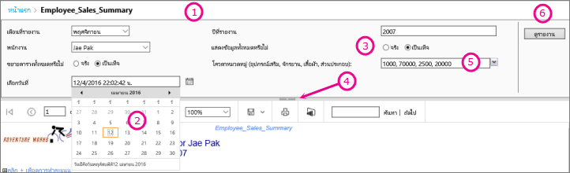
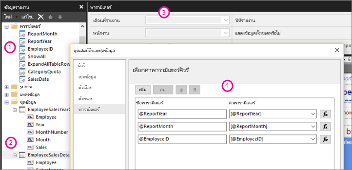

# พารามิเตอร์รายงานในตัวสร้างรายงานของ Power BI

หัวข้อนี้จะอธิบายถึงการใช้งานทั่วไปของพารามิเตอร์รายงานในตัวสร้างรายงานของ  Power BI คุณสมบัติที่คุณสามารถตั้งค่าได้ และอีกมากมาย พารามิเตอร์รายงานทำให้คุณสามารถควบคุมข้อมูลรายงาน เชื่อมต่อรายงานที่เกี่ยวข้องเข้าด้วยกัน และทำให้การนำเสนอรายงานมีความหลากหลาย คุณสามารถใช้พารามิเตอร์รายงานในรายงานที่มีการแบ่งหน้าที่คุณสร้างในตัวสร้างรายงาน

##  การใช้งานทั่วไปสำหรับพารามิเตอร์

 นี่คือบางส่วนของวิธีทั่วไปในการใช้พารามิเตอร์  
  
**ควบคุมข้อมูลรายงานที่มีการแบ่งหน้า**
  
- กรองข้อมูลรายงานที่มีการแบ่งหน้าที่แหล่งข้อมูลโดยการเขียนคิวรีชุดข้อมูลที่มีตัวแปรต่างๆ  
  
- ช่วยให้ผู้ใช้สามารถระบุค่าเพื่อกำหนดข้อมูลเองในรายงานที่มีการแบ่งหน้า ตัวอย่างเช่น ใส่พารามิเตอร์สองรายการสำหรับวันที่เริ่มต้นและวันที่สิ้นสุดสำหรับข้อมูลการขาย  
  
**ทำให้การนำเสนอรายงานมีความหลากหลาย**
  
- ช่วยให้ผู้ใช้สามารถระบุค่าเพื่อช่วยปรับแต่งลักษณะของรายงาน ตัวอย่างเช่น ป้อนพารามิเตอร์แบบบูลีนเพื่อระบุว่าจะขยายหรือยุบกลุ่มแถวที่ซ้อนกันทั้งหมดในตาราง  
  
- ช่วยให้ผู้ใช้สามารถกำหนดข้อมูลและลักษณะรายงานเองโดยการรวมพารามิเตอร์ต่างๆ ในนิพจน์  
  
##  การดูรายงานที่มีพารามิเตอร์

เมื่อคุณดูรายงานที่มีพารามิเตอร์ แถบเครื่องมือตัวแสดงรายงานจะแสดงพารามิเตอร์แต่ละตัว เพื่อให้คุณระบุค่าได้แบบโต้ตอบ ภาพประกอบต่อไปนี้แสดงพื้นที่พารามิเตอร์สำหรับรายงานที่มีพารามิเตอร์ @ReportMonth, @ReportYear, @EmployeeID, @ShowAll, @ExpandTableRows, @CategoryQuota และ @SalesDate  

  
1. **แผงพารามิเตอร์** แถบเครื่องมือตัวดูรายงานจะแสดงพร้อมท์หรือค่าเริ่มต้นสำหรับพารามิเตอร์แต่ละตัว คุณสามารถกำหนดเค้าโครงของพารามิเตอร์ในแผงพารามิเตอร์ได้  
  
2. **@SalesDate พารามิเตอร์**พารามิเตอร์@SalesDateเป็นชนิดข้อมูล **DateTime** พร้อมท์ เลือกวันที่ จะปรากฎถัดจากกล่องข้อความ หากปรับเปลี่ยนวันที่ ให้พิมพ์วันที่ใหม่ในกล่องข้อความหรือใช้การควบคุมปฏิทิน  
  
3. **@ShowAll พารามิเตอร์**พารามิเตอร์@ShowAllเป็นชนิดข้อมูล **บูลีน** ใช้ปุ่มตัวเลือกเพื่อระบุ **True** หรือ **False**  
  
4. **แสดงหรือซ่อนที่จับพื้นที่พารามิเตอร์**  บนแถบเครื่องมือตัวดูรายงาน คลิกลูกศรนี้เพื่อแสดงหรือซ่อนแผงพารามิเตอร์  
  
5. **@CategoryQuota พารามิเตอร์**พารามิเตอร์@CategoryQuotaเป็นชนิดข้อมูล **ลอย**เพื่อให้ใช้ค่าตัวเลข  @CategoryQuota ถูกตั้งค่าเป็นอนุญาตให้มีหลายค่า  
  
6. **ดูรายงาน** หลังจากที่คุณใส่ค่าพารามิเตอร์ ให้คลิกที่ **ดูรายงาน** เพื่อเรียกใช้รายงาน หากพารามิเตอร์ทั้งหมดมีค่าเริ่มต้น รายงานจะทำงานอัตโนมัติในการดูครั้งแรก  
  
##  การสร้างพารามิเตอร์ต่างๆ

คุณสามารถสร้างพารามิเตอร์ของรายงานด้วยวิธีที่แตกต่างกันไม่กี่วิธี
  
> [!NOTE]
>  ไม่ใช่ทุกแหล่งข้อมูลที่จะสนับสนุนพารามิเตอร์ต่างๆ
  
**คิวรีชุดข้อมูลหรือกระบวนการจัดเก็บด้วยพารามิเตอร์ต่างๆ**
  
 เพิ่มคิวรีชุดข้อมูลที่มีตัวแปรต่างๆ หรือกระบวนการที่จัดเก็บชุดข้อมูลที่มีพารามิเตอร์ป้อนเข้า พารามิเตอร์ชุดข้อมูลสร้างขึ้นสำหรับแต่ละตัวแปรหรือพารามิเตอร์ป้อนเข้า และพารามิเตอร์ของรายงานสร้างขึ้นสำหรับแต่ละพารามิเตอร์ชุดข้อมูล  
  

  
 รูปภาพจากตัวสร้างรายงานแสดงข้อมูลต่อไปนี้:  
  
1.  พารามิเตอร์ของรายงานในแผงข้อมูลรายงาน  
  
2.  ชุดข้อมูลพร้อมพารามิเตอร์ต่างๆ  
  
3.  แผงพารามิเตอร์  
  
4.  พารามิเตอร์ที่แสดงในกล่องโต้ตอบคุณสมบัติชุดข้อมูล  
  
**สร้างพารามิเตอร์ด้วยตนเอง**
  
สร้างพารามิเตอร์ด้วยตนเองจากแผงพารามิเตอร์ คุณสามารถกำหนดค่าพารามิเตอร์ของรายงานเพื่อให้ผู้ใช้สามารถป้อนค่าแบบโต้ตอบเพื่อช่วยปรับแต่งเนื้อหาหรือลักษณะของรายงาน นอกจากนี้คุณยังสามารถกำหนดค่าพารามิเตอร์ของรายงานเพื่อให้ผู้ใช้ไม่สามารถเปลี่ยนค่าที่กำหนดค่าไว้ล่วงหน้า  
  
> [!NOTE]  
>  เนื่องจากพารามิเตอร์ต่างๆ ถูกจัดการโดยอิสระบนเซิร์ฟเวอร์ การเผยแพร่รายงานหลักที่มีการตั้งค่าพารามิเตอร์ใหม่จะไม่เป็นการเขียนทับการตั้งค่าพารามิเตอร์ที่มีอยู่ในรายงาน  

### ค่าพารามิเตอร์ต่างๆ

 ต่อไปนี้คือตัวเลือกต่างๆ สำหรับการเลือกค่าพารามิเตอร์ในรายงาน  
  
- เลือกค่าพารามิเตอร์เดี่ยวจากรายการแบบเลื่อนลง  
  
- เลือกพารามิเตอร์หลายค่าจากรายการแบบเลื่อนลง  
  
- เลือกค่าหนึ่งจากรายการแบบเลื่อนลงสำหรับหนึ่งพารามิเตอร์ ซึ่งกำหนดค่าต่างๆ ที่มีในรายการแบบเลื่อนลงสำหรับพารามิเตอร์อื่น พารามิเตอร์เหล่านี้เป็นพารามิเตอร์แบบเรียงซ้อน พารามิเตอร์แบบเรียงซ้อนให้คุณสามารถกรองค่าพารามิเตอร์ตามลำดับจากค่าต่างๆ นับพันให้เป็นจำนวนที่สามารถจัดการได้ สำหรับข้อมูลเพิ่มเติม ดู [ใช้พารามิเตอร์แบบเรียงซ้อนในรายงานแบบแบ่งหน้า](../guidance/paginated-report-cascading-parameter.md)
  
- เรียกใช้รายงานโดยไม่ต้องเลือกค่าพารามิเตอร์ก่อน เนื่องจากระบบได้สร้างค่าเริ่มต้นสำหรับพารามิเตอร์ไว้แล้ว  
  
##  คุณสมบัติพารามิเตอร์ของรายงาน

 คุณสามารถเปลี่ยนคุณสมบัติพารามิเตอร์ของรายงานโดยการใช้กล่องโต้ตอบคุณสมบัติรายงาน ตารางต่อไปนี้สรุปคุณสมบัติที่คุณสามารถตั้งค่าสำหรับแต่ละพารามิเตอร์:  
  
|คุณสมบัติ|คำอธิบาย|  
|--------------|-----------------|  
|ชื่อ|พิมพ์ชื่อตรงตามตัวพิมพ์ใหญ่-เล็กสำหรับพารามิเตอร์ ชื่อต้องเริ่มต้นด้วยตัวอักษรและสามารถมีตัวอักษร ตัวเลข ขีดล่าง (_) ชื่อห้ามมีเว้นวรรค สำหรับพารามิเตอร์ที่สร้างขึ้นโดยอัตโนมัติ ชื่อจะตรงกับพารามิเตอร์ในคิวรีชุดข้อมูล ตามค่าเริ่มต้น พารามิเตอร์ที่สร้างขึ้นเองจะเหมือนกับพารามิเตอร์ของรายงาน 1|  
|ข้อความที่ปรากฏ|ข้อความที่ปรากฎถัดจากพารามิเตอร์บนแถบเครื่องมือตัวดูรายงาน|  
|ชนิดของข้อมูล|พารามิเตอร์ของรายงานต้องเป็นหนึ่งในชนิดของข้อมูลดังต่อไปนี้:   **Boolean** ผู้ใช้เลือกจริงหรือเท็จจากปุ่มตัวเลือก   **DateTime** ผู้ใช้เลือกวันที่จากการควบคุมปฏิทิน   **Integer** ผู้ใช้พิมพ์ค่าต่างๆ ในกล่องข้อความ   **Float** ผู้ใช้พิมพ์ค่าต่างๆ ในกล่องข้อความ   **Text** ผู้ใช้พิมพ์ค่าต่างๆ ในกล่องข้อความ   เมื่อมีการกำหนดค่าต่างๆ สำหรับพารามิเตอร์ ผู้ใช้เลือกค่าต่างๆ จากรายการแบบเลื่อนลง แม้เมื่อชนิดของข้อมูลเป็น **DateTime**|  
|อนุญาตให้มีค่าว่าง|เลือกตัวเลือกนี้หากค่าของพารามิเตอร์สามารถเป็นสตริงว่างหรือที่ว่างเปล่า   หากคุณกำหนดค่าต่างๆ ที่ถูกต้องสำหรับพารามิเตอร์หนึ่ง และคุณต้องการค่าว่างให้เป็นหนึ่งในค่าที่ถูกต้อง คุณต้องรวมไว้เป็นหนึ่งในค่าต่างๆ ที่คุณระบุ การเลือกตัวเลือกนี้จะไม่ได้รวมค่าว่างสำหรับค่าที่มีอยู่โดยอัตโนมัติ|  
|อนุญาตให้มีค่า Null|เลือกตัวเลือกนี้หากค่าของพารามิเตอร์สามารถเป็น Null   หากคุณกำหนดค่าต่างๆ ที่ถูกต้องสำหรับพารามิเตอร์หนึ่งและคุณต้องการค่า Null ให้เป็นหนึ่งในค่าที่ถูกต้อง คุณต้องรวมค่า Null เป็นหนึ่งในค่าต่างๆ ที่คุณกำหนด การเลือกตัวเลือกนี้จะไม่รวม Null โดยอัตโนมัติสำหรับค่าต่างๆ ที่มี|  
|อนุญาตให้มีหลายค่า|ป้อนค่าต่างๆ ที่มีเพื่อสร้างรายการแบบเลื่อนลงที่ผู้ใช้ของคุณสามารถเลือกได้ นี่เป็นทางที่ดีที่จะทำให้มั่นใจว่าเฉพาะค่าต่างๆ ที่ถูกต้องได้ถูกส่งในคิวรีชุดข้อมูล   เลือกตัวเลือกนี้หากค่าสำหรับพารามิเตอร์สามารถเป็นได้หลายค่าที่แสดงในรายการแบบเลื่อนลง ค่า Null ไม่ได้รับอนุญาต เมื่อเลือกตัวเลือกนี้ กล่องกาเครื่องหมายจะถูกเพิ่มในรายการของค่าต่างที่มีในรายการแบบเลื่อนลงของพารามิเตอร์ ด้านบนของรายการประกอบด้วยกล่องกาเครื่องหมายสำหรับ **เลือกทั้งหมด** ผู้ใช้สามารถตรวจสอบค่าต่างๆ ที่พวกเขาต้องการ   หากข้อมูลที่ให้ค่าต่างๆ มีการเปลี่ยนแปลงอย่างรวดเร็ว รายการที่ผู้ใช้เห็นอาจจะไม่เป็นปัจจุบันที่สุด|  
|มองเห็นได้|เลือกตัวเลือกนี้เพื่อแสดงพารามิเตอร์ของรายงานในตอนต้นของรายงานเมื่อมันทำงาน ตัวเลือกนี้อนุญาตให้ผู้ใช้เลือกค่าพารามิเตอร์ต่างๆ ขณะเวลาทำงาน|  
|ซ่อนอยู่|เลือกตัวเลือกนี้เพื่อซ่อนพารามิเตอร์ของรายงานในรายงานเผยแพร่ ค่าพารามิเตอร์ต่างๆ ของรายงานยังคงสามารถถูกตั้งค่าบน URL ของรายงานในคำจำกัดความการสมัครใช้งานหรือบนเซิร์ฟเวอร์ของรายงาน|  
|ภายใน|เลือกตัวเลือกนี้เพื่อซ่อนพารามิเตอร์ของรายงาน ในรายงานที่เผยแพร่ พารามิเตอร์ของรายงานสามารถดูได้ในข้อกำหนดของรายงานเท่านั้น|  
|ค่าที่มี|หากคุณได้กำหนดค่าต่างๆ ที่มีแล้วสำหรับพารามิเตอร์หนึ่ง ค่าต่างๆ ที่ถูกต้องมักปรากฎเป็นรายการแบบเลื่อนลง ตัวอย่างเช่น หากคุณให้ค่าต่างๆ ที่มีสำหรับพารามิเตอร์ **DateTime** รายการแบบเลื่อนลงสำหรับวันที่ปรากฎในแผงพารามิเตอร์แทนที่การควบคุมปฏิทิน   เพื่อให้แน่ใจว่ารายชื่อของค่าต่างๆ มีความสม่ำเสมอทั่วรายงานและรายงานย่อยต่างๆ คุณสามารถตั้งค่าตัวเลือกหนึ่งในแหล่งข้อมูลเพื่อใช้การทำธุรกรรมครั้งเดียวสำหรับคิวรีทั้งหมดในชุดข้อมูลที่เชื่อมโยงกับแหล่งข้อมูล   **หมายเหตุความปลอดภัย** ในรายงานใดๆ ที่รวมพารามิเตอร์ของชนิดข้อมูล **Text** ให้แน่ใจว่าใช้รายการค่าที่มี (หรือเรียกว่า รายการค่าที่ถูกต้อง) และทำให้แน่ใจว่าผู้ใช้ใดๆ ที่กำลังเรียกใช้รายงานจะมีสิทธิ์ที่จำเป็นเพื่อดูข้อมูลในรายงานเท่านั้น|  
|ค่าเริ่มต้น|ตั้งค่าเริ่มต้นจากคิวรีหรือจากรายการคงที่   เมื่อแต่ละพารามิเตอร์มีค่าเริ่มต้น รายงานจะทำงานอัตโนมัติในการดูครั้งแรก|  
|ขั้นสูง|กำหนดแอตทริบิวต์ข้อกำหนดของรายงาน **UsedInQuery** ค่าที่บ่งชี้ว่าพารามิเตอร์นี้ส่งผลโดยตรงหรือโดยอ้อมแก่ข้อมูลในรายงานหรือไม่   **กำหนดโดยอัตโนมัติว่าเมื่อใดจะรีเฟรช**  เลือกตัวเลือกนี้เมื่อคุณต้องการให้หน่วยประมวลผลรายงานทำการกำหนดการตั้งค่าสำหรับค่านี้ ค่าเป็น**จริง** หากหน่วยประมวลผลรายงานตรวจพบคิวรีชุดข้อมูลพร้อมการอ้างอิงในทางตรงหรือทางอ้อมไปยังพารามิเตอร์นี้ หรือหากรายงานมีรายงานย่อยต่างๆ   **รีเฟรชอยู่เสมอ**  เลือกตัวเลือกนี้หากพารามิเตอร์ของรายงานถูกใช้ในทางตรงหรือทางอ้อมในคิวรีชุดข้อมูลหรือพารามิเตอร์นิพจน์ ตัวเลือกนี้ตั้งค่า **UsedInQuery** ให้เป็นจริง   **ไม่ต้องรีเฟรช**  เลือกตัวเลือกนี้เมื่อพารามิเตอร์ของรายงานไม่ได้ถูกใช้ในทางตรงหรือทางอ้อมในคิวรีชุดข้อมูลหรือนิพจน์พารามิเตอร์ ตัวเลือกนี้ตั้งค่า**UsedInQuery** ให้เป็นเท็จ   **คำเตือน** ใช้ **ไม่ต้องรีเฟรช** ด้วยความระมัดระวัง บนเซิร์ฟเวอร์ของรายงาน **UsedInQuery** ถูกใช้เพื่อช่วยควบคุมตัวเลือกแคชสำหรับข้อมูลรายงานและสำหรับรายงานที่แสดง และตัวเลือกพารามิเตอร์สำหรับรายงานสแนปช็อต หากคุณตั้งค่า **ไม่ต้องรีเฟรช** อย่างไม่ถูกต้อง คุณอาจทำให้รายงานมีข้อมูลที่ไม่ถูกต้องรายงานขัดข้องหรือเป็นเหตุให้รายงานสแนปช๊อตมีข้อมูลที่ไม่สอดคล้องกัน |  
  
##   คิวรีชุดข้อมูล  
 หากต้องการกรองข้อมูลในคิวรีชุดข้อมูล คุณสามารถรวมวลีข้อจำกัดที่จำกัดข้อมูลที่เรียกโดยโดยการระบุค่าต่างๆ เพื่อรวมหรือไม่รวมจากชุดผลลัพธ์  
  
 ใช้ตัวออกแบบคิวรีสำหรับแหล่งข้อมูลเพื่อช่วยสร้างคิวรีแบบมีพารามิเตอร์  
  
-   สำหรับคิวรี Transact-SQL แหล่งข้อมูลที่แตกต่างกันสนับสนุนไวยากรณ์ที่แตกต่างกันสำหรับพารามิเตอร์ต่างๆ การสนับสนุนครอบคลุมตั้งแต่พพารามิเตอร์ต่างๆ ที่ระบุไว้ในคิวรีตามตำแหน่งหรือตามชื่อ ในตัวออกแบบคิวรีเชิงสัมพันธ์ คุณต้องเลือกตัวเลือกพารามิเตอร์สำหรับตัวกรองเพื่อสร้างคิวรีแบบมีพารามิเตอร์   
  
-   สำหรับคิวรีต่างๆ ที่อิงตามแหล่งข้อมูลหลายมิติ เช่น Microsoft SQL Server Analysis Services คุณสามารถระบุว่าจะสร้างพารามิเตอร์ที่อิงจากตัวกรองที่คุณระบุไว้ในตัวออกแบบคิวรีหรือไม่ 
  
##   การจัดการพารามิเตอร์สำหรับรายงานที่เผยแพร่  
 เมื่อคุณออกแบบรายงาน พารามิเตอร์ของรายงานจะถูกบันทึกไว้ในข้อกำหนดของรายงาน เมื่อคุณเผยแพร่รายงาน พารามิเตอร์ของรายงานจะถูกบันทึกและจัดการแยกกันจากข้อกำหนดของรายงาน  
  
 สำหรับรายงานที่เผยแพร่ คุณสามารถใช้ดังต่อไปนี้:  
  
-   **คุณสมบัติพารามิเตอร์ของรายงาน** เปลี่ยนค่าพารามิเตอร์ของรายงานโดยตรงบนรีพอร์ตเซิร์ฟเวอร์อย่างเป็นอิสระจากข้อกำหนดของรายงาน  
  
-   **การสมัครใช้งานรายงาน** คุณสามารถระบุค่าพารามิเตอร์ต่างๆ เพื่อกรองข้อมูลและส่งรายงานผ่านการสมัครใช้งาน 
  
 คุณสมบัติพารามิเตอร์สำหรับรายงานที่เผยแพร่ได้ถูกสงวนไว้หากคุณเผยแพร่ข้อกำหนดของรายงานซ้ำ หากข้อกำหนดของรายงานถูกเผยแพร่ซ้ำเป็นรายงานเดิม ชื่อพารามิเตอร์และชนิดของข้อมูลยังคงเหมือนเดิม การตั้งค่าคุณสมบัติของคุณถูกรักษาไว้ หากคุณเพิ่มหรือลบพารามิเตอร์ในข้อกำหนดของรายงาน หรือเปลี่ยนชนิดข้อมูลหรือชื่อของพารามิเตอร์ที่มีอยู่ คุณอาจต้องเปลี่ยนคุณสมบัติของพารามิเตอร์ในรายงานที่เผยแพร่  
  
 ไม่สามารถแก้ไขพารามิเตอร์ทั้งหมดได้ในทุกกรณี หากพารามิเตอร์ของรายงานได้รับค่าเริ่มต้นจากคิวรีชุดข้อมูล จะไม่สามารถแก้ไขค่าสำหรับรายงานที่เผยแพร่และไม่สามารถแก้ไขได้ในรีพอร์ตเซิร์ฟเวอร์ ค่าที่ใช้ในเวลาทำงานถูกกำหนดเมื่อคิวรีทำงานหรือในกรณีของพารามิเตอร์แบบนิพจน์ เมื่อนิพจน์ถูกประเมิน  
  
 ตัวเลือกการปฏิบัติการรายงานอาจมีผลต่อวิธีการประมวลผลพารามิเตอร์ รายงานที่เรียกใช้เป็นสแน็บช็อตไม่สามารถใช้พารามิเตอร์ต่างๆ ที่แปรผันมาจากคิวรีนอกจากคิวรีมีค่าเริ่มต้นสำหรับพารามิเตอร์ต่างๆ  
  
##   พารามิเตอร์สำหรับการสมัครใช้งาน  
 คุณสามารถกำหนดการสมัครใช้งานสำหรับตามความต้องการหรือสำหรับสแนปช็อตและระบุค่าพารามิเตอร์เพื่อการใช้งานในระหว่างการประมวลผลการสมัครใช้งาน  
  
-   **รายงานตามความต้องการ**  สำหรับรายงานตามความต้องการ คุณสามารถระบุค่าพารามิเตอร์ที่แตกต่างจากค่าที่เผยแพร่สำหรับแต่ละพารามิเตอร์ที่แสดงไว้สำหรับรายงาน ตัวอย่างเช่น สมมติว่าคุณมีรายงานบริการสายโทรศัพท์ที่ใช้พารามิเตอร์ *ระยะเวลา* ในส่งกลับคำขอในการบริการลูกค้าสำหรับวัน สัปดาห์ หรือเดือนในปัจจุบัน หากค่าพารามิเตอร์เริ่มต้นสำหรับรายงานนี้ถูกตั้งค่าไว้เป็น **วันนี้** การสมัครสมาชิกของคุณสามารถใช้ค่าพารามิเตอร์ที่แตกต่างกันได้ (เช่น **สัปดาห์** หรือ **เดือน**) เพื่อสร้างรายงานที่รวมตัวเลขรายสัปดาห์หรือรายเดือน  
  
## ขั้นตอนถัดไป

- [รายงานแบบแบ่งหน้าใน Power BI Premium คืออะไร](paginated-reports-report-builder-power-bi.md)  
- [ใช้พารามิเตอร์แบบเรียงซ้อนในรายงานแบบแบ่งหน้า](../guidance/paginated-report-cascading-parameter.md)
