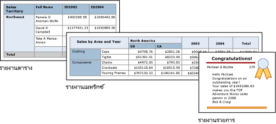

# ตาราง เมทริกซ์ และรายการในตัวสร้างรายงานใน Power BI
 ในตัวสร้างรายงาน ตาราง เมทริกซ์ และรายการเป็น *ขอบเขตข้อมูล* ที่แสดงผลข้อมูลรายงานที่มีการแบ่งหน้าในเซลล์ที่ถูกจัดเป็นแถวและคอลัมน์ โดยทั่วไปแล้วเซลล์จะมีข้อมูลข้อความเช่น ข้อความ วันที่ และหมายเลข แต่เซลล์ก็ยังมีเกจ์ แผนภูมิ หรือรายการการรายงาน เช่น รูปภาพ ตาราง เมทริกซ์ และรายการมักจะถูกเรียกรวมกันว่า  *ขอบเขตข้อมูล* tablix  
  
 ตาราง เมทริกซ์ และเทมเพลตรายการถูกสร้างในขอบเขตข้อมูล tablix ซึ่งเป็นเส้นตารางที่ยืดหยุ่นได้ที่สามารถแสดงผลข้อมูลในเซลล์ ในเทมเพลตตารางและเมทริกซ์ เซลล์ถูกจัดเป็นแถวและคอลัมน์ เนื่องจากเทมเพลตเป็นรูปแบบของขอบเขตข้อมูล tablix ทั่วไป คุณสามารถแสดงข้อมูลในการรวมกันของรูปแบบเทมเพลต และเปลี่ยนตาราง เมทริกซ์ หรือรายการ เพื่อรวมคุณลักษณะของขอบเขตข้อมูลอื่นขณะที่คุณพัฒนารายงานของคุณ ตัวอย่างเช่น หากคุณเพิ่มตารางแล้วพบว่าไม่เป็นไปตามที่คุณต้องการ คุณสามารถเพิ่มกลุ่มคอลัมน์เพื่อทำให้ตารางเป็นเมทริกซ์  
  
 ตารางและขอบเขตข้อมูลเมทริกซ์สามารถแสดงความสัมพันธ์ของข้อมูลที่มีความซับซ้อนโดยมี ตารางที่ซ้อนกัน เมทริกซ์ รายการ แผนภูมิ และเกจ์ ตารางและเมทริกซ์มีเค้าโครงแบบตารางและข้อมูลเหล่านั้นมาจากข้อมูลชุดเดียว สร้างขึ้นบนแหล่งข้อมูลเดียว ความแตกต่างที่สำคัญระหว่างตารางและเมทริกซ์คือตารางสามารถรวมได้เพียงกลุ่มแถวเท่านั้น ในขณะที่เมทริกซ์มีทั้งกลุ่มแถวและกลุ่มคอลัมน์  
  
 รายการมีความต่างกันเล็กน้อย มีการสนับสนุนเค้าโครงอิสระและรวมทั้งตารางหรือเมทริกซ์เพียร์หลายอัน ซึ่งแต่ละอันใช้ข้อมูลจากชุดข้อมูลที่แตกต่างกัน รายการสามารถใช้สำหรับแบบฟอร์มได้ เช่น ใบแจ้งหนี้  
  
 รูปภาพต่อไปนี้แสดงรายงานแบบธรรมดาที่มีตาราง เมทริกซ์ หรือรายการ  

  
##   ตาราง  
 ใช้ตารางเพื่อแสดงข้อมูลรายละเอียด จัดการข้อมูลในกลุ่มแถวหรือทั้งสอง เทมเพลตตารางมีสามคอลัมน์ซึ่งมีแถวส่วนหัวของตารางและแถวรายละเอียดสำหรับข้อมูล รูปภาพต่อไปนี้แสดงเทมเพลตตารางเบื้องต้น เลือกออกแบบพื้นผิว  

  
 คุณสามารถรวมข้อมูลโดยฟิลด์เดียว โดยหลายฟิลด์ หรือโดยเขียนนิพจน์ของคุณเอง คุณสามารถสร้างกลุ่มที่ซ้อนกันหรืออิสระ กลุ่มที่ติดกันและแสดงค่ารวมสำหรับข้อมูลที่จัดกลุ่ม หรือเพิ่มผลรวมไปยังกลุ่ม ตัวอย่างเช่น หากตารางของคุณมีกลุ่มแถวที่เรียกว่า **ประเภท** คุณสามารถเพิ่มผลรวมย่อยสำหรับแต่ละกลุ่ม รวมถึงผลรวมทั้งหมดสำหรับการรายงาน ในการพัฒนาลักษณะของตารางและข้อมูลไฮไลท์ที่คุณต้องการเน้น คุณสามารถรวมเซลล์และนำรูปแบบไปใช้ในข้อมูลและส่วนหัวของตาราง  
  
 คุณสามารถซ่อนรายละเอียดหรือจัดกลุ่มข้อมูลเบื้องต้นได้ และรวมการสลับแบบลงรายละเอียดเพื่อให้ผู้ใช้สามารถเลือกจำนวนข้อมูลที่ต้องการแสดง  
  
##   เมทริกซ์  
 ใช้เมทริกซ์เพื่อแสดงสรุปข้อมูลรวม จัดกลุ่มเป็นแถวและคอลัมน์ คล้ายกับ PivotTable หรือ crosstab จำนวนของแถวและคอลัมน์สำหรับกลุ่มถูกพิจารณาโดยจำนวนของค่าที่ไม่ซ้ำสำหรับแต่ละกลุ่มแถวและคอลัมน์ รูปภาพต่อไปนี้แสดงเทมเพลตเมทริกซ์เบื้องต้น เลือกพื้นผิวการออกแบบ:  

 
 คุณสามารถรวมข้อมูลโดยหลายฟิลด์หรือนิพจน์ในกลุ่มแถวและคอลัมน์ ขณะทำงาน เมื่อข้อมูลรายงานและขอบเขตข้อมูลถูกรวมเข้าด้วยกัน เมทริกซ์จะเพิ่มขึ้นในแนวนอนและแนวตั้งบนหน้าเว็บ เป็นคอลัมน์สำหรับกลุ่มคอลัมน์และเเถวสำหรับกลุ่มแถวจะถูกเพิ่ม เซลล์เมทริกซ์แสดงค่ารวมที่ถูกกำหนดขอบเขตไปยังจุดตัดของกลุ่มแถวและคอลัมน์ที่เซลล์อยู่ ตัวอย่างเช่น หากเมทริกซ์ของคุณมีหนึ่งกลุ่มแถว (ประเภท) และสองกลุ่มคอลัมน์(อาณาเขตและปี) ที่แสดงผลรวมยอดขาย รายงานแสดงเซลล์สองเซลล์ที่มีผลรวมยอดขายสำหรับแต่ละค่าในกลุ่มประเภท ขอบเขตของเซลล์คือจุดตัดสองจุดคือ: ประเภทกับอาณาเขตและประเภทกับปี เมทริกซ์สามารถรวมกลุ่มที่มีซ้อนกันและติดกัน กลุ่มที่ซ้อนกันมีความสัมพันธ์กันแบบพ่อแม่ลูกและกลุ่มที่ติดกันมีความสัมพันธ์แบบเพื่อน คุณสามารถเพิ่มผลรวมย่อยสำหรับกลุ่มแถวและคอลัมน์ที่ซ้อนกันได้ในทุกระดับภายในเมทริกซ์  
  
 เพื่อทำให้ข้อมูลเมทริกซ์อ่านได้มากขึ้นและไฮไลท์ข้อมูลที่คุณต้องการเน้น คุณสามารถรวมหรือแยกเซลล์แบบแนวนอนและแนวตั้งและประยุกต์ใช้การจัดรูปแบบกับข้อมูลและส่วนหัวของกลุ่ม  
  
 คุณยังสามารถรวมการสลับการลงรายละเอียดที่ซ่อนข้อมูลรายละเอียดเบื้องต้น ผู้ใช้สามารถคลิกสลับไปมาเพื่อแสดงรายละเอียดเพิ่มขึ้นหรือน้อยลงตามที่ต้องการ  
  
##   รายการ  
 ใช้รายการเพื่อสร้างเค้าโครงฟอร์มอิสระ คุณไม่ได้ถูกจำกัดเค้าโครงเส้นตาราง แต่สามารถวางฟิลด์ได้อย่างอิสระภายในรายการ คุณสามารถใช้รายการเพื่ออกแบบฟอร์มสำหรับการแสดงผลหลายฟิลด์ชุดข้อมูล หรือเป็นคอนเทนเนอร์เพื่อแสดงผลหลายขอบฟิลด์เคียงข้างกันสำหรับข้อมูลที่จัดกลุ่ม ตัวอย่างเช่น คุณสามารถนิยามกลุ่มสำหรับรายการ เพิ่มตาราง แผนภูมิ และรูปภาพ และแสดงค่าในตารางและกราฟิกจากค่าแต่ละกลุ่ม ตามที่คุณอาจจะสำหรับการบันทึกพนักงานหรือผู้ป่วย  

  
##   การเตรียมข้อมูล  
 ตาราง เมทริกซ์ และขอบเขตข้อมูลรายการแสดงข้อมูลจากชุดข้อมูล คุณสามารถจัดเตรียมข้อมูลในแบบสอบถามที่ดึงข้อมูลสำหรับชุดข้อมูลหรือโดยการตั้งค่าคุณสมบัติในตาราง เมทริกซ์ หรือรายการ  
  
 ภาษาคิวรีเช่น Transact-SQL ที่คุณใช้เพื่อดึงข้อมูลสำหรับชุดข้อมูลรายงานสามารถจัดเตรียมข้อมูลโดยใช้ตัวกรองเพื่อรวมเฉพาะชุดย่อยของข้อมูลแทนที่ค่าว่างหรือช่องว่างด้วยค่าคงที่ที่ทำให้รายงานอ่านได้มากขึ้น และการเรียงลำดับและจัดกลุ่มข้อมูล  
  
 หากคุณเลือกที่จะเตรียมข้อมูลในตาราง เมทริกซ์ หรือขอบเขตรายการของข้อมูล ให้ตั้งคุณสมบัติบนขอบเขตข้อมูลหรือเซลล์ภายในขอบเขตข้อมูล หากคุณต้องการกรองหรือเรียงข้อมูล ให้ตั้งคุณสมบัติบนขอบเขตข้อมูล ตัวอย่างเช่น เพื่อเรียงข้อมูลที่คุณระบุคอลัมน์ในการเรียงและทิศทางการเรียง หากคุณต้องการระบุค่าอื่นสำหรับฟิลด์ ให้ตั้งค่าข้อความเซลล์ที่เเสดงฟิลด์ ตัวอย่างเช่น เพื่อแสดง Blank เมื่อฟิลด์ว่างเปล่าหรือเป็นโมฆะ ให้คุณใช้นิพจน์เพื่อตั้งค่า  
  
##   การสร้างและการกำหนดค่าตาราง เมทริกซ์ หรือรายการ  
 เมื่อคุณเพิ่มตารางหรือเมทริกซ์ไปยังรายงานของคุณ คุณสามารถใช้ตัวช่วยสร้างตารางและเมทริกซ์หรือสร้างด้วยตัวเองจากเทมเพลตที่ตัวสร้างรายงานมีให้ รายการถูกสร้างขึ้นเองจากเทมเพลตรายการ  
  
 ตัวช่วยสร้างแนะนำคุณผ่านขั้นตอนในการสร้างอย่างรวดเร็วและกำหนดค่าตารางและเมทริกซ์ หลังจากที่คุณเสร็จสิ้นจากตัวช่วยสร้างแล้วหรือคุณสร้างขอบเขตข้อมูล tablix ตั้งแต่เริ่มต้น คุณสามารถกำหนดค่าและปรับแต่งเพิ่มเติมได้ กล่องโต้ตอบสามารถใช้งานได้จากเมนูคลิกขวาบนพื้นที่ข้อมูลทำให้ง่ายต่อการตั้งค่าคุณสมบัติที่ใช้บ่อยที่สุดสำหรับตัวแบ่งหน้า การทำซ้ำ และการมองเห็นส่วนหัวและส่วนท้าย ตัวเลือกการแสดง ตัวกรอง และการเรียงลำดับ แต่ขอบเขตข้อมูล tablix มีคุณสมบัติเพิ่มเติมมากมายซึ่งคุณสามารถตั้งค่าได้เฉพาะหน้าคุณสมบัติของตัวสร้างรายงาน ตัวอย่างเช่น หากคุณต้องการแสดงข้อความเมื่อชุดข้อมูลสำหรับตารา งเมทริกซ์ หรือรายการว่างเปล่า คุณจะระบุคุณสมบัติใน NoRowsMessage tablix ในหน้าต่างคุณสมบัติ  
  
##   การเปลี่ยนแปลงระหว่างเทมเพลต tablix  
 คุณไม่ได้ถูกจำกัดโดยตัวเลือกเทมเพลต tablix เบื้องต้นของคุณ ขณะคุณเพิ่ม กลุ่ม ผลรวม และป้ายชื่อ คุณอาจต้องการแก้ไขการออกแบบ tablix ของคุณ ตัวอย่างเช่น คุณอาจเริ่มด้วยตารางและจากนั้นลบแถวรายละเอียดและเพิ่มกลุ่มคอลัมน์  
  
 คุณสามารถพัฒนาตาราง เมทริกซ์ หรือรายการต่อไปโดยการเพิ่มคุณลักษณะ tablix คุณลักษณะ tablix รวมถึงการแสดงผลข้อมูลรายละเอียดหรือค่ารวมสำหรับจัดกลุ่มข้อมูลในแถวและคอลัมน์ คุณสามารถสร้างกลุ่มแบบซ้อนกัน กลุ่มติดกันแบบอิสระ หรือกลุ่มแบบซ้ำ คุณสามารถกรองและเรียงกลุ่มข้อมูล และรวมกลุ่มโดยง่าย โดยรวมนิพจน์หลายกลุ่มเข้ากับกลุ่มคำจำกัดความ  
  
 คุณยังสามารถเพิ่มผลรวมสำหรับกลุ่มหรือผลรวมทั้งหมดสำหรับขอบเขตข้อมูล คุณสามารถซ่อนแถวหรือคอลัมน์เพื่อลดความซับซ้อนของรายงานและช่วยให้ผู้ใช้สลับการแสดงผลของข้อมูลที่ถูกซ่อน เช่น ในรายงานลงรายละเอียด 

## ขั้นตอนถัดไป

- [รายงานแบบแบ่งหน้าใน Power BI Premium คืออะไร](paginated-reports-report-builder-power-bi.md)
