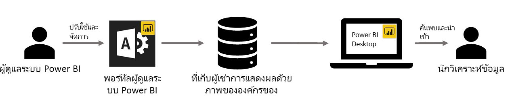

# วิชวลองค์กรใน Power BI

คุณสามารถใช้ส่วนการแสดงผล Power BI ใน Power BI เพื่อจัดทำส่วนการแสดงผลแบบเฉพาะสำหรับตัวคุณเอง ส่วนการแสดงผล Power BI เหล่านี้จะถูกสร้างขึ้น โดยนักพัฒนา และพวกเขามักจะสร้างขึ้นเมื่อภาพมากมายที่มีอยู่ใน Power BI ไม่ตอบสนองของพวกเขา

ในบางองค์กร ส่วนการแสดงผล BI มีความสำคัญมากยิ่งขึ้น มันอาจะจำเป็นในการสื่อข้อมูลที่เฉพาะเจาะจงหรือข้อมูลเชิงลึกที่มีเอกลักษณ์องค์กร มันอาจมีความต้องการข้อมูลพิเศษหรืออาจจะเน้นวิธการทำีธุรกิจแบบ่วนตัว องค์กรดังกล่าวต้องจัดทำส่วนการแสดงผล Power BI แล้วใช้ร่วมกันทั่วทั้งองค์กรและตรวจสอบให้แน่ใจว่า ได้รับการดูแลอย่างเหมาะสม Power BI ส่วนการแสดงผล Power BI ช่วยให้หน่วยงานสามารถดำเนินการได้ตามนี้

รูปต่อไปนี้แสดงขั้นตอนการไหลของส่วนแสดงผล Power BI ขององค์กรใน Power BI จากขั้นตอนผู้ดูแล ผ่านขั้นตอนการพัฒนาและการบำรุงรักษา และไปยังขั้นตอนวิเคราะห์ข้อมูลเป็นลำดับสุดท้าย

การจัดการแสดงผลด้วยภาพขององค์กรมีการปรับใช้ และจัดการ โดยผู้ดูแลระบบ Power BI จากพอร์ทัลผู้ดูแล เมื่อเปิดใช้ในที่เก็บข้อมูลขององค์กร ผู้ใช้ในองค์กรสามารถรู้จักกับมันได้อย่างง่ายดาย และนำเข้าส่วนการแสดงผล Power BI ขององค์กรลงในรายงานของพวกเขาได้โดยตรงจาก Power BI Desktop

เพื่อเรียนรู้เพิ่มเติมเกี่ยวกับวิธีการแสดงผลด้วยส่วนการแสดงผล Power BI ขององค์กรในรายงานที่คุณสร้างขึ้น ให้ดูบทความต่อไปนี้: [เรียนรู้เพิ่มเติมเกี่ยวกับการนำภาพองค์กรลงในรายงานของคุณ](power-bi-custom-visuals.md)

## จัดการส่วนการแสดงผล Power BI ของหน่วยงาน

เพื่อเรียนรู้เพิ่มเติมเกี่ยวกับวิธีการจัดการ ปรับใช้ และจัดการส่วนการแสดงผล Power BI ขององค์กรในองค์กรของคุณ ให้ดูบทความต่อไปนี้: [เรียนรู้เพิ่มเติมเกี่ยวกับการปรับใช้และส่วนการแสดงผล Power BI ขององค์กร](https://go.microsoft.com/fwlink/?linkid=866790)

> [!WARNING]
> วิชวลแบบกำหนดเองสามารถมีรหัสซึ่งมีความปลอดภัยหรือความเสี่ยงด้านความเป็นส่วนตัว ตรวจสอบให้แน่ใจว่า คุณเชื่อถือผู้เขียนและแหล่งมาของภาพที่กำหนดเองใด ๆ ก่อนทจะใช้สถานที่จัดเก็บองค์กร

## ข้อควรพิจารณาและข้อจำกัด

มีข้อควรพิจารณาและข้อจำกัดที่คุณจำเป็นต้องระวังมากมาย

ผู้ดูแลระบบ

* ไม่รองรับส่วนการแสดงผล Power BIแบบดั้งเดิม (เช่น ส่วนการแสดงผล Power BI ที่ไม่ได้สร้างขึ้นจาก API รุ่นใหม่)

* เมื่อแบบกำหนดเองจะถูกลบจากเก็บ รายงานใด ๆ ที่มีอยู่ที่ใช้ภาพที่ถูกลบจะหยุดการแสดงผล ไม่สามารถย้อนกลับการลบจากที่เก็บข้อมูลได้ เพื่อปิดการใช้งานรูปภาพแบบรชั่วคราว ให้ใช้คุณลักษณะ "ปิดใช้งาน"

ผู้ใช้ปลายทาง

* ส่วนการแสดงผล Power BI ขององค์กรเป็นวิชวลส่วนตัว ที่นำเข้ามาจากที่จัดเก็บขององค์กร ด้วยความที่เป็นวิชวลส่วนตัว จึงไม่อาจ[นำออกไปยัง PowerPoint](https://docs.microsoft.com/power-bi/consumer/end-user-powerpoint) หรือแสดงในอีเมลที่รับเข้าเมื่อผู้ใช้[สมัครใช้งานหน้ารายงาน](https://docs.microsoft.com/power-bi/consumer/end-user-subscribe)ได้ เฉพาะ[ส่วนการแสดงผล Power BI ที่ได้รับการรับรอง](https://docs.microsoft.com/power-bi/power-bi-custom-visuals-certified)ที่นำเข้าโดยตรงจาก Marketplace เท่านั้นจึงจะรองรับฟีเจอร์เหล่านี้

* การแสดงผลด้วยภาพของ Visio, ภาพของ PowerApps และภาพของ GlobeMap จาก AppSource Marketplace จะไม่แสดงผล ถ้ามีการเรียกใช้งานผ่านที่เก็บขององค์กร

## การแก้ไขปัญหา

สำหรับข้อมูลเกี่ยวกับการแก้ไข เยี่ยมชม [แก้ไขปัญหา Power BI ส่วนการแสดงผล Power BI ของคุณ](power-bi-custom-visuals-troubleshoot.md)

## คำถามที่ถามบ่อย

สำหรับข้อมูลเพิ่มเติมและคำตอบที่คุณอยากรู้ โปรดเยี่ยมชม[คำถามที่ถามบ่อยเกี่ยวกับ Power BI ส่วนการแสดงผล Power BI](power-bi-custom-visuals-faq.md#organizational-visuals)

มีคำถามเพิ่มเติมหรือไม่? [ลองไปที่ชุมชน Power BI](http://community.powerbi.com/)
