# วิชวลใน Power BI

เมื่อสร้างหรือแก้ไขรายงาน Power BI คุณสามารถใช้ภาพได้หลายประเภท แสดงไอคอนสำหรับภาพเหล่านี้จะปรากฎขึ้นในบานหน้าต่าง **การจัดรูปแบบการแสดงข้อมูล** ชุดของภาพเหล่านี้จะมีให้มาอยู่แล้วเมื่อคุณดาวน์โหลด[Power BI Desktop](https://powerbi.microsoft.com/desktop/) หรือเปิด [บริการของ Power BI](https://app.powerbi.com)

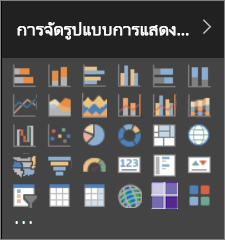

อย่างไรก็ตาม คุณไม่ได้ถูกจำกัดเฉพาะภาพชุดนี้ ถ้าคุณเลือกจุดไข่ปลา (...) ที่ด้านล่าง แหล่งข้อมูลอื่นของภาพในรายงานจะพร้อมใช้งาน -*ส่วนแสดงผล Power BI*

นักพัฒนาจะจัดทำส่วนแสดงผล Power BI โดยใช้ SKD ส่วนแสดงผล Power BI ภาพเหล่านี้ช่วยให้ผู้ใช้ทางธุรกิจสามารถดูข้อมูลในแบบที่เหมาะกับธุรกิจของพวกเขามากที่สุด ผู้เขียนรายงานสามารถนำเข้าไฟล์ภาพแบบกำหนดเองลงใส่ในรายงานและใช้งานได้เช่นเดียวกับภาพอื่น ๆ ใน Power BI ส่วนแสดงผล Power BI เป็นส่วนประกอบอันดับแรกใน Power BI และสามารถกรอง เน้น แก้ไข แชร์ และอื่น ๆ ได้

ส่วนแสดงผล Power BI สามารถนำไปปรับใช้ได้สามวิธี:

* ไฟล์วิชวลแบบกำหนดเอง
* การแสดงผลด้วยภาพขององค์กร
* วิชวลจาก Marketplace

## ไฟล์วิชวลแบบกำหนดเอง

ส่วนแสดงผล Power BI เป็นแพคเกจที่รวมเอาโค้ดสำหรับการนำเสนอข้อมูลที่ให้บริการในภาพ ทุกคนสามารถสร้างภาพแบบกำหนดเองและรวมภาพนั้นเป็นไฟล์ `.pbiviz` เดียวที่สามารถนำเข้าไปในรายงาน Power BI

> [!WARNING]
> ภาพแบบกำหนดเองสามารถมีโค้ด ซึ่งมีความเสี่ยงด้านความปลอดภัยหรือความเป็นส่วนตัว ตรวจสอบให้แน่ใจว่าคุณเชื่อถือผู้เขียนและแหล่งข้อมูลภาพแบบกำหนดเองก่อนที่จะนำเข้าไปยังรายงานของคุณ

## การแสดงผลด้วยภาพขององค์กร

ผู้ดูแลระบบ Power BI อนุมัติ และปรับใช้ส่วนแสดงผล Power BI ลงในองค์กรของพวกเขา ซึ่งผู้เขียนรายงานสามารถค้นหา ปรับปรุง และใช้ได้อย่างง่ายดาย ผู้ดูแลระบบสามารถจัดการ (ตัวอย่าง อัปเดตเวอร์ชัน ปิดใช้งาน/เปิดใช้งาน) ภาพเหล่านี้ได้อย่างง่ายดาย

 [อ่านเพิ่มเติมเกี่ยวกับการแสดงผลด้วยภาพขององค์กร](power-bi-custom-visuals-organization.md)

## วิชวลจาก Marketplace

สมาชิกในชุมชนและ Microsoft ได้มอบส่วนแสดงผล Power BI ของพวกเขาเพื่อประโยชน์สาธารณะ และเผยแพร่ทางตลาดการค้า [AppSource](https://appsource.microsoft.com/marketplace/apps?product=power-bi-visuals) คุณสามารถดาวน์โหลดภาพเหล่านี้และเพิ่มลงในรายงาน Power BI ของคุณได้ Microsoft ได้รับการทดสอบและอนุมัติส่วนแสดงผล Power BI เหล่านี้ทั้งหมด ทั้งฟังก์ชันการใช้งานและคุณภาพ

AppSource [คืออะไร?](developer/office-store.md) ซึ่งเป็นที่ที่คุณสามารถค้นหาแอป add-in และส่วนขยายสำหรับซอฟต์แวร์ Microsoft ของคุณ AppSource เชื่อมต่อผู้ใช้ของผลิตภัณฑ์ เช่น Office 365, Azure, Dynamics 365, Cortana และ Power BI นับล้านคน ไปยังโซลูชันที่ช่วยให้พวกเขาทำงานสำเร็จได้อย่างมีประสิทธิภาพขึ้น เข้าใจได้ลึกซึ้งขึ้น หรือสวยงามขึ้นกว่าที่เคย

### วิชวลที่ผ่านการรับรองแล้ว

ภาพของ Power BI ที่ผ่านการรับรอง เป็นภาพจากตลาดการค้าที่ผ่านการทดสอบที่เข้มงวดเรื่องคุณภาพ และรองรับการใช้งานเพิ่มเติม เช่น[การสมัครใช้งานทางอีเมล](service-report-subscribe.md)และ[การส่งออกไปยัง PowerPoint](service-publish-to-powerpoint.md)
เมื่อต้องการดูรายการของส่วนแสดงผล Power BI ที่ผ่านการรับรอง หรือต้องการส่งวิชวลของคุณเอง ให้ดู [ส่วนแสดงผล Power BI ที่ผ่านการรับรองแล้ว](power-bi-custom-visuals-certified.md)

คุณเป็นนักพัฒนาเว็บ และสนใจสร้างวิชวลของคุณเอง และเพิ่มเข้าไปใน AppSource หรือไม่ ดู[การพัฒนาวิชวลแบบกำหนดเองสำหรับ Power BI](developer/visuals/custom-visual-develop-tutorial.md) และเรียนรู้วิธีการ[เผยแพร่วิชวลแบบกำหนดเองไปยัง AppSource](developer/office-store.md)

### นำเข้าภาพที่กำหนดเองจากไฟล์

1. เลือกจุดไข่ปลาจากด้านล่างของบานหน้าต่าง **การจัดรูปแบบการแสดงข้อมูล**

    

2. จากรายการดรอปดาวน์ เลือก**นำเข้าจากไฟล์**

    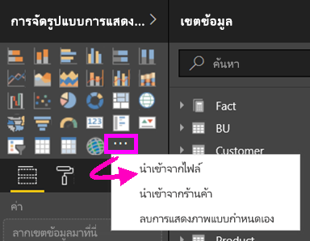

3. จากเมนู **เปิด**ไฟล์ เลือกไฟล์ที่คุณต้องการนำเข้า`.pbiviz`และจ**ากนั้นเลือกเปิด** ไอคอนภาพแบบกำหนดเองจะถูกเพิ่มไปยังด้านล่างของบานหน้าต่าง **การจัดรูปแบบการแสดงข้อมูล** และพร้อมใช้งานในรายงานของคุณ

    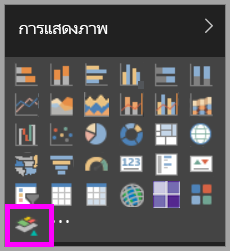

### นำเข้าการแสดงผลด้วยภาพขององค์กร

1. เลือกจุดไข่ปลาจากด้านล่างของบานหน้าต่าง **การจัดรูปแบบการแสดงข้อมูล**

    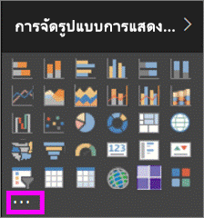

2. จากรายการดรอปดาวน์ เลือก**นำเข้าจาก marketplace**

    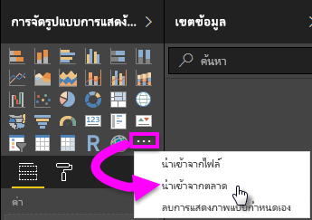

3. เลือก**องค์กรของฉัน**จากเมนบนแท็บด้านบน

    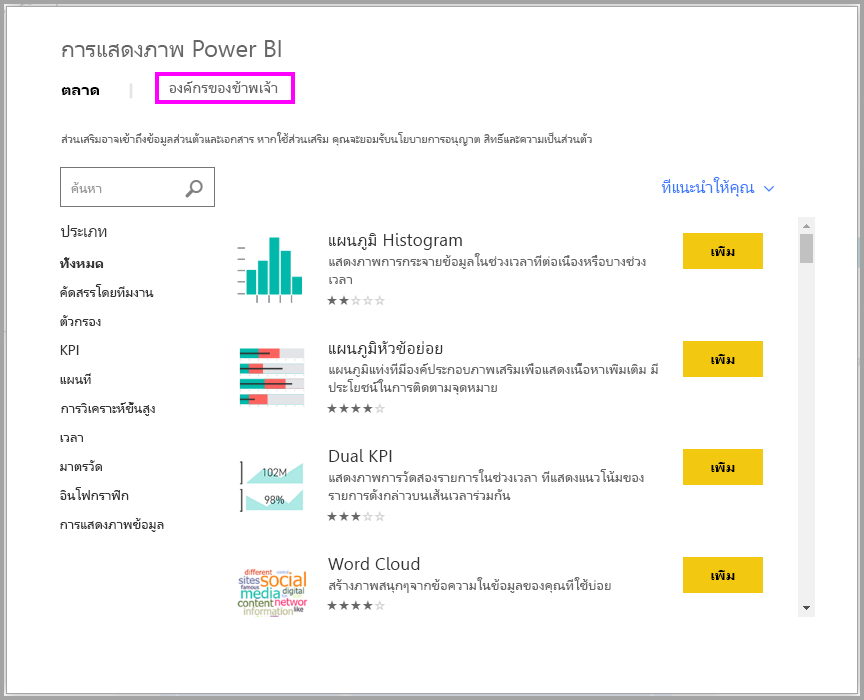

4. เลื่อนผ่านรายการเพื่อการค้นหาวิชวลที่จะนำเข้า

    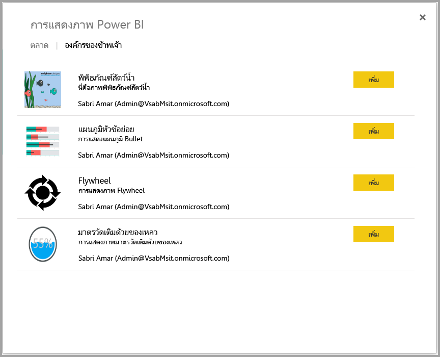

5. นำเข้าภาพแบบกำหนดเองโดยเลือกที่ปุ่ม **เพิ่ม** ไอคอนจะถูกเพิ่มไปยังด้านล่างของบานหน้าต่าง **การจัดรูปแบบการแสดงข้อมูล** และพร้อมใช้งานในรายงานของคุณ

    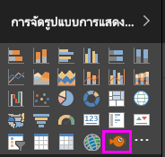

## ดาวน์โหลด หรือนำเข้าส่วนการแสดงผล Power BI จาก Microsoft AppSource

คุณมีสองตัวเลือกสำหรับการดาวน์โหลด และการนำเข้าส่วนการแสดงผล Power BI โดยสามารถทำจากใน Power BI และจากเว็บไซต์ [AppSource](https://appsource.microsoft.com/)

### นำเข้าส่วนการแสดงผล Power BI จากใน Power BI

1. เลือกจุดไข่ปลาจากด้านล่างของบานหน้าต่าง **การจัดรูปแบบการแสดงข้อมูล**

    

2. จากรายการดรอปดาวน์ เลือก**นำเข้าจาก marketplace**

    

3. เลื่อนผ่านรายการเพื่อการค้นหาวิชวลที่จะนำเข้า

    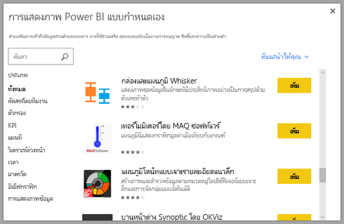

4. ถ้าต้องการเรียนรู้เพิ่มเติมเกี่ยวกับวิชวล ให้ไฮไลท์และเลือกมัน

    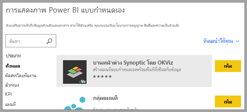

5. บนหน้ารายละเอียด คุณสามารถดูภาพหน้าจอ วิดีโอ คำอธิบายโดยละเอียด และอื่น ๆ

    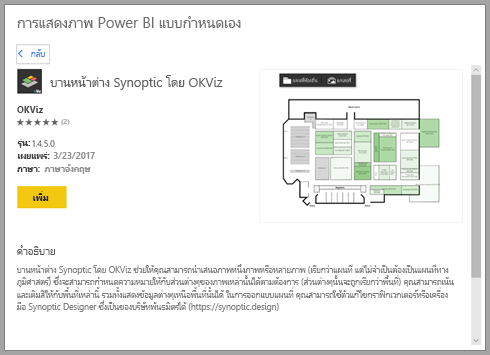

6. เลื่อนไปด้านล่างเพื่อดูการรีวิว

    

7. นำเข้าภาพแบบกำหนดเองโดยเลือกที่ปุ่ม **เพิ่ม** ไอคอนจะถูกเพิ่มไปยังด้านล่างของบานหน้าต่าง **การจัดรูปแบบการแสดงข้อมูล** และพร้อมใช้งานในรายงานของคุณ

    

### ดาวน์โหลดและนำเข้าส่วนการแสดงผล Power BI จาก Microsoft AppSource

1. เริ่มจาก [Microsoft AppSource](https://appsource.microsoft.com) และเลือกแท็บสำหรับ**แอป**

    

2. ไปยัง[หน้าผลลัพธ์แอป](https://appsource.microsoft.com/marketplace/apps) คุณสามารถดูแอปอันดับต้น ๆ ในแต่ละประเภท รวมถึง *แอป Power BI* เราจะค้นหาส่วนการแสดงผล Power BI โดยเลือก **ภาพ Power BI** จากรายการนำทางด้านซ้ายมือเพื่อจำกัดผลลัพธ์ให้แคบลง

    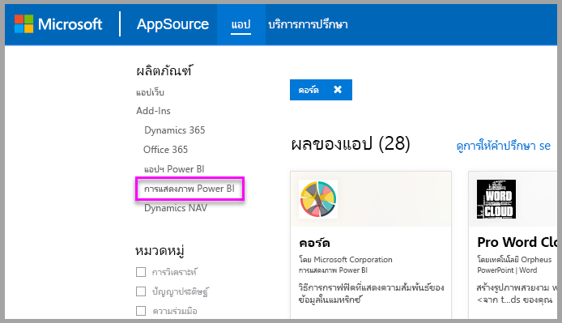

3. AppSource แสดงไทล์สำหรับวิชวลแบบกำหนดเองแต่ละตัว  แต่ละไทล์มีสแนปช็อตของภาพแบบกำหนดเองพร้อมคำอธิบายสั้น ๆ และลิงก์สำหรับดาวน์โหลด เมื่อต้องการดูรายละเอียดเพิ่มเติม ให้เลือกไทล์

    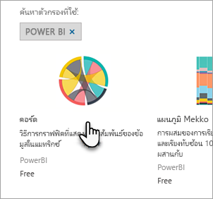

4. บนหน้ารายละเอียด คุณสามารถดูภาพหน้าจอ วิดีโอ คำอธิบายโดยละเอียด และอื่น ๆ ดาวน์โหลดภาพแบบกำหนดเองโดยการเลือก**รับทันที**และยอมรับข้อกำหนดการใช้

    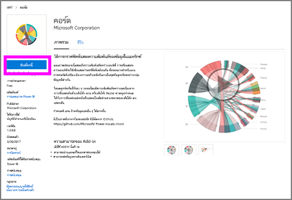

5. เลือกลิงก์เพื่อดาวน์โหลดวิชวลแบบกำหนดเอง

    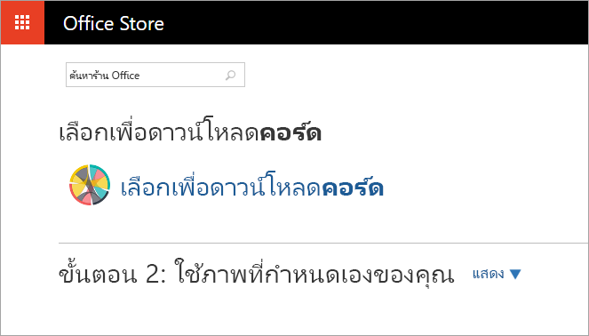

    หน้าดาวน์โหลดยังบอกวิธีการนำเข้าภาพแบบกำหนดเองลงใน Power BI Desktop และบริการของ Power BI

    คุณยังสามารถดาวน์โหลดรายงานตัวอย่างการใช้วิชวลแบบกำหนดเอง ที่ใช้แสดงขีดความสามารถของมัน

    

6. บันทึกไฟล์ `.pbiviz` และจากนั้นเปิด Power BI

7. นำเข้าไฟล์ `.pbiviz` ลงในรายงานของคุณ (ดูส่วน [นำเข้าภาพแบบกำหนดเองจากไฟล์](#import-a-custom-visual-from-a-file) ด้านบน)

## ข้อควรพิจารณาและข้อจำกัด

* วิชวลแบบกำหนดเองจะถูกเพิ่มเฉพาะในรายงานที่นำเข้า ถ้าคุณต้องการใช้วิชวลในรายงานอื่น คุณจำเป็นต้องนำเข้าในรายงานนั้นด้วยเช่นกัน เมื่อรายงานที่มีวิชวลแบบกำหนดเอง ถูกบันทึกโดยใช้ตัวเลือก **บันทึกเป็น** สำเนาของวิชวลแบบกำหนดเองจะถูกบันทึกไปกับรายงานใหม่

* ถ้าคุณไม่เห็นบานหน้าต่าง **การจัดรูปแบบการแสดงข้อมูล** แสดงว่าคุณไม่มีสิทธิการแก้ไขรายงาน  คุณสามารถเพิ่มส่วนการแสดงผล Power BI ได้เฉพาะเมื่อคุณสามารถแก้ไขรายงานเท่านั้น ไม่ใช่เมื่อรายงานนั้นได้ถูกแชร์ให้คุณ

## การแก้ไขปัญหา

แก้ไขปัญหาได้ตามหัวข้อ [การแก้ไขปัญหาส่วนการแสดงผล Power BI ของคุณ](power-bi-custom-visuals-troubleshoot.md)

## คำถามที่ถามบ่อย

สำหรับข้อมูลเพิ่มเติมและคำตอบที่คุณอยากรู้ โปรดเยี่ยมชม[คำถามที่ถามบ่อยเกี่ยวกับ Power BI ส่วนการแสดงผล Power BI](power-bi-custom-visuals-faq.md#organizational-visuals)

## ขั้นตอนถัดไป

* [การจัดรูปแบบการแสดงข้อมูลในรายงาน Power BI](visuals/power-bi-report-visualizations.md)

มีคำถามเพิ่มเติมหรือไม่? [ลองไปที่ชุมชน Power BI](http://community.powerbi.com/)
