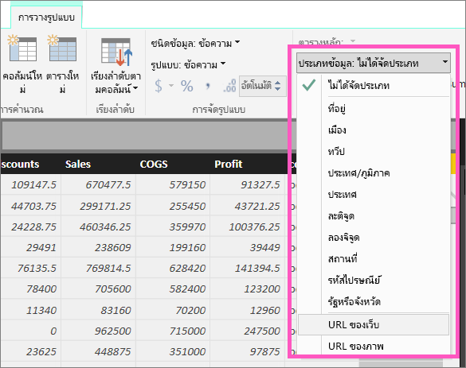
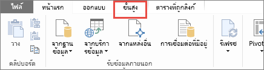

# ไฮเปอร์ลิงก์ในตาราง
หัวข้อนี้สอนวิธีการใช้ Power BI Desktop เพื่อสร้างไฮเปอร์ลิงก์ จากนั้น เมื่อสร้างเสร็จแล้ว ใช้บริการ Desktop หรือ Power BI เพื่อเพิ่มไฮเปอร์ลิงก์เหล่านั้นไปยังรายงานตารางและเมทริกซ์ของคุณ 

> **หมายเหตุ**: ไฮเปอร์ลิงก์ใน[ไทล์บนแดชบอร์ด](service-dashboard-edit-tile.md)และ[กล่องข้อความบนแดชบอร์ด](service-dashboard-add-widget.md)สามารถสร้างขึ้นทันทีโดยใช้บริการ Power BI ได้ ไฮเปอร์ลิงก์ใน[กล่องข้อความในรายงาน](service-add-hyperlink-to-text-box.md)สามารถสร้างขึ้นในทันทีโดยใช้บริการ Power BI และ Power BI Desktop ได้
> 
> 

## เมื่อต้องสร้างไฮเปอร์ลิงก์ในตารางหรือเมทริกซ์โดยใช้ Power BI Desktop
คุณสามารถสร้างการไฮเปอร์ลิงก์ในตารางและเมทริกซ์ ใน Power BI Desktop ได้ แต่ไม่ใช่จาก บริการ Power BI นอกจากนี้ ไฮเปอร์ลิงก์ยังสามารถสร้างได้ใน Power Pivot ของ Excel ก่อนที่จะนำเข้าสมุดงานใน Power BI ทั้งสองวิธีจะอธิบายไว้ด้านล่าง

## สร้างไฮเปอร์ลิงก์ตารางหรือเมทริกซ์ใน Power BI Desktop
ขั้นตอนสำหรับการเพิ่มไฮเปอร์ลิงก์ขึ้นอยู่กับว่าคุณได้นำเข้าข้อมูลดังกล่าว หรือเชื่อมต่อเข้าโดยใช้ DirectQuery ทั้งสองสถานการณ์มีอธิบายไว้ด้านล่าง

### สำหรับข้อมูลที่นำเข้าใน Power BI
1. ถ้าไฮเปอร์ลิงก์ดังกล่าวไม่ได้มีอยู่เป็นเขตข้อมูลในชุดข้อมูลของคุณ ใช้เดสก์ท็อปเพื่อเพิ่มเป็นแบบ[คอลัมน์แบบกำหนดเอง](desktop-common-query-tasks.md)
2. ในมุมมองข้อมูล เลือกคอลัมน์ และที่แถบ**การสร้างแบบจำลอง** เลือกรายการแบบเลื่อนลงสำหรับ**ประเภทข้อมูล**
   
    
3. เลือก**URL เว็บ**
4. สลับไปยังมุมมองรายงานและสร้างตารางหรือเมทริกซ์โดยใช้เขตข้อมูลที่มีการจัดประเภทเป็น URL เว็บ ไฮเปอร์ลิงก์จะเป็นสีน้ำเงินและขีดเส้นใต้
   
    
5. ถ้าคุณไม่ต้องการแสดง URL ยาวในตาราง คุณสามารถแสดงเป็นไอคอนการเชื่อมโยงหลายมิติแทนได้ โปรดทราบว่า คุณไม่สามารถแสดงไอคอนในเมทริกซ์ได้
   
   * เลือกแผนภูมิเพื่อเปิดใช้งาน
   * เลือกไอคอนแปรงลูกกลิ้ง  เพื่อเปิดแถบจัดรูปร่าง
   * ขยาย**ค่า** ค้นหา**ไอคอน URL**และเปิดใช้งานเป็น**เปิด**
6. (เป็นทางเลือก) [เผยแพร่รายงานจากเดสก์ท็อปไปยังบริการ Power BI](guided-learning/publishingandsharing.yml?tutorial-step=2)และเปิดรายงานในบริการ Power BI ไฮเปอร์ลิงก์จะทำงานตรงนั้นได้เช่นกัน

### สำหรับข้อมูลที่เชื่อมโยงกับ DirectQuery
คุณจะไม่สามารถสร้างคอลัมน์ใหม่ในโหมด DirectQuery ได้  แต่ถ้าข้อมูลของคุณมี URL อยู่แล้ว คุณสามารถทำให้ URL เหล่านั้นเป็นไฮเปอร์ลิงก์ได้

1. ในมุมมองรายงาน สร้างตารางโดยใช้เขตข้อมูลที่ประกอบด้วย URL
2. เลือกคอลัมน์ดังกล่าว และที่แถบ**การสร้างแบบจำลอง** เลือกรายการแบบเลื่อนลงสำหรับ**ประเภทข้อมูล**
3. เลือก**URL เว็บ** ไฮเปอร์ลิงก์จะเป็นสีน้ำเงินและขีดเส้นใต้
4. (เป็นทางเลือก) [เผยแพร่รายงานจากเดสก์ท็อปไปยังบริการ Power BI](guided-learning/publishingandsharing.yml?tutorial-step=2)และเปิดรายงานในบริการ Power BI ไฮเปอร์ลิงก์จะทำงานตรงนั้นได้เช่นกัน

## สร้างไฮเปอร์ลิงก์ตารางหรือเมทริกซ์ใน Power Pivot ของ Excel
อีกวิธีในการเพิ่มไฮเปอร์ลิงก์ไปยัง Power BI ตารางและเมทริกซ์คือ การสร้างไฮเปอร์ลิงก์ในชุดข้อมูลก่อนที่คุณนำเข้า/เชื่อมต่อกับชุดข้อมูลนั้นจาก Power BI ตัวอย่างนี้ใช้สมุดงาน Excel

1. เปิดสมุดงานใน Excel
2. เลือกแถบ **PowerPivot** และจากนั้น เลือก**จัดการ**
   
   
3. เมื่อ PowerPivot เปิดขึ้น เลือกแถบ**ขั้นสูง**
   
   
4. วางเคอร์เซอร์ในคอลัมน์ที่ประกอบด้วย URL ที่คุณต้องการเปลี่ยนเป็นไฮเปอร์ลิงก์ในตาราง Power BI
   
   > **หมายเหตุ**: URL ต้องเริ่มต้นด้วย**http://, https://** หรือ**www**
   > 
   > 
5. ในกลุ่ม**รายงานคุณสมบัติ** เลือก**ประเภทข้อมูล**แบบเลื่อนลง แล้วเลือก**URL เว็บ** 
   
   
6. จากบริการ Power BI หรือ Power BI Desktop เชื่อมต่อไปยัง หรือนำเข้าสมุดงานนี้
7. สร้างการแสดงภาพตารางที่มีเขตข้อมูล URL
   
   

## ข้อควรพิจารณาและการแก้ไขปัญหา
คำถาม: ฉันสามารถใช้ URL ที่กำหนดเองเป็นไฮเปอร์ลิงก์ในตารางหรือเมทริกซ์ได้หรือไม่?    
คำตอบ: ไม่ได้ คุณสามารถใช้ไอคอนลิงก์หนึ่งได้ ถ้าคุณต้องการข้อความแบบกำหนดเองสำหรับไฮเปอร์ลิงก์ของคุณ และรายการของ URL เป็นรายการที่สั้น ให้พิจารณาการใช้กล่องข้อความแทน

## ขั้นตอนถัดไป
[การแสดงภาพในรายงาน Power BI](power-bi-report-visualizations.md)

[Power BI - แนวคิดพื้นฐาน](service-basic-concepts.md)

มีคำถามเพิ่มเติมหรือไม่ [ลองไปที่ชุมชน Power BI](http://community.powerbi.com/)

