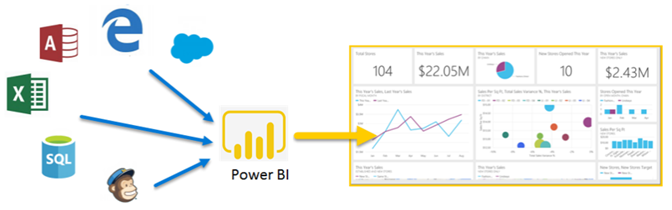
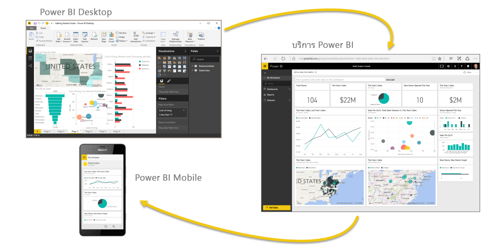
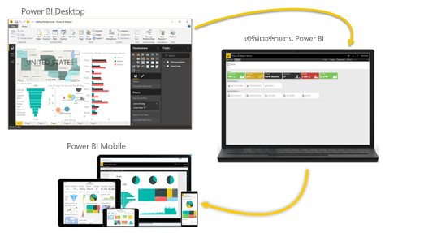

# Power BI คืออะไร
**Power BI** คือคอลเลกชันของบริการซอฟต์แวร์ แอป และตัวเชื่อมต่อที่ทำงานร่วมกันเพื่อเปลี่ยนแหล่งข้อมูลที่ไม่เกี่ยวข้องของคุณให้เป็นข้อมูลเชิงลึกที่สอดคล้องกัน แสดงข้อมูลได้ และโต้ตอบได้ ไม่ว่าข้อมูลของคุณจะเป็นสเปรดชีต Excel ง่ายๆ หรือคอลเลกชันของคลังข้อมูลแบบไฮบริดบนระบบคลาวด์และในองค์กร **Power BI** จะช่วยให้คุณเชื่อมต่อกับแหล่งข้อมูลของคุณ แสดง (หรือค้นพบ) ข้อมูลสำคัญ และแชร์ข้อมูลนั้นกับใครก็ตามหรือทุกคนที่คุณต้องการได้อย่างง่ายดาย

**Power BI** สามารถใช้งานได้ง่ายและสะดวก – สามารถสร้างข้อมูลเชิงลึกด่วนจากสเปรดชีต Excel หรือฐานข้อมูลในเครื่อง แต่ **Power BI** ยังทนทานและเป็นเครื่องมือระดับองค์กร พร้อมสำหรับการวางรูปแบบพิเศษและการวิเคราะห์แบบเรียลไทม์ เช่นเดียวกับการพัฒนาที่กำหนดเอง ดังนั้น จึงสามารถเป็นรายงานส่วนบุคคลและเครื่องมือการจัดรูปแบบการแสดงข้อมูลของคุณ และยังสามารถทำหน้าที่เป็นเครื่องมือวิเคราะห์และตัดสินใจในโครงการกลุ่ม แผนก หรือทั้งองค์กร

## ส่วนต่างๆ ของ Power BI
Power BI มีแอปพลิเคชันบนเดสก์ท็อป Windows ที่เรียกว่า **Power BI Desktop** และบริการ SaaS (*Software as a Service*) ออนไลน์ที่เรียกว่า**บริการ Power BI** และ**แอป** Power BI สำหรับอุปกรณ์เคลื่อนที่ที่พร้อมใช้งานบนโทรศัพท์และแท็บเล็ต Windows และอุปกรณ์ iOS และ Android

สามองค์ประกอบเหล่านี้ – **Desktop** **บริการ** และ **Mobile** – ได้รับการออกแบบให้ช่วยผู้ใช้ในการสร้าง แชร์ และใช้ข้อมูลเชิงลึกทางธุรกิจด้วยวิธีที่พวกเขาหรือบทบาทของพวกเขาต้องการได้อย่างมีประสิทธิภาพสูงสุด

## Power BI เหมาะสมกับบทบาทของคุณอย่างไร
วิธีที่คุณใช้ Power BI อาจขึ้นอยู่กับบทบาทของคุณในโครงการหรือในทีม และผู้อื่น ในบทบาทอื่น อาจใช้ Power BI แตกต่างกันไป ซึ่งเป็นสิ่งที่สามารถทำได้

ตัวอย่างเช่น คุณอาจใช้**บริการ Power BI**  เป็นหลัก แต่เพื่อนร่วมงานที่ทำงานกับตัวเลขและสร้างรายงานทางธุรกิจอาจใช้งาน **Power BI Desktop** (และเผยแพร่รายการเดสก์ท็อปไปยังบริการ Power BI ซึ่งคุณสามารถดูได้) และเพื่อนร่วมงานคนอื่นๆ ในแผนกการขาย อาจใช้แอป Power BI บนโทรศัพท์เพื่อตรวจดูความคืบหน้าของโควต้าการขาย และดูรายละเอียดของผู้มุ่งหวังทางการขายรายใหม่

ถ้าคุณเป็นนักพัฒนา คุณอาจใช้ Power BI API เพื่อพุชข้อมูลลงในชุดข้อมูล หรือเพื่อฝังแดชบอร์ดและรายงานลงในแอปพลิเคชันแบบกำหนดเองของคุณ มีแนวคิดสำหรับวิชวลใหม่หรือไม่ ลองสร้างด้วยตัวคุณเอง แล้วแชร์กับผู้อื่น  

คุณยังอาจใช้แต่ละองค์ประกอบของ **Power BI** ในช่วงเวลาที่ต่างกัน โดยขึ้นอยู่กับสิ่งที่คุณต้องการทำหรือบทบาทของคุณในโครงการหรือการทำงาน

คุณอาจดูสินค้าคงคลังและกระบวนการผลิตในแดชบอร์ดแบบเรียลไทม์ในบริการ และยังใช้ **Power BI Desktop** ในการสร้างรายงานเกี่ยวกับการส่วนมีส่วนร่วมกับลูกค้าสำหรับทีมของคุณเอง วิธีที่คุณใช้ Power BI อาจขึ้นอยู่กับฟีเจอร์หรือบริการของ Power BI ที่เป็นเครื่องมือที่ดีที่สุดสำหรับสถานการณ์ของคุณ แต่ทุกส่วนของ Power BI พร้อมใช้งานสำหรับคุณ ทำให้มีความยืดหยุ่นและน่าสนใจ

เมื่อต้องสำรวจเอกสารที่เกี่ยวข้องกับบทบาทของคุณ:
- Power BI สำหรับ [***นักออกแบบ***](desktop-what-is-desktop.md)
- Power BI สำหรับ [***ผู้บริโภค***](consumer/end-user-consumer.md)
- Power BI สำหรับ [***นักพัฒนา***](developer/what-can-you-do.md)
- Power BI สำหรับ [***ผู้ดูแลระบบ***](service-admin-administering-power-bi-in-your-organization.md)

## ลำดับการทำงานใน Power BI
ลำดับการทำงานทั่วไปใน Power BI เริ่มจากการเชื่อมต่อกับแหล่งข้อมูล และสร้างรายงานใน **Power BI Desktop** รายงานดังกล่าวจะถูกเผยแพร่จาก **Desktop** ไปยัง **บริการของ Power BI** และแชร์เพื่อให้ผู้ใช้ใน**บริการ**และ**อุปกรณ์เคลื่อนที่** สามารถ*ใช้* (ดูและโต้ตอบ) รายงาน
บางครั้ง คุณอาจต้องการให้สิทธิ์เพื่อนร่วมงานที่คล้ายกับของคุณเอง (สิทธิ์*ผู้สร้าง*) เพื่อให้พวกเขาสามารถใช้**บริการ**เพื่อแก้ไขรายงาน สร้างแดชบอร์ด และแชร์งานของพวกเขาได้

ซึ่งไม่จำเป็นต้องเป็นแบบนี้เสมอไป แม้ว่านี่คือหนึ่งในเวิร์กโฟลว์ที่ใช้บ่อย และแสดงวิธีที่องค์ประกอบ Power BI ทั้งสาม ส่งเสริมกันและกัน

แต่ถ้าคุณยังไม่พร้อมที่จะย้ายไปยังคลาวด์ และต้องการเก็บรายงานของคุณหลังไฟร์วอลล์ขององค์กร  ลองอ่านต่อไป

## การรายงานในองค์กรด้วยเซิร์ฟเวอร์รายงาน Power BI
สร้าง ปรับใช้ และจัดการ Power BI รายงานระยะไกล และภายในองค์กรกับช่วงของเตรียมพร้อมสำหรับการใช้เครื่องมือและบริการที่มีเซิร์ฟเวอร์รายงาน Power BI

เซิร์ฟเวอร์รายงาน Power BI เป็นโซลูชันที่คุณปรับใช้หลังไฟร์วอลล์ของคุณ และจัดส่งรายงานของคุณไปยังผู้ใช้ที่ถูกต้อง ด้วยวิธีต่าง ๆ ไม่ว่าจะดูในเว็บเบราว์เซอร์ บนอุปกรณ์เคลื่อนที่ หรือทางอีเมล และเนื่องจากเซิร์ฟเวอร์รายงาน Power BI เข้ากันได้กับ Power BI ในระบบคลาวด์ คุณสามารถย้ายไปยังคลาวด์เมื่อคุณพร้อม

## ขั้นตอนถัดไป
[ลงชื่อเข้าใช้ รับข้อมูล และเรียนรู้วิธีใช้บริการของ Power BI](service-the-new-power-bi-experience.md)   
[บทช่วยสอน: เริ่มต้นใช้งานบริการ Power BI ](service-get-started.md)
