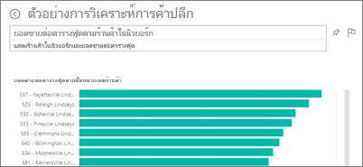
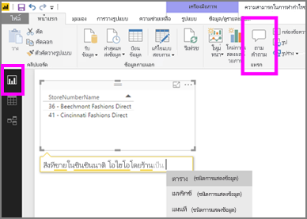

# Q&A ใน Power BI service และ Power BI Desktop
## Q&A คืออะไร
ในบางครั้ง วิธีที่เร็วที่สุดในการให้ได้คำตอบจากข้อมูลของคุณคือ การถามคำถามโดยใช้ภาษาธรรมชาติ ตัวอย่างเช่น "ยอดขายรวมปีที่แล้วเป็นเท่าไหร่"  ใช้ Q&A เพื่อสำรวจข้อมูลของคุณโดยใช้การอนุมาน ความสามารถภาษาธรรมชาติ และรับคำตอบในรูปแบบของแผนภูมิและกราฟ Q&A แตกต่างจากโปรแกรมค้นหา Q&A เพียงแค่แสดงผลลัพธ์เกี่ยวกับข้อมูลใน Power BI

บทความนี้จะกระโดดไปยัง Q&A ทุกอย่าง เลือกการเชื่อมโยงด้านล่างเพื่อเรียนรู้ Q&A ทำงานอย่างไรใน Power BI ทำงานแบบบริการตนเอง (แดชบอร์ดและรายงาน) Power BI Desktop (รายงาน) Power BI Embedded และ Power BI สำหรับอุปกรณ์เคลื่อน  

> [!NOTE]
> **ถามตอบ Power BI** สนับสนุนการตอบคำถามภาษาธรรมชาติ ที่ถามเป็นภาษาอังกฤษ คุณยังสามารถลองใช้คุณลักษณะตัวอย่าง สำหรับคำถามที่ถามเป็นภาษาสเปน ใน **Power BI Desktop** ไปที่**ไฟล์**, **ตัวเลือกและการตั้งค่า**, **ตัวเลือก** และค้นหาแท็บ**คุณลักษณะตัวอย่าง** เลือกกล่องสำหรับ**การสนับสนุนภาษาสเปนสำหรับ Q&A**  
>
>

การถามคำถามเป็นเพียงการเริ่มต้น  สนุกกับการเดินทางผ่านข้อมูลของคุณ เพื่อปรับแต่งหรือขยายคำถามของคุณ ค้นพบข้อมูลใหม่ที่น่าเชื่อถือ และให้ความสำคัญกับรายละเอียดและซูมออกเพื่อให้ได้มุมมองที่กว้างขึ้น คุณจะรู้สึกยินดีกับข้อมูลเชิงลึกและการค้นพบที่คุณทำ

ประสบการณ์การใช้งานเป็นแบบโต้ตอบอย่างแท้จริง... และรวดเร็ว รับการสนับสนุนโดยการเก็บข้อมูลในหน่วยความจำ ตอบสนองได้เกือบทันที

##  Q&A สำหรับ*ผู้บริโภค*
เมื่อเพื่อนร่วมงานแชร์แดชบอร์ดกับคุณ คุณจะพบกล่องคำถาม Q&A ในแดชบอร์ดใน Power BI service (app.powerbi.com) ที่ด้านล่างของแดชบอร์ด ใน Power BI สำหรับอุปกรณ์เคลื่อน และการแสดงภาพใน Power BI แบบฝัง เว้นแต่ว่าเจ้าของได้ให้สิทธิ์การแก้ไข คุณจะไม่สามารถใช้ Q&A เพื่อสำรวจข้อมูลแต่จะไม่สามารถบันทึกการแสดงภาพใดๆ ที่สร้างขึ้น ด้วย Q&A

## Q&A สำหรับ*สำหรับผู้สร้าง*
ถ้าคุณเป็น*ผู้สร้าง*ของรายงาน Power BI หรือมีสิทธิ์ในการแก้ไขไปยังชุดข้อมูล คุณจะพบกล่อง Q&A บนแดชบอร์ด ใน Power BI service และในแต่ละหน้ารายงานใน Power BI service และ Power BI Desktop การแสดงภาพใดๆ ที่คุณสร้างโดยใช Q&A ที่สามารถบันทึกไปยังแดชบอร์ดและบันทึกไว้ในรายงาน

นอกจากการใช้ Q&A เพื่อสำรวจข้อมูลของพวกเขาแล้ว ผู้สร้างและเจ้าของชุดข้อมูลสามารถปรับปรุงประสบการณ์ใช้งาน Q&A สำหรับผู้บริโภคโดย[ปรับเปลี่ยนชุดข้อมูลของพวกเขา](service-prepare-data-for-q-and-a.md) โดยเพิ่ม[คำถามที่โดดเด่น](service-q-and-a-create-featured-questions.md)และ[เปิดและปิดใช้งาน Q&A ](service-q-and-a-direct-query.md)สำหรับการเชื่อมต่อชุดข้อมูลภายในองค์กรแบบ live ใน[สถานการณ์ที่ฝัง](developer/qanda.md)นักพัฒนาสามารถเลือกระหว่างโหมด 2 โหมด **แบบโต้ตอบ**และ**เฉพาะผลลัพธ์**

## Q&A ทราบว่าจะตอบคำถามได้อย่างไร
### ชุดข้อมูลที่ใดใช้งาน Q&A
Q&A ทราบว่าจะตอบคำถามของข้อมูลเฉพาะได้อย่างไร อาศัยชื่อของตาราง คอลัมน์ และเขตข้อมูลที่คำนวณในชุดข้อมูลด้านใน อะไรที่คุณ (หรือเจ้าของชุดข้อมูล) เรียกสิ่งต่างๆ นั้นเป็นสิ่งสำคัญ

ตัวอย่าง สมมติว่า คุณมีตาราง Excel ที่มีชื่อว่า "Sales" มีคอลัมน์ที่ชื่อว่า "Product", "Month" Units Sold”, “Gross Sales” และ “Profit” คุณสามารถถามคำถามใดๆก็ได้ เกี่ยวกับเอนทิตีเหล่านั้น  คุณสามารถสอบถาม "แสดง*ขาย* " รวม*กำไร*แต่ละ*เดือน*" " เรียงลำดับ*ผลิตภัณฑ์*โดย*หน่วยที่ขายได้* และอื่น ๆ

Q&A สามารถตอบคำถามที่ยึดตามวิธีการจัดระเบียบชุดข้อมูลของคุณ สิ่งนี้จะทำงานกับข้อมูลใน Salesforce ได้อย่างไร เมื่อคุณเชื่อมต่อกับบัญชี salesforce.com ของคุณ Power BI จะสร้างแดชบอร์ดโดยอัตโนมัติ  ก่อนที่คุณเริ่มการถามคำถามด้วย Q&A ให้ดูที่ข้อมูลที่แสดงในการแสดงภาพแดชบอร์ด และที่ข้อมูลที่แสดงในเมนูดรอปดาวน์ Q&A

* ถ้าป้ายชื่อแกนและค่าของแสดงภาพซึ่งรวม "sales",  "account", "month", และ "opportunities" จากนั้นคุณสามารถถามคำถามได้อย่างมั่นใจเช่น: "*บัญชีผู้ใช้*ใดมี*โอกาส*มากที่สุด หรือแสดง*ยอดขาย*ตามเดือนเป็นแผนภูมิแท่ง "
* ถ้ารายการแบบดร๊อปดาวน์มี "พนักงาน" "รัฐ" และ "ปี" จาก นั้นคุณสามารถถามคำถามแบบมั่นใจได้เช่น: "*พนักงานขาย*ใด*ขาย*ได้ต่ำสุดใน*ฟลอริดา*ใน *2013*"

ถ้าคุณมีข้อมูลประสิทธิภาพการทำงานเว็บไซต์ใน Google Analytics คุณสามารถถาม Q&A เกี่ยวกับเวลาที่ใช้ในเว็บเพจ จำนวนการเยี่ยมชมหน้าเฉพาะและอัตราการมีส่วนร่วมของผู้ใช้ หรือ ถ้าคุณกำลังทำคิวรี่ข้อมูลประชากร คุณอาจถามคำถามเกี่ยวกับอายุและรายไดในครัวเรือนตามท้องถิ่น

### การแสดงภาพแบบใดที่ Q&A ใช้
Q&A เลือกการแสดงภาพที่ดีที่สุดที่ยึดตามข้อมูลที่ถูกแสดง ในบางครั้งข้อมูลในชุดข้อมูลภายในที่ถูกกำหนดเป็นชนิดหรือประเภทบางอย่าง และวิธีนี้ช่วยให้ Q&A รู้ว่าจะแสดงอย่างไร ตัวอย่างเช่น ถ้าข้อมูลถูกกำหนดเป็นชนิดวัน โดยแสดงเป็นแผนภูมิเส้น ข้อมูลที่ถูกจัดประเภทเป็นเมือแสดงบนแผนที่

คุณยังสามารถบอก Q&A ซึ่งแสดงภาพเพื่อใช้ ด้วยการเพิ่มคำถามของคุณ แต่โปรดทราบว่าอาจจะไม่เป็นไปได้เสมอ ที่ Q&A จะแสดงข้อมูลในชนิดแสดงภาพที่คุณร้องขอ

สำหรับข้อมูลเกี่ยวกับคำสำคัญที่ Q&A รู้จัก ให้ดู[เคล็ดลับสำหรับการถามคำถาม](service-q-and-a-tips.md)

## สำหรับรายละเอียดเพิ่มเติมเกี่ยวกับ Power BI Q&A
[ภาพรวม วิธีใช Q&A ในแดชบอร์ดและรายงาน Power BI](power-bi-tutorial-q-and-a.md): ขั้นตามคำแนะนำสำหรับการใช้งาน Q&A และภาพรวมของวิธีทำงานทั้งหมด

[แอปสำหรับอุปกรณ์เคลื่อนของ Microsoft Power BI](mobile-apps-ios-qna.md)สำหรับ iOS บน iPads iPhones และ iPod Touch

[Microsoft Power BI Embedded](developer/qanda.md)รวม Q&A ลงในแอปพลิเคชัน

[เคล็ดลับสำหรับการถามคำถามใน Q&A](service-q-and-a-tips.md) เรียนรู้วิธีการพูดคุยกับ Q&A เมื่อต้องรับผลลัพธ์ที่ดีที่สุดที่เป็นไป

[เพิ่มคำถามที่แนะนำในชุดข้อมูลของคุณ](service-q-and-a-create-featured-questions.md)และ Q&A จะแนะนำคำถามเหล่านี้ให้เพื่อนร่วมงานของคุณ

[เปิดใช้ Q&A สำหรับชุดข้อมูลภายในองค์กรของคุณ](service-q-and-a-direct-query.md)ถ้าคุณต้องการเกตเวย์เพื่อเชื่อมต่อกับชุดข้อมูล ใช้การตั้งค่า Power BI เพื่อเปิดและปิด Q&A

[บทเรียน ให้ใช้ Q&A กับตัวอย่างการขายปลีกใน บริการ Power BI service](power-bi-visualization-introduction-to-q-and-a.md): ให้ใช้ Power BI service ในบทเรียนที่ใช้ในอุตสาหกรรมได้จริง

[ทำข้อมูลของคุณทำงานได้ดีกับ Q&A](service-prepare-data-for-q-and-a.md): บุคคลสร้างแบบจำลองชุดข้อมูลและข้อมูลหรือไม่  จากนั้น หัวข้อนี้เหมาะสำหรับคุณ

มีคำถามเพิ่มเติมหรือไม่ [ลองไปที่ชุมชน Power BI](http://community.powerbi.com/)
