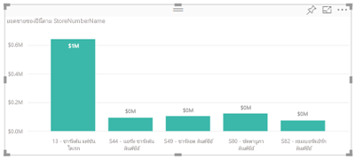
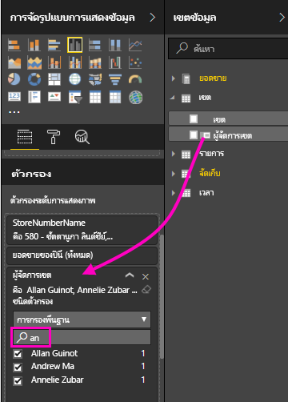
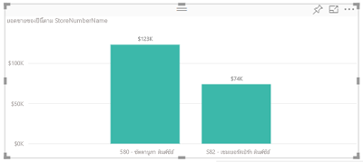

# เพิ่มตัวกรองสำหรับรายงานในมุมมองการแก้ไข

บทความนี้จะอธิบายวิธีเพิ่มตัวกรองหน้า, ตัวกรองการแสดงภาพ, ตัวกรองรายงาน หรือตัวกรอง drillthrough ไปยังรายงานใน Power BI ตัวอย่างในบทความนี้จะอยู่ในบริการของ Power BI ขั้นตอนแทบจะเหมือนกันเกือบทั้งหมดใน Power BI Desktop

**คุณทราบหรือไม่** Power BI มีการใช้งานตัวกรองใหม่อยู่ในตัวอย่าง อ่านเพิ่มเติมเกี่ยวกับ[การใช้งานตัวกรองใหม่ในรายงาน Power BI](power-bi-report-filter-preview.md)

## ตัวกรองในมุมมองการแก้ไขและมุมมองการอ่าน
คุณสามารถโต้ตอบกับรายงานในสองมุมมอง คือ มุมมองการอ่าน และมุมมองการแก้ไข ความสามารถในการกรองที่พร้อมใช้งานสำหรับคุณจะขึ้นอยู่กับมุมมองที่เลือก อ่านรายละเอียด [เกี่ยวกับตัวกรองและการไฮไลท์ในรายงาน Power BI](power-bi-reports-filters-and-highlighting.md) ทั้งหมด

บทความนี้จะอธิบายวิธีการสร้างตัวกรองใน **มุมมองการแก้ไข** ของรายงาน  สำหรับข้อมูลเพิ่มเติมเกี่ยวกับตัวกรองในมุมมองการอ่าน สามารถดูได้ที่ [โต้ตอบกับตัวกรองในมุมมองการอ่านของรายงาน](consumer/end-user-reading-view.md)

## ชนิดตัวกรองในบานหน้าต่างตัวกรอง
ไม่ว่าคุณกำลังใช้บริการ Desktop หรือ Power BI บานหน้าต่างตัวกรองจะแสดงตามแนวทางด้านขวาของพื้นที่รายงาน ถ้าคุณไม่เห็นบานหน้าต่างตัวกรอง เลือกแบบ " > " ไอคอนจากมุมขวาบนเพื่อขยาย

ตัวกรองมีอยู่สี่ประเภท คือ **ตัวกรองหน้า**, **ตัวกรองภาพ**, **ตัวกรอง drillthrough** และ **ตัวกรองรายงาน**

เนื่องจากตัวกรองยัง*คงอยู่* เมื่อคุณนำทางออกจากรายงาน Power BI ยังคงรักษาการเปลี่ยนแปลงของตัวกรอง, ตัวแบ่งส่วนข้อมูล และการเปลี่ยนแปลงของมุมมองข้อมูลอื่น ๆ ที่คุณสร้าง ดังนั้นคุณจะสามารถกลับไปทำงานที่ค้างไว้ได้ เมื่อคุณกลับไปยังรายงาน หากคุณไม่ต้องการเก็บการเปลี่ยนแปลงตัวกรองไว้ ให้เลือก **รีเซ็ตเป็นค่าเริ่มต้น** จากแถบเมนูด้านบน

## เพิ่มตัวกรองลงในวิชวล
คุณสามารถเพิ่มตัวกรองลงในวิชวลเฉพาะได้สองวิธี (หรือที่เรียกว่า "ตัวกรองภาพ") 

* โดยการกรองเขตข้อมูลที่กำลังถูกใช้โดยการแสดงภาพ
* โดยการระบุเขตข้อมูลที่ไม่ถูกใช้แล้วโดยการแสดงภาพ และเพิ่มเขตข้อมูลนั้นโดยตรงไปยังบักเก็ต **ตัวกรองระดับภาพ**

อนึ่ง กระบวนงานนี้ใช้ตัวอย่างการวิเคราะห์ร้านค้าปลีก หากคุณต้องการดาวน์โหลดและทำตามไปด้วย ดาวน์โหลด [ตัวอย่างการวิเคราะห์ร้านค้าปลีก](sample-retail-analysis.md)

### กรองเขตข้อมูลในภาพ

1. เปิด [รายงานในมุมมองการแก้ไข](service-the-report-editor-take-a-tour.md) ของคุณ
   
   
2. เปิดบานหน้าต่างการจัดรูปแบบข้อมูลและตัวกรองและบานหน้าต่างเขตข้อมูล (ถ้าพวกเขายังไม่ได้อยู่เปิด)
   
   
3. เลือกการแสดงภาพเพื่อเปิดใช้งาน เขตข้อมูลทั้งหมดที่ถูกใช้ โดยภาพจะอยู่บานหน้าต่าง **เขตข้อมูล** และยังแสดงอยู่ในบานหน้าต่าง **ตัวกรอง** ใต้หัวเรื่อง **ตัวกรองระดับภาพ**
   
   
4. ในตอนนี้ เราจะเพิ่มตัวกรองลงในเขตข้อมูลที่ถูกใช้แล้ว โดยการแสดงภาพ 
   
    เลื่อนลงไป**ตัวกรองระดับการมองเห็น**พื้นที่แล้วเลือกลูกศรเพื่อขยายเขตข้อมูลคุณต้องการกรอง ในตัวอย่างนี้ เราจะกรอง**StoreNumberName**
     
     
    
    ตั้งค่าการควบคุมการกรองแบบ **พื้นฐาน**, **ขั้นสูง** หรือ **Top N** อย่างใดอย่างหนึ่ง ในตัวอย่างนี้ เราจะค้นหาในการกรองพื้นฐานสำหรับ **cha** และเลือกร้านค้าทั้งห้าเหล่านั้น
     
     
   
    เปลี่ยนแปลงภาพเพื่อแสดงตัวกรองใหม่ หากคุณบันทึกรายงานของคุณกับตัวกรอง ผู้อ่านรายงานจะสามารถเห็นภาพที่กรองเป็นอย่างแรก และสามารถโต้ตอบกับตัวกรองในมุมมองการอ่านที่เลือก หรือยกเลิกค่า
     
    

### กรองด้วยเขตข้อมูลที่ไม่ได้อยู่ในภาพ

ตอนนี้มาเพิ่มเขตข้อมูลใหม่ไปยังการแสดงภาพเป็นตัวกรองระดับภาพกัน
   
1. จากบานหน้าต่างเขตข้อมูล เลือกเขตข้อมูลที่ต้องการเพิ่มเป็นตัวกรองระดับภาพใหม่ และลากลงในการ **พื้นที่ตัวกรองระดับภาพ**  ในตัวอย่างนี้ เราจะลาก **ผู้จัดการเขต** ลงในบักเก็ต **ตัวกรองระดับภาพ** ค้นหา **an** และเลือกผู้จัดการทั้งสามเหล่านั้น 
     
    

    โปรดสังเกตว่า **ผู้จัดการเขต***ไม่*ได้ถูกเพิ่มลงในการแสดงภาพของตัวเอง การแสดงภาพจะยังประกอบด้วย**StoreNumberName**เป็นแกน และ**ยอดขายของปีนี้**เป็นค่า  
     
    

    และ ตอนนี้มีการกรองข้อมูลการแสดงภาพของตัวเองเพื่อแสดงยอดขายปีนี้ของผู้จัดการสำหรับร้านค้าที่ระบุ
     
    

    หากคุณบันทึกรายงานของคุณกับตัวกรองนี้ ผู้อ่านรายงานจะสามารถโต้ตอบกับตัวกรอง **ผู้จัดการเขต** ในมุมมองการอ่านที่เลือกหรือยกเลิกค่า

## เพิ่มตัวกรองไปยังหน้าทั้งหมด

คุณสามารถเพิ่มตัวกรองไปยังหน้าทั้งหมด (หรือตัวกรองมุมมองหน้า)
1. เปิด [รายงานในมุมมองการแก้ไข](service-the-report-editor-take-a-tour.md) ของคุณ
2. เปิดบานหน้าต่างการจัดรูปแบบข้อมูลและตัวกรองและบานหน้าต่างเขตข้อมูล (ถ้าพวกเขายังไม่ได้อยู่เปิด)
3. จากบานหน้าต่างเขตข้อมูล เลือกเขตข้อมูลที่ต้องการเพิ่มเป็นตัวกรองระดับภาพใหม่ และลากลงในพื้นที่ **ตัวกรองระดับหน้า**  
4. เลือกค่าที่ต้องการกรอง และตั้งค่ากรองตัวการควบคุมการกรองแบบ **พื้นฐาน** หรือ **ขั้นสูง** อย่างใดอย่างหนึ่ง
   
   การแสดงภาพทั้งหมดบนหน้า ผลกระทบจากตัวกรองนี้ วาดอีกครั้งเพื่อแสดงการเปลี่ยนแปลงได้ 
   
   

    หากคุณบันทึกรายงานของคุณกับตัวกรอง ผู้อ่านรายงานจะสามารถโต้ตอบกับตัวกรองในมุมมองการอ่านที่เลือกหรือยกเลิกค่า

## ตัวกรอง Drillthrough
ด้วยหากต้องการเข้าถึงรายละเอียดในบริการ Power BI และ Power BI Desktop คุณสามารถสร้างการ*ปลายทาง*หน้ารายงานที่มุ่งเน้นเฉพาะเจาะจงเอนทิตี - เช่นผู้ ขาย หรือลูกค้า หรือผู้ผลิต ได้ ตอนนี้ จากรายงานหน้าอื่น ๆ ผู้ใช้สามารถคลิกขวาบนจุดข้อมูลสำหรับเอนทิตีและเข้าถึงรายละเอียดไปยังหน้าโฟกัสนั้น

### การสร้างตัวกรอง Drillthrough
เพื่อทำตาม เปิดตัวอย่างทำกำไรลูกค้าในมุมมองการแก้ไข สมมติว่าคุณต้องการสร้างให้หน้าหนึ่งหน้ามีความมุ่งเน้นพื้นที่ธุรกิจผู้บริหาร   

1. เพิ่มหน้าใหม่ลงในรายงาน และตั้งชื่อเป็น**ทีมผู้บริหาร** นี่จะเป็นการเข้าถึงรายละเอียด*ปลายทาง*หน้า
2. เพิ่มการแสดงภาพที่ติดตามเมตริกหลักสำหรับพื้นที่ทางธุรกิจของผู้บริหารทีม    
3. เพิ่ม**ผู้บริหาร > ชื่อผู้บริหาร**เมื่อต้องการเข้าถึงรายละเอียดตัวกรองได้ดีขึ้น    
   
    
   
    โปรดสังเกตว่า Power BI เพิ่มเป็นลูกศรย้อนกลับไปยังหน้ารายงาน  เลือกลูกศรย้อนกลับคืนค่าผู้ใช้รายงาน*ต้นฉบับ*หน้าที่พวกเขาทำงานอยู่เมื่อพวกเขาร่วมการเข้าถึงรายละเอียด ลูกศรย้อนกลับทำงานในมุมมองการอ่านเท่านั้น
   
     

### ตัวกรอง Drillthrough
มาดูวิธีการทำงานของตัวกรองการเข้าถึงรายละเอียด

1. เริ่มต้นบนการ**ดัชนีชี้วัดทีม**หน้ารายงาน    
2. สมมติว่าคุณคือ Andrew Ma และคุณต้องการดูหน้ารายงานทีมผู้บริหารที่ถูกกรองเพียงข้อมูลของคุณ  จากแผนภูมิพื้นที่ด้านบนซ้าย ขวาคลิกจุดข้อมูลสีเขียวใด ๆ เมื่อต้องเปิดตัวเลือกเมนูเข้าถึงรายละเอียด
   
    
3. เลือก**Drillthrough > ทีมผู้บริหาร**เมื่อต้องการเข้าถึงรายละเอียดไปยังหน้ารายงานมีชื่อว่า**ทีมผู้บริหาร** หน้าจะถูกกรองให้แสดงข้อมูลเกี่ยวกับจุดข้อมูลที่คุณคลิกขวา ใน Andrew Ma นี้กรณีและปัญหา เฉพาะเขตข้อมูลที่อยู่ในตัวกรอง Drillthrough ที่ดีได้รับการส่งผ่านไปยังหน้ารายงาน drillthrough  
   
    

## เพิ่มตัวกรองรายงานทั้งหมด (หรือตัวกรองรายงาน)
1. เปิด [รายงานในมุมมองการแก้ไข](service-the-report-editor-take-a-tour.md) ของคุณ
2. เปิดบานหน้าต่างการจัดรูปแบบข้อมูลและตัวกรองและบานหน้าต่างเขตข้อมูล (ถ้าพวกเขายังไม่ได้อยู่เปิด)
3. จากบานหน้าต่างเขตข้อมูล เลือกเขตข้อมูลที่คุณต้องการเพิ่มเป็นตัวกรองระดับภาพใหม่ และลากลงในพื้นที่ **ตัวกรองระดับภาพ**  
4. เลือกค่าที่คุณต้องการกรอง

    ภาพบนหน้าที่ทำงาน และหน้าทั้งหมดในรายงาน เปลี่ยนแปลงเพื่อแสดงตัวกรองใหม่ หากคุณบันทึกรายงานของคุณกับตัวกรอง ผู้อ่านรายงานจะสามารถโต้ตอบกับตัวกรองในมุมมองการอ่านที่เลือกหรือยกเลิกค่า

1. เลือกลูกศรย้อนกลับเพื่อย้อนกลับไปยังเพจก่อนหน้ารายงาน

## ข้อควรพิจารณาและการแก้ไขปัญหา

- มีสถานการณ์ที่ตัวกรองระดับภาพและระดับหน้าของคุณ อาจส่งกลับผลลัพธ์ที่แตกต่างกัน  ตัวอย่างเช่น เมื่อคุณเพิ่มตัวกรองระดับภาพ Power BI จะกรองผลลัพธ์รวม  รวมค่าเริ่มต้นคือ ผลรวม แต่คุณสามารถ[เปลี่ยนชนิดการรวม](service-aggregates.md)  

    ต่อมา เมื่อคุณเพิ่มตัวกรองระดับหน้า Power BI จะกรองโดยไม่มีการรวม  ทำงานนี้ไม่ได้เนื่องจากในหน้าอาจมีภาพจำนวนมากซึ่งแต่ละรายการสามารถใช้ชนิดการรวมที่แตกต่างกัน  ดังนั้น คือกำหนดตัวกรองบนแต่ละแถวข้อมูล

- ถ้าคุณไม่เห็นบานหน้าต่างเขตข้อมูล ตรวจสอบให้แน่ใจว่า คุณอยู่ในรายงาน[มุมมองการแก้ไข](service-interact-with-a-report-in-editing-view.md)    
- ถ้าคุณได้ทำการเปลี่ยนแปลงมากมายกับตัวกรอง และต้องการกลับไปยังค่าเริ่มต้นของผู้เขียนรายงาน เลือก**รีเซ็ตเป็นค่าเริ่มต้น**จากแถบเมนูด้านบน

## ขั้นตอนถัดไป
[สำรวจภาพรวมของบานหน้าต่างตัวกรองของรายงาน](consumer/end-user-report-filter.md)

[ตัวกรองและการทำไฮไลท์ในรายงาน](power-bi-reports-filters-and-highlighting.md)

[โต้ตอบกับตัวกรองและการไฮไลต์ในมุมมองการอ่านของรายงาน](consumer/end-user-reading-view.md)

[เปลี่ยนวิธีที่่ภาพรายงานกรองแบบไขว้ และข้ามไฮไลท์ของแต่ละตัว](consumer/end-user-interactions.md)

มีคำถามเพิ่มเติมหรือไม่ [ลองไปที่ชุมชน Power BI](http://community.powerbi.com/)

