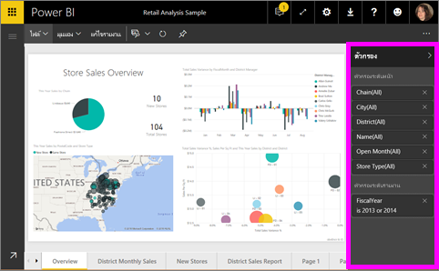
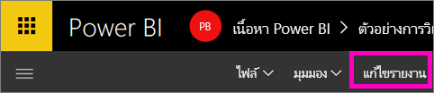
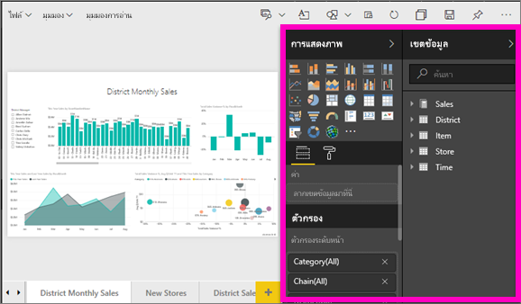
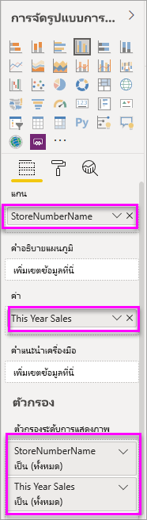
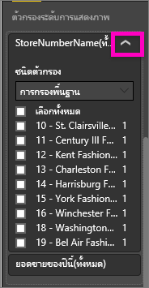
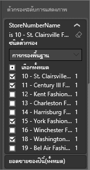
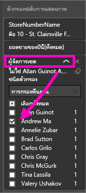
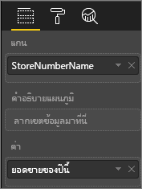
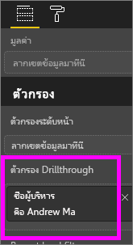
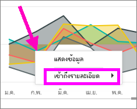

# เพิ่มตัวกรองไปใช้กับรายงานการบริการ Power BI (ในมุมมองการแก้ไข)
> [!TIP]
> เราขอแนะนำให้อ่านแรก[เกี่ยวกับตัวกรองและการเน้นในรายงาน Power BI](power-bi-reports-filters-and-highlighting.md)

ตัวอย่างนี้ในบทความนี้แสดงบริการ Power BI อย่างไรก็ตาม ขั้นตอนจะเหมือนกันเกือบทั้งหมดใน Power BI Desktop
> 
> 

## ความแตกต่างระหว่างตัวกรองรายงานในมุมมองการแก้ไขเมื่อเทียบกับมุมมองการอ่านคืออะไร
มีสองโหมดสำหรับการโต้ตอบกับรายงาน: [มุมมองการอ่าน](service-reading-view-and-editing-view.md)และ[มุมมองการแก้ไข](service-interact-with-a-report-in-editing-view.md)  และความสามารถที่กรองที่คุณใช้งานขึ้นอยู่ในโหมดที่คุณใช้อยู่

* ในมุมมองการแก้ไข คุณสามารถเพิ่มรายงาน หน้า และตัวกรองแบบเป็นภาพ เมื่อคุณบันทึกรายงาน ตัวกรองจะถูกบันทึกด้วย บุคคลที่กำลังดูที่รายงานในมุมมองการอ่านสามารถโต้ตอบกับตัวกรองที่คุณได้เพิ่ม
* ในมุมมองการอ่าน คุณสามารถโต้ตอบกับรายงานใดก็ได้ drillthrough หน้า และตัวกรองแบบเป็นภาพที่มีอยู่แล้วในรายงาน แต่คุณไม่สามารถเพิ่มตัวกรองใหม่ เปลี่ยนแปลงที่คุณสร้างขึ้นในบานหน้าต่างตัวกรองจะถูกบันทึกพร้อมกับรายงาน แม้ว่าคุณดูรายงานในแอปสำหรับอุปกรณ์เคลื่อนที่  

> [!NOTE]
> บทความนี้อธิบายวิธีการสร้างตัวกรองในรายงาน**มุมมองการแก้ไข**  สำหรับข้อมูลเพิ่มเติมเกี่ยวกับตัวกรองในมุมมองการอ่าน ดู[โต้ตอบกับตัวกรองในมุมมองการอ่านรายงาน](service-reading-view-and-editing-view.md)

## ตัวกรองที่พร้อมใช้งานใน Power BI *ตัวกรอง*บานหน้าต่าง
ไม่ว่าคุณกำลังใช้บริการ Desktop หรือ Power BI บานหน้าต่างตัวกรองจะแสดงตามแนวทางด้านขวาของพื้นที่รายงาน ถ้าคุณไม่เห็นบานหน้าต่างตัวกรอง เลือกแบบ " > " ไอคอนจากมุมขวาบนเพื่อขยาย

ตัวกรองสี่ประเภท

- **ตัวกรองหน้า**ใช้กับภาพทั้งหมดบนหน้ารายงาน     
- **ตัวกรองภาพ**นำไปใช้กับภาพเดียวบนหน้ารายงาน    
- **ตัวกรอง drillthrough**นำไปใช้กับเอนทิตีแบบเดียวในรายงาน    
- **ตัวกรองรายงาน**นำไปใช้กับทุกหน้าในรายงาน    

    

## เพิ่มตัวกรองการแสดงภาพที่เฉพาะเจาะจง (หรือภาพตัวกรอง)
ทำได้ 2 วิธี 

* โดยการกรองเขตข้อมูลที่กำลังถูกใช้ โดยการแสดงภาพ
* โดยการระบุเขตข้อมูลที่ไม่ถูกใช้แล้ว โดยการแสดงภาพ เพิ่มเขตข้อมูลนั้นโดยตรงไปยัง**ตัวกรองระดับการมองเห็น**

### โดยการกรองเขตข้อมูลอยู่ในการแสดงภาพ
1. เปิด[รายงานในมุมมองการแก้ไข](service-reading-view-and-editing-view.md)
   
   
2. เปิดบานหน้าต่างการจัดรูปแบบข้อมูลและตัวกรองและบานหน้าต่างเขตข้อมูล (ถ้าพวกเขายังไม่ได้อยู่เปิด)
   
   
3. เลือกการแสดงภาพเพื่อเปิดใช้งาน เขตข้อมูลทั้งหมดที่ถูกใช้ โดยภาพจะถูกระบุในการ**เขตข้อมูล**บานหน้าต่าง และยังแสดงอยู่ในการ**ตัวกรอง**บานหน้าต่าง ภายใต้การ**ตัวกรองระดับการมองเห็น**หัวเรื่อง
   
   
4. ในตอนนี้ เราจะเพิ่มตัวกรองลงในเขตข้อมูลที่ถูกใช้แล้ว โดยการแสดงภาพ 
   
   * เลื่อนลงไป**ตัวกรองระดับการมองเห็น**พื้นที่แล้วเลือกลูกศรเพื่อขยายเขตข้อมูลคุณต้องการกรอง ในตัวอย่างนี้ เราจะกรอง**StoreNumberName**
     
       
   * ตั้งค่าอย่างใดอย่างหนึ่ง**พื้นฐาน****ขั้นสูง**หรือ**Top N**กรองตัวควบคุม (ดู[วิธีใช้ตัวกรองรายงาน](power-bi-how-to-report-filter.md)) ในตัวอย่างนี้ เราจะเลือกพื้นฐานการกรองและการวางถัดจากตัวเลข 10, 11, 15 และ 18
     
       
   * เปลี่ยนแปลงภาพเพื่อแสดงตัวกรองใหม่ ถ้าคุณบันทึกรายงานของคุณ ด้วยตัวกรอง ผู้อ่านรายงานสามารถโต้ตอบกับตัวกรองในมุมมองการอ่าน เลือก หรือยกเลิกค่า
     
      
5. ตอนนี้มาเพิ่มเขตข้อมูลใหม่ทั้งหมด เป็นตัวกรองระดับ Visual การแสดงภาพของเรา
   
   * จากบานหน้าต่างเขตข้อมูล เลือกเขตข้อมูลคุณต้องการเพิ่มเป็นตัวกรองระดับภาพใหม่ และลากลงในการ**พื้นที่ตัวกรองระดับภาพ**  ในตัวอย่างนี้ เราจะลาก**ผู้จัดการเขต**ลงในการ**ตัวกรองระดับการมองเห็น**กลุ่ม และเลือก Andrew Ma เท่านั้น 
     
      
   * โปรดสังเกตว่า**ผู้จัดการเขต**คือ*ไม่*เพิ่มลงในการแสดงภาพของตัวเอง การแสดงภาพจะยังประกอบด้วย**StoreNumberName**เป็นแกน และ**ยอดขายของปีนี้**เป็นค่า  
     
      
   * และ ตอนนี้มีการกรองข้อมูลการแสดงภาพของตัวเองเพื่อแสดงยอดขายของ Andrew เฉพาะปีนี้สำหรับการเก็บที่ระบุ
     
     

## เพิ่มตัวกรองไปยังหน้าทั้งหมด (หรือตัวกรองมุมมองหน้า)
1. เปิด[รายงานในมุมมองการแก้ไข](service-reading-view-and-editing-view.md)
2. เปิดบานหน้าต่างการจัดรูปแบบข้อมูลและตัวกรองและบานหน้าต่างเขตข้อมูล (ถ้าพวกเขายังไม่ได้อยู่เปิด)
3. จากบานหน้าต่างเขตข้อมูล เลือกเขตข้อมูลคุณต้องการเพิ่มเป็นตัวกรองระดับภาพใหม่ และลากลงในการ**พื้นที่ตัวกรองระดับภาพ**  
4. เลือกค่าคุณต้องการกรอง และการตั้งค่าอย่างใดอย่างหนึ่ง**พื้นฐาน**หรือ**ขั้นสูง**กรองตัวควบคุม (ดู[วิธีการใช้ตัวกรองรายงาน](power-bi-how-to-report-filter.md))
   
   การแสดงภาพทั้งหมดบนหน้า ผลกระทบจากตัวกรองนี้ วาดอีกครั้งเพื่อแสดงการเปลี่ยนแปลงได้ 
   
   

ถ้าคุณบันทึกรายงานของคุณ ด้วยตัวกรอง ผู้อ่านรายงานสามารถโต้ตอบกับตัวกรองในมุมมองการอ่าน เลือก หรือยกเลิกค่า

## ตัวกรอง Drillthrough
ด้วยหากต้องการเข้าถึงรายละเอียดในบริการ Power BI และ Power BI Desktop คุณสามารถสร้างการ*ปลายทาง*หน้ารายงานที่มุ่งเน้นเฉพาะเจาะจงเอนทิตี - เช่นผู้ ขาย หรือลูกค้า หรือผู้ผลิต ได้ ตอนนี้ จากรายงานหน้าอื่น ๆ ผู้ใช้สามารถคลิกขวาบนจุดข้อมูลสำหรับเอนทิตีและเข้าถึงรายละเอียดไปยังหน้าโฟกัสนั้น

### การสร้างตัวกรอง Drillthrough
เพื่อทำตาม เปิดตัวอย่างทำกำไรลูกค้าในมุมมองการแก้ไข สมมติว่าคุณต้องการสร้างให้หน้าหนึ่งหน้ามีความมุ่งเน้นพื้นที่ธุรกิจผู้บริหาร   

1. เพิ่มหน้าใหม่ลงในรายงาน และตั้งชื่อเป็น**ทีมผู้บริหาร** นี่จะเป็นการเข้าถึงรายละเอียด*ปลายทาง*หน้า
2. เพิ่มการแสดงภาพที่ติดตามเมตริกหลักสำหรับพื้นที่ทางธุรกิจของผู้บริหารทีม    
3. เพิ่ม**ผู้บริหาร > ชื่อผู้บริหาร**เมื่อต้องการเข้าถึงรายละเอียดตัวกรองได้ดีขึ้น    
   
    
   
    โปรดสังเกตว่า Power BI เพิ่มเป็นลูกศรย้อนกลับไปยังหน้ารายงาน  เลือกลูกศรย้อนกลับคืนค่าผู้ใช้รายงาน*ต้นฉบับ*หน้าที่พวกเขาทำงานอยู่เมื่อพวกเขาร่วมการเข้าถึงรายละเอียด ลูกศรย้อนกลับทำงานในมุมมองการอ่านเท่านั้น
   
     

### ตัวกรอง Drillthrough
มาดูวิธีการทำงานของตัวกรองการเข้าถึงรายละเอียด

1. เริ่มต้นบนการ**ดัชนีชี้วัดทีม**หน้ารายงาน    
2. สมมติว่าคุณคือ Andrew Ma และคุณต้องการดูหน้ารายงานทีมผู้บริหารที่ถูกกรองเพียงข้อมูลของคุณ  จากแผนภูมิพื้นที่ด้านบนซ้าย ขวาคลิกจุดข้อมูลสีเขียวใด ๆ เมื่อต้องเปิดตัวเลือกเมนูเข้าถึงรายละเอียด
   
    
3. เลือก**Drillthrough > ทีมผู้บริหาร**เมื่อต้องการเข้าถึงรายละเอียดไปยังหน้ารายงานมีชื่อว่า**ทีมผู้บริหาร** หน้าจะถูกกรองให้แสดงข้อมูลเกี่ยวกับจุดข้อมูลที่คุณคลิกขวา ใน Andrew Ma นี้กรณีและปัญหา เฉพาะเขตข้อมูลที่อยู่ในตัวกรอง Drillthrough ที่ดีได้รับการส่งผ่านไปยังหน้ารายงาน drillthrough  
   
    

## เพิ่มตัวกรองรายงานทั้งหมด (หรือตัวกรองรายงาน)
1. เปิด[รายงานในมุมมองการแก้ไข](service-reading-view-and-editing-view.md)
2. เปิดบานหน้าต่างการจัดรูปแบบข้อมูลและตัวกรองและบานหน้าต่างเขตข้อมูล (ถ้าพวกเขายังไม่ได้อยู่เปิด)
3. จากบานหน้าต่างเขตข้อมูล เลือกเขตข้อมูลคุณต้องการเพิ่มเป็นตัวกรองระดับภาพใหม่ และลากลงในการ**พื้นที่ตัวกรองระดับภาพ**  
4. เลือกค่าที่คุณต้องการกรอง (ดู[วิธีการใช้ตัวกรองรายงาน](power-bi-how-to-report-filter.md))

    ภาพบนหน้าที่ทำงาน และหน้าทั้งหมดในรายงาน เปลี่ยนแปลงเพื่อแสดงตัวกรองใหม่ ถ้าคุณบันทึกรายงานของคุณ ด้วยตัวกรอง ผู้อ่านรายงานสามารถโต้ตอบกับตัวกรองในมุมมองการอ่าน เลือก หรือยกเลิกค่า

1. เลือกลูกศรย้อนกลับเพื่อย้อนกลับไปยังเพจก่อนหน้ารายงาน

## ข้อควรพิจารณาและการแก้ไขปัญหา
### ทำไมภาพระดับหน้าและตัวกรองระดับตัวกรองของคุณอาจส่งกลับผลลัพธ์ที่แตกต่างกัน
เมื่อคุณเพิ่มภาพระดับตัวกรอง กรอง Power BI ผลลัพธ์รวบรวม  รวมค่าเริ่มต้นคือ ผลรวม แต่คุณสามารถ[เปลี่ยนชนิดการรวม](service-aggregates.md)  

เมื่อคุณเพิ่มหน้าระดับตัวกรอง กรอง Power BI โดยไม่มีการรวบรวม  ทำงานนี้ได้เนื่องจากในหน้าอาจมีภาพจำนวนมากซึ่งแต่ละรายการสามารถใช้ชนิดการรวมที่แตกต่างกัน  ดังนั้น คือกำหนดตัวกรองบนแต่ละแถวข้อมูล

ถ้าคุณไม่เห็นบานหน้าต่างเขตข้อมูล ตรวจสอบให้แน่ใจว่า คุณอยู่ในรายงาน[มุมมองการแก้ไข](service-interact-with-a-report-in-editing-view.md)

## ขั้นตอนถัดไป
 [วิธีการใช้ตัวกรองรายงาน](power-bi-how-to-report-filter.md)

  [ตัวกรองและการทำไฮไลท์ในรายงาน](power-bi-reports-filters-and-highlighting.md)

[โต้ตอบกับตัวกรองและการเน้นในรายงานมุมมองการอ่าน](service-reading-view-and-editing-view.md)

[เปลี่ยนวิธีภาพรายงาน กรองแบบไขว้ และข้ามเน้นแต่ละคน](service-reports-visual-interactions.md)

มีคำถามเพิ่มเติมหรือไม่ [ลองไปที่ชุมชน Power BI](http://community.powerbi.com/)

