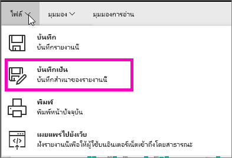
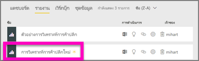

# สร้างรายงานใหม่จากรายงานที่มีอยู่
คุณอาจมีรายงานที่เชื่อมต่อกับชุดข้อมูลของคุณแล้ว และมีวิชวลบางส่วนที่คุณต้องการนำมาใช้อีก หรือปรับเปลี่ยน  ทำไมไม่แค่คัดลอกรายงานนั้นมาพื้นฐานของรายงานใหม่?  เพื่อทำเช่นนั้น:

1. [เปิดรายงาน](service-report-open.md)
2. จาก**เมนูแฟ้ม** เลือก**บันทึกเป็น**
   
   
3. พิมพ์ชื่อสำหรับรายงานใหม่ และเลือก**บันทึก**
   
   
   
   ข้อความสำเร็จ ให้คุณทราบว่า รายงานใหม่ได้ถูกบันทึกลงในพื้นที่ทำงานปัจจุบันของคุณใน Power BI เรียบร้อยแล้ว
   
   
4. เปิดแท็บ**รายงาน**ของพื้นที่ทำงานคุณ แล้วเลือกรายงานใหม่เพื่อเปิด คุณอาจลบวิชวลที่คุณไม่ต้องการแล้ว ปรับเปลี่ยนวิชวลอื่น ๆ และเพิ่มวิชวลใหม่
   
   
5. ขอให้สนุกกับการปรับปรุง และแก้ไขรายงานใหม่ของคุณ

## ขั้นตอนถัดไป:
[สร้างการแสดงภาพใหม่](power-bi-report-add-visualizations-ii.md)

[ลบการแสดงภาพ](service-delete.md)ที่คุณไม่ต้องการ
