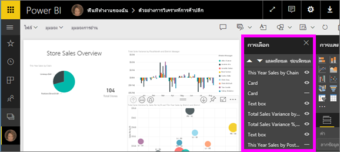
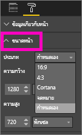

# การตั้งค่าการแสดงหน้าในรายงาน Power BI
เราเข้าใจดีว่าพิกเซลของการจัดหน้ารายงานของคุณเป็นเรื่องสำคัญ บางครั้ง การทำดังกล่าวเป็นไปได้ยาก เนื่องจากคุณและเพื่อนร่วมงานของคุณดูรายงานเหล่านั้นบนหน้าจอด้วยอัตราส่วนกว้างยาวและขนาดแตกต่างกัน 

มุมมองการแสดงในค่าเริ่มต้นคือ**พอดีกับหน้า**และขนาดแสดงในค่าเริ่มต้นคือ**16:9** ถ้าคุณต้องการล็อกในอัตราส่วนกว้างยาวที่แตกต่างกัน หรือต้องการให้พอดีกับรายงานของคุณในลักษณะอื่น มีเครื่องมือสองอย่างที่ช่วยคุณได้ คือ: การตั้งค่า***มุมมองหน้า*** และการตั้งค่า***ขนาดหน้า***

<iframe width="560" height="315" src="https://www.youtube.com/embed/5tg-OXzxe2g" frameborder="0" allowfullscreen></iframe>

## ค้นหาการตั้งค่ามุมมองหน้าในบริการของ Power BI และ Power BI Desktop ได้ที่ใด
การตั้งค่ามุมมองหน้าจะพร้อมใช้งานทั้งในบริการของ Power BI และ Power BI Desktop แต่อินเทอร์เฟซจะแตกต่างกันเล็กน้อย สองหัวข้อด้านล่างนี้อธิบายสถานทีที่่คุณสามารถค้นหาการตั้งค่ามุมมองในแต่ละเครื่องมือของ Power BI

### ใน Power BI Desktop
ในมุมมองรายงาน เลือก แท็บ**มุมมอง**เพื่อเปิดการตั้งค่ามุมมองหน้าและการตั้งค่าการจัดหน้าโทรศัพท์

  

### ในบริการของ Power BI (app.powerbi.com)
ในบริการของ Power BI เปิดรายงาน แล้วเลือก**มุมมอง**จากแถบเมนูด้านบนซ้าย

การตั้งค่ามุมมองหน้าจะพร้อมใช้งานทั้งใน[มุมมองการอ่าน และมุมมองการแก้ไข](consumer/end-user-reading-view.md) ในมุมมองการแก้ไข เจ้าของรายงานสามารถกำหนดการตั้งค่ามุมมองหน้าให้กับหน้ารายงานต่างๆ และการตั้งค่าเหล่านั้นจะถูกบันทึกพร้อมกับรายงาน เมื่อเพื่อนร่วมงานเปิดรายงานนั้นในมุมมองการอ่าน พวกเขาจะเห็นหน้ารายงานที่ใช้การตั้งค่าของเจ้าของ  ในมุมมองการอ่าน เพื่อนร่วมงานสามารถเปลี่ยนแปลงการตั้งค่า*บาง*อย่างของหน้า แต่การเปลี่ยนแปลงนั้นจะไม่ถูกบันทึกเมื่อพวกเขาออกจากรายงาน

##    การตั้งค่ามุมมองหน้า
การตั้งค่า*มุมมองหน้า*ชุดแรกควบคุมการแสดงหน้ารายงานของคุณอย่างสัมพันธ์กับหน้าต่างเบราว์เซอร์  เลือกระหว่าง:

* **จัดพอดีกับหน้า**(ค่าเริ่มต้น): เนื้อหาจะถูกปรับให้พอดีกับหน้า
* **จัดพอดีกับความกว้าง**: เนื้อหาถูกปรับให้พอดีกับความกว้างของหน้า
* **ขนาดจริง**: จะแสดงเนื้อหาเต็มขนาด

การตั้งค่า*มุมมองหน้า*ชุดที่สองควบคุมตำแหน่งของวัตถุบนพื้นที่รายงาน

* **แสดงเส้นตาราง**: เปิดใช้งานเส้นตารางเพื่อช่วยให้คุณจัดตำแหน่งวัตถุบนพื้นที่รายงาน
* **จัดชิดเส้นตาราง**: ใช้กับ**แสดงเส้นตาราง**เมื่อต้องการจัดตำแหน่งและจัดแนววัตถุบนพื้นที่รายงานอย่างแม่นยำ 
* **ล็อกวัตถุ**: ล็อกวัตถุทั้งหมดบนพื้นที่รายงานเพื่อไม่ให้ย้ายหรือปรับขนาดวัตถุได้
* **บานหน้าต่างส่วนที่เลือก**: บานหน้าต่างส่วนที่เลือกจะแสดงวัตถุทั้งหมดบนพื้นที่รายงาน และคุณสามารถตัดสินใจว่าจะแสดงและจะซ่อนวัตถุใด

    

## การตั้งค่าขนาดหน้า

การตั้งค่า*ขนาดหน้า*จะพร้อมใช้งานเฉพาะสำหรับเจ้าของรายงาน ในบริการของ Power BI (app.powerbi.com) สิ่งนี้หมายความว่าสามารถเปิดรายงานใน[มุมมองการแก้ไข](consumer/end-user-reading-view.md) การตั้งค่าเหล่านี้ควบคุมอัตราส่วนการแสดงและขนาดจริง (เป็นพิกเซล) ของพื้นที่รายงาน   

* อัตราส่วน 4:3
* อัตราส่วน 16:9 (ค่าเริ่มต้น)
* Cortana
* จดหมาย
* แบบกำหนดเอง (ความสูงและความกว้างเป็นพิกเซล)

## ขั้นตอนถัดไป
[เรียนรู้วิธีการใช้มุมมองหน้าและการตั้งค่าขนาดหน้าในรายงาน Power BI ของคุณ](consumer/end-user-report-view.md)

อ่านเพิ่มเติมเกี่ยวกับ[รายงานใน Power BI](consumer/end-user-reports.md)

[Power BI - แนวคิดพื้นฐาน](consumer/end-user-basic-concepts.md)

มีคำถามเพิ่มเติมหรือไม่ [ลองไปที่ชุมชน Power BI](http://community.powerbi.com/)

