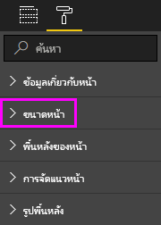

# การตั้งค่าการแสดงหน้าในรายงาน Power BI
เราเข้าใจเป็นสิ่งสำคัญในการเก็บพิกเซลเค้าโครงรายงานของคุณสมบูรณ์แบบ บางครั้ง ซึ่งสามารถทำได้ยาก เนื่องจากคุณและเพื่อนร่วมงานของคุณอาจดูรายงานเหล่านั้นบนหน้าจอด้วยขนาดและอัตราส่วนกว้างยาวแตกต่างกัน 

มุมมองการแสดงในค่าเริ่มต้นคือ**พอดีกับหน้า**และขนาดแสดงในค่าเริ่มต้นคือ**16:9** ถ้าคุณต้องการล็อกในอัตราส่วนกว้างยาวที่แตกต่างกัน หรือต้องการให้พอดีกับรายงานของคุณในลักษณะอื่น มีเครื่องมือสองอย่างที่ช่วยคุณได้ คือ: ***มุมมองหน้า***ตั้งค่า และ***ขนาดหน้า***ตั้งค่า

<iframe width="560" height="315" src="https://www.youtube.com/embed/5tg-OXzxe2g" frameborder="0" allowfullscreen></iframe>

## ค้นหาการตั้งค่ามุมมองหน้าในบริการ Power BI และ Power BI Desktop
ตั้งค่ามุมมองหน้าจะพร้อมใช้งานในบริการ Power BI และ Power BI Desktop แต่อินเทอร์เฟซจะแตกต่างกันเล็กน้อย ส่วนต่อไปนี้อธิบายที่คุณสามารถค้นหาการตั้งค่ามุมมองในแต่ละเครื่องมือ Power BI

### ใน Power BI Desktop
ในมุมมองรายงาน เลือก แท็บ**มุมมอง**เพื่อเปิดการตั้งค่ามุมมองหน้าและการตั้งค่าการจัดหน้าโทรศัพท์

  

### ในบริการ Power BI (app.powerbi.com)
ในบริการ Power BI เปิดรายงานและเลือก**มุมมอง**จากแถบเมนูด้านบนซ้าย

ตั้งค่ามุมมองหน้าจะพร้อมใช้งานทั้งใน[มุมมองการอ่าน และมุมมองการแก้ไข](consumer/end-user-reading-view.md) ในมุมมองการแก้ไข เจ้าของรายงานสามารถกำหนดตั้งค่ามุมมองหน้าไปยังหน้ารายงานแต่ละ และตั้งค่าเหล่านั้นจะถูกบันทึกพร้อมกับรายงาน เมื่อเพื่อนร่วมงานเปิดรายงานนั้นในมุมมองการอ่าน พวกเขาจะเห็นหน้ารายงานที่ใช้การตั้งค่าของเจ้าของ ในมุมมองการอ่าน เพื่อนร่วมงานสามารถเปลี่ยนแปลง*บาง*ของตัว**มุมมองหน้า**ตั้งค่า แต่การเปลี่ยนแปลงจะไม่ถูกบันทึกเมื่อพวกเขาออกจากรายงานได้

## การตั้งค่ามุมมองหน้า
ตั้งค่ามุมมองหน้าชุดแรกควบคุมการแสดงหน้ารายงานของคุณเกี่ยวข้องกับหน้าต่างเบราว์เซอร์ เลือกระหว่าง:

* **พอดีกับหน้า**(ค่าเริ่มต้น): เนื้อหาจะถูกปรับให้พอดีกับหน้า
* **จัดพอดีกับความกว้าง**: เนื้อหาถูกปรับให้พอดีกับความกว้างของหน้า
* **ขนาดจริง**: จะแสดงเนื้อหาเต็มขนาด

วินาทีการตั้งค่าของตัวควบคุมการตั้งค่ามุมมองหน้าตำแหน่งของวัตถุบนพื้นที่รายงาน เลือกระหว่าง:

* **แสดงเส้นตาราง**: เปิดใช้งานเส้นตารางเพื่อช่วยให้คุณจัดตำแหน่งวัตถุบนพื้นที่รายงาน
* **จัดชิดเส้นตาราง**: ใช้กับ**แสดงเส้นตาราง**เพื่อจัดตำแหน่งอย่างแม่นยำ และจัดแนววัตถุบนพื้นที่รายงาน 
* **ล็อกวัตถุ**: ล็อกวัตถุทั้งหมดบนพื้นที่ทำงานเพื่อให้พวกเขาไม่สามารถย้าย หรือปรับขนาด
* **บานหน้าต่างส่วนที่เลือก**: การ**เลือก**บานหน้าต่างแสดงวัตถุทั้งหมดบนพื้นที่ทำงาน คุณสามารถตัดสินใจที่จะแสดงและที่จะซ่อน

    

## ตั้งค่าขนาดหน้า

**ขนาดหน้ากระดาษ**ตั้งค่าพร้อมใช้งานสำหรับเจ้าของรายงานเท่านั้น ในบริการ Power BI (app.powerbi.com), ซึ่งหมายความ ว่า สามารถเปิดรายงานใน[มุมมองการแก้ไข](consumer/end-user-reading-view.md) **ขนาดหน้ากระดาษ**ถูกตั้งค่าในการ**แสดงภาพ**บานหน้าต่าง และตัวควบคุมแสดงอัตราส่วน และขนาดจริง (เป็นพิกเซล) ของพื้นที่รายงาน:   

* อัตราส่วน 4:3
* อัตราส่วน 16:9 (ค่าเริ่มต้น)
* Cortana
* จดหมาย
* แบบกำหนดเอง (ความสูงและความกว้างเป็นพิกเซล)

## ขั้นตอนถัดไป
[มุมมองรายงานใน Power BI Desktop](desktop-report-view.md)

[เปลี่ยนมุมมองหน้าและตั้งค่าขนาดหน้าในรายงาน Power BI ของคุณเอง](consumer/end-user-report-view.md)

อ่านข้อมูลเพิ่มเติมเกี่ยวกับ[รายงานใน Power BI](consumer/end-user-reports.md)

[แนวคิดพื้นฐานสำหรับผู้บริโภคบริการ Power BI](consumer/end-user-basic-concepts.md)

มีคำถามเพิ่มเติมหรือไม่? [ลองไปที่ชุมชน Power BI](http://community.powerbi.com/)

