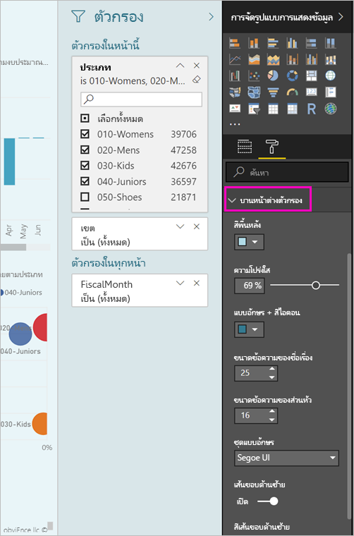
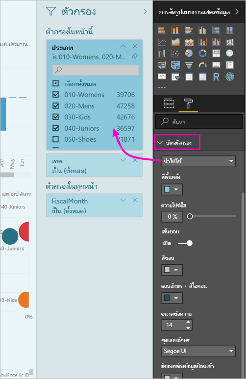

# <a name="the-new-filter-experience-in-power-bi-reports-preview"></a>ใช้งานตัวกรองใหม่ในรายงาน Power BI (ตัวอย่าง)

ตัวกรองใน Power BI มีฟังก์ชันใหม่ ๆ และการออกแบบใหม่ เมื่อคุณเข้าใช้ประสบการณ์การใช้งานตัวกรองใหม่ คุณสามารถจัดรูปแบบบานหน้าต่างตัวกรองมีลักษณะเหมือนส่วนเหลือของรายงาน คุณสามารถล็อก และแม้แต่ซ่อนตัวกรอง เมื่อคุณออกแบบรายงานของคุณ คุณไม่เห็นบานหน้าต่างตัวกรองเก่าทั้งหมดในพื้นที่การแสดงภาพ คุณทำทั้งหมดตัวกรองของคุณแก้ไข และจัดรูปแบบในบานหน้าต่างตัวกรองเดียว 


> [!NOTE]
> ประสบการณ์การใช้งานตัวกรองใหม่อยู่ในตัวอย่าง การติดตั้งใหม่อาจแทนที่การจัดรูปแบบที่คุณได้ตั้งค่าไว้แล้ว

ออกแบบรายงาน นี่คือสิ่งที่คุณสามารถทำได้ในบานหน้าต่างตัวกรองเดียวใหม่:

- เพิ่ม และเอาเขตข้อมูลเพื่อกรองออก 
- เปลี่ยนสถานะตัวกรอง
- จัดรูปแบบ และกำหนดค่าบานหน้าต่างตัวกรองเพื่อให้ได้ความรู้สึกส่วนหนึ่งของรายงานของคุณ
- กำหนดว่าบานหน้าต่างตัวกรองถูกเปิด หรือถูกยุบอยู่ตามค่าเริ่มต้นเมื่อลูกค้าเปิดรายงานขึ้น
- ซ่อนบานหน้าต่างตัวกรองทั้งหมดหรือตัวกรองเฉพาะที่คุณต้องการให้ผู้ใช้รายงานเพื่อดู
- ตัวควบคุมที่คั่นหน้าคู่มองเห็น เปิด และยุบสถานะของบานหน้าต่างตัวกรองใหม่
- ล็อกตัวกรองที่คุณต้องการให้ผู้บริโภคเมื่อต้องแก้ไข

ด้วยประสบการณ์ตัวกรองใหม่ ผู้ใช้รายงานสามารถยังโฮเวอร์เหนือวิชวลเพื่อดูรายการแบบอ่านอย่างเดียวของตัวกรองหรือตัวแบ่งส่วนข้อมูลที่มีผลต่อภาพนั้น


## <a name="turn-on-the-new-filter-experience"></a>ลองใช้งานตัวกรองใหม่ 

คุณเปิดใช้งานการใช้งานใหม่ใน Power BI Desktop จากนั้นคุณสามารถปรับเปลี่ยนตัวกรองหรือในบริการ Power BI (https://app.powerbi.com) เนื่องจากการใช้งานตัวกรองใหม่อยู่ในตัวอย่าง คุณต้องการใช้งานใน Power BI Desktop ถ้าคุณเริ่มต้นด้วยการสร้างรายงานในบริการ Power BI จะไม่มีตัวกรองใหม่

### <a name="turn-on-new-filters-for-all-new-reports"></a>เปิดใช้งานตัวกรองใหม่สำหรับรายงานใหม่ทั้งหมด

1. ใน Power BI Desktop เลือก**แฟ้ม** > **ตัวเลือกและการตั้งค่า** > **ตัวเลือก** > **คุณลักษณะตัวอย่าง** แล้ว เลือกการ**ประสบการณ์การใช้งานตัวกรองใหม่**กล่องกาเครื่องหมาย 
2. รีสตาร์ท Power BI Desktop เพื่อดูการใช้งานตัวกรองใหม่ในรายงานใหม่ทั้งหมด

หลังจากที่คุณรีสตาร์ท Power BI Desktop จะเปิดใช้งานตามค่าเริ่มต้นสำหรับรายงานใหม่ทั้งหมดที่คุณสร้าง  

### <a name="turn-on-new-filters-for-an-existing-report"></a>เปิดใช้งานตัวกรองใหม่สำหรับรายงานที่มีอยู่

นอกจากนี้คุณยังสามารถเปิดใช้งานตัวกรองใหม่สำหรับรายงานที่มีอยู่ได้อีกด้วย

1. ใน Power BI Desktop ในรายงานที่มีอยู่ ให้เลือก**แฟ้ม** > **ตัวเลือกและการตั้งค่า** > **ตัวเลือก**
2. ในแถบนำทางด้านซ้าย ภายใต้**แฟ้มปัจจุบัน**เลือก**ตั้งค่ารายงาน**
3. ภายใต้**ประสบการณ์การใช้งานการกรอง**เลือก**เปิดใช้งานบานหน้าต่างตัวกรองที่อัปเดต และแสดงตัวกรองในส่วนหัวภาพสำหรับรายงานนี้**

## <a name="view-filters-for-a-visual-in-reading-mode"></a>ดูตัวกรองสำหรับภาพในโหมดการอ่าน

ในโหมดการอ่าน ลากเมาส์ไปยังตัวกรองไอคอนสำหรับภาพเพื่อดูเมนูแบบป็อปอัพกับตัวกรองทั้งหมด ตัวแบ่งส่วนข้อมูล และอื่นๆ ที่มีผลต่อภาพนั้น การจัดรูปแบบป็อปอัพจะเหมือนกับการจัดรูปแบบในตัวกรองบานหน้าต่าง 


นี่คือชนิดตัวกรองที่มุมมองนี้แสดง: 
- ตัวกรองพื้นฐาน
- ตัวแบ่งส่วนข้อมูล
- ไฮไลต์เชื่อมโยง 
- กรองข้าม
- ตัวกรองขั้นสูง
- ตัวกรอง Top N
- ตัวกรองวันที่ที่เกี่ยวข้อง
- ตัวแบ่งส่วนข้อมูลซิงค์
- ตัวกรอง รวม/ไม่รวม
- ตัวกรองที่ส่งผ่าน URL

## <a name="build-the-new-filters-pane"></a>สร้างบานหน้าต่างตัวกรองใหม่

หลังจากที่คุณเปิดใช้งานบานหน้าต่างตัวกรองใหม่ คุณเห็นทางด้านขวาของหน้ารายงาน จัดรูปแบบตามค่าเริ่มต้นที่ยึดตามการตั้งค่ารายงานปัจจุบันของคุณ คุณสามารถใช้บานหน้าต่างตัวกรองใหม่เมื่อต้องการกำหนดค่าตัวกรองที่ จะรวม และปรับปรุงตัวกรองที่มีอยู่ในบานหน้าต่างใหม่ บานหน้าต่างตัวกรองใหม่แสดงคุณใดผู้ใช้รายงานของคุณจะเห็นเมื่อคุณเผยแพร่รายงานของคุณ 

1. ตามค่าเริ่มต้น ผู้บริโภครายงานของคุณสามารถดูบานหน้าต่างตัวกรอง ถ้าคุณไม่ต้องการให้เห็น เลือกไอคอนตาถัดจาก**ตัวกรอง**

    

2. เมื่อต้องเริ่มสร้างบานหน้าต่างตัวกรองของคุณใหม่ ลากเขตข้อมูลที่สนใจลงในบานหน้าต่างตัวกรองใหม่เป็นหน้าภาพ หรือตัวกรองระดับรายงาน

เมื่อคุณเพิ่มภาพลงในพื้นที่รายงาน Power BI เพิ่มตัวกรองไปยังบานหน้าต่างตัวกรองสำหรับแต่ละเขตข้อมูลในภาพโดยอัตโนมัติ 

## <a name="lock-or-hide-filters"></a>ล็อกหรือซ่อนตัวกรอง

คุณสามารถล็อกหรือซ่อนตัวกรองของแต่ละการ์ด ถ้าคุณล็อกตัวกรอง ผู้บริโภครายงานของคุณสามารถดู แต่ไม่สามารถเปลี่ยนแปลง หากคุณซ่อน พวกเขาไม่สามารถมองเห็นได้ ซ่อนตัวกรองการ์ดจะมีประโยชน์หากถ้าคุณต้องการซ่อนตัวกรองล้างข้อมูลที่แยกค่า null หรือค่าที่ไม่คาดคิด 

- ในบานหน้าต่างตัวกรองใหม่ เลือก หรือยกเลิกการ**ตัวกรองล็อก**หรือ**ซ่อนตัวกรอง**ไอคอนในบัตรตัวกรอง

   

เมื่อคุณเปิดการตั้งค่าเหล่านี้ และปิดในบานหน้าต่างตัวกรองใหม่ คุณเห็นการเปลี่ยนแปลงมีผลในรายงาน ตัวกรองที่ซ่อนอยู่จะไม่แสดงในตัวกรองป็อปอัพสำหรับภาพ

คุณยังสามารถกำหนดค่าสถานะบานหน้าต่างตัวกรองใหม่เป็นโฟลว์พร้อมกับบุ๊กมาร์กรายงานของคุณ สถานะบานหน้าต่างเปิด ปิด และมองเห็นเป็นบุ๊กมาร์กทั้งหมด
 
## <a name="format-the-new-filters-pane"></a>จัดรูปแบบบานหน้าต่างตัวกรองใหม่

ส่วนใหญ่ของประสบการณ์การใช้งานใหม่นี้จะให้คุณสามารถจัดรูปแบบบานหน้าต่างตัวกรองเพื่อให้ตรงกับลักษณะที่แสดงของรายงานของคุณ คุณสามารถจัดรูปแบบบานหน้าต่างตัวกรองแตกต่างกันสำหรับแต่ละหน้าในรายงาน นี่คือองค์ประกอบที่คุณสามารถจัดรูปแบบได้: 

- สีพื้นหลัง
- ความโปร่งใสของพื้นหลัง
- เส้นขอบ หรือปิด
- สีขอบ
- ชื่อเรื่องและหัวข้ออักษร สี และข้อความขนาด

คุณยังสามารถจัดรูปแบบองค์ประกอบเหล่านี้สำหรับการ์ดตัวกรอง ขึ้นอยู่กับการนำไปใช้ (ตั้งค่าเป็นอย่างอื่น) หรือพร้อมใช้งาน (ลบ): 

- สีพื้นหลัง
- ความโปร่งใสของพื้นหลัง
- เส้นขอบ: เปิดหรือปิด
- สีขอบ
- แบบอักษร์ สี และขนาดข้อความ
- สีของกล่องข้อมูลป้อนเข้า

### <a name="format-the-filters-pane-and-cards"></a>จัดรูปแบบบานหน้าต่างตัวกรองและการ์ด

1. ในรายงาน คลิกรายงานเอง หรือพื้นหลัง (*รูปพื้นหลัง*), จากนั้นในการ**แสดงภาพ**บานหน้าต่าง เลือก**รูปแบบ** 
    คุณเห็นตัวเลือกการจัดรูปแบบหน้ารายงาน รูปพื้น หลัง และยังบานหน้าต่างตัวกรอง และตัวกรองการ์ด

        

1. ขยาย**บานหน้าต่างตัวกรอง**การตั้งค่าสีสำหรับพื้นหลัง ไอคอน และเส้น ขอบด้านซ้าย เพื่อเสริมหน้ารายงาน

    

1. ขยาย**การ์ดตัวกรอง**เพื่อตั้งค่าสีและเส้นขอบเป็น**พร้อมใช้งาน**และ**ใช้งานได้** หากคุณสร้างการ์ดที่พร้อมใช้งาน และใช้สีที่ต่างกัน จะเห็นได้ชัดว่าใช้ตัวกรองใหนสามารภใช้ได้ 
  
    

## <a name="theming-for-filter-pane"></a>ชุดรูปแบบสำหรับบานหน้าต่างตัวกรอง
ตอนนี้คุณสามารถปรับเปลี่ยนการตั้งค่าเริ่มต้นของบานหน้าต่างตัวกรองกับชุดรูปแบบไฟล์ นี่คือส่วนย่อยธีมตัวอย่างเพื่อเริ่มต้นใช้:

 
```
"outspacePane": [{ 

"backgroundColor": {"solid": {"color": "#0000ff"}}, 

"foregroundColor": {"solid": {"color": "#00ff00"}}, 

"transparency": 50, 

"titleSize": 35, 

"headerSize": 8, 

"fontFamily": "Georgia", 

"border": true, 

"borderColor": {"solid": {"color": "#ff0000"}} 

}], 

"filterCard": [ 

{ 

"$id": "Applied", 

"transparency": 0, 

"backgroundColor": {"solid": {"color": "#ff0000"}}, 

"foregroundColor": {"solid": {"color": "#45f442"}}, 

"textSize": 30, 

"fontFamily": "Arial", 

"border": true, 

"borderColor": {"solid": {"color": "#ffffff"}}, 

"inputBoxColor": {"solid": {"color": "#C8C8C8"}} 

}, 

{ 

"$id": "Available", 

"transparency": 40, 

"backgroundColor": {"solid": {"color": "#00ff00"}}, 

"foregroundColor": {"solid": {"color": "#ffffff"}}, 

"textSize": 10, 

"fontFamily": "Times New Roman", 

"border": true, 

"borderColor": {"solid": {"color": "#123456"}}, 

"inputBoxColor": {"solid": {"color": "#777777"}} 

}] 
```

## <a name="sort-the-filter-pane"></a>บานหน้าต่างตัวกรองเรียงลำดับ

ฟังก์ชันการเรียงลำดับแบบกำหนดเองเป็นส่วนหนึ่งของประสบการณ์ใช้งานบานหน้าต่างตัวกรองใหม่ ผู้สร้างรายงานสามารถลาก แล้วปล่อยตัวกรองเพื่อจัดเรียงตามลำดับพวกเขาต้องการ


เรียงลำดับตามตัวอักษรสำหรับตัวกรองได้ เมื่อต้องเริ่มโหมดเรียงลำดับแบบกำหนดเอง เพียงแค่ลากตัวกรองใด ๆ ไปยังตำแหน่งใหม่ คุณสามารถเรียงลำดับตัวกรองภายในระดับจะนำไปใช้กับ - ตัวอย่าง ระ ดับวิชวล ระดับหน้า หรือ ระดับรายงานตัวกรองเท่านั้น

## <a name="filters-pane-scaling"></a>ปรับขนาดบานหน้าต่างตัวกรอง

บานหน้าต่างตัวกรองใหม่ปรับขนาด ด้วยหน้ารายงานและรูปภาพ ดังนั้นหน้ารายงาน และตัวกรองอยู่เสมอบานหน้าต่างในสัดส่วนกัน

## <a name="improved-filters-pane-accessibility"></a>การเข้าถึงบานหน้าต่างตัวกรองปรับปรุง

เราได้ปรับปรุงการนำทางแป้นพิมพ์สำหรับบานหน้าต่างตัวกรองใหม่ คุณสามารถดูทุกส่วนของบานหน้าต่างตัวกรอง และใช้แป้นบริบทบนคีย์บอร์ดของคุณหรือ Shift + F10 เพื่อเปิดเมนูบริบท


## <a name="rename-filters"></a>เปลี่ยนชื่อตัวกรอง
เมื่อคุณกำลังแก้ไขบานหน้าต่างตัวกรอง คุณสามารถดับเบิลคลิกที่ชื่อเรื่องเพื่อทำการแก้ไข เปลี่ยนชื่อจะเป็นประโยชน์ถ้าคุณต้องการอัปเดบัตรตัวกรองเพื่อทำความเข้าใจเพิ่มเติมสำหรับผู้ใช้ของคุณ อย่าลืมเปลี่ยนชื่อการ์ดตัวกรองไม่*ไม่*ชื่อที่ใช้แสดงของเขตข้อมูลในรายการเขตข้อมูล เพียงแค่เปลี่ยนแปลงชื่อแสดงที่ใช้ในบัตรตัวกรอง


## <a name="restrict-changes-to-filter-type"></a>จำกัดการเปลี่ยนแปลงชนิดตัวกรอง

ภายใต้ตัวกรองพบส่วนของการตั้งค่ารายงานที่คุณมีตัวเลือกเพื่อควบคุมว่าผู้ใช้สามารถเปลี่ยนชนิดตัวกรอง


## <a name="next-steps"></a>ขั้นตอนถัดไป

ลองใช้งานตัวกรองใหม่ ส่งคำติชมของคุณสำหรับคุณลักษณะนี้ และวิธีเราสามารถปรับปรุง บนการ[ไซต์ Power BI คิด](https://ideas.powerbi.com/forums/265200-power-bi) 

- [วิธีการใช้ตัวกรองรายงาน](consumer/end-user-report-filter.md)
- [ตัวกรองและการทำไฮไลท์ในรายงาน](power-bi-reports-filters-and-highlighting.md)

มีคำถามเพิ่มเติมหรือไม่? [ลองไปที่ชุมชน Power BI](http://community.powerbi.com/)

