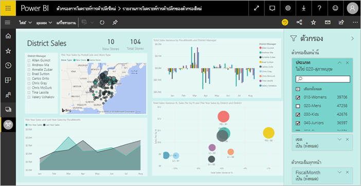
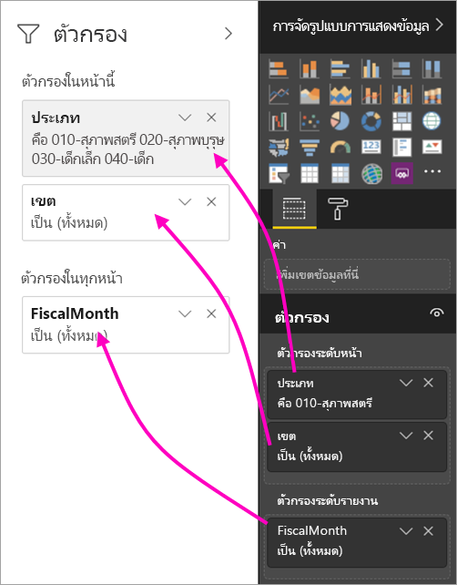
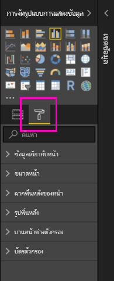
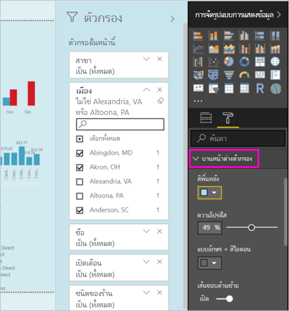
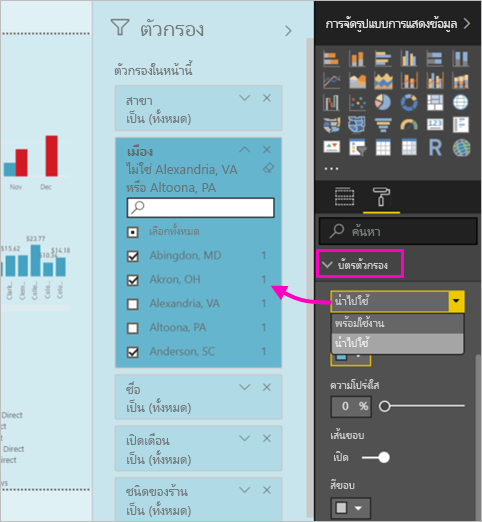
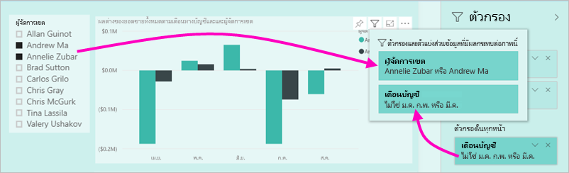

# ใช้งานตัวกรองใหม่ในรายงาน Power BI (ตัวอย่าง)

บทความนี้กล่าวถึงว่าประสบการณ์การใช้งานตัวกรองใหม่: ตัวกรองใน Power BI ได้รับการออกแบบใหม่และมีฟังก์ชันการทำงานใหม่ เมื่อคุณออกแบบรายงาน ใน Power BI Desktop หรือ ในบริการ Power BI คุณสามารถทำให้บานหน้าต่างตัวกรองมีลักษณะ และดำเนินการกับรายงานทั้งหมด ในการใช้งานใหม่ บานหน้าต่างตัวกรองเก่าทำหน้าที่เป็นบานหน้าต่างตัวกรองสำหรับแก้ไข และบานหน้าต่างตัวกรองใหม่ เป็นเพียงสิ่งที่ลูกค้ารายงานของคุณดู 
 

ในฐานะผู้ออกแบบรายงาน นี่คือสิ่งที่คุณสามารถทำได้ ด้วยตัวกรองใหม่:

- แสดงมุมมองแบบอ่านอย่างเดียวของตัวกรองในส่วนหัวภาพ เพื่อให้ลูกค้าทราบแน่นอนว่าตัวกรองหรือตัวแบ่งส่วนข้อมูลจะมีผลต่อภาพที่กำหนด
- จัดรูปแบบ และกำหนดค่าบานหน้าต่างตัวกรองเพื่อให้เป็นส่วนหนึ่งของรายงานของคุณ
- กำหนดว่าบานหน้าต่างตัวกรองถูกเปิด หรือถูกยุบอยู่ตามค่าเริ่มต้นเมื่อลูกค้าเปิดรายงานขึ้น
- ซ่อนบานบานหน้าต่างตัวกรองทั้งหมดหรือตัวกรองเฉพาะที่คุณต้องการให้ผู้ใช้รายงานเพื่อดู
- ตัวควบคุมที่คั่นหน้าคู่มองเห็น เปิด และยุบสถานะของบานบานหน้าต่างตัวกรองใหม่
- ล็อกตัวกรองที่คุณต้องการให้ผู้บริโภคเมื่อต้องแก้ไข

## ลองใช้งานตัวกรองใหม่ 

คุณเปิดใช้งานการใช้งานใหม่ใน Power BI Desktop จากนั้นคุณสามารถปรับเปลี่ยนตัวกรองหรือในบริการ Power BI (https://app.powerbi.com) เนื่องจากการใช้งานตัวกรองใหม่อยู่ในตัวอย่าง คุณต้องการใช้งานใน Power BI Desktop ถ้าคุณเริ่มต้นด้วยการสร้างรายงานในบริการ Power BI จะไม่มีตัวกรองใหม่

### เปิดใช้งานตัวกรองใหม่สำหรับรายงานใหม่ทั้งหมด

1. ใน Power BI Desktop เลือก**แฟ้ม** > **ตัวเลือกและการตั้งค่า** > **ตัวเลือก** > **คุณลักษณะตัวอย่าง** แล้ว เลือกการ**ประสบการณ์การใช้งานตัวกรองใหม่**กล่องกาเครื่องหมาย 
2. รีสตาร์ท Power BI Desktop เพื่อดูการใช้งานตัวกรองใหม่ในรายงานใหม่ทั้งหมด

หลังจากที่คุณรีสตาร์ท Power BI Desktop จะเปิดใช้งานตามค่าเริ่มต้นสำหรับรายงานใหม่ทั้งหมดที่คุณสร้าง  

### เปิดใช้งานตัวกรองใหม่สำหรับรายงานที่มีอยู่

นอกจากนี้คุณยังสามารถเปิดใช้งานตัวกรองใหม่สำหรับรายงานที่มีอยู่ได้อีกด้วย

1. ใน Power BI Desktop ในรายงานที่มีอยู่ ให้เลือก**แฟ้ม** > **ตัวเลือกและการตั้งค่า** > **ตัวเลือก**
2. ด้านล่าง**รายงานการตั้งค่า**เลือก**เปิดใช้งานบานบานหน้าต่างตัวกรองที่อัปเดต และแสดงตัวกรองในส่วนหัวภาพสำหรับรายงานนี้**

## สร้างบานหน้าต่างตัวกรองใหม่

หลังจากที่คุณเปิดใช้งานบานหน้าต่างตัวกรองใหม่ คุณจะเห็นบานหน้าต่างทางด้านขวาของหน้ารายงาน จัดรูปแบบตามค่าเริ่มต้นที่ยึดตามการตั้งค่ารายงานปัจจุบันของคุณ บานหน้าต่างตัวกรองเก่าตอนนี้ทำหน้าที่เป็นตัวกรองที่บานหน้าต่างการแก้ไข บานหน้าต่างตัวกรองใหม่แสดงให้คุณเห็นผู้ใช้รายงานของคุณเมื่อคุณเผยแพร่รายงานของคุณ คุณสามารถอัปเดตตัวกรองที่มีอยู่ในบานหน้าต่างใหม่ แต่คุณใช้บานหน้าต่างตัวกรองที่เก่ากว่าเพื่อกำหนดค่าตัวกรองที่จะรวม

1. ก่อนอื่น ตัดสินใจว่า คุณต้องการให้ผู้ใช้รายงานของคุณเพื่อดูบานหน้าต่างตัวกรอง หากคุณต้องการดู ให้เลือกไอคอนรูปตา  ถัดจากตัวกรอง

2. เมื่อต้องเริ่มสร้างบานหน้าต่างตัวกรองของคุณใหม่ ลากเขตข้อมูลที่สนใจไปยังบานหน้าต่างการแก้ไข เช่น ภาพ หน้า หรือตัวกรองระดับรายงาน คุณจะเห็นส่วนเหล่านั้นในบานหน้าต่างตัวกรองใหม่

    

เมื่อคุณเพิ่มภาพลงในพื้นที่รายงาน Power BI เพิ่มตัวกรองสำหรับแต่ละเขตข้อมูลในภาพโดยอัตโนมัติ Power BI ไม่เพิ่มตัวกรองเหล่านั้นโดยอัตโนมัติไปยังบานหน้าต่างตัวกรองแบบอ่านอย่างเดียว คุณจำเป็นต้องเลือกไอคอนรูปตาเพื่อเพิ่มโดยชัดเจน

 
## ล็อกหรือซ่อนตัวกรอง

คุณสามารถล็อกหรือซ่อนตัวกรองของแต่ละการ์ด ถ้าคุณล็อกตัวกรอง ผู้บริโภครายงานของคุณสามารถดู แต่ไม่สามารถเปลี่ยนแปลง หากคุณซ่อน พวกเขาไม่สามารถมองเห็นได้ ซ่อนตัวกรองการ์ดจะมีประโยชน์หากถ้าคุณต้องการซ่อนตัวกรองล้างข้อมูลที่แยกค่า null หรือค่าที่ไม่คาดคิด 

- ในตัวกรองที่บานหน้าต่างการแก้ไข เลือก หรือยกเลิกการ**ตัวกรองล็อก**หรือ**ซ่อนตัวกรอง**ไอคอนในการ์ดตัวกรอง

   

เมื่อคุณเปิดและปิดการตั้งค่าเหล่านี้ในบานหน้าต่างการแก้ไขตัวกรอง คุณจะเห็นการเปลี่ยนแปลงมีผลในบานหน้าต่างตัวกรองใหม่ ตัวกรองที่ซ่อนอยู่จะไม่แสดงในตัวกรองป็อปอัพสำหรับภาพ

คุณยังสามารถกำหนดค่าสถานะบานหน้าต่างตัวกรองของคุณไปยังโฟลว์พร้อมกับบุ๊กมาร์กรายงานของคุณ สถานะบานหน้าต่างเปิด ปิด และมองเห็นเป็นบุ๊กมาร์กทั้งหมด
 
## จัดรูปแบบบานหน้าต่างตัวกรองใหม่

ส่วนที่สำคัญของการใช้งานใหม่นี้คือ ตอนนี้คุณสามารถจัดรูปบานหน้าต่างตัวกรองเพื่อให้ตรงกับลักษณะที่แสดงของรายงานของคุณ คุณสามารถจัดรูปแบบบานหน้าต่างตัวกรองที่แตกต่างกันสำหรับแต่ละหน้าในรายงาน นี่คือองค์ประกอบที่คุณสามารถจัดรูปแบบได้: 

- สีพื้นหลัง
- ความโปร่งใสของพื้นหลัง
- ปิดหรือเปิดเส้นขอบของบานหน้าต่างตัวกรอง
- สีเส้นขอบของบานหน้าต่างตัวกรอง

คุณยังสามารถจัดรูปแบบองค์ประกอบเหล่านี้สำหรับการ์ดตัวกรอง ขึ้นอยู่กับการนำไปใช้ (ตั้งค่าเป็นอย่างอื่น) หรือพร้อมใช้งาน (ลบ): 

- สีพื้นหลัง
- ความโปร่งใสของพื้นหลัง
- เส้นขอบ: เปิดหรือปิด
- สีขอบ

### ตั้งค่ารูปแบบสำหรับบานหน้าต่างตัวกรองและการ์ด

1. ในรายงาน คลิกรายงานเอง หรือพื้นหลัง (*รูปพื้นหลัง*), จากนั้นในการ**แสดงภาพ**บานหน้าต่าง เลือก**รูปแบบ** 
    คุณจะเห็นตัวเลือกการจัดรูปแบบหน้ารายงาน รูปพื้น หลัง และยังบานหน้าต่างตัวกรอง และตัวกรองการ์ด

        

1. ขยาย**บานหน้าต่างตัวกรอง**การตั้งค่าสีสำหรับพื้นหลัง ไอคอน และเส้น ขอบด้านซ้าย เพื่อเสริมหน้ารายงาน

    

1. ขยาย**การ์ดตัวกรอง**เพื่อตั้งค่าสีและเส้นขอบเป็น**พร้อมใช้งาน**และ**ใช้งานได้** หากคุณสร้างการ์ดที่พร้อมใช้งาน และใช้สีที่ต่างกัน จะเห็นได้ชัดว่าใช้ตัวกรองใหนสามารภใช้ได้ 
  
    

## ดูตัวกรองสำหรับภาพในโหมดการอ่าน

ในโหมดการอ่าน คุณสามารถลากเมาศ์ไปยังภาพ และดูเมนูแบบป็อปอัพกับตัวกรองทั้วหมด ตัวแบ่งส่วนข้อมูล และอื่นๆ ที่มีผลต่อภาพนั้น การจัดรูปแบบป็อปอัพจะเหมือนกับการจัดรูปแบบในตัวกรองบานหน้าต่าง 

นี่คือชนิดตัวกรองที่มุมมองนี้แสดง: 
- ตัวกรองพื้นฐาน
- ตัวแบ่งส่วนข้อมูล
- ไฮไลต์เชื่อมโยง 
- กรองข้าม
- ตัวกรองขั้นสูง
- ตัวกรอง Top N
- ตัวกรองวันที่ที่เกี่ยวข้อง
- ตัวแบ่งส่วนข้อมูลซิงค์
- ตัวกรอง รวม/ไม่รวม
- ตัวกรองที่ส่งผ่าน URL

## จะมาเร็ว ๆ นี้

ในเดือนต่อๆ ไปเราวางแผนที่จะรวมการปรับปรุงต่อไปนี้:
- ความสามารถในการเปลี่ยนลำดับของการ์ดตัวกรอง
- การใช้งานบานหน้าต่างตัวกรองเดียวสำหรับผู้สร้างรายงาน 
- ดูตัวเลือกการจัดรูปแบบ

ลองใช้งานตัวกรองใหม่ ส่งคำติชมของคุณสำหรับคุณลักษณะนี้และวิธีที่เราสามารถปรับปรุงการใช้งาน 

## ขั้นตอนถัดไป
[วิธีการใช้ตัวกรองรายงาน](consumer/end-user-report-filter.md)

[ตัวกรองและการทำไฮไลท์ในรายงาน](power-bi-reports-filters-and-highlighting.md)

[โต้ตอบกับตัวกรองและการเน้นในรายงานมุมมองการอ่าน](consumer/end-user-reading-view.md)

[เปลี่ยนวิธีภาพรายงาน กรองแบบไขว้ และข้ามเน้นแต่ละคน](consumer/end-user-interactions.md)

มีคำถามเพิ่มเติมหรือไม่ [ลองไปที่ชุมชน Power BI](http://community.powerbi.com/)

