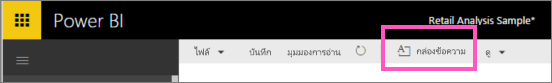
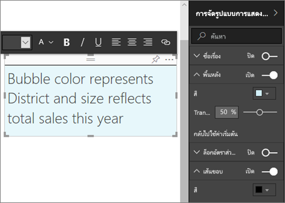

# กล่องข้อความและรูปร่างในรายงาน Power BI
คุณสามารถเพิ่มกล่องข้อความและรูปร่างในรายงาน โดยใช้บริการ Power BI และ Power BI Desktop ในทั้งสองกรณี คุณต้องแก้ไขสิทธิ์สำหรับรายงาน ถ้ามีการแชร์รายงานกับคุณในบริการ Power BI คุณจะไม่มีสิทธิ์การแก้ไข 

ตรวจสอบจะใช้ Power BI Desktop เพื่อ[เพิ่มรูปภาพแบบคงที่ไปยังรายงาน](guided-learning/visualizations.yml?tutorial-step=11)แล้ว ทำตามขั้นตอนด้านล่างเพื่อลองด้วยตนเอง โดยใช้บริการ Power BI แทน
> 
> <iframe width="560" height="315" src="https://www.youtube.com/embed/_3q6VEBhGew" frameborder="0" allowfullscreen></iframe>
> 

## เพิ่มกล่องข้อความไปยังรายงาน
1. เปิดรายงานในมุมมองการแก้ไข

2. วางเคอร์เซอร์ของคุณในพื้นที่ว่างบนพื้นที่รายงาน และเลือก**กล่องข้อความ**จากเมนูด้านบน
   
   
3. พิมพ์ข้อความของคุณลงในกล่องข้อความ และ นอก ตั้งค่ารูปแบบฟอนต์ สี ข้อความ และจัดแนว 
   
   
4. การจัดตำแหน่งกล่องข้อความ ให้เลือกพื้นที่สีเทาที่ด้านบนแล้วลาก เมื่อต้องการปรับขนาดกล่องข้อความ เลือก แล้วลากจุดจับเค้าร่าง 
   
   

5. กล่องข้อความที่เลือก เพิ่มการจัดรูปแบบเพิ่มเติมในการ**แสดงภาพ**บานหน้าต่าง ในตัวอย่างนี้ เราได้จัดรูปแบบพื้นหลังและเส้นขอบ คุณยังสามารถสร้างเป็นขนาดที่แน่นอนและตำแหน่งของกล่องข้อความ  

   

6. เพื่อปิดกล่องข้อความ เลือกพื้นที่ว่างบนพื้นที่รายงาน 

7. เลือกไอคอนหมุด   การปักหมุดกล่องข้อความไปยังแดชบอร์ด 

## เพิ่มรูปร่างไปยังรายงาน
1. วางเคอร์เซอร์ของคุณที่ใดก็ได้บนพื้นที่รายงาน แล้วเลือก**รูปร่าง**
   
   
2. จากดร๊อปดาวน์ เลือกรูปร่างเพื่อเพิ่มในพื้นที่รายงานของคุณ ตัวอย่างนี้ เพิ่มลูกศรเพื่อดึงดูดความสนใจไปแผนภูมิฟอง มีผลต่างยอดขายทั้งหมดที่สูงสุด 
   
   ในบานหน้าต่าง**จัดรูปแบบรูปร่าง** ให้ปรับแต่งรูปร่างของคุณ ในตัวอย่างนี้ เราได้สร้างเป็นลูกศรสีแดงมีขอบสีแดงเข้ม ถูกหมุน 90 องศา
   
   
3. เพื่อจัดตำแหน่งรูปร่าง ให้เลือกพื้นที่สีเทาที่ด้านบนและลาก เมื่อต้องการปรับขนาดรูปร่าง เลือก แล้วลากจุดจับเค้าร่าง เหมือนในหนังสือ คุณยังสามารถสร้างเป็นขนาดที่แน่นอนและตำแหน่งของกล่องข้อความ

   > [!NOTE]
   > รูปร่างที่ไม่สามารถปักหมุดที่ยังแดชบอร์ดได้ ยกเว้นเป็นหนึ่งภาพเมื่อคุณ[ปักหมุดหน้าสด](service-dashboard-pin-live-tile-from-report.md) 
   > 
   > 

## ขั้นตอนถัดไป
[เพิ่มไฮเปอร์ลิงก์ให้กล่องข้อความ](service-add-hyperlink-to-text-box.md)

[แนวคิดพื้นฐานสำหรับผู้บริโภคบริการ Power BI](consumer/end-user-basic-concepts.md)

มีคำถามเพิ่มเติมหรือไม่? [ลองไปที่ชุมชน Power BI](http://community.powerbi.com/)
