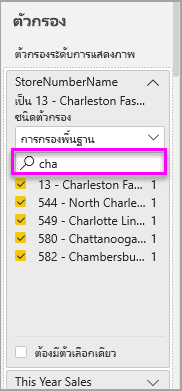

# เกี่ยวกับตัวกรองและการไฮไลท์ในรายงาน Power BI
 บทความนี้ทำการแนะนำการใช้ตัวกรองและการไฮไลท์ใน Power BI service ประสบการณ์การใช้งานนั้นแทบจะเหมือนกับใน Power BI Desktop ***ตัวกรอง***ให้ลบออกทั้งหมดยกเว้นข้อมูลที่คุณต้องการวิเคราะห์ ***การไฮไลต์*** ไม่ใช่การกรอง โดยจะไม่ลบข้อมูลออก แต่จะไฮไลต์เซตย่อยของข้อมูลที่สามารถมองเห็นได้แทน ซึ่งข้อมูลที่ไม่ได้ไฮไลต์ยังคงสามารถจะมองเห็นได้แต่จะเป็นสีจาง

มีหลายวิธีคุณสามารถกรอง และไฮไลท์รายงานใน Power BI การอัดข้อมูลทั้งหมดในบทความเดียวจะสร้างความสับสน ดังนั้นจึงได้แบ่งส่วนออกมาดังนี้:

* แนะนำตัวกรองและไฮไลท์(บทความที่คุณกำลังอ่านในขณะนี้)
* วิธีที่คุณสามารถ [สร้างและใช้ตัวกรองในมุมมองการแก้ไข](power-bi-report-add-filter.md) ในรายงาน เมื่อคุณมีสิทธิ์การแก้ไขสำหรับรายงาน คุณสามารถสร้าง, แก้ไข และลบตัวกรองในรายงานได้
* วิธีที่คุณจะสามารถ [กรองและไฮไลต์ในรายงานที่แชร์ร่วมกับคุณ](consumer/end-user-reading-view.md) ในมุมมองการอ่านรายงาน สิ่งที่คุณสามารถดำเนินการได้มีข้อจำกัดมาก อย่างไรก็ตามคุณยังคงมีตัวเลือกการกรองและการไฮไลต์อีกมากมาย  
* การแนะนำโดยละเอียดของ [ตัวควบคุมการกรองและการไฮไลต์ที่พร้อมใช้งานในมุมมองการแก้ไข](consumer/end-user-report-filter.md) รวมถึงลักษณะเชิงลึกของชนิดตัวกรอง (เช่น วันที่และเวลา, ตัวเลข, ข้อความ)
* หลังจากที่ได้เรียนรู้วิธีการทำงานของตัวกรองและไฮไลท์ตามค่าเริ่มต้นแล้ว ลองเรียนรู้การ [เปลี่ยนวิธีที่การจัดรูปแบบการแสดงข้อมูลบนตัวกรองหน้าและไฮไลต์ซึ่งกันและกัน](consumer/end-user-interactions.md)

## บทแนะนำบานหน้าต่างตัวกรอง

คุณสามารถใช้ตัวกรองในบานหน้าต่าง **ตัวกรอง** หรือโดย [สร้างการเลือกในตัวแบ่งส่วนข้อมูล](visuals/power-bi-visualization-slicers.md) โดยตรงบนรายงาน บานหน้าต่างตัวกรองแสดงตารางและเขตข้อมูลที่ใช้ในรายงานและตัวกรองที่มีการใช้ ถ้ามี 

ตัวกรองสี่ประเภท

- **ตัวกรองหน้า**ใช้กับภาพทั้งหมดบนหน้ารายงาน     
- **ตัวกรองภาพ** ใช้กับภาพเดียวบนหน้ารายงาน หากคุณเลือกภาพบนพื้นที่รายงาน คุณจะเห็นตัวกรองระดับภาพเท่านั้น    
- **ตัวกรองรายงาน**นำไปใช้กับทุกหน้าในรายงาน    
- **ตัวกรอง drillthrough**นำไปใช้กับเอนทิตีแบบเดียวในรายงาน    

คุณสามารถค้นหาในตัวกรองหน้า, ตัวกรองภาพ และตัวกรองรายงานในมุมมองการอ่านหรือมุมมองการแก้ไข เพื่อค้นหาและเลือกค่าที่คุณต้องการ 

หากตัวกรองมีคำว่า **ทั้งหมด** ด้านข้าง หมายความว่า ค่าทั้งหมดในเขตข้อมูลจะรวมอยู่ในตัวกรอง  ตัวอย่างเช่น **สาขา (ทั้งหมด)** ในสกรีนช็อตด้านล่าง หมายถึงหน้ารายงานนี้มีข้อมูลเกี่ยวกับสาขาร้านค้าทั้งหมด  ในทางกลับกัน ตัวกรองระดับรายงาน **FiscalYear เป็น 2013 หรือ 2014** แสดงถึงรายงานที่มีข้อมูลสำหรับปีงบประมาณ 2013 และ 2014 เท่านั้น

## ตัวกรองในมุมมองการอ่านหรือมุมมองการแก้ไข
มีการโต้ตอบกับรายงานสองโหมด คือ [มุมมองการอ่าน](consumer/end-user-reading-view.md) และมุมมองการแก้ไข ความสามารถในการกรองที่พร้อมใช้งานสำหรับคุณจะขึ้นอยู่กับโหมดที่เลือก

* ในมุมมองการแก้ไข คุณสามารถเพิ่มตัวกรองรายงาน, ตัวกรองหน้า, ตัวกรอง Drillthrough และตัวกรองภาพ เมื่อคุณบันทึกรายงาน ตัวกรองจะถูกบันทึกไปกับรายงานด้วย แม้ว่าคุณจะเปิดในแอปสำหรับอุปกรณ์เคลื่อนที่ก็ตาม บุคคลที่กำลังดูรายงานในมุมมองการอ่านสามารถโต้ตอบกับตัวกรองที่คุณเพิ่มได้ แต่ไม่สามารถเพิ่มตัวกรองใหม่ได้
* ในมุมมองการอ่าน คุณสามารถโต้ตอบกับตัวกรองใด ๆ ที่มีอยู่แล้วในรายงาน และบันทึกการเลือกของคุณ คุณไม่สามารถเพิ่มตัวกรองใหม่ได้

### ตัวกรองในมุมมองการอ่าน
หากคุณเข้าถึงรายงานในมุมมองการอ่านเท่านั้น บานหน้าต่างตัวกรองจะมีลักษณะดังนี้:

หน้านี้ของรายงานมีตัวกรองระดับหน้า 6 ตัว และตัวกรองระดับรายงาน 1 ตัว

แต่ละภาพสามารถมีตัวกรองสำหรับทุกเขตข้อมูลในภาพดังกล่าวได้ และผู้เขียนรายงานอาจเพิ่มตัวกรองอื่น ๆ อีก ในรูปภาพด้านล่าง แผนภูมิฟองมีตัวกรองหกตัว

ในมุมมองการอ่าน สำรวจข้อมูลโดยการปรับเปลี่ยนตัวกรองที่มีอยู่ เปลี่ยนแปลงที่คุณเซฟในรายงาน แม้ว่าคุณดูรายงานในแอปสำหรับอุปกรณ์เคลื่อนที่ เรียนรู้วิธีเมื่อคุณ [สำรวจบานหน้าต่างตัวกรองรายงาน](consumer/end-user-report-filter.md)

เมื่อคุณออกจากรายงาน ตัวกรองของคุณจะถูกบันทึก หากต้องการยกเลิกการกรองของคุณและกลับไปยังการกรอง, การแบ่งส่วนข้อมูล, การดูรายละเอียด และชุดการเรียงลำดับ ตามค่าเริ่มต้นของผู้เขียนรายงาน ให้เลือก **รีเซ็ตเป็นค่าเริ่มต้น** จากแถบเมนูด้านบน

### ตัวกรองในมุมมองการแก้ไข
เมื่อคุณมีสิทธิ์ระดับเจ้าของสำหรับรายงาน และเปิดในมุมมองการแก้ไข คุณจะเห็นว่า **ตัวกรอง** เป็นเพียงหนึ่งในบานหน้าต่างตัวแก้ไข

ในมุมมองการอ่าน จะเห็นหน้านี้ของรายงานมีตัวกรองระดับหน้า 6 ตัว และตัวกรองระดับรายงาน 1 ตัว และโดยการเลือกแผนภูมิฟอง เราจะเห็นว่ามีตัวกรองระดับภาพ 6 ตัวถูกใช้อยู่

เราสามารถจัดการตัวกรองและการไฮไลต์ในมุมมองการแก้ไขได้มากขึ้น โดยส่วนใหญ่เราสามารถเพิ่มตัวกรองใหม่ได้ เรียนรู้วิธีการ [เพิ่มตัวกรองไปยังรายงาน](power-bi-report-add-filter.md) และอีกมากมาย

## การไฮไลต์เฉพาะกิจ
เลือกเขตข้อมูลบนพื้นที่รายงานเพื่อไฮไลต์ภาพอื่น ๆ บนหน้า เลือกพื้นที่ว่างในภาพเดียวกันเมื่อต้องลบออก การไฮไลต์ชนิดนี้คือวิธีการที่สนุกในการสำรวจผลกระทบของข้อมูลอย่างรวดเร็ว หากต้องการปรับแต่งวิธีการทำงานของการไฮไลต์เชื่อมโยง สามารถดูได้ที่ [การโต้ตอบของภาพ](consumer/end-user-interactions.md)

## ขั้นตอนถัดไป
[เพิ่มตัวกรองไปยังรายงาน (ในมุมมองการแก้ไข)](power-bi-report-add-filter.md)

[ชมการแนะนำของตัวกรองรายงาน](consumer/end-user-report-filter.md)

[เปลี่ยนวิธีที่่ภาพรายงานกรองแบบไขว้ และข้ามไฮไลท์ของแต่ละตัว](consumer/end-user-interactions.md)

มีคำถามเพิ่มเติมหรือไม่ [ลองไปที่ชุมชน Power BI](http://community.powerbi.com/)

