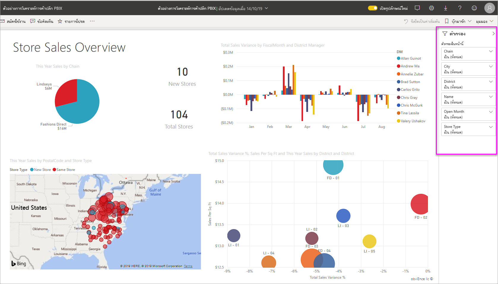
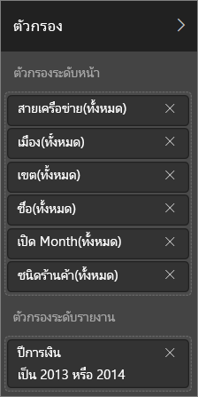
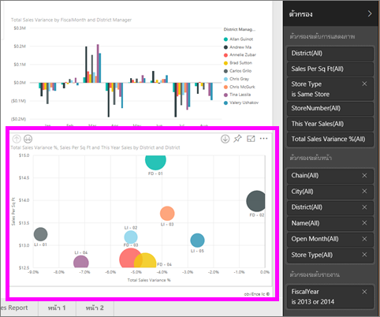
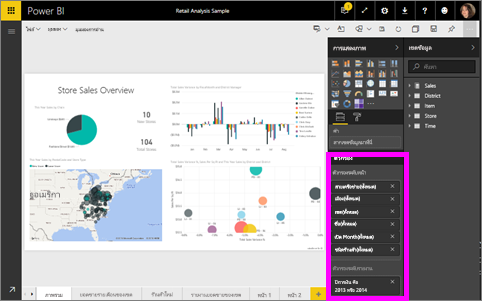

# เกี่ยวกับตัวกรองและการไฮไลท์ในรายงาน Power BI
***ตัวกรอง***ให้ลบออกทั้งหมดยกเว้นข้อมูลที่คุณต้องการวิเคราะห์  ***การไฮไลท์***จะไม่กรอง เนื่องจากจะไม่ลบข้อมูลออกแตจะไฮไลท์เซตย่อยของข้อมูลที่สามารถมองเห็นได้แทน ข้อมูลที่ไม่ไฮไลท์ยังคงเป็นสีจาง แต่สามารถจะมองเห็นได้

มีหลายวิธีคุณสามารถกรอง และไฮไลท์รายงานใน Power BI ถ้ายัดเยียดข้อมูลทั้งหมดในบทความหนึ่งยทความ จะสร้างความสับสนอย่างมาก ดังนั้นเราจึงได้แบ่งได้ดังนี้

* แนะนำตัวกรองและไฮไลท์(บทความที่คุณกำลังอ่านในขณะนี้)
* วิธีคุณสามารถ[สร้างและใช้ตัวกรองและการไฮไลท์ในมุมมอง/รายงานของคุณทีกำลังถูกแก้ไข](power-bi-report-add-filter.md) เมื่อคุณมีการแก้ไขสิทธิ์สำหรับรายงาน คุณสามารถสร้าง แก้ไข และลบตัวกรองและไฮไลท์ในรายงาน
* วิธีที่คุณจะสามารถ[ใช้ตัวกรองและไฮไลท์ในรายงานที่ใช้ร่วมกันกับคุณ หรือในมุมมองการอ่านรายงาน](service-reading-view-and-editing-view.md) สิ่งที่คุณสามารถทำงานมีความจำกัดมาก แต่ Power BI ยังช่วยให้คุณกรองและการไฮไลท์ตัวเลือกหลากหลาย  
* [การแนะนำโดยละเอียดของตัวกรองและตัวควบคุมการไฮไลท์ที่พร้อมใช้งานในมุมมองการแก้ไข ](power-bi-how-to-report-filter.md)รวมถึงลักษณะการเชิงลึกที่ชนิดของตัวกรอง (เช่น วันที่และเวลา ตัวเลข ข้อความ) และความแตกต่างระหว่างตัวเลือกขั้นสูงและขั้นพื้นฐาน
* หลังจากที่คุณได้เรียนรู้วิธีการทำงานตามการตั้งค่าเริ่มต้นของตัวกลองและไฮไลท์ [เรียนรู้วิธีเปลี่ยนวิธีการแสดงภาพบนหน้าตัวกรองและไฮไลท์ซึ่งกันและกัน](service-reports-visual-interactions.md)

> [!TIP]
> Power BI ทราบความสัมพันธ์ของข้อมูลได้อย่างไร  ใช้ความสัมพันธ์ระหว่างตารางหลายตารางและเขตข้อมูลใน[แบบจำลองข้อมูล](https://support.office.com/article/Create-a-Data-Model-in-Excel-87e7a54c-87dc-488e-9410-5c75dbcb0f7b?ui=en-US&rs=en-US&ad=US)ต้นแบบ เพื่อทำให้รายการบนหน้ารายงานโต้ตอบซึ่งกันและกัน
> 
> 

## แนะนำตัวกรองและไฮไลท์ในรายงานโดยใช้บานหน้าต่างตัวกรอง
 บทความนี้ทำการแนะนำการใช้ตัวกรองและการไฮไลท์ใน Power BI service  แต่ประสบการณ์การใช้งานนั้นเกือบจะเป็นอย่างเดียวกับใน Power BI Desktop  

ตัวกรองและการไฮไลท์สามารถนำไปใช้โดยใช้บานหน้าต่าง**ตัวกรอง**หรือ โดยการเลือกโดยตรงบนรายงาน(แบบโดยเฉพาะ ให้ดูด้านล่างของหน้า) บานหน้าต่างตัวกรองแสดงตารางและเขตข้อมูลที่ใช้ในรายงานและตัวกรองที่มีการใช้ ถ้ามี ตัวกรอง่จะแบ่งเป็น**ระดับหน้า** **ระดับรายงาน** **Drillthrough**และ**ระดับภาพ**  ถ้าคุณเลือกภาพบนพื้นที่รายงาน คุณจะเห็นตัวกรองระดับการมองเห็นเท่านั้น

> [!TIP]
> ถ้าตัวกรองมีคำว่า**ทั้งหมด**อยู่ถัดมัน นั่นหมายความว่าเขตข้อมูลทั้งหมดจะถูกรวมอยู่เป็นตัวกรอง  ตัวอย่างเช่น**Chain(All)** ในสกรีนช็อตด้านล่างบอกเราว่า หน้ารายงานนี้มีข้อมูลเกี่ยวกับห่วงโซ่ของร้านทั้งหมด  ในทางกลับกัน ตัวกรองระดับรายงาน**FiscalYear เป็น 2013 หรือ 2014**บอกเราว่า รายงานมีข้อมูลสำหรับปีงบประมาณ 2013 และ 2014 เท่านั้น
> 
> 

## ตัวกรองในมุมมองการอ่านและมุมมองการแก้ไข
มีการโต้ตอบกับรายงานสองโหมด [มุมมองการอ่านและมุมมองการแ](service-reading-view-and-editing-view.md)ก้ไข  และความสามารถที่กรองที่คุณใช้งานขึ้นอยู่ในโหมดที่คุณใช้อยู่

* ในมุมมองการแก้ไข คุณสามารถเพิ่มรายงาน หน้า drillthrough และตัวกรองแบบเป็นภาพ เมื่อคุณบันทึกรายงาน ตัวกรองจะถูกบันทึกกับรายงาน แม้ว่าคุณเปิดในแอปสำหรับอุปกรณ์เคลื่อนที่ บุคคลที่กำลังดูที่รายงานในมุมมองการอ่านสามารถโต้ตอบกับตัวกรองที่คุณได้เพิ่ม แต่คุณไม่สามารถเพิ่มตัวกรองใหม่
* ในมุมมองการอ่าน คุณสามารถโต้ตอบกับตัวกรองใดๆ ที่มีอยู่แล้วในรายงาน และบันทึกการคัดเลือกที่คุณทำ  แต่คุณไม่สามารถเพิ่มตัวกรองใหม่

### บานหน้าต่างตัวกรองในมุมมองการอ่าน
ถ้าคุณเข้าถึงรายงานในมุมมองการอ่านเท่านั้น บานหน้าต่างตัวกรองมีลักษณะดังนี้

ดังนั้นหน้านี้ของรายงานมีตัวกรองระดับหน้า 6 ตัวและตัวกรองระดับรายงาน 1 ตัว

เพื่อดู ถ้ามีตัวกรองภาพระดับใดๆอยู่ เลือกภาพ ในรูปด้านล่าง แผนภูมิรูปฟองใช้ตัวกรอง 6 ตัว

ในมุมมองการอ่าน สำรวจข้อมูลด้วยการปรับเปลี่ยนตัวกรองที่มีอยู่ เปลี่ยนแปลงที่คุณเซฟในรายงาน แม้ว่าคุณดูรายงานในแอปสำหรับอุปกรณ์เคลื่อนที่ กลับไปยัง[มุมมองการอ่านและมุมมองแก้ไขใน Power BI service](service-reading-view-and-editing-view.md)

### บานหน้าต่างตัวกรองในมุมมองการแก้ไข
เมื่อคุณมีสิทธิ์ระดับเจ้าของสำหรับรายงาน และเปิดในมุมมองการแก้ไข คุณจะเห็นว่า**ตัวกรอง**เป็นเพียงหนึ่งในบานหน้าต่างตัวแก้ไขที่มีหลายตัว

เช่นเดียวกับมุมมองการอ่าน (ด้านบน) เราเห็นว่า หน้าของรายงานนี้มีตัวกรองระดับหน้า 6 ตัวและตัวกรองระดับรายงาน 1 ตัว และ โดยการเลือกแผนภูมิรูปฟอง เราจะดูได้ว่ามีภาพ 6 ภาพถูกใช้อยู่

แต่ในมุมมองการแก้ไข มีอยู่มากกว่าที่เราสามารถทำได้ด้วยตัวกรองและการไฮไลท์ แตกต่างหลักคือความสามารถในการเพิ่มตัวกรองใหม่ เรียนรู้วิธีการจะทำสิ่งนีและมีมากในข้อความนี้[เพิ่มตัวกรองในรายงาน](power-bi-report-add-filter.md)

## การกรองแบบเฉพาะและการไฮไลท์
เลือกเขตข้อมูลบนพื้นที่รายงานเพื่อกรองและไฮไลต์ส่วนเหลือของหน้า เลือกพื้นที่ว่างในภาพเดียวกันเมื่อต้องลบออก การกรองและการไฮไลท์ชนิดนี้คือวิธีการสนุกสนานในการสำรวจผลกระทบของข้อมูลอย่างรวดเร็ว เมื่อต้องการปรับแต่งวิธีการทำงานข้ามตัวกรองและข้ามไฮไลท์ ดู[การโต้ตอบของภาพ](service-reports-visual-interactions.md)

เมื่อคุณออกจากรายงาน การเปลี่ยนแปลงของคุณถูกบันทึก เพื่อยกเลิกการกรองของคุณ และกลับไปยังการกรอง, การแบ่งส่วนข้อมูล, ดูรายละเอียด และชุดเรียงลำดับ ตามค่าเริ่มต้นของผู้เขียนรายงาน - เลือก**รีเซ็ตเป็นค่าเริ่มต้น**จากแถบเมนูด้านบน

## ขั้นตอนถัดไป
[โต้ตอบกับตัวกรองและการไฮไลท์(ในมุมมองการอ่าน)](service-reading-view-and-editing-view.md)

[เพิ่มตัวกรองไปใช้กับรายงาน (ในมุมมองการแก้ไข)](power-bi-report-add-filter.md)

[ชมการแนะนำของตัวกรองรายงาน](power-bi-how-to-report-filter.md)

[เปลี่ยนวิธีภาพรายงานข้ามตัวกรองและข้ามไฮไลท์ซึ่งกันและกัน](service-reports-visual-interactions.md)

อ่านเพิ่มเติมเกี่ยวกับ[รายงานใน Power BI](service-reports.md)

มีคำถามเพิ่มเติมหรือไม่? [ลองไปที่ชุมชน Power BI](http://community.powerbi.com/)

