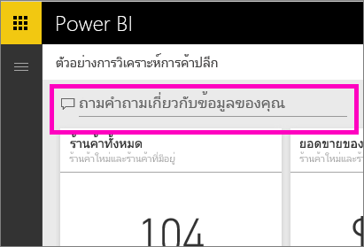
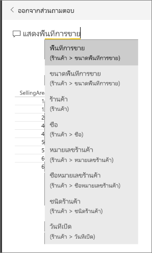
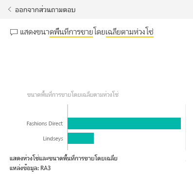
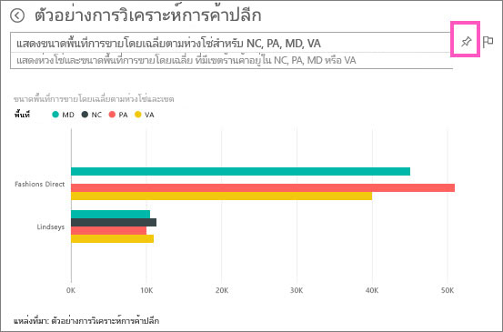
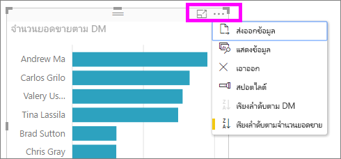

# บทช่วยสอน: วิธีการใช้ถามตอบเพื่อสร้างการแสดงภาพ และสร้างรายงาน
[ภาพรวมถามตอบ](consumer/end-user-q-and-a.md)ได้แนะนำคุณเกี่ยวกับ ถามตอบของ Power BI และเปรียบเทียบความแตกต่างระหว่าง*ผู้บริโภค* (มีแดชบอร์ดและรายงานที่แชร์ให้กับพวกเขา) และ*ผู้สร้าง* (เป็นเจ้าของรายงานและชุดข้อมูลพื้นฐาน) ส่วนแรกของบทช่วยสอนนี้ออกแบบสำหรับ ผู้บริโภคแดชบอร์ดที่ใช้บริการ Power BI และส่วนสองออกแบบมาสำหรับ ผู้ที่สร้างรายงานโดยใช้บริการของ Power BI หรือ Power BI Desktop เนื้อหา [ถามตอบ และ Power BI สำหรับอุปกรณ์เคลื่อนที่](consumer/mobile/mobile-apps-ios-qna.md) และ[ถามตอบ ด้วย Power BI Embedded](developer/qanda.md) ครอบคลุมในบทความต่างหาก

ถามตอบ เป็นการโต้ตอบที่สนุก และมักจะนำคำถามหนึ่งไปสู่คำถามอื่น ๆ เมื่อการแสดงภาพเปิดเผยให้เห็นแนวทางน่าสนใจที่จะค้นคว้าต่อ ดู Amanda สาธิตการใช้ถามตอบ เพื่อสร้างการแสดงภาพ เจาะลึกลงในวิชวลเหล่านั้น และปักหมุดวิชวลไปยังแดชบอร์ด

<iframe width="560" height="315" src="https://www.youtube.com/embed/qMf7OLJfCz8?list=PL1N57mwBHtN0JFoKSR0n-tBkUJHeMP2cP" frameborder="0" allowfullscreen></iframe>

## ส่วนที่ 1: ใช้ถามตอบบนแดชบอร์ดในบริการของ Power BI (app.powerbi.com)
แดชบอร์ดประกอบด้วย ไทล์ที่ปักหมุดจากชุดข้อมูลหนึ่งหรือหลายชุด ดังนั้นคุณสามารถถามคำถามเกี่ยวกับข้อมูลที่มีอยู่ในชุดข้อมูลใด ๆ เหล่านั้น เพื่อดูว่ารายงานและชุดข้อมูลใดถูกใช้ในการสร้างแดชบอร์ด เลือก**ดูรายการที่เกี่ยวข้อง**จากแถบเมนู

กล่องคำถามถามตอบ อยู่ที่มุมบนซ้ายของแดชบอร์ดคุณ และนี่คือที่ที่คุณพิมพ์คำถามของคุณโดยใช้ภาษาธรรมชาติ ถามตอบ เข้าใจคำที่คุณพิมพ์เข้าไป และหาว่าที่ไหน (ชุดข้อมูลไหน) คือที่ค้นหาคำตอบ ถามตอบยังช่วยคุณสร้างคำถาม ด้วยการทำให้ข้อความสมบูรณ์โดยอัตโนมัติ การเปลี่ยนข้อความในคำถาม และการช่วยเหลืออื่น ๆ ทางข้อความหรือภาพ

คำตอบของคำถามคุณ จะแสดงเป็นการแสดงภาพแบบโต้ตอบ และจะปรับปรุงตามเมื่อคุณปรับเปลี่ยนคำถาม

1. เปิดแดชบอร์ด แล้ววางเคอร์เซอร์ของคุณในกล่องคำถาม ถึงแม้ว่าคุณยังไม่เริ่มพิมพ์ ถามตอบจะแสดงหน้าจอใหม่ ด้วยคำแนะนำเพื่อช่วยคุณสร้างคำถามของคุณ คุณจะเห็นชื่อของตารางใน[ชุดข้อมูลเบื้องต้น](service-get-data.md) และอาจเห็นรายการคำถามทั้งหมด ถ้าเจ้าของชุดข้อมูลสร้าง[คำถามที่น่าสนใจ](service-q-and-a-create-featured-questions.md)ไว้แล้ว

   

   คุณสามารถเลือกหนึ่งในคำถามเหล่านี้เป็นจุดเริ่มต้น และปรับปรุงคำถาม ต่อเพื่อหาคำตอบสิ่งที่คุณกำลังค้นหา หรือใช้ชื่อตารางเพื่อช่วยให้คุณเรียบเรียงคำถามใหม่

2. เลือกตัวเลือกจากชุดข้อมูล หรือเริ่มพิมพ์คำถามของคุณเอง แล้วเลือกจากคำแนะนำในรายการดรอปดาวน์

   

3. ขณะที่คุณพิมพ์คำถาม ถามตอบจะเลือก[การแสดงภาพ](visuals/power-bi-visualization-types-for-reports-and-q-and-a.md)ที่ดีที่สุด เพื่อแสดงคำตอบของคุณ และการแสดงภาพจะเปลี่ยนแปลงตาม ขณะที่คุณปรับเปลี่ยนคำถาม

   

4. เมื่อคุณพิมพ์คำถาม Power BI จะค้นหาคำตอบที่ดีที่สุด โดยใช้ชุดข้อมูลใด ๆ ที่มีไทล์อยู่บนแดชบอร์ดนั้น  ถ้าไทล์ทั้งหมดมาจาก*ชุดข้อมูล A* คำตอบของคุณจะมาจาก*ชุดข้อมูล A*  ถ้ามีไทล์จากทั้ง*ชุดข้อมูล A* และ*ชุดข้อมูล B* ถามตอบจะค้นหาคำตอบที่ดีที่สุดจากชุดข้อมูลทั้ง 2 นั้น

   > [!TIP]
   > ดังนั้นโปรดระวัง ถ้าคุณมีไทล์หนึ่งจาก*ชุดข้อมูล A* และคุณเอาออกจากแดชบอร์ดของคุณ ถามตอบจะไม่สามารถเข้าถึง*ชุดข้อมูล A* ได้อีก
   >
   >
5. เมื่อคุณพอใจกับผลลัพธ์ [ปักหมุดการแสดงภาพไปยังแดชบอร์ด](service-dashboard-pin-tile-from-q-and-a.md) โดยการเลือกไอคอนรูปเข็มหมุดในมุมบนขวา ถ้าแดชบอร์ดถูกแชร์ให้กับคุณ หรือเป็นส่วนหนึ่งของแอป คุณจะไม่สามารถปักหมุดได้

   

##    ส่วนที่ 2: ใช้ถามตอบในรายงาน ในบริการของ Power BI หรือ Power BI Desktop

ใช้ถามตอบ เพื่อสำรวจชุดข้อมูลของคุณ และเพิ่มการแสดงภาพไปยังรายงาน และแดชบอร์ด รายงานจะมาจากชุดข้อมูลเดียว และอาจเป็นรายงานเปล่า หรือประกอบด้วยหน้าต่าง ๆ ที่เต็มไปด้วยการแสดงภาพ แต่เพียงเพราะว่ารายงานว่างเปล่า ไม่ได้หมายความว่าไม่มีข้อมูลใด ๆ ที่คุณสามารถสำรวจได้ - ชุดข้อมูลเชื่อมโยงกับรายงาน และกำลังรอให้คุณสำรวจ และสร้างการแสดงภาพ  เพื่อดูว่าชุดข้อมูลไหนใช้สร้างรายงาน เปิดรายงานในมุมมองการอ่านในบริการของ Power BI แล้วเลือก**ดูรายการที่เกี่ยวข้อง**จากแถบเมนู

เพื่อใช้ถามตอบในรายงาน คุณต้องมีสิทธิ์ในการแก้ไขสำหรับ รายงานและชุดข้อมูลพื้นฐาน ใน[หัวข้อภาพรวมถามตอบ](consumer/end-user-q-and-a.md) เราเรียกสิ่งนี้ว่าเป็นสถานการณ์*ผู้สร้าง* ดังนั้นถ้าคุณเป็น*ผู้บริโภค*รายงานที่ถูกแชร์ให้กับคุณแทน ถามตอบจะไม่มีให้

1. เปิดรายงานในมุมมองการแก้ไข (บริการของ Power BI) หรือมุมมองรายงาน (Power BI Desktop) และเลือก**ถามคำถาม**จากแถบเมนู

    **เดสก์ท็อป**    
    

    **บริการ**    
    

2. กล่องคำถามถามตอบ จะแสดงบนพื้นที่รายงานของคุณ ในตัวอย่างด้านล่าง กล่องคำถามแสดงอยู่เหนือการแสดงภาพอื่น ซึ่งยอมรับได้ แต่จะเป็นการดีกว่าถ้า[เพิ่มหน้าเปล่าลงในรายงาน](power-bi-report-add-page.md)ก่อนที่ถามคำถาม

    

3. วางเคอร์เซอร์ของคุณในกล่องคำถาม ขณะที่คุณพิมพ์ ถามตอบจะแสดงคำแนะนำ เพื่อช่วยคุณสร้างคำถามของคุณ

   

4. ขณะที่คุณพิมพ์คำถาม ถามตอบจะเลือก[การแสดงภาพ](visuals/power-bi-visualization-types-for-reports-and-q-and-a.md)ที่ดีที่สุด เพื่อแสดงคำตอบของคุณ และการแสดงภาพจะเปลี่ยนตาม ขณะที่คุณปรับเปลี่ยนคำถาม

   

5. เมื่อคุณมีการแสดงภาพที่คุณชอบ เลือก ENTER เพื่อบันทึกการแสดงภาพลงรายงาน เลือก**ไฟล์ > บันทึก**

6. โต้ตอบกับการแสดงภาพใหม่ ไม่สำคัญว่าคุณได้สร้างการแสดงภาพด้วยวิธีไหน -- ทั้งหมดจะมีการโต้ตอบ จัดรูปแบบ และคุณลักษณะที่เหมือนกัน

   

   ถ้าคุณได้สร้างการแสดงภาพในบริการของ Power BI คุณสามารถ[ปักหมุดไปยังแดชบอร์ด](service-dashboard-pin-tile-from-q-and-a.md)ได้

## บอกถามตอบว่าต้องใช้การแสดงภาพแบบไหน
ด้วยถามตอบ ไม่เพียงแต่คุณสามารถขอให้ข้อมูลคุณพูดออกมาด้วยตัวเอง คุณสามารถบอกวิธีที่ Power BI จะแสดงคำตอบได้ เพียงแค่เพิ่ม "as a <visualization type>" ตรงท้ายคำถามของคุณ  ตัวอย่างเช่น "show inventory volume by plant as a map" และ "show total inventory as a card"  ลองทำด้วยตัวเองดู

##  ข้อควรพิจารณาและการแก้ไขปัญหา
- ถ้าคุณได้เชื่อมต่อชุดข้อมูลโดยใช้การเชื่อมต่อสด หรือใช้เกตเวย์ ถามตอบจะต้อง[เปิดใช้งานสำหรับชุดข้อมูลนั้น](service-q-and-a-direct-query.md)

- คุณได้เปิดรายงาน และไม่เห็นตัวเลือกการถามตอบ ถ้าคุณกำลังใช้บริการของ Power BI ตรวจสอบทำให้แน่ใจว่า รายงานเปิดในมุมมองการแก้ไข ถ้าคุณไม่สามารถเปิดรายงานในมุมมองการแก้ไข นั่นหมายความว่า คุณไม่มีสิทธิ์ในการแก้ไขรายงานนั้น และจะไม่สามารถใช้ถามตอบกับรายงานนั้น

## ขั้นตอนถัดไป
กลับไปยัง [Q&A ใน Power BI](consumer/end-user-q-and-a.md)   
[บทช่วยสอน: ใช้ถามตอบ ด้วยตัวอย่างการขายปลีก](power-bi-visualization-introduction-to-q-and-a.md)   
[เคล็ดลับการถามคำถาม ในถามตอบ](consumer/end-user-q-and-a-tips.md)   
[เตรียมเวิร์กบุ๊กสำหรับการถามตอบ](service-prepare-data-for-q-and-a.md)  
[เตรียมชุดข้อมูลภายในองค์กรสำหรับการถามตอบ](service-q-and-a-direct-query.md)
[ปักหมุดไทล์ไปยังแดชบอร์ดจากถามตอบ](service-dashboard-pin-tile-from-q-and-a.md)
