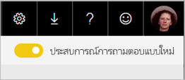
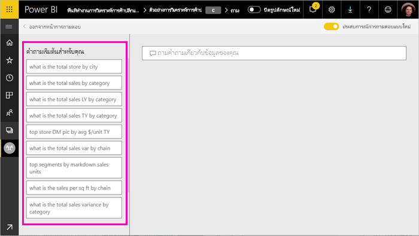
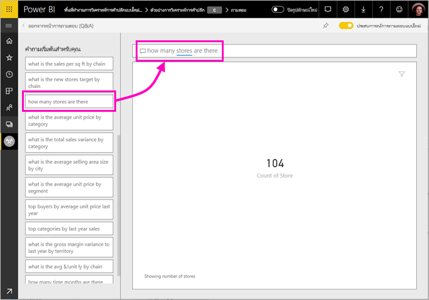
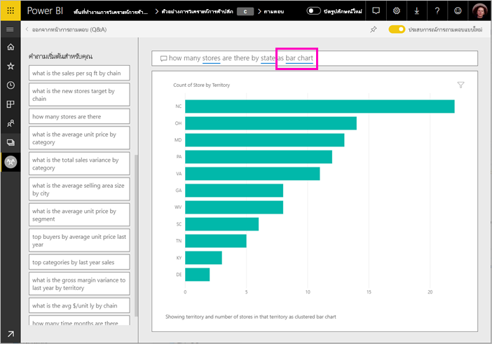

# ใช้ Power BI q&a เพื่อสำรวจข้อมูลของคุณ และสร้างวิชวล

ในบางครั้ง วิธีที่เร็วที่สุดในการให้ได้คำตอบจากข้อมูลของคุณคือ การถามคำถามโดยใช้ภาษาธรรมชาติ คุณลักษณะการถามตอบใน Power BI ช่วยให้คุณสำรวจข้อมูลของคุณในคำของคุณเอง  ส่วนแรกของบทความนี้แสดงวิธีการที่คุณใช้ถามตอบในแดชบอร์ดในบริการ Power BI ส่วนที่สองแสดงคุณสามารถทำอะไรกับถามตอบเมื่อสร้างรายงานในบริการ Power BI หรือ Power BI Desktop สำหรับพื้นหลังเพิ่มเติม ดู[q&a สำหรับผู้บริโภค](consumer/end-user-q-and-a.md)บทความ 

[ถามตอบในแอปสำหรับอุปกรณ์เคลื่อน Power BI](consumer/mobile/mobile-apps-ios-qna.md)และ[ถามตอบ ด้วย Power BI Embedded](developer/qanda.md)ครอบคลุมในบทความที่แยกต่างหาก 

ถามตอบเป็นแบบโต้ตอบ สนุก บ่อยครั้ง คำถามหนึ่งลูกค้าเป้าหมายให้กับผู้อื่น ตามที่แสดงภาพที่แสดงเส้นทางที่น่าสนใจในการไล่ตาม ดู Amanda สาธิตการใช้ถามตอบ เพื่อสร้างการแสดงภาพ เจาะลึกลงในวิชวลเหล่านั้น และปักหมุดวิชวลไปยังแดชบอร์ด

<iframe width="560" height="315" src="https://www.youtube.com/embed/qMf7OLJfCz8?list=PL1N57mwBHtN0JFoKSR0n-tBkUJHeMP2cP" frameborder="0" allowfullscreen></iframe>

## ส่วนที่ 1: ใช้ถามตอบบนแดชบอร์ดในบริการ Power BI

ในบริการ Power BI (app.powerbi.com), แดชบอร์ดประกอบด้วยไทล์ที่ปักหมุดจากชุดข้อมูลอย่าง น้อยหนึ่ง ดังนั้นคุณสามารถถามคำถามเกี่ยวกับข้อมูลมีอยู่ในชุดข้อมูลเหล่านั้น เมื่อต้องดูรายงานและชุดข้อมูลใดถูกใช้ในการสร้างแดชบอร์ด เลือก**มุมมองที่เกี่ยวข้อง**จากแถบเมนู

กล่องคำถามถามตอบจะอยู่ที่มุมบนซ้ายของแดชบอร์ดของคุณ ที่คุณพิมพ์คำถามของคุณโดยใช้ภาษาธรรมชาติ ไม่เห็นกล่องถามตอบหรือไม่ ดู[ข้อควรพิจารณาและการแก้ไขปัญหา](consumer/end-user-q-and-a.md#considerations-and-troubleshooting)ในการ**q&a สำหรับผู้บริโภค**บทความ  ถามตอบรู้จักคำที่คุณพิมพ์ และแสดงตัวเลขตำแหน่ง (ในชุดข้อมูลไหน) เพื่อค้นหาคำตอบ ถามตอบยังช่วยคุณสร้างคำถาม ด้วยการทำให้ข้อความสมบูรณ์โดยอัตโนมัติ การเปลี่ยนข้อความในคำถาม และการช่วยเหลืออื่น ๆ ทางข้อความหรือภาพ

คำตอบของคำถามคุณ จะแสดงเป็นการแสดงภาพแบบโต้ตอบ และจะปรับปรุงตามเมื่อคุณปรับเปลี่ยนคำถาม

1. เปิดแดชบอร์ด แล้ววางเคอร์เซอร์ของคุณในกล่องคำถาม ในมุมขวาบน เลือก**ใหม่ประสบการณ์ q&a**

    

1. ถึงแม้ว่าคุณยังไม่เริ่มพิมพ์ ถามตอบจะแสดงหน้าจอใหม่ ด้วยคำแนะนำเพื่อช่วยคุณสร้างคำถามของคุณ คุณเห็นวลีและคำถามทั้งหมดที่ประกอบด้วยชื่อของตารางในชุดข้อมูลเบื้องต้น และอาจเห็นคำถามทั้งหมดที่อยู่ในรายการถ้ามีสร้างเจ้าของชุดข้อมูล[แนะนำคำถาม](service-q-and-a-create-featured-questions.md)

   

   คุณสามารถเลือกหนึ่งคำถามเหล่านี้เป็นจุดเริ่มต้น และสามารถปรับปรุงคำถามเพื่อค้นหาคำตอบเฉพาะ หรือใช้ชื่อตารางเพื่อช่วยให้คุณเรียบเรียงคำถามใหม่

2. เลือกจากรายการของคำถาม หรือเริ่มพิมพ์คำถามของคุณเอง และเลือกจากคำแนะนำแบบหล่นลง

   

3. ขณะที่คุณพิมพ์คำถาม q&a เลือกการแสดงภาพที่ดีที่สุดเพื่อแสดงคำตอบของคุณ

   

4. แสดงภาพจะเปลี่ยนเป็นแบบไดนามิกปรับเปลี่ยนคำถาม

   

1. เมื่อคุณพิมพ์คำถาม Power BI จะค้นหาคำตอบที่ดีที่สุด โดยใช้ชุดข้อมูลใด ๆ ที่มีไทล์อยู่บนแดชบอร์ดนั้น  ถ้าไทล์ทั้งหมดมาจาก*ชุดข้อมูล A* คำตอบของคุณจะมาจาก*ชุดข้อมูล A*  ถ้ามีไทล์จาก*ชุดข้อมูล a*และ*datasetB*แล้ว ถามตอบค้นหาคำตอบที่ดีที่สุดจากชุดข้อมูล 2 เหล่านั้น

   > [!TIP]
   > ดังนั้นโปรดระวัง ถ้าคุณมีไทล์หนึ่งจาก*ชุดข้อมูล A* และคุณเอาออกจากแดชบอร์ดของคุณ ถามตอบจะไม่สามารถเข้าถึง*ชุดข้อมูล A* ได้อีก
   >

5. เมื่อคุณพอใจกับผลลัพธ์ ปักหมุดการแสดงภาพไปยังแดชบอร์ดโดยการเลือกไอคอนหมุดในมุมบนขวา ถ้าแดชบอร์ดถูกแชร์ให้กับคุณ หรือเป็นส่วนหนึ่งของแอป คุณจะไม่สามารถปักหมุดได้

   

## ส่วนที่ 2: ใช้ Q&A ในรายงาน ในบริการของ Power BI หรือ Power BI Desktop

ใช้ถามตอบ เพื่อสำรวจชุดข้อมูลของคุณ และเพิ่มการแสดงภาพไปยังรายงาน และแดชบอร์ด รายงานจะมาจากชุดข้อมูลเดียว และอาจเป็นรายงานเปล่า หรือประกอบด้วยหน้าต่าง ๆ ที่เต็มไปด้วยการแสดงภาพ แต่เพียงเพราะว่ารายงานว่างเปล่า ไม่ได้หมายความว่าไม่มีข้อมูลใด ๆ ที่คุณสามารถสำรวจได้ - ชุดข้อมูลเชื่อมโยงกับรายงาน และกำลังรอให้คุณสำรวจ และสร้างการแสดงภาพ  เพื่อดูว่าชุดข้อมูลไหนใช้สร้างรายงาน เปิดรายงานในมุมมองการอ่านในบริการของ Power BI แล้วเลือก**ดูรายการที่เกี่ยวข้อง**จากแถบเมนู

เมื่อต้องใช้ถามตอบในรายงาน คุณต้องมีสิทธิ์ในการแก้ไขสำหรับรายงานและชุดข้อมูลพื้นฐาน ในการ[q&a สำหรับผู้บริโภค](consumer/end-user-q-and-a.md)บทความ เราอ้างอิงนี้เป็นการ*ผู้สร้าง*สถานการณ์สมมติ ถ้าแทน คุณกำลัง*ใช้*รายงานที่มีการแชร์กับคุณ ถามตอบ ไม่พร้อมใช้งาน

1. เปิดรายงานในมุมมองการแก้ไข (บริการ Power BI) หรือมุมมองรายงาน (Power BI Desktop) และเลือก**ถามคำถาม**จากแถบเมนู

    **Power BI Desktop**    
    

    **บริการ**    
    

2. กล่องคำถามถามตอบ จะแสดงบนพื้นที่รายงานของคุณ ในตัวอย่างด้านล่าง กล่องคำถามแสดงอยู่เหนือการแสดงภาพอื่น ซึ่งยอมรับได้ แต่จะเป็นการดีกว่าถ้าเพิ่มหน้าเปล่าลงในรายงานก่อนที่ถามคำถาม

    

3. วางเคอร์เซอร์ของคุณในกล่องคำถาม ขณะที่คุณพิมพ์ ถามตอบจะแสดงคำแนะนำ เพื่อช่วยคุณสร้างคำถามของคุณ

   

4. ขณะที่คุณพิมพ์คำถาม ถามตอบจะเลือก[การแสดงภาพ](visuals/power-bi-visualization-types-for-reports-and-q-and-a.md)ที่ดีที่สุด เพื่อแสดงคำตอบของคุณ และการแสดงภาพจะเปลี่ยนตาม ขณะที่คุณปรับเปลี่ยนคำถาม

   

5. เมื่อคุณมีการแสดงภาพที่คุณชอบ เลือก ENTER เพื่อบันทึกการแสดงภาพลงรายงาน เลือก**ไฟล์ > บันทึก**

6. โต้ตอบกับการแสดงภาพใหม่ ไม่สำคัญว่าคุณได้สร้างการแสดงภาพด้วยวิธีไหน -- ทั้งหมดจะมีการโต้ตอบ จัดรูปแบบ และคุณลักษณะที่เหมือนกัน

   

   ถ้าคุณได้สร้างการแสดงภาพในบริการของ Power BI คุณสามารถ[ปักหมุดไปยังแดชบอร์ด](service-dashboard-pin-tile-from-q-and-a.md)ได้

## บอกการถามตอบว่าต้องใช้การแสดงภาพแบบใด
ด้วยถามตอบ ไม่เพียงแต่คุณสามารถขอให้ข้อมูลคุณพูดออกมาด้วยตัวเอง คุณสามารถบอกวิธีที่ Power BI จะแสดงคำตอบได้ เพียงแค่เพิ่ม "as a <visualization type>" ตรงท้ายคำถามของคุณ  ตัวอย่างเช่น "show inventory volume by plant as a map" และ "show total inventory as a card"  ลองทำด้วยตัวเองดู

## ข้อควรพิจารณาและการแก้ไขปัญหา
- ถ้าคุณได้เชื่อมต่อชุดข้อมูลโดยใช้การเชื่อมต่อสด หรือใช้เกตเวย์ ถามตอบจะต้อง[เปิดใช้งานสำหรับชุดข้อมูลนั้น](service-q-and-a-direct-query.md)

- คุณได้เปิดรายงาน และไม่เห็นตัวเลือกการถามตอบ ถ้าคุณกำลังใช้บริการของ Power BI ตรวจสอบทำให้แน่ใจว่า รายงานเปิดในมุมมองการแก้ไข ถ้าคุณไม่สามารถเปิดมุมมองการแก้ไขนั่นหมายความว่า คุณไม่มีสิทธิ์แก้ไขสำหรับรายงานนั้น และคุณสามารถใช้ถามตอบกับรายงานนั้น

## ขั้นตอนถัดไป

- [Q&a สำหรับผู้บริโภค](consumer/end-user-q-and-a.md)   
- [เคล็ดลับสำหรับการถามคำถามในถามตอบ](consumer/end-user-q-and-a-tips.md)   
- [เตรียมเวิร์กบุ๊กสำหรับการถามตอบ](service-prepare-data-for-q-and-a.md)  
- [เตรียมชุดข้อมูลภายในองค์กรสำหรับ q&a](service-q-and-a-direct-query.md)   
- [ปักหมุดไทล์ไปยังแดชบอร์ดจาก q&a](service-dashboard-pin-tile-from-q-and-a.md)
