# แผนที่ ArcGIS ในบริการของ Power BI และ Power BI Desktop จาก Esri
บทช่วยสอนนี้ถูกเขียนจากมุมมองของผู้สร้างแผนที่ ArcGIS เมื่อผู้สร้างแชร์แผนที่ ArcGIS ให้กับเพื่อนร่วมงาน ผู้ร่วมงานสามารถดูและโต้ตอบกับแผนที่ แต่ไม่สามารถบันทึกการเปลี่ยนแปลงได้ เพื่อเรียนรู้เพิ่มเติมเกี่ยวกับการดูแผนที่ ArcGIS ดูที่[โต้ตอบกับแผนที่ ArcGIS](power-bi-visualizations-arcgis.md)

การรวมกันระหว่างแผนที่ ArcGIS และ Power BI ทำให้การนำเสนอจุดต่าง ๆ บนแผนที่ก้าวขึ้นไปอีกระดับ เลือกแผนที่พื้นฐาน ชนิดของสถานที่ตั้ง ธีม สไตล์สัญลักษณ์ และเลเยอร์อ้างอิง เพื่อสร้างการแสดงภาพแผนที่ที่สวยงามและสื่อความหมาย การรวมกันของ เลเยอร์ข้อมูลที่เป็นทางการบนแผนที่ และการวิเคราะห์ทางตำแหน่ง ให้คุณทำความเข้าใจการแสดงภาพของคุณที่ลึกซึ้งขึ้น

 ถึงแม้ว่าคุณไม่สามารถสร้างแผนที่ ArcGIS บนอุปกรณ์เคลื่อนที่ คุณสามารถดู และโต้ตอบกับแผนที่ ดู[การโต้ตอบกับแผนที่ ArcGIS](power-bi-visualizations-arcgis.md)

> [!TIP]
> GIS ย่อมาจาก Geographic Information Science หมายถึงวิทยาการข้อมูลทางภูมิศาสตร์

ตัวอย่างด้านล่างใช้พื้นที่สีเทาเข้ม เพื่อแสดงยอดขายตามภูมิภาคในรูป แผนที่คลื่นความร้อน เทียบกับเลเยอร์รายได้หลังหักภาษีของประชากรปี 2016 คุณจะได้เห็นเมื่อคุณอ่านต่อไป การใช้แผนที่ ArcGIS มอบความสามารถที่ไม่จำกัดในการทำแผนที่ ข้อมูลประชากร และ การแสดงภาพแผนที่ที่สวยงาม ให้คุณสามารถบอกเล่าเรื่องราวของคุณได้ดีที่สุด

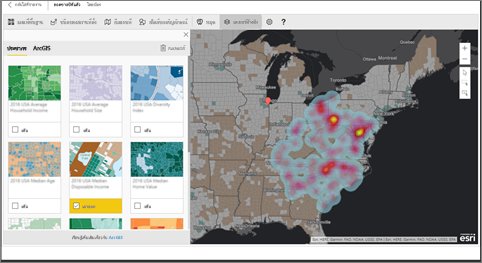

> [!TIP]
> เยี่ยมชม[หน้าของ esri บน Power BI](https://www.esri.com/powerbi)เพื่อดูตัวอย่างมากมาย และอ่านคำบอกเล่าจากผู้ใช้ แล้วดู[หน้าเริ่มต้นใช้งาน ArcGIS Maps for Power BI ](https://doc.arcgis.com/en/maps-for-powerbi/get-started/about-maps-for-power-bi.htm)ของทาง esri

## ความยินยอมของผู้ใช้
ArcGIS Maps for Power BI ให้บริการโดย Esri (www.esri.com) การใช้ ArcGIS Maps for Power BI ของคุณ ต้องอยู่ภายใต้ข้อกำหนดและนโยบายความเป็นส่วนตัวของ Esri ผู้ใช้ Power BI ที่ต้องการใช้วิชวล ArcGIS Maps for Power BI จำเป็นต้องตอบรับในกล่องโต้ตอบความยินยอม

**แหล่งข้อมูล**

[ข้อกำหนด](https://go.microsoft.com/fwlink/?LinkID=826322)

[นโยบายความเป็นส่วนตัว](https://go.microsoft.com/fwlink/?LinkID=826323)

[หน้าผลิตภัณฑ์ ArcGIS Maps for Power BI](https://www.esri.com/powerbi)

 

## เปิดใช้งานแผนที่ ArcGIS
แผนที่ ArcGIS มีให้ใช้ใน บริการของ Power BI, Power BI Desktop และ Power BI สำหรับอุปกรณ์เคลื่อนที่ บทความนี้ให้คำแนะนำ สำหรับบริการ และ Desktop

### เปิดใช้งานแผนที่ ArcGIS ***ในบริการของ Power BI (app.powerbi.com)***
บทช่วยสอนนี้ใช้[ตัวอย่างการวิเคราะห์การค้าปลีก](sample-retail-analysis.md) เพื่อเปิดใช้งาน **ArcGIS Maps for Power BI**:

1. จากส่วนขวาบนของแถบเมนู เลือกไอคอนรูปเฟือง และเปิด**การตั้งค่า**
   
    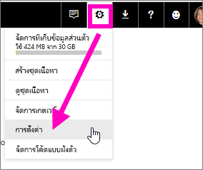
2. เลือกกล่องกาเครื่องหมาย **ArcGIS Maps for Power BI** คุณจะต้องรีสตาร์ต Power BI หลังจากที่คุณทำการเลือกแล้ว
   
    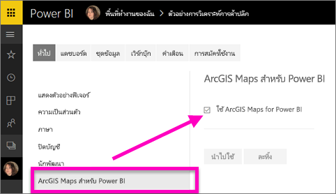
3. เปิดรายงานใน[มุมมองการแก้ไข](service-reading-view-and-editing-view.md) เลือกไอคอน ArcGIS Maps for Power BI จากบานหน้าต่าง การจัดรูปแบบการแสดงข้อมูล
   
    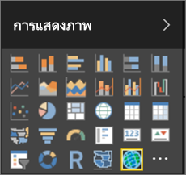
4. Power BI เพิ่มเแม่แบบแผนที่ ArcGIS ที่ว่างเปล่าไปยังพื้นที่ของรายงาน
   
   

 

## สร้างวิชวลแผนที่ ArcGIS
ดู Will สร้างการแสดงภาพแผนที่ ArcGIS ที่แตกต่างกันสองสามภาพ จากนั้น ใช้ขั้นตอนด้านล่าง เพื่อลองทำด้วยตนเองโดยใช้[ตัวอย่างการวิเคราะห์การค้าปลีก](sample-datasets.md)

<iframe width="560" height="315" src="https://www.youtube.com/embed/EKVvOZmxg9s" frameborder="0" allowfullscreen></iframe>

1. จากบานหน้าต่าง**เขตข้อมูล** ลากเขตข้อมูลไปยังบักเก็ต**สถานที่ตั้ง** หรือ**ละติจูด** และ/หรือ**ลองจิจูด** ในตัวอย่างนี้ เรากำลังใช้**ร้าน > เมือง**
   
   > [!NOTE]
   > ArcGIS Maps for Power BI จะตรวจโดยอัตโนมัติ ว่าเขตข้อมูลที่คุณเลือก ควรแสดงเป็นรูปร่างหรือจุดบนแผนที่ถึงจะดีที่สุด คุณสามารถปรับเปลี่ยนค่าเริ่มต้นในการตั้งค่า (ดูด้านล่าง)
   > 
   > 
   
    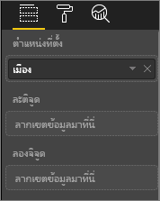
2. แปลงการแสดงภาพไปเป็นแผนที่ ArcGIS โดยการเลือกแม่แบบ จากบานหน้าต่าง การจัดรูปแบบการแสดงข้อมูล 
3. จากบานหน้าต่าง**เขตข้อมูล** ลากเป็นหน่วยวัดไปบักเก็ต**ขนาด**เพื่อปรับปรุงวิธีแสดงข้อมูล ในตัวอย่างนี้ เรากำลังใช้**ยอดขาย > ยอดขายปีที่แล้ว**
   
    

## การตั้งค่าและการจัดรูปแบบแผนที่ ArcGIS
เพื่อเข้าถึงคุณลักษณะการจัดรูปแบบ **ArcGIS Maps for Power BI**:

1. เข้าถึงคุณลักษณะเพิ่มเติม โดยการเลือกจุดไข่ปลาที่อยู่มุมบนขวาของการแสดงภาพ และเลือก**แก้ไข**
   
   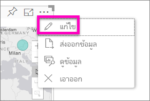
   
   คุณลักษณะที่มีให้ใช้งาน จะแสดงด้านบนของการแสดงภาพ แต่ละคุณลักษณะ เมื่อเลือก บานหน้าต่างงานที่มีรายละเอียดตัวเลือกจะเปิดออกมา 
   
   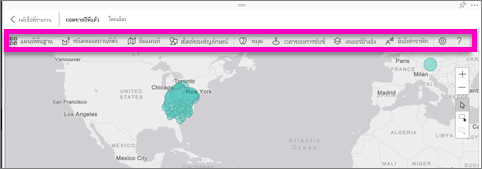
   
   > [!NOTE]
   > สำหรับข้อมูลเพิ่มเติมเกี่ยวกับการตั้งค่าและคุณลักษณะ ดู**เอกสารประกอบโดยละเอียด**ด้านล่าง
   > 
   > 
2. เพื่อกลับไปรายงาน เลือก**กลับไปยังรายงาน**จากมุมบนซ้ายของพื้นที่รายงานของคุณ

 

## เอกสารประกอบโดยละเอียด
**Esri** มี[เอกสารประกอบที่ครอบคลุม](https://go.microsoft.com/fwlink/?LinkID=828772)ชุดคุณลักษณะของ **ArcGIS Maps for Power BI**

## ภาพรวมคุณลักษณะ
### แผนที่พื้นฐาน
มีแผนที่พื้นฐานสี่แบบให้: พื้นที่สีเทาเข้ม, พื้นที่สีเทาอ่อน, OpenStreetMap และแผนที่ถนน  แผนที่ถนนเป็นแผนที่มาตรฐานของ ArcGIS

เพื่อนำแผนที่พื้นฐานไปใช้ เลือกแผนที่จากในบานหน้าต่างงาน

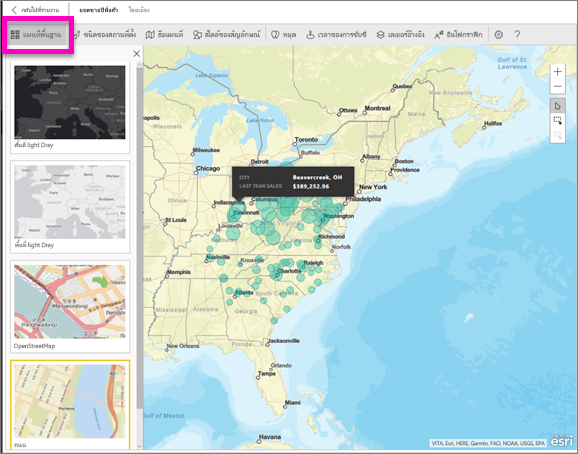

### ชนิดของสถานที่ตั้ง
ArcGIS Maps for Power BI จะตรวจหา วิธีดีที่สุดในการแสดงข้อมูลบนแผนที่โดยอัตโนมัติ ซึ่งเลือกได้ระหว่าง จุด หรือขอบเขต ตัวเลือกชนิดของสถานที่ตั้ง ให้คุณสามารถปรับปรุงตัวเลือกเหล่านี้

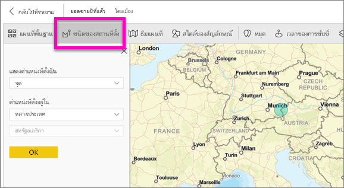

**ขอบเขต**จะทำงานเฉพาะ เมื่อข้อมูลของคุณ มีค่าทางภูมิศาสตร์มาตรฐาน Esri เลือกรูปร่างที่จะแสดงบนแผนที่ให้โดยอัตโนมัติ ค่าทางภูมิศาสตร์มาตรฐานรวมถึง ประเทศ จังหวัด รหัสไปรษณีย์ เป็นต้น แต่เหมือนกับ การกำหนดรหัสพิกัด Power BI อาจไม่ตรวจพบเขตข้อมูลที่ควรเป็นขอบเขตตามค่าเริ่มต้น หรืออาจไม่มีขอบเขตสำหรับข้อมูลของคุณ  

### ธีมแผนที่
มีธีมแผนที่ให้สี่แบบ ธีมเฉพาะสถานที่ตั้ง และธีมขนาด ถูกเลือกให้โดยอัตโนมัติจากเขตข้อมูลที่คุณกำหนดให้กับสถานที่ตั้ง และที่เพิ่มลงในบักเก็ต**ขนาด** ในบานหน้าต่างเขตข้อมูบ Power BI เรากำลังใช้ธีม**ขนาด** ดังนั้นเรามาเปลี่ยนไปใช้**แผนที่คลื่นความร้อน**  

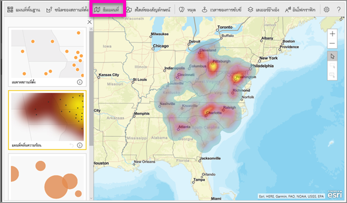

<table>
<tr><th>ธีม</th><th>คำอธิบาย</th>
<tr>
<td>เฉพาะสถานที่ตั้ง</td>
<td>ลงจุดข้อมูลหรือเติมสีขอบเขต ตามการตั้งค่าในชนิดของสถานที่ตั้ง</td>
</tr>
<tr>
<td>แผนที่คลื่นความร้อน</td>
<td>ลงจุดความเข้มของข้อมูลบนแผนที่</td>
</tr>
<tr>
<td>ขนาด</td>
<td>ลงจุดข้อมูลบนแผนที่ ตามขนาดที่อยู่ในบักเก็ตขนาด ในบานหน้าต่างเขตข้อมูล</td>
</tr>
<tr>
<td>ทำคลัสเตอร์</td>
<td>ลงจำนวนของจุดข้อมูลในภูมิภาคบนแผนที่ </td>
</tr>
</table>

### สไตล์ของสัญลักษณ์
สไตล์ของสัญลักษณ์ ให้คุณสามารถปรับการแสดงข้อมูลบนแผนที่ สไตล์ของสัญลักษณ์ จะขึ้นกับ ชนิดของสถานที่ตั้ง และ ธีมแผนที่ ที่เลือก ตัวอย่างด้านล่าง แสดงกรณีที่ ชนิดของสถานที่ตั้ง ตั้งค่าเป็น**ขนาด** และมีการปรับความโปร่งใส สไตล์ และขนาด

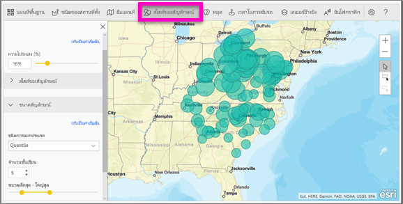

### หมุด
เรียกความสนใจไปยังจุดบนแผนที่ของคุณ โดยการเพิ่มหมุด  

1. เลือกแท็บ**หมุด**
2. พิมพ์คำสำคัญ (เช่น ที่อยู่ สถานที่ และจุดสนใจ) ในกล่องค้นหา และเลือกจากรายการดรอปดาวน์ สัญลักษณ์จะปรากฏขึ้นบนแผนที่ และแผนที่ขยายไปยังตำแหน่งที่ตั้งให้โดยอัตโนมัติ ผลลัพธ์การค้นหาจะถูกบันทึกเป็นการ์ดที่ตั้ง ในบานหน้าต่างการปักหมุด คุณสามารถบันทึกการ์ดได้สูงสุด 10 สถานที่
   
   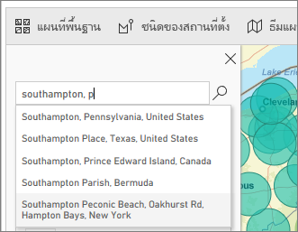
3. Power BI เพิ่มเข็มหมุดไปยังตำแหน่งที่ตั้ง และคุณสามารถเปลี่ยนสีของหมุดได้
   
   
4. เพิ่มและลบหมุด
   
   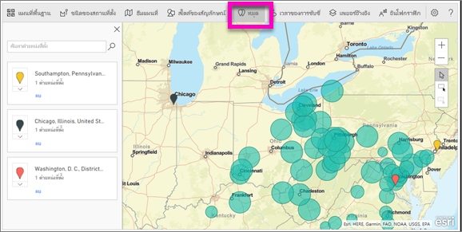

### เวลาในการขับรถ
บานหน้าต่างเวลาในการขับระ ให้คุณเลือกตำแหน่งที่ตั้ง และจากนั้นหาว่า จุดอื่น ๆ บนแผนที่อยู่ภายในระยะทาง หรือเวลาเดินทางที่กำหนดหรือไม่  
    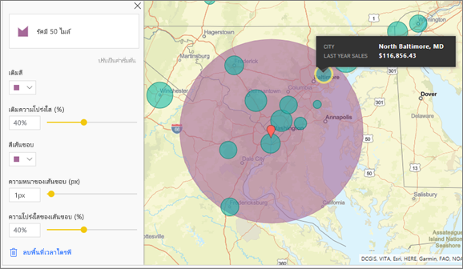

1. เลือกแท็บ**เวลาในการขับรถ** และเลือกเครื่องมือ เลือกรายการเดียว หรือหลายรายการ เลือกครั้งเดียว ที่หมุดสำหรับ วอชิงตัน ดี.ซี.
    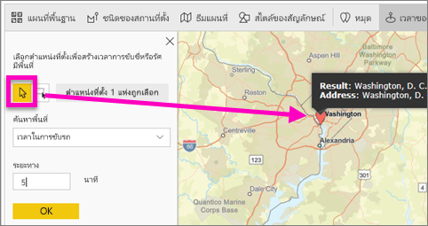
   
   > [!TIP]
   > เป็นการง่ายกว่า ถ้าเลือกตำแหน่งในขณะที่คุณขยายแผนที่ (โดยใช้ไอคอน +)
   > 
   > 
2. สมมติว่า คุณกำลังบินไป วอชิงตัน ดี.ซี. เป็นเวลาสองสามวัน และต้องการค้นหาร้านค้าที่อยู่ในระยะทางขับรถ ที่สมเหตุสมผล เปลี่ยนพื้นที่การค้นหาเป็น**รัศมี** และระยะทางเป็น **50** ไมล์ และเลือกตกลง    
   
    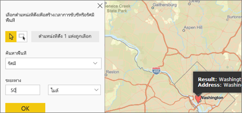
3. รัศมีจะแสดงเป็นสีม่วง เลือกตำแหน่งที่ตั้งใด ๆ เพื่อแสดงรายละเอียด คุณอาจจัดรูปแบบของรัศมี โดยการเปลี่ยนสีและเค้าร่างได้
   
    

### เลเยอร์อ้างอิง
#### เลเยอร์อ้างอิง - ข้อมูลประชากร
ArcGIS Maps for Power BI มีเลเยอร์ประชากรให้เลือกจำนวนหนึ่ง เพื่อช่วยแสดงบริบทของข้อมูลจาก Power BI

1. เลือกแท็บ**เลเยอร์อ้างอิง** และเลือก**ข้อมูลประชากร**
2. แต่ละเลเยอร์จะแสดงพร้อมกล่องกาเครื่องหมาย ทำเครื่องหมายถูกเพื่อเพิ่มเลเยอร์ไปยังแผนที่  ในตัวอย่างนี้ เราได้เพิ่มรายได้เฉลี่ยต่อครัวเรือน 
   
    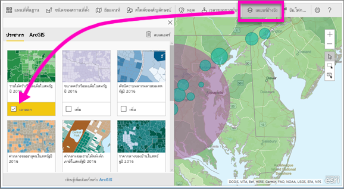
3. แต่ละเลเยอร์สามารถโต้ตอบได้เช่นกัน เช่นเดียวกับที่คุณสามารถโฮเวอร์เมาส์เหนือแผนภูมิฟองเพื่อดูรายละเอียด คุณสามารถคลิกบนพื้นที่แรเงาบนแผนที่เพื่อดูรายละเอียด 
   
    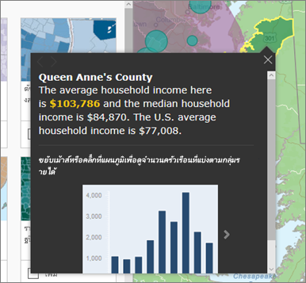

#### เลเยอร์อ้างอิง - ArcGIS
ArcGIS Online ให้องค์กรสามารถเผยแพร่แผนที่บนเว็บสาธารณะ นอกจากนี้ Esri มีชุดของแผนที่บนเว็บที่รวบรวมไว้ผ่านทาง Living Atlas ในแท็บ ArcGIS คุณสามารถค้นหาแผนที่เว็บสาธารณะ หรือแผนที่ Living Atlas ทั้งหมด และเพิ่มเป็นเลเยอร์อ้างอิงลงในแผนที่

1. เลือกแท็บ**เลเยอร์อ้างอิง** และเลือก**ArcGIS**
2. ป้อนคำค้นหา จากนั้นเลือกเลเยอร์แผนที่ ในตัวอย่างนี้ เราได้เลือกเขตการเลือกตั้งสมาชิกสภาของสหรัฐอเมริกา
   
    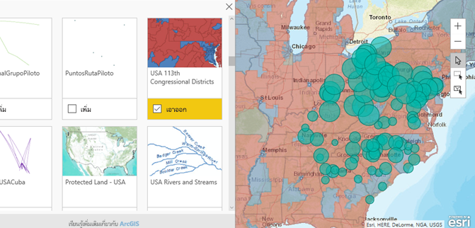
3. เพื่อดูรายละเอียด เลือกพื้นที่แรเงา พื้นที่ใดพื้นที่หนึ่ง เพื่อเปิด *เลือกจากเลเยอร์อ้างอิง*: ใช้เครื่องมือการเลือกเลเยอร์อ้างอิง เพื่อเลือกขอบเขตหรือวัตถุบนเลเยอร์อ้างอิง

 

## การเลือกจุดข้อมูล
ArcGIS Maps for Power BI มีโหมดการเลือกให้สามโหมด

เปลี่ยนโหมดได้โดยการเลือกสวิตช์:

 เลือกแต่ละจุดข้อมูล

 วาดสี่เหลี่ยมผืนผ้าบนแผนที่ และเลือกจุดข้อมูลที่อยู่ภายใน

 ใช้ขอบเขตหรือรูปหลายเหลี่ยมภายในเลเยอร์อ้างอิง เพื่อใช้เลือกจุดข้อมูลที่อยู่ภายใน

> [!NOTE]
> คุณสามารถเลือกจุดข้อมูลได้สูงสุด 250 จุดในแต่ละครั้ง
> 
> 

 

## การขอความช่วยเหลือ
**Esri** มี[เอกสารประกอบที่ครอบคลุม](https://go.microsoft.com/fwlink/?LinkID=828772)ชุดคุณลักษณะของ **ArcGIS Maps for Power BI**

คุณสามารถถามคำถาม ค้นหาข้อมูลล่าสุด รายงานปัญหา และค้นหาคำตอบใน[กระทู้ ชุมชน Power BI ที่เกี่ยวข้องกับ **ArcGIS Maps for Power BI**](https://go.microsoft.com/fwlink/?LinkID=828771) ได้

ถ้าคุณมีคำแนะนำเพื่อการปรับปรุง โปรดส่งไปยัง[รายการแนวคิด Power BI](https://ideas.powerbi.com)

 

## การจัดการการใช้ ArcGIS Maps for Power BI ภายในองค์กรของคุณ
Power BI ให้ผู้ใช้ ผู้ดูแลผู้เช่า และผู้ดูแลระบบ IT จัดการว่าจะใช้ ArcGIS Maps for Power BI หรือไม่

**ตัวเลือกผู้ใช้**ใน Power BI Desktop ผู้ใช้สามารถหยุดใช้ ArcGIS Maps for Power BI โดยการปิดใช้งานบนแท็บความปลอดภัยใน**ตัวเลือก**ได้ เมื่อปิดใช้งาน ArcGIS Maps จะไม่โหลดตามค่าเริ่มต้น

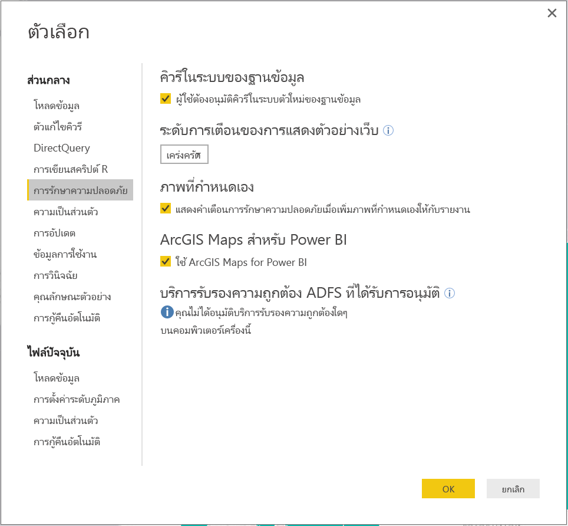

ในบริการของ Power BI ผู้ใช้สามารถหยุดใช้ ArcGIS Maps for Power BI โดยการปิดใช้งานบนแท็บ ArcGIS Maps for Power BI ในการตั้งค่าผู้ใช้ เมื่อปิดใช้งาน ArcGIS Maps จะไม่โหลดตามค่าเริ่มต้น

**ตัวเลือกการจัดการผู้เช่า**ใน PowerBI.com ผู้ดูแลผู้เช่าสามารถป้องกันไม่ให้ผู้ใช้ของผู้เช่าทั้งหมด ใช้ ArcGIS Maps for Power BI โดยการปิดใช้งานได้ เมื่อเกิดกรณีนี้ Power BI จะไม่เห็นไอคอน ArcGIS Maps for Power BI ในบานหน้าต่างการจัดรูปแบบการแสดงข้อมูล

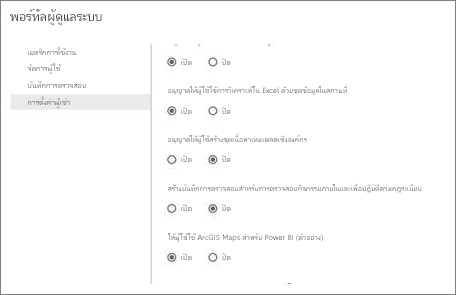

**ตัวเลือกผู้ดูแลด้าน IT** Power BI Desktop สนับสนุนการใช้**นโยบายกลุ่ม**เพื่อปิดใช้งาน ArcGIS Maps for Power BI ในคอมพิวเตอร์ทั่วทั้งองค์กร

<table>
<tr><th>แอตทริบิวต์</th><th>ค่า</th>
</tr>
<tr>
<td>คีย์</td>
<td>Software\Policies\Microsoft\Power BI Desktop&lt;/td&gt;
</tr>
<tr>
<td>valueName</td>
<td>EnableArcGISMaps</td>
</tr>
</table>

ค่า 1 (เลขฐานสิบ) เปิดใช้งาน ArcGIS Maps for Power BI

ค่า 0 (เลขฐานสิบ) ปิดใช้งาน ArcGIS Maps for Power BI

## ข้อควรพิจารณาและข้อจำกัด
ArcGIS Maps for Power BI มีให้ใช้งานในบริการและแอปพลิเคชันต่อไปนี้:

<table>
<tr><th>บริการ/แอป</th><th>ความพร้อมใช้งาน</th></tr>
<tr>
<td>Power BI Desktop</td>
<td>ใช่</td>
</tr>
<tr>
<td>บริการของ power BI (PowerBI.com)</td>
<td>ใช่</td>
</tr>
<tr>
<td>แอปพลิเคชัน Power BI สำหรับอุปกรณ์เคลื่อนที่</td>
<td>ใช่</td>
</tr>
<tr>
<td>Power BI ที่เผยแพร่ไปยังเว็บ</td>
<td>ไม่ใช่</td>
</tr>
<tr>
<td>Power BI ที่ฝังตัว</td>
<td>ไม่ใช่</td>
</tr>
<tr>
<td>บริการของ power BI ที่ฝังตัว (PowerBI.com)</td>
<td>ไม่ใช่</td>
</tr>
</table>

ในบริการหรือแอปพลิเคชันที่ไม่มี ArcGIS Maps for Power BI ให้ใช้งาน การแสดงภาพจะแสดงเป็นวิชวลว่าง ที่มีโลโก้ Power BI

เมื่อกำหนดรหัสพิกัดที่อยู่ เฉพาะที่อยู่ 1500 สถานที่แรกเท่านั้นที่จะกำหนดได้ การกำหนดรหัสพิกัด ชื่อสถานที่ หรือประเทศ ไม่อยู่ในข้อจำกัด 1500 สถานที่

 

**ArcGIS Maps for Power BI ทำงานร่วมกันอย่างไร?**
ArcGIS Maps for Power BI ให้บริการโดย Esri (www.esri.com) การใช้ ArcGIS Maps for Power BI ของคุณ ต้องอยู่ภายใต้[ข้อกำหนด](https://go.microsoft.com/fwlink/?LinkID=8263222)และ[นโยบายความเป็นส่วนตัว](https://go.microsoft.com/fwlink/?LinkID=826323)ของ Esri ผู้ใช้ Power BI ที่ต้องการใช้วิชวล ArcGIS Maps for Power BI จำเป็นต้องตอบรับในกล่องโต้ตอบความยินยอม (ดู ความยินยอมของผู้ใช้ สำหรับรายละเอียด)  การใช้ ArcGIS Maps for Power BI ต้องอยู่ภายใต้ข้อกำหนดและนโยบายความเป็นส่วนตัวของ Esri ซึ่งยังได้เชื่อมโยงจากกล่องโต้ตอบความยินยอม แต่ละผู้ใช้ต้องยินยอมก่อนที่จะใช้ ArcGIS Maps for Power BI เป็นครั้งแรก ทันทีที่ผู้ใช้ตอบรับความยินยอม ข้อมูลที่ผูกไว้กับวิชวล จะถูกส่งไปยังบริการของ Esri อย่างน้อยสำหรับการกำหนดรหัสพิกัด ซึ่งหมายถึงการแปลงข้อมูลตำแหน่งที่ตั้ง ไปเป็นข้อมูลละติจูดและลองจิจูดที่สามารถแสดงบนแผนที่ได้ คุณควรถือว่า ข้อมูลใด ๆ ที่ผูกอยู่กับการแสดงภาพข้อมูล สามารถถูกส่งไปยังบริการของ Esri Esri มีบริการต่าง ๆ เช่น แผนที่พื้นฐาน การวิเคราะห์เชิงพื้นที่ กำหนดรหัสพิกัด เป็นต้น วิชวล ArcGIS Maps for Power BI โต้ตอบกับบริการเหล่านี้โดยใช้การเชื่อมต่อ SSL ที่ป้องกันโดยใบรับรองที่ให้และดูแลรักษาโดย Esri สามารถรับข้อมูลเพิ่มเติมเกี่ยวกับ ArcGIS Maps for Power BI จาก[หน้าผลิตภัณฑ์ ArcGIS Maps for Power BI](https://www.esri.com/powerbi) ของ Esri ได้

เมื่อผู้ใช้ลงทะเบียนสมัครใช้บริการ Plus ที่ให้บริการโดย Esri ผ่านทาง ArcGIS Maps for Power BI พวกเขากำลังติดต่อโดยตรงกับทาง Esri Power BI ไม่ส่งข้อมูลส่วนบุคคลเกี่ยวกับผู้ใช้ไปให้ Esri ผู้ใช้ลงชื่อเข้าใช้ และเชื่อถือแอปพลิเคชัน AAD ของ Esri ด้วยข้อมูลประจำตัว AAD ของพวกเขาเอง จากการทำเช่นนั้น ผู้ใช้ที่จะแชร์ข้อมูลส่วนบุคคลของพวกเขาโดยตรงกับ Esri เมื่อผู้ใช้เพิ่มเนื้อหา Plus ลงในวิชวล ArcGIS Maps for Power BI ผู้ใช้ Power BI อื่นต้องเป็นสมาชิก Plus ด้วย ถึงดูหรือแก้ไขเนื้อหานั้นได้ 

สำหรับการคำถามทางเทคนิคโดยละเอียด เกี่ยวกับวิธีการทำงานของ ArcGIS Maps for Power BI ของ Esri สื่อสารผ่านไซต์ฝ่ายสนับสนุนของ Esri

**มีค่าธรรมเนียมใด ๆ สำหรับการใช้ ArcGIS Maps for Power BI หรือไม่?**

แผนที่ ArcGIS สำหรับ Power BI มีให้สำหรับผู้ใช้ Power BI ทั้งหมดโดยไม่มีค่าใช้จ่ายเพิ่มเติม ซึ่งเป็นคอมโพเนนต์ที่ให้โดย **Esri** และการใช้งานจะขึ้นอยู่กับข้อกำหนดและนโยบายความเป็นส่วนตัวที่ให้โดย **Esri** ตามที่ระบุไว้ก่อนหน้านี้ในบทความ

**ฉันได้รับข้อผิดพลาดใน Power BI Desktop เกี่ยวกับแคชของฉันกำลังเต็ม**

นี่คือข้อบกพร่องที่กำลังแก้ไข  ในระหว่างนี้ เพื่อล้างแคชของคุณ โปรดลองลบไฟล์ในตำแหน่งที่ตั้งนี้: C:\Users\\AppData\Local\Microsoft\Power BI Desktop\CEF แล้วรีสตาร์ต Power BI

**ArcGIS Maps for Power BI สนับสนุน Shapefiles ของ Esri หรือไม่?**

ArcGIS Maps for Power BI ตรวจพบขอบเขตมาตรฐาน เช่นประเทศ/ภูมิภาค, รัฐ/จังหวัด และรหัสไปรษณีย์โดยอัตโนมัติ ถ้าคุณต้องการใช้รูปร่างของคุณเอง คุณสามารถทำได้ด้วย[แผนที่รูปร่างสำหรับ Power BI Desktop (ตัวอย่าง)](desktop-shape-map.md)

**ฉันสามารถดูแผนที่ ArcGIS ของฉันแบบออฟไลน์ได้หรือไม่?**

ไม่ Power BI ต้องเชื่อมต่อกับเครือข่ายเพื่อแสดงแผนที่

**ฉันสามารถเชื่อมต่อกับบัญชี ArcGIS Online ของฉันจาก Power BI ได้หรือไม่?**

ยังไม่ได้ [ลงคะแนนสำหรับแนวคิดนี้](https://ideas.powerbi.com/forums/265200-power-bi-ideas/suggestions/9154765-arcgis-geodatabases) และเราจะส่งอีเมลให้คุณ เมื่อเราเริ่มทำงานกับคุณลักษณะนี้  

## ขั้นตอนถัดไป
[โต้ตอบกับแผนผังที่ ArcGIS ที่ถูกแชร์กับคุณ](power-bi-visualizations-arcgis.md)

[บล็อกโพสต์ประกาศให้ใช้งาน ArcGIS Maps for Power BI](https://powerbi.microsoft.com/blog/announcing-arcgis-maps-for-power-bi-by-esri-preview/)

มีคำถามเพิ่มเติมหรือไม่? [ลองถามชุมชน Power BI](http://community.powerbi.com/)

