# แนวทางปฏิบัติที่ดีที่สุดของการออกแบบสำหรับรายงานและรูปภาพ
<!-- Shared newnav Include -->
[!INCLUDE [newnavbydefault](./includes/newnavbydefault.md)]

## บทนำ
เอกสารนี้ให้แนวทางปฏิบัติที่ดีที่สุดสำหรับการออกแบบรายงานใน Power BI เริ่มต้นด้วยการวางแผน ซึ่งจะกล่าวถึงหลักของการออกแบบที่คุณสามารถนำไปใช้กับรายงานของคุณ รวมถึงหน้าและแต่ละรูปภาพที่ประกอบเป็นรายงานนั้น  หลายแนวทางปฏิบัติที่ดีที่สุดเหล่านี้ใช้กับการออกแบบแดชบอร์ดได้เช่นกัน

เราหวังว่าเอกสารนี้จะเป็นจุดที่ช่วยให้คุณเริ่มต้นและนำสิ่งที่คุณได้เรียนรู้ไปใช้กับรายงานและการแสดงภาพของคุณเอง และเราหวังว่าคุณจะสนทนาบน community.powerbi.com ต่อไป การออกแบบรายงาน BI และการใช้งานการแสดงภาพเป็นหัวข้อที่กำลังพูดถึงอย่างมากในขณะนี้ และมีผู้นำด้านความคิด ผู้เขียนบล็อก และเว็บไซต์จำนวนมากที่เข้าดูในหัวข้อนี้ทั้งในเชิงกว้างและเชิงลึก (เราได้แสดงสองสามรายการที่ส่วนท้าย)   

> [!NOTE]
> มีคำแนะนำที่รวมอยู่ในเอกสารทางเทคนิคนี้ให้คุณนำไปใช้ได้ตามสถานการณ์ที่่เหมาะสม สำหรับทุก ๆ หลักการที่เราได้อธิบายไว้ด้านล่าง โดยทั่วไปแล้วมีบางครั้งที่เราต้อง "แหกกฎ"
> 
> 

*เรากำลังรู้สึกว่ารับไม่ไหวกับข้อมูล นั่นไม่ใช่เพราะว่ามีข้อมูลมากเกินไป แต่เป็นเพราะเราไม่ทราบวิธีการจัดการกับข้อมูลดังกล่าวต่างหาก*
-- Stephen Few

## ดบริเวณโดยรอบและคำศัพท์เฉพาะทาง
ใน Power BI รายงานหนึ่ง ๆ สามารถมีอย่างน้อยหนึ่งหน้ารายงานขึ้นไป และหน้าทั้งหมดที่รวมอยู่ด้วยกันจะเรียกว่า รายงาน องค์ประกอบพื้นฐานของรายงานเป็นภาพ (หรือที่เรียกว่า การแสดงภาพ) รูปภาพแบบเดี่ยว และกล่องข้อความ จากแต่ละจุดข้อมูลไปจนถึงองค์ประกอบรายงาน ไปจนถึงหน้ารายงาน มีตัวเลือกการจัดรูปแบบที่ไม่ใช่ตัวเลขให้เลือก

เราจะเริ่มด้วยขั้นตอนการวางแผนรายงาน จากนั้นไปต่อที่หลักการพื้นฐานในการออกแบบรายงาน จากนั้นพูดคุยเกี่ยวกับหลักการออกแบบภาพ และเสร็จสิ้นด้วยการสนทนาเกี่ยวกับแนวทางปฏิบัติที่ดีที่สุดสำหรับแต่ละชนิดของภาพ

แนวทางโดยละเอียดและคำแนะนำสำหรับการสร้าง และการใช้รายงาน Power BI สามารถเข้าดูได้ที่ **powerbi.com > เรียนรู้**

## ก่อนที่คุณจะสร้างการแสดงภาพแรกของคุณ...ให้มุ่งเน้นไปที่ข้อกำหนดต่าง ๆ
การสร้างรายงานเริ่มต้นก่อนที่คุณจะสร้างภาพแรกของคุณเนื่องจากรายงานที่ดีต้องมีการวางแผนก่อน  คุณต้องทราบว่าข้อมูลใดที่คุณต้องทำงานด้วย และจดบันทึกข้อกำหนดสำหรับรายงานนั้น ถามตัวเองว่า “ความต้องการทางธุรกิจคืออะไร จะมีการใช้ข้อมูลนี้อย่างไร และโดยใคร?” คำถามสำคัญคือ "ผู้อ่านรายงานต้องการตัดสินใจในเรื่องใดโดยอ้างอิงข้อมูลในรายงานนี้?"

คำตอบสำหรับคำถามเหล่านั้นจะกระตุ้นการออกแบบของคุณ ทุกรายงานบอกเล่าเรื่องราว ตรวจสอบให้แน่ใจว่าเรื่องราวในรายงานตรงกับความต้องการทางธุรกิจ คุณอาจรู้สึกว่าต้องการใส่ภาพที่แสดงข้อมูลเชิงลึกอันสวยหรู แต่หากข้อมูลเชิงลึกเหล่านั้นไม่ตรงกับความต้องการทางธุรกิจ รายงานของคุณจะไม่เป็นประโยชน์ นอกจากนี้ ภาพเหล่านั้นจะดึงความสนใจของผู้ใช้รายงานไปยังจุดอื่นด้วย และคุณอาจพบว่าข้อมูลที่จำเป็นสำหรับการตัดสินใจไม่สามารถดึงออกมาได้จากข้อมูลนี้ คุณสามารถใช้รายงานนี้เพื่อวัดสิ่งทีต้องการได้หรือไม่?

คุณสามารถใช้รายงานเพื่อตรวจสอบ เปิดเผย ติดตาม ทำนาย วัด จัดการ ทดสอบ และทำสิ่งอื่น ๆ ได้ ตัวอย่างเช่น หากความต้องการทางธุรกิจคือรายงานการขายที่วัดประสิทธิภาพการทำงาน คุณอาจออกแบบรายงานที่ดูการขายในปัจจุบันเปรียบเทียบกับการขายก่อนหน้านี้ เปรียบเทียบกับคู่แข่ง และรวมบาง KPI ที่เปิดการแจ้งเตือน  บางครั้งผู้อ่านสามารถเจาะลึกในตัวเลขยอดขายเพื่อดูปัญหาการปิดร้านค้าหรือปัญหาในห่วงโซ่อุปทานที่อาจมีผลกระทบต่อยอดขาย  การเจาะลึกอื่น ๆ อาจเป็นความสามารถในการดูยอดขายแยกตามร้านค้า ภูมิภาค ผลิตภัณฑ์ ฤดูกาล และอื่น ๆ

ทราบถึงลูกค้าที่ดูรายงานและออกแบบรายงานโดยใช้คำศัพท์ที่คุ้นเคย ให้ข้อมูลที่ลงรายละเอียดและความซับซ้อนที่สอดคล้องกับระดับความรู้ของลูกค้า มีลูกค้ามากกว่าหนึ่งประเภท? หนึ่งขนาดจะไม่พอดีกับทั้งหมด ออกแบบหน้ารายงานแยกต่างหากโดยยึดตามความเชี่ยวชาญ และตรวจสอบให้แน่ใจว่าทำป้ายชื่อแต่ละหน้าอย่างชัดเจนเพื่อให้ลูกค้าสามารถระบุด้วยตนเอง ตัวเลือกอื่นคือ การใช้ตัวแบ่งส่วนข้อมูลเพื่อให้ลูกค้าสามารถปรับแต่งหน้ารายงานให้เหมาะกับการใช้งานของตน นำลูกค้าให้มาเกี่ยวข้องตั้งแต่ในขั้นตอนการวางแผนเพื่อหลีกเลี่ยงข้อผิดพลาดของการสร้างสิ่งที่คุณคิดว่าลูกค้าต้องการ  เตรียมตัวให้พร้อมสำหรับการเริ่มอีกครั้งและทำซ้ำ

หลังจากที่คุณระบุความต้องการทางมีธุรกิจ ลูกค้า และตัวชี้วัดที่คุณต้องการรวมเข้าไปด้วย ขั้นตอนถัดไปคือการเลือกภาพเหมาะสมเพื่อบอกเล่าเรื่องราว และนำเสนอภาพเหล่านั้นในวิธีที่มีประสิทธิภาพมากที่สุดที่เป็นไปได้ ซึ่งนั่นครอบคลุมหลายส่วนมาก และเราจะเริ่มด้วยหลักการพื้นฐานบางอย่างของการออกแบบรายงาน

## หลักการของการออกแบบรายงาน
หน้ารายงานมีพื้นที่ว่างที่จำกัด และหนึ่งสิ่งที่ยากที่สุดคือการใส่องค์ประกอบทั้งหมดที่คุณต้องการลงในช่องว่างนั้น และต้องทำให้ข้อมูลดังกล่าวเข้าใจได้ง่ายด้วย และต้องไม่ประเมินค่า "ความสวยงาม" ต่ำเกินไป กุญแจสำคัญคือการหาความสมดุลระระหว่างความสวยงามและประโยชน์ในการใช้งาน

ลองมาดูเค้าโครง ความชัดเจน และความงดงาม

### เค้าโครง - พื้นที่รายงาน
พื้นที่รายงานมีจำนวนพื้นที่ว่างที่ีจำกัด  ถ้าคุณไม่สามารถใส่องค์ประกอบทั้งหมดบนหนึ่งหน้ารายงานได้ ให้แบ่งรายงานออกเป็นหลายหน้า  เราสามารถปรับหน้ารายงานสามารถให้เหมาะกับผู้ชมได้ (ฝ่ายบุคคล ฝ่ายไอที ฝ่ายขาย หรือ SLT) หรือหมาะสมกับคำถามทางธุรกิจที่เฉพาะเจาะจง (เช่น ข้อบกพร่องส่งผลกระทบต่อการหยุดทำงานของเราอย่างไร? ผลกระทบของแคมเปญการตลาดที่มีต่อความคิดเห็นคืออะไร?่) หรือเรื่องราวความก้าวหน้า (เช่นหน้าแรกเป็น ภาพรวมหรือสิ่งที่ดึงดูดความสนใจ "เกาะเกี่ยว" หน้า 2 เป็นเรื่องราวของข้อมูล หน้า 3 ลงลึกในเรื่องราว เป็นต้น)  ถ้าทั้งรายงานของคุณพอดีกับหนึ่งหน้า นั่นถือว่าเยี่ยมเลย หากไม่เป็นเช่นนั้น สร้างหน้ารายงานแยกเป็นอีกหน้าด้วยข้อมูลที่สั้นลง  และอย่าลืมตั้งชื่อหน้าที่สื่อความหมายและในเชิงช่วยเหลือ

คิดถึงการเติมแกลเลอรีภาพตัดปะ คุณจะไม่ใส่อาร์ตเวิร์ค 50 ชิ้นเข้าไปในห้องเล็ก ๆ เติมเต็มห้องด้วยเก้าอี้และระบายผนังแต่ละสีที่ต่างกัน ในฐานะหัวหน้าผู้ดูแลพิพิธภัณฑ์ คุณจะเลือกเฉพาะชิ้นที่มีธีมเหมือนกัน วางอยู่ในห้องและทิ้งให้มีพื้นที่ว่างมากพอสำหรับผู้เยี่ยมชมที่จะเคลื่อนที่ไปยังจุดต่าง ๆ และได้ไตร่ตรองภาพ รวมถึงใส่บัตรข้อมูลที่อธิบายถึงสิ่งที่ผู้ชมกำลังดูอยู่ และมีเหตุผลที่ว่าทำไมแกลเลอรีสมัยใหม่ส่วนใหญ่มีผนังสีพื้นที่ราบเรียบ!
สำหรับบทความนี้ เราจะเริ่มต้นด้วยตัวอย่างรายงานที่ต้องทำงานด้วยอย่างมาก  ขณะที่เรานำหลักปฏิบัติของเราดีที่สุดและหลักการของการออกแบบมาใช้ รายงานของเราจะดีขึ้นเรื่อย ๆ

**รูปภาพ 1: หน้ารายงานที่ดูไม่สวยนี้จำเป็นต้องทำงานด้วยอย่างมาก**

ตัวอย่างข้างต้นมีปัญหาด้านการออกแบบที่เกี่ยวข้องกับพื้นที่ว่าง (เค้าโครง) มากมายที่เราจะกล่าวถึงดังด้านล่างนี้:

* การจัดแนว เรียงลำดับ และการใช้ความใกล้เคียง
* การใช้ช่องว่างและการเรียงลำดับได้ไม่ดี
* กองข้อความ

### การจัดแนว เรียงลำดับ และความใกล้เคียง
เค้าโครงขององค์ประกอบรายงานส่งผลกระทบต่อความเข้าใจและแนะนำผู้อ่านผ่านหน้ารายงาน วิธีการที่คุณวางและจัดตำแหน่งองค์ประกอบจะตำแหน่งบอกเล่าเรื่องราว  เรื่องราวอาจเป็น "เริ่มต้นที่นี่ แล้วดูที่นี่" หรือ "องค์ประกอบทั้ง 3 เหล่านี้เกี่ยวเนืื่องกัน"

* ในวัฒนธรรมส่วนใหญ่ ผู้คนจะสแกนจากซ้ายไปขวาและจากบนลงล่าง จัดตำแหน่งองค์ประกอบสำคัญที่สุดท่ี่มุมบนซ้ายของรายงานของคุณ และจัดระเบียบส่วนที่เหลือของภาพต่าง ๆ ด้วในแนวทางที่นำไปสู่การเลื่อนดูและการทำความเข้าใจข้อมูลอย่างสมเหตุผล
* จัดตำแหน่งองค์ประกอบที่ต้องการให้ผู้อ่านตัดสินใจเลือกที่ทางด้านซ้ายของการแสดงภาพที่ตัวเลือกดังกล่าวจะส่งผลกระทบ ตัวอย่างเช่น ตัวแบ่งส่วนข้อมูล
* จัดตำแหน่งองค์ประกอบที่เกี่ยวข้องใกล้เคียงกัน ความใกล้เคียงบ่งชี้ว่าองค์ประกอบเหล่านั้นเกี่ยวข้องกัน
* อีกวิธีในการสื่อความสัมพันธ์คือ การเพิ่มเส้นขอบหรือสีพื้นหลังรอบ ๆ องค์ประกอบที่เกี่ยวข้อง ในทางกลับกัน เพิ่มตัวแบ่งเพื่อบอกความแตกต่างระหว่างส่วนต่าง ๆ ของรายงาน
* ใช้ช่องว่างสีขาวเพื่อดูส่วนที่มีกลุ่มก้อนข้อมูลของหน้ารายงานนั้น
* เติมหน้ารายงาน ถ้าคุณพบว่าคุณมีพื้นที่ว่างสีขาวเหลือจำนวนมาก ทำให้การแสดงภาพของคุณใหญ่ขึ้น หรือทำให้พื้นที่รายงานขนาดเล็กลง
* ปรับขนาดองค์ประกอบของรายงานด้วยความตั้งอกตั้งใจ อย่าให้พื้นที่ว่างที่ใช้งานได้กำหนดขนาดของการแสดงภาพ
* ทำให้องค์ประกอบสำคัญมีขนาดใหญ่กว่าองค์ประกอบอื่น หรือเพิ่มองค์ประกอบภาพ เช่น ลูกศร ทั้งนี้เพื่อดึงดูดความสนใจ
* จัดแนวองค์ประกอบบนหน้ารายงาน ทั้งแบบสมมาตรหรือการจัดแนวแบบไม่สมมาตรโดยตั้งใจ

มาดูรายละเอียดของการจัดแนวกัน

#### การจัดแนว
การจัดแนวไม่ได้หมายความว่าองค์ประกอบที่แตกต่างกันต้องมีขนาดเท่ากัน หรือคุณต้องมีหมายเลขเดียวกันสำหรับองค์ประกอบบนแต่ละแถวของรายงาน นั่นหมายความว่า มีโครงสร้างสำหรับหน้าที่จะช่วยในการนำทางและความสามารถในการอ่านได้

เราสามารถเห็นได้ในรายงานที่ปรับปรุงแล้วของเราที่ด้านล่างนี้ ตอนนี้องค์ประกอบของรายงานจะจัดเรียงกันที่ขอบซ้ายและขวา และแต่ละแถวของรายงานจัดแนวตามแนวนอนและแนวตั้งด้วยเช่นกัน ตัวแบ่งส่วนข้อมูลของเราอยู่ทางด้านซ้ายภาพที่ตัวแบ่งส่วนข้อมูลมีผลกระทบ

**รูปที่ 2: ตัวอย่างรายงานที่ไม่สวยของเราได้รับการปรับปรุงด้วยตัวแก้ไขเค้าโครง**

Power BI มีเครื่องมือที่จะช่วยให้คุณสามารถจัดแนวภาพของคุณได้ ใน Power BI Desktop ที่มีการเลือกหลายภาพ คุณสามารถใช้ตัวเลือก**การจัดแนวและการกระจาย**ในแถบ Ribbon **ภาพ**เพื่อให้ตรงกับค่าตำแหน่งของภาพได้

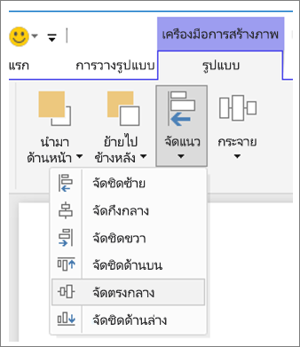

**รูปที่ 3: จัดแนวภาพใน Power BI Desktop**

นอกจากนี้ ใน Power BI แบบออนไลน์และ Power BI Desktop คุณยังสามารถควบคุมขนาดและตำแหน่งของภาพได้อย่างถูกต้องแม่นยำด้วยแถบ **General** ในพื้นที่การจัดรูปแบบสำหรับภาพทั้งหมด:

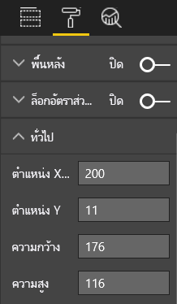

**รูปที่ 4: ตั้งค่าตำแหน่งที่แน่นอนสำหรับภาพของคุณ**

ในหน้าตัวอย่างรายงานของเรา (รูปที่ 2) บัตรที่ 2 และเส้นขอบที่มีขนาดใหญ่จะจัดแนวอยู่บน**ตำแหน่ง X**ที่ 200

#### ใส่พื้นที่วางให้พอดี
ใช้พื้นที่ที่คุณมีให้ได้ประโยชน์สูงสุด  ถ้าคุณทราบว่าจะมีการดู/แสดงรายงานอย่างไร ให้ออกแบบโดยคำนึงถึงสิ่งนั้นเป็นหลัก ลดช่องว่างเพื่อเติมพื้นที่ทำงาน  พยายามกำจัดความจำเป็นที่ต้องมีแถบเลื่อนบนภาพส่วนบุคคลให้ได้มากที่สุด  เติมช่องว่างโดยไม่ทำให้ภาพดูเหมือนถูกบีบอัด

##### ปรับขนาดหน้ารายงาน
การลดขนาดของหน้าจะทำให้แต่ละองค์ประกอบจะมีขนาดใหญ่ขึ้นซึ่งสัมพันธ์กับทั้งหน้า ทำขั้นตอนนี้ได้โดยการยกเลิกการเลือกภาพใดก็ได้บนหน้า และใช้แถบ**ขนาดหน้ากระดาษ**ในพื้นที่การจัดรูปแบบ  

นี่คือหน้ารายงานที่ใช้หน้าขนาด 4:3 จากนั้นใช้ 16:9 โปรดสังเกตว่าเค้าโครงเหมาะกับขนาด 16:9 มากกว่ามากอย่างไร เนื่องจากมีพื้นที่เพียงพอที่จะนำแถบเลื่อนจากภาพที่สองออกไปได้

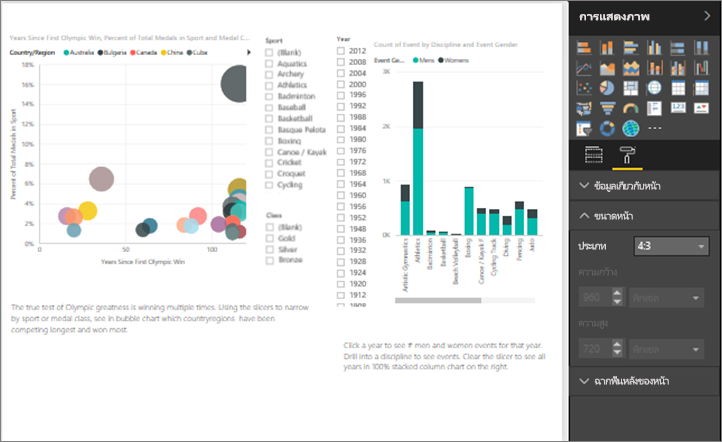

**รูปที่ 5a: รายงานขนาดหน้า 4:3** 

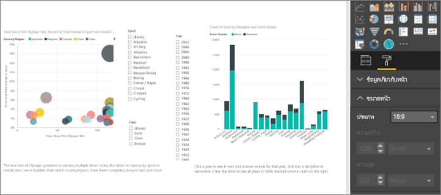

**รูป 5b: รายงานที่อัตราส่วนขนาดหน้า 16:9**

จะมีการดูรายงานของคุณในอัตราส่วน 4:3, 16:9 หรือขนาดอื่น? บนหน้าจอขนาดเล็กหรือหน้าจอขนาดใหญ่? หรือด้วยอัตราส่วนและขนาดหน้าจอที่เป็นไปได้ทั้งหมด?  ออกแบบโดยคำนึงถึงปัจจัยเหล่านี้

หน้ารายงานตัวอย่างของเราดูเหมือนถูกบีบอัดเล็กน้อย โดยไม่มีการเลือกภาพ เปิดพื้นที่การจัดรูปแบบ โดยการเลือกไอคอนลูกกลิ้งทาสี ขยาย**ขนาดหน้ารายงาน**และเปลี่ยน**ความสูง**เป็น 900

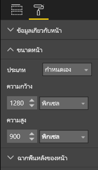

**รูปที่ 6: เพิ่มความสูงของหน้า**

#### ลดกองข้อความ
หน้ารายงานที่รกจะทำให้เข้าใจยาก และอาจทำให้ผู้อ่านรายงานรู้สึกรับข้อมูลไม่ไหวและไม่แม้แต่จะลองอ่านรายงาน  ลบองค์ประกอบรายงานทั้งหมดที่ไม่จำเป็น อย่าเพิ่มองค์ประกอบที่ไม่จำเป็นและไม่ช่วยในการทำความเข้าใจหรือการนำทาง หน้ารายงานของคุณต้องสื่อข้อมูลอย่างชัดเจน และรวดเร็ว และดึงความสนใจไว้เท่าที่จะทำได้

Edward Tufte เรียกมันว่า "อัตราส่วนข้อมูลต่อหมึก" ในสมุดนี้*ภาพแสดงข้อมูลเชิงปริมาณ*  โดยทั่วไปแล้วให้ลบสิ่งที่ไม่จำเป็นออก

กองข้อความที่คุณลบออกจะเพิ่มพื้นที่ว่างสีขาวบนหน้ารายงานของคุณ และให้คุณมีพื้นที่เพิ่มเติมในการใช้แนวทางปฏิบัติที่ดีที่สุดที่เราได้เรียนรู้แล้วด้านบนในหัวข้อ "การจัดแนว เรียงลำดับ และความใกล้เคียง"

ตอนนี้ตัวอย่างของเราดูดีขึ้นแล้ว เราได้ลบกองข้อความจำนวนมากออกไปและเพิ่มรูปร่างเพื่อรวมองค์ประกอบกลุ่มเข้าด้วยกัน  รูปพื้นหลังจะหายไปแล้ว กล่องข้อความและรูปร่างลูกศรที่ไม่จำเป็นหายไป ได้ย้ายหนึ่งภาพไปยังหน้าอื่นในรายงาน เป็นต้น นอกจากนี้เราได้ขยายขนาดของหน้าเพื่อเพิ่มช่องว่าง (สีเหลือง?) สีขาว

**รูปที่ 7: ตัวอย่างรายงานที่ไม่สวยของเราถูกลบกองข้อความ**

### บอกเล่าเรื่องราวอย่างรวดเร็ว
การทดสอบโดยรวมคือ ใครก็ตามที่ไม่มีความรู้เรื่องนี้มาก่อนสามารถเข้าใจรายงานได้อย่างรวดเร็วโดยที่ไม่ต้องมีใครอธิบาย เมื่อดูอย่างอย่างรวดเร็ว ผู้อ่านรายงานควรสามารถดูเห็นได้อย่างรวดเร็วว่าหน้าดังกล่าวเกี่ยวกับอะไร และแต่ละแผนภูมิ/ตารางเกี่ยวกับอะไร   

เมื่อผู้อ่านดูรายงานของคุณ ตาของผู้อ่านควรจับจ้องที่องค์ประกอบที่คุณต้องการให้พวกเขาดูในขั้นแรก จากนั้นตาของพวกเขาจะเลื่อนจากซ้ายไปขวา และจากบนลงล่าง  เปลี่ยนพฤติกรรมนี้โดยการเพิ่มลำดับภาพ เช่น ป้ายชื่อกล่องข้อความ รูปร่าง เส้นขอบ ขนาด และสี  

#### กล่องข้อความ
บางครั้งชื่อเรื่องบนการแสดงภาพไม่เพียงพอที่จะบอกเล่าเรื่องราว  เพิ่มกล่องข้อความเพื่อสื่อสารกับบุคคลที่ดูรายงานของคุณ  กล่องข้อความสามารถอธิบายหน้ารายงาน การจัดกลุ่มภาพ หรืออธิบายแต่ละภาพได้ กล่องข้อความสามารถอธิบายผลลัพธ์หรือระบุภาพ องค์ประกอบในภาพ หรือความสัมพันธ์ระหว่างภาพได้ดียิ่งขึ้น คุณสามารถใช้กล่องข้อความเพื่อดึงความสนใจตามเงื่อนไขที่แตกต่างที่เรียกว่า ภายนอกกล่องข้อความ

ในบริการ Power BI จากแถบเมนูด้านบน เลือก**กล่องข้อความ** (ใน Power BI Desktop เลือก**กล่องข้อความ**จากพื้นที่**แทรก**ของ Ribbon)

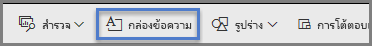

**รูปที่ 8: เพิ่มกล่องข้อความ**

พิมพ์ในกล่องเปล่าแล้วใช้ตัวควบคุมที่ด้านล่างเพื่อตั้งค่าแบบตัวอักษร ขนาด การจัดแนว และอื่น ๆ ใช้ด้ามจับเพื่อปรับขนาดกล่อง

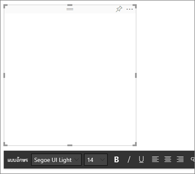

**รูปที่ 9: จัดรูปแบบกล่องข้อความ**

แต่อย่าจัดรูปแบบมากเกินไป! ข้อความมากเกินไปในรายงานจะทำลายสมาธิและดึงความสนใจจากภาพ ถ้าคุณพบว่าหน้ารายงานของคุณจำเป็นต้องมีข้อความจำนวนมากเพื่อทำให้เข้าใจได้ง่ายขึ้น ดังนั้นคุณควรเริ่มทำใหม่อีกครั้ง  คุณสามารถเลือกภาพอื่นที่บอกเล่าเรื่องราวได้ดีกว่าได้หรือไม่? คุณสามารถเปลี่ยนชื่อภาพแบบเดิมให้ฟังดูแล้วเข้าใจได้มากขึ้นได้หรือไม่?   

#### ข้อความ
สร้างแนวทางสไตล์ข้อความและนำไปใช้กับทุกหน้าของรายงานของคุณ เลือกเพียงไม่กี่แบบตัวอักษร ขนาดข้อความ และสี  ใช้แนวทางสไตล์นี้กับองค์ประกอบข้อความและตัวเลือกแบบอักษรที่คุณสร้างภายในการแสดงภาพของคุณ (ดูชื่อและป้ายชื่อที่เป็นส่วนหนึ่งของการแสดงภาพดังด้านล่าง) ตั้งกฎว่าเมื่อไหร่คุณจะใช้รูปแบบตัวหนา ตัวเอียง ขนาดตัวอักษรที่ใหญ่ขึ้น สีบางสี และอื่น ๆ  พยายามหลีกเลี่ยงการใช้ตัวพิมพ์ใหญ่หรือการขีดเส้นใต้ทั้งหมด

#### รูปร่าง
รูปร่างก็เช่นกันที่สามารถช่วยการนำทางและการทำความเข้าใจได้ ใช้รูปร่างเพื่อจัดกลุ่มข้อมูลที่เกี่ยวข้องกัน ทำไฮไลท์ข้อมูลที่สำคัญ และใช้ลูกศรเพื่อนำทางการดู รูปร่างช่วยให้ผู้อ่านเข้าใจตำแหน่งที่จะเริ่มและวิธีการแปลความหมายรายงานของคุณ ในเงื่อนไขการออกแบบ ส่วนนี้มักจะเรียกว่า*ความคมชัด*

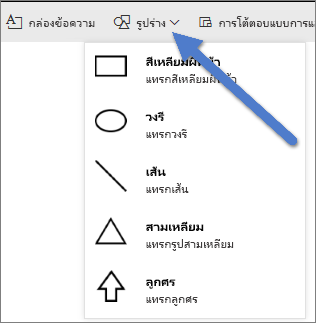

**รูปที่ 10a: รูปร่างในบริการ Power BI**

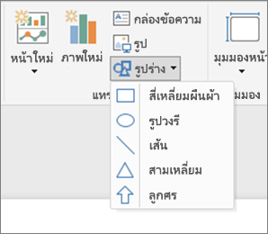

**รูปที่ 10b: รูปร่างในบริการ Power BI**

หน้าตัวอย่างของเรามีลักษณะอย่างไร?  รูป 11 แสดงหน้าที่สะอาดกว่า มีกองข้อความน้อยกว่า โดยมีการใช้หน้าตาของข้อความ แบบตัวอักษร และสีที่สอดคล้องกัน  ชื่อเรื่องของหน้าที่มุมบนซ้ายบอกเราว่าหน้าดังกล่าวเกี่ยวกับอะไร

**รูปที่ 11: ตัวอย่างรายงานของเราที่มีการนำคำแนะนำข้อความไปใช้และเพิ่มชื่อเรื่อง**

ในตัวอย่างของเรามีการเพิ่มชื่อเรื่องของหน้ารายงานที่มุมบนซ้าย ซึ่งเป็นจุดแรกที่ผู้อ่านจะดู ขนาดตัวอักษรคือ 28 และตัวอักษรคือ Segoe ตัวหนาเพื่อช่วยให้โดดเด่นจากส่วนอื่น ๆ ของหน้า  คำแนะนำสไตล์ข้อความไม่เรียกใช้พื้นหลัง ชื่อเรื่องสีดำ คำอธิบายแผนภูมิ และป้ายชื่อและที่ถูกนำไปใช้กับภาพทั้งหมดบนหน้า ในส่วนที่ทำได้ (แกนแผนภูมิผสมและป้ายชื่อจะไม่สามารถแก้ไขได้)  นอกจากนี้:

* การ์ด: **ประเภทป้ายชื่อ**ตั้งค่าเป็นปิด **ชื่อเรื่อง**เป็นเปิดใช้งาน และตั้งค่าให้อยู่กึ่งกลางของ 12pt สีดำ
* ชื่อเรื่องเป็นภาพ: ถ้าเปิดใช้งานอยู่ ตั้งค่าเป็น 12pt และชิดซ้าย
* ตัวแบ่งส่วนข้อมูล: **หัวข้อ**ตั้งค่าเป็นปิด **ชื่อเรื่อง**เป็นเปิดใช้งาน ทิ้งให้**รายการ** > **ข้อความ**เป็นสีเทาและ 10pt
* แผนภูมิกระจายและคอลัมน์: ฟอนต์สีดำสำหรับแกน X และ Y และชื่อเรื่องแกน X และ Y ถ้ามีการใช้งาน

#### สี
ใช้สีเพื่อความสอดคล้องกัน  เราจะพูดคุยเพิ่มเติมเกี่ยวกับสีในหลักการของการออกแบบภาพที่ด้านล่าง แต่ตรงจุดนี้เรากำลังหมายถึงการเลือกสีอย่างรอบคอบเพื่อไม่ให้รบกวนความสนใจของผู้อ่านในการทำความเข้าใจรายงานของคุณได้อย่างรวดเร็ว  สีสว่างหลายสีมากเกินไปจะรบกวนประสาทสัมผัส ส่วนนี้จะอธิบายเพิ่มเติมถึงสิ่งที่ไม่ควรทำกับสี

#### พื้นหลัง
เมื่อตั้งค่าพื้นหลังสำหรับหน้ารายงาน เลือกสีที่ไม่บดบังรายงานมากเกินไป หรือไม่กลมกลืนกับสีอื่น ๆ ในหน้ารายงาน หรือเป็นสีที่ปกติแล้วรบกวนสายตาผู้อ่าน โปรดทราบว่าสีบางสีมีความหมายในตัวของมันเอง  ตัวอย่างเช่น ในสหรัฐอเมริกา สีแดงในรายงานจะโดยทั่วไปจะถูกตีความหมายเป็น "ไม่ดี"

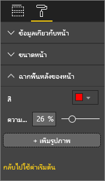

**รูปที่ 12 : ตั้งค่าพื้นหลังของรายงาน**

คุณกำลังสร้างรายงานที่วิจิตรงดงามได้ แต่รายงานนั้นต้องสามารถใช้งานได้ เลือกสีที่ช่วยทำให้การอ่านทำได้ง่ายขึ้นและช่วยให้องค์ประกอบรายงานโดดเด่นขึ้น  

การศึกษาเกี่ยวกับการใช้สีและจัดรูปแบบข้อมูลภายในเว็บเพจพบว่า ความคมชัดระหว่างสีต่าง ๆ ที่มากกว่าช่วยทำให้เข้าใจได้เร็วกว่า (ผลของสีข้อความและพื้นหลังที่มีต่อการค้นหาภาพของเว็บเพจ และ**การกำหนดการรับรู้ของผู้ใช้ต่อความซับซ้อนของภาพภาพบนเว็บเพจและลักษณะความสวยงาม**)

เราได้ใช้แนวทางปฏิบัติที่ดีที่สุดสำหรับสีกับตัวอย่างรายงานของเรา (รูปที่ 20 และ 21) ด้านล่าง ส่วนที่โดดเด่นที่สุดคือเราได้เปลี่ยนสีพื้นหลังเป็นสีดำ  สีเหลืองสว่างเกินไปและทำให้ตาของเราเกิดความเครียด  นอกจากนี้ บนแผนภูมิ "จำนวนชื่อนักกีฬาแยกตามปีและระดับชั้น" ส่วนที่เป็นสีเหลืองของแถบจะถูกกลืนเข้าไปในพื้นหลังสีเหลือง  การใช้พื้นหลังสีดำ (หรือสีขาว) ทำให้เกิดความคมชัดสูงสุดและทำให้ผู้อ่านมุ่งความสนใจไปที่ภาพ

ต่อไปนี้เป็นขั้นตอนเพิ่มเติมที่เราต้องการใช้เพื่อปรับปรุงรายงานตัวอย่าง:

**ชื่อเรื่องของหน้า**

เมื่อเราได้เปลี่ยนพื้นหลังเป็นสีดำแล้ว ชื่อเรื่องของเราหายไปเนื่องจากช่องกล่องข้อความอนุญาตเฉพาะฟอนต์สีดำเท่านั้น   เมื่อต้องการแก้ไขปัญหานี้ ให้เพิ่มชื่อเรื่องกล่องข้อความแทน  ในกล่องข้อความที่เลือก ให้ลบข้อความ และที่แถบการจัดรูปแบบข้อมูล เลือก**ชื่อเรื่อง**และเปิดใช้งาน เลือกลูกศรเพื่อขยายตัวเลือก**ชื่อเรื่อง** พิมพ์**Summer Olympic Games**ลงในช่องข้อมูล**ข้อความชื่อเรื่อง** และเลือกสีขาวสำหรับ**สีแบบอักษร**

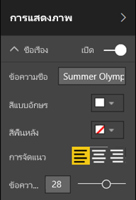

**รูปที่ 13 : เพิ่มชื่อของหน้า**

**การ์ด**

สำหรับภาพบัตร เปิดพื้นที่การจัดรูปแบบ (ไอคอนลูกกลิ้งทาสี) และเปิดใช้งาน**พื้นหลัง** เลือกสีขาวพร้อมด้วยความโปร่งใสของ 0% จากนั้นเปิด**ชื่อเรื่อง** เลือก**สีฟอนต์**สีขาว และ**สีพื้นหลัง**สีดำ

**ตัวแบ่งส่วนข้อมูล**

ถึงตรงนี้ ตัวแบ่งส่วนข้อมูลสองตัวมีการจัดรูปแบบที่แตกต่างกัน ซึ่งไม่สมเหตุสมผลสำหรับการออกแบบ สำหรับทั้งสองตัวแบ่งส่วนข้อมูล เปลี่ยนสีพื้นหลังเป็นฟ้าน้ำทะเล  สีฟ้าน้ำทะเลเป็นตัวเลือกที่ดีเนื่องจากเป็นส่วนหนึ่งของชุดสีของหน้า คุณสามารถดูในแผนที่ทึบ แผนภูมิต้นไม้ และแผนภูมิคอลัมน์ได้

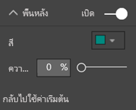

**รูปที่ 14: เปลี่ยนสีพื้นหลังตัวแบ่งส่วนข้อมูล**

เพิ่มเส้นขอบบาง ๆ สีขาว

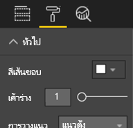

**15 รูป: เพิ่มเส้นขอบตัวแบ่งส่วนข้อมูล**

แบบอักษรสีเทายากต่อการเห็นเมื่อเทียบกับสีฟ้าน้ำทะเล ดังนั้นให้เปลี่ยนสี**รายการ**เป็นสีขาว

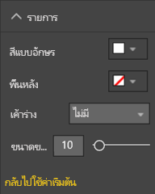

**รูปที่ 16: เปลี่ยนสีฟอนต์ตัวแบ่งส่วนข้อมูล**

และสุดท้าย ใต้**ชื่อเรื่อง**เปลี่ยน**สีฟอนต์**เป็นสีขาว และเพิ่ม**สีพื้นหลัง**เป็นสีดำ

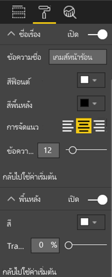

**รูปที่ 17: จัดรูปแบบชื่อตัวแบ่งส่วนข้อมูล**

**รูปร่างสี่เหลี่ยมผืนผ้า**

สี่เหลี่ยมผืนผ้าจะถูกกลืนในพื้นหลังสีดำเช่นกัน  เมื่อต้องการแก้ไขปัญหานี้ เลือกรูปร่าง และในพื้นที่**จัดรูปแบบรูปร่าง** เปิดใช้งาน**พื้นหลัง**

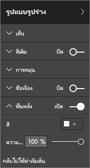

**รูปที่ 18 : จัดรูปแบบรูปร่าง**

**แผนภูมิคอลัมน์ แผนภูมิฟองอากาศ แผนผังทึบ และแผนผังต้นไม้**

เพิ่มรูปพื้นหลังสีขาวไปยังภาพที่เหลือบนหน้ารายงาน จากพื้นที่การจัดรูปแบบ ขยายตัวเลือก**เส้น**และตั้งค่า**สีเส้น**เป็นสีขาว และ**น้ำหนัก**เป็น 3

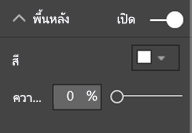

**รูปที่ 19 : เพิ่มรูปพื้นหลังสีขาวไปยังแสดงภาพที่เหลือ**

**รูปที่ 20 : ตัวอย่างรายงานที่ใช้แนวทางปฏิบัติที่ดีที่สุดสำหรับสี (พื้นหลังสีดำ)**

**รูปที่ 21 : ตัวอย่างรายงานที่ใช้แนวทางปฏิบัติที่ดีที่สุดสำหรับสี (พื้นหลังสีขาว)**
 

### ความงาม
สิ่งที่เราจะพิจารณาอย่างมากคือความงามอย่างที่เราได้กล่าวถึงไปแล้วข้างต้น ซึ่งคือองค์ประกอบต่าง ๆ เช่น การจัดแนว สี ตัวเลือกฟอนต์ กลุ่มข้อความ  แต่มีหลักปฏิบัติที่ดีที่สุดเพิ่มเติมบางประการสำหรับการออกแบบรายงานที่เราควรกล่าวถึง และส่วนเหล่านี้มีผลโดยตรงต่อลักษณะปรากฏโดยรวมของรายงาน  

โปรดจำไว้ว่า การใช้งานรายงานของคุณจะต้องตรงตามความต้องการทางธุรกิจ ไม่ใช่เพื่อความสวยงาม  แต่ยังคงต้องมีความสวยงามในระดับหนึ่ง โดยเฉพาะอย่างยิ่งเพื่อสร้างความประทับใจเมื่อแรกเห็น ที่ปรึกษา Nashville, Tony Bodoh ได้อธิบายว่า "อารมณ์ลุกโชนในเวลาครึ่งวินาทีก่อนที่ตรรกะจะเริ่มขึ้น"  เมื่อแรกเห็น ผู้อ่านรายงานจะแสดงปฏิกริยาความรู้สึกที่ระดับหนึ่งต่อหน้ารายงาน ก่อนที่จะใช้เวลามากขึ้นเพื่อเจาะลึกในรายละเอียด ถ้าหน้ารายงานของคุณมีลักษณะไม่เป็นระเบียบ สับสน ดูไม่เป็นมืออาชีพ...ผู้อ่านรายงานของคุณอาจไม่ทราบเรื่องราวอันทรงพลังที่รายงานพยายามจะสื่อเลยก็เป็นได้

TDI บล็อกเกอร์และนักวิเคราะห์อุตสาหกรรม TechTarget, Wayne Eckerson ได้ให้อุปมาไว้ดีเยี่ยม  การออกแบบรายงานเป็นเหมือนตกแต่งห้องสักห้อง  เมื่อเวลาผ่านไปคุณจะซื้อแจกัน โซฟา โต๊ะ และภาพวาด  เมื่อพิจารณาแยกกัน คุณชอบทุกองค์ประกอบเหล่านี้ แต่ถึงแม้ว่าแต่ละส่วนที่เลือกจะดูเหมาะสมดี แต่เมื่อรวมกันแล้วกลับดูไม่กลมกลืนกันหรือแข่งขันกันเพื่อดึงความสนใจ

มุ่งความสนใจที่:

* การสร้างธีมหรือลักษณะปรากฏทั่วไปสำหรับรายงานของคุณ และนำธีมนั้นไปใช้กับทุกหน้าของรายงาน
* ใช้รูปแบบภาพเดี่ยวและกราฟิกอื่น ๆ ช่วยและไม่เบี่ยงเบนออกจากเรื่องราวที่ต้องการจะสื่อจริง ๆ
* และใช้แนวทางปฏิบัติที่ดีที่สุดทั้งหมดที่เรากล่าวถึงจนถึงจุดนี้ของบทความ

## หลักการของการออกแบบภาพ
เราได้ทำการค้นหาหลักการของการออกแบบรายงาน วิธีการจัดระเบียบองค์ประกอบรายงานที่ช่วยทำให้รายงานสามารถเข้าใจได้ง่ายและรวดเร็ว  ในตอนนี้ เราจะดูที่หลักการการออกแบบสำหรับภาพ  และในหัวข้อถัดไป เราจะเจาะลึกลงในแต่ละภาพและพูดคุยเกี่ยวกับหลักปฏิบัติที่ดีที่สุดสำหรับ้บางประเภทที่ใช้กันทั่วไปมากกว่า

ในหัวข้อนี้ เรากำลังจะออกจากหน้ารายงานที่มีเฉพาะตัวอย่างของเราชั่วขณะและดูตัวอย่างอื่น ๆ  หลังจากที่เราได้เรียนรู้หลักการการออกแบบภาพ เราจะกลับไปยังหน้ารายงานตัวอย่างของเราและนำสิ่งที่เราได้เรียนรู้ไปใช้ (พร้อมคำแนะนำทีละขั้นตอน)  

### การวางแผน – เลือกภาพที่ถูกต้อง
เราจำเป็นต้องวางแผนในการเลือกภาพ ซึ่งขั้นตอนนี้มีความสำคัญพอ ๆ กับการวางแผนก่อนที่จะเริ่มทำรายงานของคุณ  ถามตัวคุณเองว่า "ฉันจะบอกเล่าเรื่องราวอะไรกับภาพนี้?" และจากนั้นตรวจสอบชนิดของภาพที่จะบอกเล่าเรื่องราวได้ที่ดีที่สุด คุณสามารถแสดงความคืบหน้าผ่านวงจรการขายเป็นแผนภูมิแท่งได้ แต่คุณคิดว่าแผนภูมิแบบน้ำตกหรือแผนภูมิกรวยจะสื่อสารเรื่องราวได้ดีกว่าหรือไม่? สำหรับความช่วยเหลือเกี่ยวกับส่วนนี้ อ่านหัวข้อสุดท้ายของเอกสารนี้ "ชนิดของภาพและแนวทางปฏิบัติที่ดีที่สุด" ซึ่งจะอธิบายหลักปฏิบัติที่ดีที่สุดสำหรับประเภทที่มีการใช้กันทั่วไปมากกว่า  ไม่ต้องแปลกใจเลยถ้าชนิดของภาพแรกที่คุณเลือกไม่ใช่ตัวเลือกที่ดีที่สุดของคุณ  ลองมากกว่าหนึ่งชนิดเพื่อดูว่าภาพชนิดใดที่สื่อความหมายได้ดีที่สุด

ทำความเข้าใจถึงความแตกต่างระหว่างข้อมูลเชิงกลุ่มและเชิงปริมาณ และทราบว่าภาพชนิดใดใช้งานได้ดีที่สุดกับข้อมูลประเภทใด ข้อมูลเชิงปริมาณมักจะหมายถึงการวัด และโดยทั่วไปแล้วจะเป็นตัวเลข ข้อมูลเชิงกลุ่มมักจะหมายถึงมิติ และสามารถจำแนกประเภทได้ ซึ่งจะกล่าวถึงแบบลงลึกเพิ่มเติมใน "เลือกหน่วยวัดที่ถูกต้อง" ด้านล่างนี้

หลีกเลี่ยงการใช้ภาพชนิดที่หลากสีสันหรือซับซ้อนมากขึ้นเพียงเพื่อทำให้รายงานของคุณดูน่าประทับใจมากขึ้น สิ่งที่คุณต้องการคือตัวเลือกที่เรียบง่ายที่สุดเพื่อสื่อความหมายของเรื่องราวของคุณ แผนภูมิแท่งแนวนอนและแผนภูมิเส้นแบบง่ายสามารถสื่อข้อมูลได้อย่างรวดเร็ว  แผนภูมิเหล่านี้ให้ความคุ้นเคยและความรู้สึกสบาย และผู้อ่านส่วนใหญ่สามารถแปลความหมายได้อย่างง่ายดาย  ประโยชน์ที่เพิ่มมาก็คือ ผู้คนส่วนใหญ่อ่านจากซ้ายไปขวาและจากบนลงล่าง แผนภูมิสองชนิดนี้จึงทำให้ผู้อ่านสามารถสแกนและทำความเข้าใจได้อย่างรวดเร็วได้

ภาพของคุณจำเป็นต้องมีการเลื่อนเพื่อบอกเล่าเรื่องราวหรือไม่? หลีกเลี่ยงการเลื่อนถ้าทำได้  ลองใช้ตัวกรองและใช้ลำดับชั้น/เจาะลึกข้อมูลลง และถ้าส่วนเหล่านี้ไม่กำจัดแถบเลื่อนออกไป พิจารณาเลือกรูปภาพชนิดอื่น ถ้าคุณไม่สามารถหลีกเลี่ยงการเลื่อนได้ การเลื่อนตามแนวนอนดีกว่าการเลื่อนตามแนวตั้ง

แม้ว่าคุณเลือกภาพที่ดีที่สุดสำหรับเรื่องราวของคุณแล้ว แต่คุณอาจยังต้องช่วยในการบอกเล่าเรื่องราวด้วย  ซึ่งนั่นเป็นส่วนที่่ป้ายชื่อ ชื่อเรื่อง เมนู ขนาด และสีจะเข้ามามีส่วนร่วม เราจะกล่าวถึงองค์ประกอบการออกแบบเหล่านี้ในภายหลังในหัวข้อที่ชื่อว่า "องค์ประกอบการออกแบบ"

### เลือกหน่วยวัดที่ถูกต้อง
เรื่องราวที่ภาพของคุณกำลังบอกเล่าดึงดูดความสนใจหรือไม่? มีความสำคัญหรือไม่?  อย่าสร้างภาพเพียงเพื่อให้ได้ชื่อว่าสร้างภาพเท่านั้น บางทีคุณอาจคิดว่าข้อมูลจะบอกเล่าเรื่องราวที่น่าสนใจได้ แต่ไม่เป็นเช่นนั้นเลย อย่ากลัวที่จะเริ่มต้นใหม่และค้นหาเรื่องราวที่น่าสนใจกว่า หรือเรื่องราวอาจมีอยู่แล้ว แต่ต้องได้รับการนำเสนอด้วยการวัดวิธีอื่น

ตัวอย่างเช่น คุณต้องการวัดความสำเร็จของผู้จัดการฝ่ายขายของคุณ หน่วยวัดใดที่คุณใช้เพื่อทำสิ่งนี้?  จะคุณวัดได้ที่ดีที่สุดโดยดูยอดขายรวมหรือผลกำไรโดยรวม การเติบโตปีก่อนหน้า หรือประสิทธิภาพการทำงานเทียบกับเป้าหมาย? พนักงานขายที่ชื่อ Sally อาจสร้างกำไรมากที่สุด และถ้าคุณแสดงผลกำไรโดยรวมแยกตามพนักงานขายในแผนภูมิแท่ง Sally จะเป็นดาวเด่นเลยทีเดียวเมื่อเปรียบเทียบกับพนักงานขายคนอื่น ๆ  แต่ถ้า Sally มีค้นทุนสำหรับยอดขายดังกล่าวที่สูง (ค่าใช้จ่ายการเดินทาง ต้นทุนการจัดส่ง ต้นทุนการผลิต เป็นต้น) การดูแค่การขายจะไม่สื่อเรื่องราวที่ดีที่สุด

#### สะท้อนความเป็นจริง / ไม่บิดเบือนความเป็นจริง
การสร้างภาพที่บิดเบือนความจริงนั้น เป็นไปได้ มีเว็บไซต์หนึ่งที่ผู้ที่โปรดปรานข้อมูลแชร์ภาพที่ "ไม่ถูกต้อง" และข้อคิดเห็นส่วนใหญ่คือ ผิดหวังในบริษัทที่สร้างและกระจายภาพนั้น  นั่นสื่อข้อความว่าเราไม่สามารถไว้ใจพวกเขาได้

ดังนั้นให้สร้างภาพที่ไม่ตั้งใจบิดเบือนความเป็นจริง และที่ไม่ได้บอกเล่าเรื่องราวตามที่ใจคุณต้องการให้บอก  ต่อไปนี้คือหนึ่งตัวอย่าง:

**รูปที่ 22 : แผนภูมิที่บิดเบือนความเป็นจริง**

ในตัวอย่างนี้จะปรากฏเหมือนกับว่ามีความแตกต่างอย่างมากระหว่าง 4 บริษัท และ CorpB ประสบความสำเร็จมากกว่าทั้ง 3 บริษัทมาก  แต่โปรดสังเกตว่า แกน X ไม่ได้เริ่มต้นที่ศูนย์ และความแตกต่างระหว่างบริษัทเหล่านี้มีแนวโน้มที่จะมีข้อผิดพลาด  นี่คือข้อมูลเดียวกันโดยที่แกน X เริ่มต้นที่ศูนย์

**รูปที่ 23 : แผนภูมิจริง**

ผู้อ่านคาดหมายและมักจะคาดการณ์ว่าแกน X จะเริ่มต้นที่ศูนย์ ถ้าคุณตัดสินใจที่จะไม่เริ่มต้นที่ศูนย์ คุณสามารถทำเช่นนั้นได้ในลักษณะที่ไม่บิดเบือนผลลัพธ์ และพิจารณาเพิ่มการเตือนภาพหรือกล่องข้อความเพื่อชี้ให้เห็นสิ่งที่แตกต่างจากปกติ  

### องค์ประกอบการออกแบบ
เมื่อคุณเลือกชนิดและการวัด รวมถึงได้สร้างภาพแล้ว ถึงเวลาปรับแต่งหน้าจอแสดงเพื่อให้ได้ประสิทธิภาพสูงสุด  หัวข้อนี้ครอบคลุมถึง:

* เค้าโครง พื้นที่ว่าง และขนาด
* องค์ประกอบข้อความ: ป้ายชื่อ คำอธิบายประกอบ เมนู ชื่อเรื่อง
* เรียงลำดับ
* การโต้ตอบกับภาพ
* สี

#### ปรับแต่งภาพเพื่อการใช้งานพื้นที่ว่างให้ที่ดีที่สุด
ถ้าคุณกำลังพยายามใส่หลายแผนภูมิลงในหนึ่งรายงาน การขยายอัตราส่วนข้อมูลต่อหมึกของคุณให้สูงที่สุดจะช่วยทำให้เรื่องราวในข้อมูลของคุณมีความโดดเด่นขึ้น ตามที่กล่าวถึงด้านบน Edward Tufte ได้แนะนำอัตราส่วน 'ข้อมูลต่อหมึก' ไว้: เป้าหมายคือการลบเครื่องหมายออกจากแผนภูมิให้มากที่สุดเท่าที่จะทำได้โดยไม่ทำให้ความสามารถของผู้อ่านในการแปลข้อมูลด้อยลง

ในแผนภูมิชุดแรกที่ด้านล่างมีป้ายชื่อแกน (ม.ค. 2014, เม.ย. 2014 ฯลฯ) และชื่อเรื่อง (เรียงตาม "วันที่") จำนวนมาก นอกจากนี้ ชื่อเรื่องสำหรับแต่ละแผนภูมิจำเป็นต้องมีช่องว่างในแนวนอนทั่วทั้งแผนภูมิ ด้วยการลบชื่อแผนภูมิและเปิดใช้งานแต่ละป้ายชื่อแกน เราจะลบหมึกบางรายการออกและจะใช้งานพื้นที่ว่างโดยรวมได้ดียิ่งขึ้น เราสามารถลบป้ายชื่อแกนสำหรับสองแผนภูมิด้านบนได้เพื่อลดหมึก และใช้ช่องว่างดังกล่าวสำหรับข้อมูลได้มากขึ้น

หากมีีรอบระยะเวลาเฉพาะที่คุณต้องการเรียกใช้ คุณสามารถวาดเส้นหรือสี่เหลี่ยมผืนผ้าอยู่เบื้องหลังแผนภูมิทั้งหมดได้ เพื่อช่วยในการกวาดตาขึ้นและลงและช่วยในการเปรียบเทียบ

**รูปที่ 24 : ก่อน**

**รูปที่ 25: หลัง**

**การเปิดและปิดชื่อแกน**

เลือกภาพเพื่อเปิดใช้งานและเปิดพื้นที่การจัดรูปแบบ ขยายตัวเลือกสำหรับการ**แกน X**หรือ**แกน Y** แล้วลากตัวเลื่อนสำหรับเปิดหรือปิด**ชื่อเรื่อง**

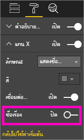

**รูปที่ 26 : เปิดและปิดชื่อแกน**

**การเปิดและปิดป้ายติดแกน**

เลือกภาพเพื่อเปิดใช้งานและเปิดพื้นที่การจัดรูปแบบ ถัดจาก**แกน X**และ**แกน Y**จะเป็นตัวเลื่อน  ลากตัวเลื่อนเพื่อเปิดหรือปิดการป้ายชื่อแกน

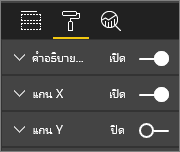

**รูปที่ 27 : เปิดและปิดป้ายชื่อแกน**

> [!TIP]
> มีหนึ่งสถานการณ์ที่คุณอาจปิดใช้งานป้ายชื่อแกน Y นั่นคืือ หากคุณเปิดใช้งาน**ป้ายชื่อข้อมูล**อยู่
> 
> 

**การลบชื่อเรื่องของภาพ**

เลือกภาพเพื่อเปิดใช้งานและเปิดพื้นที่การจัดรูปแบบ ตั้งค่าแถบเลื่อนสำหรับ**ชื่อเรื่อง**เป็นปิดใช้งาน

**รูปที่ 28 : ลบชื่อเรื่องออกจากภาพ**

พิจารณาว่าผู้อ่านของคุณจะดูรายงานอย่างไร และตรวจสอบให้ให้แน่ใจว่าภาพและข้อความของคุณมีขนาดใหญ่เพียงพอและเข้มเพียงพอสำหรับการอ่าน ถ้าคุณมีหนึ่งภาพที่มีสัดส่วนขนาดใหญ่กว่าภาพอื่น ผู้อ่านอาจคาดเดาว่าภาพนั้นเป็นภาพที่สำคัญมากที่สุด เว้นช่องว่างให้เพียงพอระหว่างแต่ละภาพ เพื่อให้ รายงานของคุณดูไม่รกรุงรังและสับสน  จัดแนวภาพของคุณเพื่อช่วยนำทางตาของผู้อ่าน

**การปรับขนาดภาพ**

เลือกภาพเพื่อเปิดใช้งาน จับภาพและลากด้ามจับหนึ่งเพื่อปรับขนาด

**รูปที่ 29 : ปรับขนาดภาพ**

**การเคลื่อนย้ายภาพ**

เลือกภาพเพื่อเปิดใช้งาน เลือกและกดค้างที่แถบจับที่อยู่กึ่งกลางด้านบนของภาพ จากนั้นลากภาพไปยังตำแหน่งใหม่

**รูปที่ 30 : เคลื่อนย้ายภาพ**

#### ชื่อและป้ายชื่อที่เป็นส่วนหนึ่งของการแสดงภาพ
ตรวจสอบให้แน่ใจว่าชื่อและป้ายชื่อจะสามารถอ่านได้และอธิบายความหมายในตัวมันเอง ข้อความในชื่อเรื่องและป้ายชื่อต้องมีขนาดที่เหมาะสมและด้วยสีที่โดดเด่น (เช่น สีดำแทนที่จะเป็นค่าเริ่มต้นอย่าง สีเทา) จำคำแนะนำสำหรับสไตล์ของเราได้หรือไม่ (ดู "ข้อความ" ด้านบน) ? จำกัดจำนวนสีและขนาด แบบอักษรที่มีหลายสีและหลายขนาดเกินไปจะทำให้หน้ารายงานดูยุ่งเหยิงและสับสน  พิจารณาใช้สีฟอนต์และขนาดเดียวกันสำหรับชื่อเรื่องของภาพทั้งหมดบนหน้ารายงาน และเลือกการจัดแนวเดียวกันสำหรับชื่อเรื่องทั้งหมดบนหน้ารายงาน  

**พื้นที่การจัดรูปแบบ**

สำหรับแต่ละการปรับเปลี่ยนการจัดรูปแบบที่แสดงอยู่ด้านล่าง เลือกไอคอนลูกกลิ้งทาสีเพื่อเปิดพื้นที่การจัดรูปแบบ

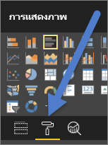

**รูปที่ 31: เปิดพื้นที่การจัดรูปแบบ**

จากนั้นเลือกองค์ประกอบภาพเพื่อปรับปลี่ยน และตรวจสอบให้แน่ใจว่ามีการเปิดใช้งาน ตัวอย่างขององค์ประกอบด้านภาพคือ: **แกน X**, **แกน Y**, **ชื่อเรื่อง**, **ป้ายชื่อข้อมูล** และ**คำอธิบายแผนภูมิ** ตัวอย่างด้านล่างแสดงองค์ประกอบ**ชื่อเรื่อง**

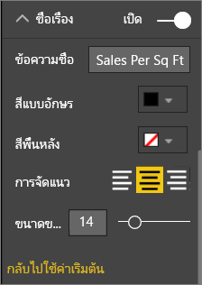

**รูปที่ 32 : จัดรูปแบบชื่อเรื่องภาพ**

**ตั้งค่าขนาดของข้อความ**

เราสามารถปรับขนาดข้อความชื่อเรื่องและป้ายชื่อข้อมูลได้ แต่ไม่ใช่สำหรับแกน X หรือ Y หรือคำอธิบายแผนภูมิ  สำหรับป้ายชื่อข้อมูลโดยเฉพาะ จัดแต่ง**หน่วยแสดง**และตัวเลข**ตำแหน่งทศนิยม**จนกว่าคุณได้รายละเอียดในระดับที่เหมาะสมสำหรับแสดงบนรายงานของคุณ   

**ตั้งค่าการจัดแนวข้อความ**

ตัวเลือกสำหรับการจัดแนวชื่อเรื่องคือ ซ้าย ขวา และจัดกึ่งกลาง  เลือกหนึ่งค่าและนำการตั้งค่าเดียวกันนั้นไปใช้กับภาพทั้งหมดบนหน้า  

**ตั้งค่าตำแหน่งของข้อความ**

เราสามารถถูกปรับตำแหน่งของข้อความสำหรับแกน Y และคำอธิบายแผนภูมิได้   ซึ่งขึ้นอยู่กับการเลือกของคุณ ทำเช่นเดียวกันนี้สำหรับแกน Y อื่นและอธิบายอื่น ๆ บนหน้า

**ตั้งค่าความยาวชื่อเรื่องและป้ายชื่อ**

ปรับความยาวของชื่อเรื่อง ชื่อแกน ป้ายชื่อข้อมูล และคำอธิบายแผนภูมิ ถ้าคุณตัดสินใจที่จะแสดงองค์ประกอบเหล่านี้ การปรับความยาว (พร้อมกับขนาดของข้อความ) ตรวจสอบให้แน่ใจว่าไม่มีสิ่งใดถูกตัดทอน สำหรับ**ชื่อเรื่อง**และ**คำอธิบายแผนภูมิ** การตั้งค่าคือ**ข้อความชื่อเรื่อง**และนี่คือบริเวณที่คุณพิมพ์ชื่อเรื่องตามจริงที่จะปรากฏบนภาพ สำหรับ**แกน X**และ**แกน Y** การตั้งค่าคือ**สไตล์** และคุณเลือกจากรายการแบบเลื่อนลง สำหรับ**ป้ายชื่อข้อมูล** การตั้งค่าคือ**แสดงผล**และ**ทศนิยม** ใช้รายการ**แสดงผล**แบบเลื่อนลงเพื่อเลือกหน่วยวัด: ล้าน พัน ไม่มี อัตโนมัติ และอื่น ๆ ใช้ช่องข้อมูล**ทศนิยม**เพื่อบอก Power BI ถึงจำนวนตำแหน่งทศนิยมที่ต้องการแสดง

**ตั้งค่าสีข้อความ**

สีข้อความสำหรับชื่อเรื่อง แกน และป้ายชื่อข้อมูล สามารถปรับเปลี่ยนได้  

#### ชื่อและป้ายชื่อที่ไม่เป็นส่วนหนึ่งของการแสดงภาพ
ก่อนหน้านี้ในเอกสารนี้ เรากล่าวถึงการเพิ่มกล่องข้อความไปยังหน้ารายงาน บางครั้งชื่อเรื่องบนการแสดงภาพไม่เพียงพอที่จะบอกเล่าเรื่องราว  เพิ่มกล่องข้อความเพื่อสื่อสารข้อมูลเพิ่มเติมกับผู้อ่านรายงานของคุณ  
เพื่อป้องกันไม่ให้หน้ารายงานของคุณดูสับสนหรือยุ่งเหยิงเกินไป ควรใช้งานแบบอักษรของกล่องข้อความ ขนาด สี และการจัดตำแหน่งให้สอดคล้องกัน เมื่อต้องการปรับเปลี่ยนข้อความในกล่องข้อความ เลือกกล่องข้อความเพื่อแสดงเมนูจัดรูปแบบ

**รูปที่ 33: จัดรูปแบบแบบอักษรที่ใช้ในกล่องข้อความ**

#### เรียงลำดับ
โอกาสที่ง่ายมากในการให้ข้อมูลเชิงลึกที่เร็วกว่า คือการตั้งค่าการเรียงลำดับภาพ ตัวอย่างเช่น แผนภูมิแท่งแบบเรียงลำดับจากน้อยไปมากหรือจากมากไปน้อยตามค่าในแถบ ซึ่งจะช่วยให้คุณแสดงข้อมูลแบบเพิ่มหน่วยที่สำคัญได้อย่างรวดเร็วโดยไม่ต้องใช้องค์ประกอบอื่นเพิ่มเติม

การเรียงลำดับแผนภูมิ เลือกจุดไข่ปลา (...) ที่ด้านบนขวาของแผนภูมิ เลือก**เรียงลำดับ**และเลือกช่องข้อมูลที่คุณต้องการเรียงลำดับและทิศทาง สำหรับข้อมูลเพิ่มเติม ดู[เปลี่ยนวิธีการเรียงลำดับภาพ](power-bi-report-change-sort.md)

#### การโต้ตอบและปฏิสัมพันธ์กับแผนภูมิ
คุณลักษณะของ Power BI ที่น่าสนใจมากที่สุดอย่างหนึ่งคือ ความสามารถในการแก้ไขวิธีที่แผนภูมิที่ทำงานร่วมกัน  ตามค่าเริ่มต้น แผนภูมิจะถูกทำไฮไลท์ข้าม: เมื่อคุณเลือกจุดข้อมูล ข้อมูลที่เกี่ยวข้องของแผนภูมิอื่น ๆ สว่างขึ้นและข้อมูลที่ไม่เกี่ยวข้องจะลดความสว่างขึ้น คุณสามารถแทนลักษณะการทำงานนี้ได้เพื่อใช้แผนภูมิใด ๆ เป็นตัวกรองจริง ซึ่งช่วยให้คุณไม่ต้องใช้องค์ประกอบอื่นบนหน้ารายงานของคุณ การทำเช่นนี้ เลือก**โต้ตอบภาพ**จากแถบเมนู

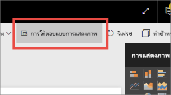

**รูปที่ 34 : โต้ตอบกับภาพ**

จากนั้น สำหรับแต่ละภาพบนหน้ารายงาน ตัดสินใจว่าคุณต้องการให้ภาพที่เลือกทำการกรอง ทำไฮไลท์ หรือไม่ต้องทำอะไร ภาพทั้งหมดไม่สามารถทำไฮไลท์ได้ และสำหรับภาพที่ไฮไลท์เป็นตัวควบคุมจะไม่พร้อมใช้งาน สำหรับข้อมูลเพิ่มเติม ดู[โต้ตอบแบบภาพใน Power BI](service-reports-visual-interactions.md)

> [!TIP]
> สำหรับผู้อ่านที่ยังไม่คุ้นเคยกับ Power BI ความสามารถในการคลิกและโต้ตอบกับรายงานอาจไม่เห็นได้ชัดเจนขึ้นในทันที เพิ่มกล่องข้อความเพื่อช่วยในการทำความเข้าใจสิ่งที่พวกเขาสามารถคลิกเพื่อค้นหาข้อมูลเชิงลึกเพิ่มเติมได้
> 
> 

#### การใช้สีในภาพ
ก่อนหน้านี้ในเอกสารนี้ เรากล่าวถึงความสำคัญของการมีแผนสำหรับวิธีที่คุณจะใช้สีกับทั้งรายงาน หัวข้อนี้จะมีการบางส่วนที่กล่าวไปแล้ว แต่โดยหลัก ๆ แล้วจะเป็นวิธีที่คุณใช้สีในแต่ละภาพ และใช้หลักการเดียวกัน: ใช้สีเพื่อผูกรวมรายงานเข้าด้วยกัน เพิ่มการเน้นข้อมูลสำคัญ และเพิ่มความเข้าใจของผู้อ่านที่มีต่อภาพ สีที่ต่างกันมากเกินไปจะรบกวนสมาธิและทำให้ยากต่อผู้อ่านสำหรับตำแหน่งที่จะต้องดู อย่าสละความสามารถในการทำความเข้าใจเพื่อแลกกับความงาม เพิ่มสีเฉพาะเมื่อสีนั้นจะสร้างความเข้าใจได้มากขึ้น

> [!TIP]
> รู้ว่าผู้อ่านรายงานของคุณเป็นใครและกฎการใช้สีตามนั้น  ตัวอย่างเช่น ในสหรัฐอเมริกา โดยทั่วไปแล้วสีเขียวหมายความว่า "ดี" และสีแดงโดยทั่วไปแล้วหมายความว่า "ไม่ดี"
> 
> 

หัวข้อนี้จะแบ่งย่อยเพื่อให้ครอบคลุมถึง:

1. สีของข้อมูล
2. สีของป้ายชื่อข้อมูล
3. สีสำหรับค่าแบบกลุ่ม
4. สีสำหรับค่าตัวเลข

**ใช้สีเพื่อเน้นข้อมูลที่น่าสนใจ**

วิธีง่ายที่สุดในการใช้สีคือ โดยการเปลี่ยนสีอย่าง น้อยหนึ่งจุดข้อมูลเพื่อดึงความสนใจไปยังข้อมูลนั้น ในตัวอย่างนี้ สีเปลี่ยนเมื่อโอลิมปิกเกมส์ย้ายจากวนรอบ 4 ปีเป็นรอบ 2 ป โดยสลับเป็นเกมฤดูร้อนและเกมฤดูหนาว

**รูปที่ 35 : ใช้สีเพื่อบอกเล่าเรื่องราว**

คุณสามารถเปลี่ยนสีของจุดข้อมูลได้จากแถบ**สีข้อมูล**พื้นที่การจัดรูปแบบ เมื่อต้องการกำหนดแต่ละจุดข้อมูลด้วยตนเอง ตรวจสอบให้แน่ใจว่าเปิดใช้งาน**แสดงทั้งหมด**

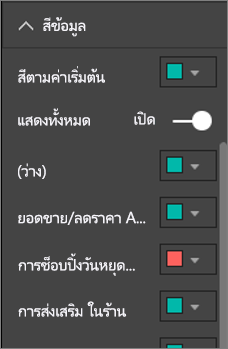

**รูปที่ 36 : ตั้งค่าสีจุดข้อมูล**

> [!NOTE]
> Power BI ใช้ธีมค่าเริ่มต้นกับภาพรายงานของคุณ  มีการเลือกสีของธีมเพื่อให้มีความหลากหลายและความคมชัด เมื่อต้องการเปลี่ยนสีธีมจากค่าเริ่มต้น เลือก**สีแบบกำหนดเอง**
> 
> 

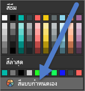

**รูปที่ 37 : เลือกสีแบบกำหนดเอง**

ใน Power BI Desktop คุณสามารถทำไฮไลท์ค่านอกขอบเขตหรือส่วนของเส้นโดยใช้ซีรีส์ที่สอง:

**รูปที่ 38 : ใช้เดสก์ท็อปเพื่อลงจุดค่านอกขอบเขต**

ตรงนี้ ค่าในชุดข้อมูล 'นอกขอบเขต' จะมีอยู่เฉพาะที่อุณหภูมิเฉลี่ยเดือนสิงหาคมที่ลดลงต่ำกว่า 60 องศา ขั้นตอนนี้สามารถทำได้โดยการสร้างคอลัมน์ที่ได้จากการคำนวณ DAX โดยใช้สูตรนี้:

ค่านอกขอบเขต = if(Editions[Temp]<60, Editions[Temp], BLANK())

ในตัวอย่างของเรามี 3 ค่านอกขอบเขต: 1952, 1956 และ 2000

**สีสำหรับป้ายชื่อและชื่อเรื่อง**

ขณะที่คุณสำรวจตัวเลือกการจัดรูปแบบทั้งหมดที่พร้อมใช้งาน คุณจะพบตำแหน่งต่าง ๆ มากมายที่สามารถเพิ่มสีให้ชื่อเรื่องและคำอธิบายแผนภูมิได้ ตัวอย่างเช่น คุณสามารถเปลี่ยนสีของชื่อแกนและป้ายชื่อข้อมูลได้ ดำเนินต่อด้วยความระมัดระวัง  โดยทั่วไปแล้ว คุณควรใช้สีเดียวกับชื่อเรื่องภาพทั้งหมด  เช่นเดียวกับคำแนะนำทั้งหมดในเอกสารนี้ มีสถานการณ์และเหตุผลอื่น ๆ เสมอในการ "แหกกฎ" แต่ถ้าคุณตัดสินใจที่จะแหกกฎ คุณควรทำด้วยเหตุผลที่เหมาะสม

**สีสำหรับค่าแบบกลุ่ม**

โดยทั่วไปแล้ว แผนภูมิที่เป็นชุดข้อมูลมีค่าแบบกลุ่มในคำอธิบายแผนภูมิ ตัวอย่างเช่น แต่ละสีในคำอธิบายแผนภูมิที่ด้านล่างแสดงประเภทต่าง ๆ ของประเทศ/ภูมิภาค

**รูปที่ 39: สีเริ่มต้นที่นำไปใช้**

สี Power BI ที่ใช้ตามค่าเริ่มต้นถูกเลือกเพื่อให้เกิดการแบ่งสีที่ดีสำหรับค่าแบบกลุ่ม ทั้งนี้เพื่อให้ง่ายต่อการแยกความแตกต่าง บางครั้งผู้คนเปลี่ยนสีเหล่านี้เพื่อให้ตรงกับโครงร่างขององค์กร เป็นต้น แต่นั่นอาจทำให้เกิดปัญหาได้

**รูปที่ 40 : การใช้ความอิ่มตัวหลายระดับของสีีเดียว**

การใช้เพียงสีเดียวแต่มีความเข้มของสีหลายระดับ ภาพนี้สร้างความเข้าใจเกี่ยวกับลำดับระหว่างหมวดหมู่ต่าง ๆ ที่ผิด ซึ่งภาพนี้บอกเป็นนัยว่าฟองอากาศที่เข้มขึ้นมีค่าสูงกว่าหรือต่ำกว่าสีที่เข้มน้อยกว่าบนบางมาตราส่วน นอกจากการใช้ตัวอักษรแล้ว ปกติจะไม่มีลำดับภาพตามลำดับในค่าแบบกลุ่มเช่นนี้
การเปลี่ยนสีเริ่มต้น เปิดพื้นที่การจัดรูปแบบและเลือก**สีข้อมูล**

**สีสำหรับค่าตัวเลข**

สำหรับช่องข้อมูลที่มีลำดับภาพและค่าตัวเลข คุณยังสามารถใส่สีจุดข้อมูลได้โดยแยกตามค่า ซึ่งจะเป็นประโยชน์สำหรับการแสดงค่ากระจายทั่วข้อมูล และยังอนุญาตให้สองตัวแปรแสดงบนแผนภูมิเดียวได้ ตัวอย่างเช่น แผนภูมินี้สามารถเข้าใจได้ชัดเจนว่า ถึงแม้ว่าประเทศจีนมีตัวเลขเหรียญรางวัลที่สูงที่สุด แต่ประเทศญี่ปุ่นและประเทศไทยได้เข้าร่วมในกีฬาโอลิมปิกหลายครั้งกว่า

**รูปที่ 41 : สีจุดข้อมูลแยกตามค่า**

ในการสร้างแผนภูมินี้ เพิ่มค่าไปยังช่องข้อมูลความเข้มของสี จากนั้นปรับสีเหล่านั้นในพื้นที่การจัดรูปแบบ

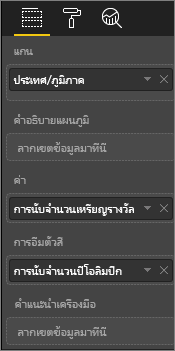

**รูปที่ 42: เพิ่มช่องข้อมูลความเข้มของสี**

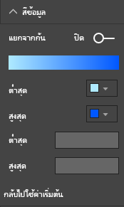

**รูปที่ 43: ปรับสีที่ใช้สำหรับความเข้ม**

นอกจากนี้ยังสามารถใช้สีเพื่อเน้นค่าความแปรปรวนรอบ ๆ ค่าศูนย์กลางได้ ตัวอย่างเช่น เติมสีค่าที่เป็นบวกเป็นสีเขียว และค่าที่เป็นลบเป็นสีแดง ควรระวังเรื่องวัฒนธรรมที่แตกต่างกันเมื่อกำหนดสีเป็นค่าบวกหรือค่าลบ ไม่ใช่ทุกวัฒนธรรมที่ใช้สีแดงสำหรับค่าที่ไม่ดี และสีเขียวสำหรับค่าที่ดี

**รูปที่ 44 : สีเพื่อเน้นค่าความแปรปรวนรอบ ๆ ค่าศูนย์กลาง**
 

### หลักการของการออกแบบภาพที่นำไปใช้กับหน้ารายงานตัวอย่าง
ตอนนี้มาใช้หลักการสำหรับภาพดังที่กล่าวถึงไปแล้วข้างต้น และนำไปใช้กับรายงานตัวอย่างของเรา

ก่อน

**รูปที่ 45: เราตัวอย่างรายงาน (ก่อน)**

หลัง

**รูปที่ 46: เราตัวอย่างรายงาน (หลัง)**

#### เราได้ทำอะไรได้บ้าง?
1. ตัวแบ่งส่วนข้อมูล: ลบช่องว่างจากตัวแบ่งส่วนข้อมูลโดยการเพิ่มตัวกรองระดับหน้ารายงาน และเลือกเฉพาะสีทอง เงิน ทองแดง การเปลี่ยนแปลง**ตัวควบคุมการเลือก**เป็นปิดใช้งานสำหรับ**เลือกค่าเดียว**และ**เลือกทั้งหมด**
2. แผนภูมิฟอง: มีรายการมากมายในคำอธิบายแผนภูมิที่ถูกเลื่อนออกจากหน้าจอ  ลบคำอธิบายแผนภูมิและเปิดใช้งาน**ป้ายชื่อประเภท**แทน ลูกค้าสามารถเลื่อนไปเหนือฟองอากาศเพื่อดูรายละเอียดได้ ชื่อเรื่องสั้นลงและลบ "ตามประเทศ/ภูมิภาค" เนื่องจากดูเหมือนว่าชัดแจ้งในตัว เปิดใช้งานป้ายชื่อแกนสำหรับทั้งสองเพื่อให้สามารถทำความเข้าใจแผนภูมิได้ง่ายขึ้น
3. แผนที่ทึบ: เปลี่ยนแปลง**สีข้อมูล**เพื่อทำให้โดดเด่นมากขึ้น เปิดใช้งาน**ความแตกต่าง** และตั้งค่า**ต่ำสุด**เป็นสีชมพ ูและค่า**สูงสุด**เป็นสีแดง
4. แผนภูมิแผนที่: ลบตัวกรองที่ถูกตั้งค่าสำหรับสหรัฐอเมริกาเท่านั้นออกไป ตั้งค่า**ป้ายชื่อข้อมูล**เป็น 1 ตำแหน่งทศนิยม ภาพมีการใช้ช่องข้อมูล ระดับชั้น ที่ไม่มีประโยชน์มากนัก เนื่องจากเกืิอบจะเป็น 33% เสมอ (สีทอง/เงิน/ทองแดง)  เลือกช่องข้อมูลที่น่าสนใจเพิ่มเติมที่น่าสนใจ, เพศ เปลี่ยนกีฬาทางน้ำเป็นสีน้ำเงินและกรีฑาเป็นสีเทาสำหรับการออกแบบ
5. แผนภูมิแถบด้านบน: ชื่อเรื่องสั้นลง ลบป้ายชื่อข้อมูล ปิดใช้งานชื่อเรื่องคำอธิบายแผนภูมิ เปลี่ยนลำดับของคำของชื่อเรื่องให้ตรงกับแผนภูมิด้านล่าง
6. แผนภูมิแท่งด้านล่าง: เรียงลำดับตามปีจากน้อยไปหามากเพื่อให้ตรงกับแผนภูมิด้านบน เปลี่ยนสีเพื่อให้ตรงกับระดับชั้น เปลี่ยนชื่อเรื่องแล้ว ปิดคำอธิบายแผนภูมิเพื่อให้มีช่องว่างเพิ่มเติมสำหรับข้อมูล เปิดใช้งานป้ายชื่อข้อมูลซึ่งจะไม่แสดงในรายงาน (เนื่องจากภาพมีขนาดเล็กเกินไปที่จะสามารถอ่านป้ายชื่อได้) แต่จะแสดงเมื่อเปิดภาพในโหมดโฟกัส [เรียนรู้เกี่ยวกับโหมดโฟกัส](service-focus-mode.md) เพิ่มจำนวนการจัดการแข่งขัน (แตกต่างกัน) ไปยัง**คำแนะนำเครื่องมือ** ดังนั้นในตอนนี้ เมื่อคุณเลื่อนไปเหนือคอลัมน์แบบเรียงซ้อน คำแนะนำเครื่องมือจะบอกให้คุณทราบจำนวนการจัดการแข่งขันที่มีการแข่งขันในปีนั้น ๆ
7. การโต้ตอบแบบภาพ: ปิดใช้งานการโต้ตอบสำหรับบัตรทั้งสองเนื่องจากต้องการให้แสดงเกมและกีฬาทั้งหมดเสมอ

## ชนิดของภาพและแนวทางปฏิบัติที่ดีที่สุด
Power BI มีหลายชนิดภาพที่อยู่ในระบบ  การเพิ่มภาพแบบกำหนดเองที่พร้อมใช้งานจาก Microsoft และชุมชน Power BI ทำให้ตัวเลือกภาพโดยรวมมีจำนวนมากเกินไปที่จะบันทึกไว้ในที่นี้ แต่เรามาดูภาพบางชนิดที่ใช้บ่อยที่สุดกัน  

### แผนภูมิเส้น

แผนภูมิเส้นเป็นวิธีที่มีประสิทธิภาพในการดูข้อมูลเมื่อเวลาผ่านไป  การดูข้อมูลในตารางไม่ได้ใช้ประโยชน์จากความเร็วที่ตาของเราจับจุดสูงสุด จุดที่เป็นแอ่ง วงกลม หรือรูปแบบต่าง ๆ ได้  
ตัวอย่างด้านล่างแสดงแนวโน้มจำนวนเหรียญรางวัลที่ได้รับและจำนวนนักกีฬาที่ชนะเหรียญรางวัลเหล่านั้น  

**รูปที่ 47 : แผนภูมิเส้น**

#### แนวทางปฏิบัติที่ดีที่สุด
* เมื่อผู้คนดูที่แผนภูมิเส้น สิ่งแรกที่พวกเขาจะเห็นคือ รูปร่างของเส้นโค้ง  ซึ่งหมายความว่า คุณจำเป็นต้องมีแกน x ที่ทำให้เส้นโค้งสื่อความหมายดังกล่าว เช่น เวลาหรือประเภทการแจกจ่าย  ถ้าคุณใส่ช่องข้อมูลที่เป็นค่าแบบกลุ่ม เช่น ผลิตภัณฑ์หรือภูมิศาสตร์บนแกน x แผนภูมิเส้นจะไม่น่าสนใจ เนื่องจากรูปร่างของเส้นโค้งจะไม่สื่อข้อมูลที่มีความหมาย
* ถ้าคุณเลือกที่จะวางหลายแผนภูมิที่ด้านบนและด้านล่างของแต่ละอันดังนี้ เพื่อทำให้ง่ายต่อการเปรียบเทียบชุดข้อมูลต่าง ๆ ให้จัดแนวแกน X ใช้ตัวกรองเพื่อให้แน่ใจว่าแผนภูมิจะแสดงช่วงของค่าเดียวกัน  ตัวอย่างเช่น ถ้าคุณกำลังดูช่วงวันที่ ตรวจสอบให้แน่ใจว่าเป็นช่วงวันที่เดียวกัน  ตัวอย่างเช่น 1896 ถึง 2012 บนแผนภูมิทั้งสอง
* ใช้พื้นที่ว่างให้เต็มที่  ถ้าเหมาะสมสำหรับข้อมูลของคุณ ตั้งค่าจุดเริ่มต้นและจุดสิ้นสุดสำหรับแกน Y เพื่อกำจัดช่องว่างที่ด้านบนและด้านล่างของแผนภูมิของคุณ และเพื่อเน้นในจุดข้อมูลจริง การทำเช่นนี้ เลือกไอคอนลูกกลิ้งทาสีเพื่อเปิดพื้นที่จัดรูปแบบ ขยายพื้นที่**แกน Y**และตั้งค่าจุด**เริ่มต้น**และ**สิ้นสุด**
  
  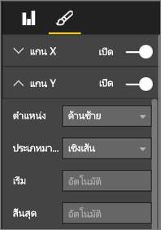
  
  **รูปที่ 48 : ตั้งค่าจุดเริ่มต้นและจุดสิ้นสุด**
* อีกเหตุผลหนึ่งในการตั้งค่าจุดเริ่มต้นและจุดสิ้นสุดอย่างชัดเจนคือ เมื่อคุณกำลังเปรียบเทียบแผนภูมิอย่างน้อยสองในหน้าเดียวกันที่ใช้ช่องข้อมูลแกน Y เดียวกัน  ตัวอย่างเช่น ถ้าคุณกำลังดูจำนวนเหตุการณ์สะสม สหราชอาณาจักรมีจำนวนในช่วงตั้งแต่ 1 ถึง 70 และออสเตรเลียมีจำนวนในช่วงตั้งแต่ 1 ถึง 12 แผนภูมิเส้นทั้ง 2 จะแสดงแกน Y ที่แตกต่างอย่างมาก (รูป x) ซึ่งทำให้ยากต่อการเปรียบเทียบอย่างรวดเร็ว ควรตั้งค่าแผนภูมิเพื่อใช้ช่วงแกน Y เดียวกัน (รูป x) แทน
  
  
  
  **รูปที่ 49: แผนภูมิเส้นที่มีแกน Y แตกต่างกัน**
  
  
  
  **รูปที่ 50: แผนภูมิเส้นที่มีแกน Y ที่ตรงกัน**

สำหรับข้อมูลเพิ่มเติม ดู:

* [แกน X และ Y ที่กำหนดด้วยตนเอง](power-bi-visualization-customize-x-axis-and-y-axis.md)
* [แผนภูมิเส้นและช่วงที่ไม่สม่ำเสมอ](http://www.perceptualedge.com/articles/visual_business_intelligence/line_graphs_and_irregular_intervals.pdf)
* [แผนภูมิเส้น 101](http://www.columnfivemedia.com/data-visualization-101-line-charts)

### แผนภูมิแท่ง/คอลัมน์

ถ้าแผนภูมิเส้นเป็นมาตรฐานสำหรับการดูข้อมูลเมื่อเวลาผ่านไป แผนภูมิแท่งเป็นมาตรฐานสำหรับการดูที่ค่าเฉพาะในหมวดหมู่ต่าง ๆ  ถ้าคุณเรียงลำดับแถบตามตัวเลข คุณจะเห็นค่าด้านบนสุดและการกระจายได้ทันที  แผนภูมิแท่งแนวนอนใช้งานได้ดีกับป้ายชื่อที่ยาว  

**รูปที่ 51 : แผนภูมิแท่งแนวนอน**

#### แนวทางปฏิบัติที่ดีที่สุด
* แสดงป้ายชื่อข้อมูลสำหรับค่า  ซึ่งทำให้ง่ายต่อการระบุค่าเฉพาะ เมื่อต้องการทำเช่นนี้ เปิดพื้นที่การจัดรูปแบบ และตั้งค่าเป็นเปิดใช้งาน**ป้ายชื่อข้อมูล**
  
  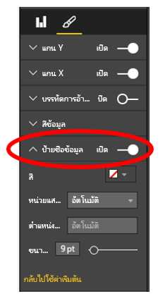
  
  **รูปที่ 52: เปิดใช้งานป้ายชื่อข้อมูล**
* แผนภูมิแท่งข้างต้นนั้นมีประโยชน์มากเมื่อต้องการเปรียบเทียบหน่วยวัดหนึ่งกับหลายหน่วย**ณ จุดเวลาเดียว**  ในขณะที่แผนภูมิเส้นด้านบนแสดงถึงแนวโน้มตามช่วงเวลา แผนภูมิแท่งแสดงแนวโน้มสำหรับแต่ละประเภทที่เวลาเฉพาะ  เมื่อดูอย่างรวดเร็ว แผนภูมิแท่งของเราแสดงให้เห็นว่าสเปนมีหนึ่งในอัตราการว่างงานแย่ที่สุดในโลกที่ 25%
* เมื่อทั้งแผนภูมิแท่ง/คอลัมน์ไม่พอดีกับพื้นที่ที่มีการจัดสรร Power BI เพิ่มแถบเลื่อน เมื่อเป็นไปได้และเหมาะสม ให้ปรับโครงสร้างภาพและรายงานเพื่อแสดงทั้งแผนภูมิ เพื่อให้ผู้อ่านเข้าใจภาพรวมของการกระจายข้อมูลทั้งหมด  โชคไม่ดีที่เราไม่สามารถแสดงในตัวอย่างของเราได้สำหรับการกำหนดตัวเลขที่มีนัยสำคัญของประเทศต่าง ๆ ทั่วโลก
  
  วิธีหนึ่งในการจำกัดค่าที่รวมอยู่คือการใช้ตัวกรอง ตัวอย่างเช่น เพิ่มตัวกรองระดับภาพที่แสดงเฉพาะประเทศที่มีอัตราการว่างงานอยู่สูงกว่า 20%
* แผนภูมิแท่ง/คอลัมน์สามารถเจาะลึกลงไป (และขึ้นมาอีกครั้ง) ได้  นี่คือวิธีที่ดีในการรวมข้อมูลเพิ่มเติมลงในภาพโดยไม่ต้องใช้พื้นที่เพิ่มเติม  ตัวอย่างด้านล่างมีลำดับชั้นสำหรับภูมิภาค > ประเทศ  ดับเบิ้้ลคลิกที่แถบภูมิภาคเพื่อเจาะลงไปประเทศที่ประกอบกันเป็นภูมิภาคนั้น  สำหรับข้อมูลเพิ่มเติมเกี่ยวกับการดูรายละเอียดแนวลึก ดู[การดูรายละเอียดแนวลึกในการแสดงภาพ](power-bi-visualization-drill-down.md)
  
  
  
  **รูปที่ 53 : ดูรายละเอียดแนวลึก**

สำหรับรายละเอียดเพิ่มเติมเกี่ยวกับแผนภูมิแท่งและแผนภูมิคอลัมน์:

* [แผนภูมิแท่ง 101](http://blog.newscred.com/article/data-visualization-101-bar-charts)
* [แค็ตตาล็อกการแสดงภาพข้อมูล: แผนภูมิแท่ง](http://www.datavizcatalogue.com/methods/bar_chart.html#.VYV-hY3bLJw)
* [แค็ตตาล็อกการแสดงภาพข้อมูล: แผนภูมิแท่งหลายชุด](http://www.datavizcatalogue.com/methods/multiset_barchart.html#.VYV_gI3bLJw)

### กราฟแท่งแบบวางซ้อนกัน/ คอลัมน์

เพิ่มมิติอื่นลงในแผนภูมิแท่ง/คอลัมน์ของคุณโดยการซ้อนประเภทต่าง ๆ ภายในแท่งหรือคอลัมน์  ตอนนี้แผนภูมิสื่อข้อมูลเกี่ยวกับแนวโน้มโดยรวมหนึ่งแนวโน้ม (ตามความสูง/ความยาว) และยังแสดงอิทธิพลที่มีต่อประเภทในแนวโน้มนั้นด้วย แผนภูมิด้านล่างแสดงการเติบโตโดยรวมของรายได้ทีมฟุตบอลที่มากกว่า 6 พันล้านในปี ค.ศ. 2014

**รูปที่ 54 : แผนภูมิคอลัมน์แบบเรียงซ้อน**

แผนภูมิคอลัมน์แบบเรียงซ้อนนี้แสดงผลรวมรายได้ที่กำลังเติบโตเมื่อเวลาผ่านไป และประเภทการออกอากาศและเชิงพาณิชย์จะเพิ่มอย่างมั่นคงเมื่อเวลาผ่านไป ซึ่งช่วยเพิ่มรายได้โดยรวม  แต่แผนภูมินี้ไม่ทำให้ง่ายต่อการเปรียบเทียบผลกระทบที่แต่ละประเภทมีต่อกันของทั้ง 3 ประเภท ตัวอย่างเช่น การเติบโตของประเภทเชิงพาณิชย์เป็นอย่างไรเมื่อเทียบกับการเติบโตของการออกอากาศหรือวันที่ตรงกัน?  ตัวเลือกที่ดีกว่าสำหรับข้อมูลนี้ หรือภาพที่มาด้วยสำหรับข้อมูลนี้ จะเป็นแผนภูมิเส้น  

**รูปที่ 55: แปลงเป็นแผนภูมิเส้น**

ในแผนภูมิเส้นนี้ เป็นเรื่องง่ายกว่าที่จะดูวิธีการเพิ่มรายได้เชิงพาณิชย์มากที่สุด ตามด้วยการออกอากาศ และวันที่ตรงกัน

#### แนวทางปฏิบัติที่ดีที่สุด
* เนื่องจากด้วยคอลัมน์/แท่ง คุณมีตัวเลือกที่แสดงในแนวนอนหรือแนวตั้งได้   แนวนอนเป็นตัวเลือกที่ดีกว่าถ้าคุณมีป้ายชื่อที่ยาว และแนวตั้งจะดีกว่าถ้าคุณมีข้อมูลเป็นชุดเวลา  
* หลีกเลี่ยงแผนภูมิแท่ง/คอลัมน์แบบเรียงซ้อนถ้าคุณต้องการแสดงแนวโน้มและรูปแบบอื่น ๆ ของการเปลี่ยนแปลงเมื่อเวลาผ่านไป  แผนภูมิอื่น ๆ เช่น แผนภูมิเส้น ใช้งานได้ดีกว่ามาก
* นอกจากนี้คุณสามารถให้การแจกแจงตามผลรวมปริมาณ หรือเป็น % ของผลรวมได้  
* ดังที่ Few ได้ทำหมายเหตุไว้*ว่าการเปรียบเทียบเซกเมนต์ของแท่งที่เรียงซ้อนกันนั้นเป็นเรื่องยาก ถ้าเซกเมนต์จัดเรียงข้าง ๆ กันและทั้งหมดโตในทิศทางขึ้นด้านบนจากเส้นฐานเดียวกัน อาจเป็นเรื่องง่ายที่จะเปรียบเทียบความสูงของแท่งเหล่านี้ แต่เมื่อมีการเรียงซ้อนกับอีกแท่ง งานดังกล่าวจะทำได้ยาก รวมถึง แม้ว่าการดูการเปลี่ยนแปลง (รายได้) ในแต่ละเดือนจะทำได้ง่าย แต่การดูว่า (รายได้) เปลี่ยนไปอย่างไรใน (ประเภท) อื่นนั้นทำได้ยาก*   
* แผนภูมิแบบเรียงซ้อน 100% เป็นตัวเลือกที่ดีเมื่อใช้เปอร์เซ็นต์ที่เพิ่มเป็น 100  ในตัวอย่างด้านล่าง เราจะเห็นการแจกแจงประเภทแยกตามทีม  เปอร์เซ็นต์สัมพันธ์กันและช่วยให้เราเห็นรูปแบบเมื่อมองอย่างรวดเร็ว ตัวอย่างเช่น รายได้ของ Everton มาจากการออกอากาศเป็นหลัก (เกินกว่า 70%) ขณะที่ PSG มีรายได้จากการออกการอากศเพียง 20% เท่านั้น  ตัวเลือกการแสดงผลในแนวนอนทำให้การใส่ป้ายชื่อทีมและการดูผลกระทบของประเภทรายได้ทำได้ง่ายขึ้น
  
  
  
  **รูปที่ 56: แผนภูมิแบบเรียงซ้อนแนวนอน**

สำหรับข้อมูลเพิ่มเติมเกี่ยวกับแผนภูมิแบบเรียงซ้อน:

* [แค็ตตาล็อกการแสดงภาพข้อมูล: กราฟแท่งแบบเรียงซ้อน](http://www.datavizcatalogue.com/methods/stacked_bar_graph.html#top)
* [กราฟแท่งแบบเรียงซ้อนจะใช้ประโยชน์ได้ 100% เมื่อไหร่?](http://www.perceptualedge.com/blog/?p=2239)

### การรวมแผนภูมิแท่ง/คอลัมน์

ใน Power BI คุณสามารถรวมแผนภูมิคอลัมน์และบรรทัดลงในแผนภูมิผสมได้ ตัวเลือกคือ: แผนภูมิเส้นและแผนภูมิคอลัมน์แบบเรียงซ้อน และแผนภูมิเส้นและแผนภูมิคอลัมน์แบบกลุ่ม ประหยัดพื้นที่รายงานอันมีค่าโดยการรวมภาพสองภาพให้เป็นหนึ่ง

ภาพถ่ายหน้าจอสองภาพที่ด้านล่างนี้แสดงภาพก่อนและหลัง  หน้าแรกมีสองภาพแยกกัน: แผนภูมิคอลัมน์ที่แสดงประชากรเมื่อเวลาผ่าานไป และแผนภูมิเส้นที่แสดง GDP เมื่อเวลาผ่านไป แผนภูมิเหล่านี้จะเหมาะสมอย่างยิ่งสำหรับทำแผนภูมิผสมเนื่องจากมีแกน X (ปี) และค่า (2002 ถึง 2012) เดียวกัน  เหตุใดจึงไม่รวมเข้าด้วยกันเพื่อเปรียบเทียบ 2 แนวโน้มบนภาพเดียว?  การรวมแผนภูมิทั้ง 2 นี้ช่วยให้คุณเปรียบเทียบข้อมูลได้อย่างรวดเร็ว

หน้ารายงานใหม่มีภาพเดียว: แผนภูมิเส้นและแผนภูมิคอลัมน์แบบเรียงซ้อนกัน จริง ๆ แล้วเราสามารถสร้างแผนภูมิเส้นและแผนภูมิคอลัมน์แบบกลุ่มได้ง่าย ๆ  ตอนนี้ การหาความสัมพันธ์ระหว่างแนวโน้มทั้งสองนั้นเป็นเรื่องง่ายกว่า   เราเห็นได้ว่า จนถึงปี 2008 ประชากรและ GDP มีแนวโน้มที่คล้ายกัน แต่เริ่มต้นในปี 2009 การเพิ่มขึ้นของประชากรราบเรียบ และ GDP มีการเปลี่ยนแปลงมากกว่า  

 **รูปที่ 57: เป็นสองแผนภูมิที่แยกกัน**

 **รูปที่ 58: เป็นแผนภูมิผสม**

#### แนวทางปฏิบัติที่ดีที่สุด
แผนภูมิผสมใช้งานได้ดีีที่สุดเมื่อภาพทั้งสองมีอย่างน้อยหนึ่งแกนที่เหมือนกัน

ดูแกนของคุณ! แผนภูมิผสมของคุณง่ายต่อการอ่านและตีความหรือไม่?  หรือแผนภูมิดังกล่าวใช้ช่วงและค่าที่ไม่เหมือนกัน? ตัวอย่างเช่น ถ้ามาตราส่วนของแกน Y ของแผนภูมิคอลัมน์มีขนาดเล็กกว่ามาตราส่วนของแกน Y ของแผนภูมิเส้นมาก แผนภูมิผสมของคุณจะไม่สื่อความหมาย  ตัวอย่างเช่น สังเกตบรรทัดที่ 3 (สีฟ้าน้ำทะเล) ไปทางด้านล่างสุด

   

   **รูปที่ 59: แผนภูมิเส้นที่ไม่ประสบความสำเร็จ**

ดังนั้น แผนภูมิผสมของคุณก็เช่นกันจะไม่มีความหมายถ้าแผนภูมิคอลัมน์และแผนภูมิเส้นของคุณใช้หน่วยวัดที่แตกต่างกัน 2 หน่วย และคุณไม่สร้างแกนคู่  ตัวอย่างเช่น ดอลลาร์เทียบกับเปอร์เซ็นต์ ตรวจสอบให้แน่ใจว่าได้รวมทั้งสองแกนเพื่อช่วยให้ผู้อ่านเข้าใจแผนภูมิ และพิจารณาเพิ่มป้ายชื่อแกนด้วย

เมื่อต้องการทำเช่นนี้ เปิดพื้นที่การจัดรูปแบบ ขยาย**แกน Y**และเปิดใช้งาน**แสดงรอง** (ถ้าไม่ได้เปิดอยู่แล้ว) บางครั้งการตั้งค่านี้ค้นหาได้ยาก ขยาย**แกน Y (คอลัมน์)** เลื่อนลงจนกว่าคุณเห็น**แสดงรอง** นอกจากนี้ เปิดใช้งาน**ชื่อเรื่อง**แกน Y (คอลัมน์) และเปิดใช้งาน**ชื่อเรื่อง**แกน Y (เส้น)

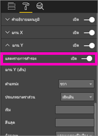

**รูปที่ี 60: แสดงแกนทุติยภูมิ**

**รูปที่ 61: สร้างแผนภูมิผสมแทน**

* ใช้ประโยชน์จากแกนคู่ เป็นวิธีที่ดีในการเปรียบเทียบหลายหน่วยวัดที่มีช่วงของค่าที่แตกต่างกัน และเป็นวิธีที่ดีในการแสดงความสัมพันธ์ระหว่างสองหน่วยวัดในหนึ่งภาพ

สำหรับข้อมูลเพิ่มเติมู:

* [แผนภูมิผสมใน Power BI](power-bi-visualization-combo-chart.md)
* [สิ่งที่ควรระวังเกี่ยวกับแกนคู่ปรับมาตราส่วนในภาพ](http://www.perceptualedge.com/articles/visual_business_intelligence/dual-scaled_axes.pdf)

### แผนภูมิกระจาย

ในบางครั้งเรามีตัวแปรต่าง ๆ มากมายที่เราต้องการดูร่วมกัน และแผนภูมิกระจายเป็นวิธีมีประโยชน์อย่างมากเมื่อต้องการได้ภาพโดยรวม  แผนภูมิกระจายแสดงความสัมพันธ์ระหว่างหน่วยวัดเชิงปริมาณ 2 หน่วย (แผนภูมิกระจาย) หรือ 3 หน่วย (แผนภูมิฟอง)  แผนภูมิกระจายจะมีแกนค่าสองแกนเสมอเพื่อแสดงข้อมูลตัวเลขหนึ่งชุดตามแกนแนวนอนและอีกชุดของค่าตัวเลขตามแกนแนวตั้ง แผนภูมิแสดงจุดที่จุดตัดของค่าตัวเลข x และ y เพื่อรวมค่าเหล่านี้ลงในจุดข้อมูลเดียว จุดข้อมูลเหล่านี้อาจถูกกระจายสม่ำเสมอกันหรืออาจไม่สม่ำเสมอกันตามแกนแนวนอน โดยขึ้นอยู่กับข้อมูลดังกล่าว

แผนภูมิฟองอากาศแทนที่จุดข้อมูลด้วยฟองอากาศ โดยที่ีมีขนาดฟองเป็นตัวแทนขนาดที่เพิ่มขึ้นของข้อมูล

แผนภูมิฟองที่ด้านล่างดูที่อเมริกาใต้และเปรียบเทียบ GDP ต่อหัว (แกน Y) ผลรวมของ GDP (แกน X) และประชากรตามประเทศในอเมริกาใต้  ขนาดของฟองแสดงจำนวนประชากรทั้งหมดสำหรับประเทศนั้น บราซิลมีประชากรมากที่สุด (ขนาดฟอง) และมีส่วนแบ่งมากที่สุดของ GDP อเมริกาใต้ (ซึ่งยาวที่สุดตามแนวบนแกน X)  แต่โปรดสังเกตว่า GDP ต่อหัวสำหรับประเทศอุรุกวัย ชิลี และอาร์เจนตินาสูงกว่าบราซิล (ขึ้นไปสูงกว่าบนแกน Y)

**รูปที่ 62 : GDP อเมริกาใต้และประชากรเป็นแผนภูมิฟอง**

ถ้าคุณเพิ่มแกนเคลื่อนไหว คุณแสร้งทำได้ว่าคุณเป็น Hans Rosling และบอกเล่าเรื่องราวเมื่อเวลาผ่านไปhttps://www.youtube.com/watch?v=PbaDBJWCeD4) เมื่อต้องเพิ่มมีแกนเคลื่อนไหว ลากช่องข้อมูลวันที่และเวลาลงในแอ่ง**แกนเคลื่อนไหว**

#### แนวทางปฏิบัติที่ดีที่สุด
* แผนภูมิกระจายและแผนภูมิฟองเป็นตัวบอกเล่าเรื่องราวได้ยอดเยี่ยม แต่จะไม่เป็นประโยชน์เมื่อคุณพยายามสำรวจข้อมูล  นี่คือสิ่งที่ Stephen Few ชี้ให้เห็นในย่อหน้าด้านล่าง*ความเข้มแข็งของส่วนนี้คือการใช้บอกเล่าเรื่องราว เมื่อ Rosling เคลื่อนที่ไปเรื่อย ๆ สิ่งที่เกิดขึ้นในแผนภูมิขณะที่ฟองเคลื่อนย้ายไปรอบ ๆ และเปลี่ยนค่า เขาชี้ไปที่สิ่งที่เขาต้องเราดู ข้อมูลก็จะปรากฏขึ้นมามีชีวิตชีวา อย่างไรก็ตาม แผนภูมิฟองแบบเคลื่อนไหวมีประสิทธิภาพน้อยกว่ามากสำหรับการสำรวจและการสร้างความเข้าใจในตัวข้อมูลเอง ฉันไม่คิดว่า Rosling จะใช้วิธีนี้พื่อค้นหาเรื่องราว แต่เพื่อบอกเรื่องราวมีผู้อ่านทราบเรื่องราวนั้นแล้ว เราไม่สามารถเข้าร่วมมากกว่าหนึ่งฟองในเวลาเดียวกันได้เนื่องจากฟองเหล่านี้เคลื่อนย้ายไปรอบ ๆ ดังนั้นเราถูกบังคับเปิดภาพเคลื่อนไหวขึ้นมาหลายครั้งเพื่อให้เข้าใจถึงสิ่งที่เกิดขึ้น เราสามารถเพิ่มเส้นทางไปยังฟองที่เลือกได้ ซึ่งทำให้สามารถตรวจทานเส้นทางที่ฟองเหล่านี้เดินทางได้เต็มรูปแบบ แต่หากมีการใช้เส้นทางดังกล่าวสำหรับฟองมากกว่าสองถึงสามฟอง แผนภูมิจะดูเป็นการรวมกลุ่มมากเกินไป โดยหลัก ๆ แล้ว สิ่งที่กำลังชี้ให้เห็นคือ นี่ไม่ใช่วิธีที่ดีที่สุดในการแสดงข้อมูลนี้สำหรับการสำรวจและวิเคราะห์*
* เพิ่มป้ายชื่อแกน X และ Y เพื่อช่วยบอกเล่าเรื่องราว  โดยเฉพาะเมื่อมีแผนภูมิฟอง มีองค์ประกอบมากมายที่เคลื่อนที่และและป้ายชื่อช่วยให้ผู้อ่านทำความเข้าใจภาพได้ดีขึ้น
* เพิ่มป้ายชื่อข้อมูลเพื่อให้แปลภาพได้ง่าย  โดยเฉพาะอย่างยิ่งด้วยแผนภูมิฟอง เมื่อคุณมีหลายรายการในคำอธิบายแผนภูมิ การแยกความแตกต่างระหว่างสีที่คล้ายกันอาจเป็นเรื่องยาก  ในภาพด้านบน สีคำอธิบายแผนภูมิสำหรับซูรินาม โคลัมเบีย และเอกวาดอร์จะคล้ายกันอย่างมาก
* คุณได้สร้างแผนภูมิกระจายและเห็นจุดข้อมูลเดียวเท่านั้นที่รวมค่าทั้งหมดบนแกน X และ Y หรือไม่? หรือแผนภูมิของคุณรวมค่าทั้งหมดตามเส้นแนวนอนหรือแนวตั้งเดียว?  เพื่อแก้ไขส่วนนี้ เพิ่มช่องข้อมูลไปยังพื้นที่**รายละเอียด**ที่จะบอกวิธีการจัดกลุ่มค่า Power BI ช่องข้อมูลต้องไม่ซ้ำกันสำหรับแต่ละจุดที่คุณต้องการลรทำผัง สำหรับความช่วยเหลือ ไปยัง[บทช่วยสอนแผนภูมิกระจายและแผนภูมิฟองของ Power BI](power-bi-visualization-scatter.md)

### แผนภูมิแผนผังต้นไม้

แผนผังต้นไม้อาจมีประโยชน์อย่างยิ่งสำหรับการให้ภาพรวมที่ดีของขนาดที่สัมพันธ์ขององค์ประกอบต่าง ๆ ที่ประกอบขึ้นเป็นแผนผังดังกล่าว โดยเฉพาะอย่างยิ่งเมื่อคุณสามารถจัดกลุ่มแผนผังแยกตามประเภทได้  ทุกครั้งที่ฉันพยายามทำความเข้าใจเกี่ยวกับธุรกิจใหม่ มีแผนผังต้นไม้ขององค์ประกอบหลักที่สามารถเป็นประโยชน์อย่างมากเพื่อให้ทราบการแจกแจงโดยรวม

ในแผนภูมิแรกด้านล่าง คุณสามารถเห็นได้ทันทีว่าบราซิลมี GDP ประมาณครึ่งหนึ่งของอเมริกาใต้ และเวเนซุเอลาและอาร์เจนตินาจะมีขนาดเท่ากันโดยประมาณ

ถ้าคุณต้องการมีบริบทมากขึ้นและยังมีแนวคิดเกี่ยวกับผลกระทบจากประเทศท่ี่เป็นส่วนประกอบแผนผังสูงสุด คุณสามารถสร้างลำดับชั้นภาพได้ด้วยสมาชิกประเภท (ประเทศ) ที่อยู่ภายในภูมิภาคต่าง ๆ ได้ แผนภูมิต้นไม้ที่สองให้แนวความคิดกับเรา ซึ่งเป็นอันดับแรกสุดและสำคัญที่สุด ของขนาดที่สัมพันธ์ของภูมิภาค จากนั้น ภายในแต่ละภูมิภาค เราสามารถดูแต่ละประเทศที่มีพื้นที่ร่วมในผังมากสุด เราเห็นว่ามีสามภูมิภาคขนาดใหญ่ (ยุโรป เอเชีย และอเมริกาเหนือ) และภายในภูมิภาคเหล่านี้เราสามารถดูประเทศ/ภูมิภาคอันดับสูงสุดได้ง่าย

ข้อจำกัดหลักของแผนผังต้นไม้ความสามารถที่มีจำกัดในการเปรียบเทียบสี่เหลี่ยมผืนผ้าต่าง ๆ ที่อยู่เหนือสีเหลี่ยมบนสุด  ซึ่งเป็นแผนภูมิที่ดีสำหรับภาพรวม แต่คอลัมน์และแผนภูมิแท่งอาจเป็นตัวเลือกที่ดีกว่าเมื่อต้องการแสดงความคิดที่แม่นยำกว่าของขนาดที่สัมพันธ์กับองค์ประกอบที่แตกต่างกัน
  ตัวอย่างเช่น แผนภูมิต้นไม้แผนภูมิแรกทำให้สามารถบ่งชี้ได้มากกว่าสำหรับลำดับของขนาด GDP แต่จะยากต่อการระบุความแตกต่างเฉพาะระหว่างประเทศ โดยเฉพาะอย่างยิ่งกล่องที่ไม่มีป้ายชื่อและมีขนาดเล็กกว่า สำหรับ ข้อมูลนี้ที่มีการเปรียบเทียบการจัดกลุ่มเดียว แผนภูมิแท่งหรือคอลัมน์อาจเป็นตัวเลือกที่ดีกว่า

**รูปที่ 63 : เปรียบเทียบ GDP อเมริกาใต้เป็นแผนผังต้นไม้**

ต่อไปนี้เราได้เพิ่มอีกระดับของข้อมูล ภูมิภาค และเราสามารถดูส่วนสนับสนุนโดยรวมสำหรับ GDP โดยแยกตามภูมิภาค ตลอดจนผลกระทบที่เกี่ยวเนื่องภายในภูมิภาคได้ ระวังว่าการดำเนินการกับหน่วยวัดที่ไม่ใช่ผลรวม (เช่น ค่าเฉลี่ย) ที่ค่าเฉลี่ยงดังกล่าวอาจไม่เป็นตัวแทนของค่าที่เกิดตามจริงที่ระดับการรวมค่า

**รูปที่ 64 : GDP แยกตามภูมิภาคและประเทศเป็นแผนผังต้นไม้**

สำหรับข้อมูลเพิ่มเติมเกี่ยวกับแผนภูมิต้นไม้ สามารถดูได้ที่ลิงก์ด้านล่างนี้

* [ภาพรวมแผนภูมิต้นไม้](http://www.perceptualedge.com/articles/b-eye/treemaps.pdf)
* [แค็ตตาล็อกการแสดงภาพข้อมูล: แผนภูมิต้นไม้](http://www.datavizcatalogue.com/methods/treemap.html#.VYhylI3bL7Y)

### แผนภูมิอื่น ๆ
#### แผนภูมิวงกลมหรือแผนภูมิโดนัท

โดยทั่วไป แผนภูมิแท่ง/คอลัมน์/เส้นจะใช้เพื่อวัตถุประสงค์ส่วนใหญ่ เราเข้าใจดีว่าแผนภูมิวงกลมและโดนัทยากสำหรับมนุษย์ที่จะแปลความหมายได้อย่างถูกต้อง รวมถึงสามารถบิดเบือนข้อมูลได้ด้วย หลีกเลี่ยงเมื่อทำได้ Stephen Few ได้เขียนประวัติและอันตรายไว้อย่างดีเยี่ยมใน [เก็บพาย (แผนภูมิวงกลม) ไว้เป็นขนมหวานเถอะ] ([www.percetualedge.com/articles/08-21-07.pdf](http://www.perceptualedge.com/articles/08-21-07.pdf)

เขาอธิบายถึงหนึ่งสถานการณ์ที่จะมีการใช้แผนภูมิวงกลม นั่นคือ เมื่อเปรียบเทียบความสัมพันธ์หนึ่งส่วนกับทั้งหมด แม่ว่าจะใช้แผนภูมิวงกลมได้ แต่ก็ไม่ได้ดีไปกว่าการใช้แผนภูมิแท่งแบบเรียงซ้อนแบบ 100%

อีกบทความที่สร้างความเพลิดเพลินให้เรา (และภาพเคลื่อนไหว) เกี่ยวกับแผนภูมิวงกลม สามารถดูได้ใน[เว็บไซต์การวิเคราะห์ Darkhorse](http://www.darkhorseanalytics.com/blog/salvaging-the-pie)ได้

หรือลองอ่านมุมมองที่แย้งความคิดเห็นนี้ [ว่าทำไม Tufte ถึงพูดผิดเกี่ยวกับแผนภูมิวงกลม](http://speakingppt.com/2013/03/18/why-tufte-is-flat-out-wrong-about-pie-charts/)

#### ตัววัดรัศมีและ KPI

ดูเหมือนว่าตัววัดรัศมีเป็นภาพที่ดีสำหรับบ่งชี้ประสิทธิภาพการทำงานเทียบกับเป้าหมายและได้รับความนิยมมากในแดชบอร์ดผู้บริหาร อย่างไรก็ตาม ตัววัดรัศมีมีปัญหาด้วยสองแนวทางหลัก เช่นเดียวกับแผนภูมิวงกลม การแปลมุมของพื้นที่ที่มีการแรเงาเพื่อเปรียบเทียบกับเส้นโค้ง 180 องศาแบบเต็มหรือเส้นเป้าหมายนั้นทำได้ยาก นอกจากนี้ ยังใช้พื้นที่จำนวนมากในการแสดงการเมตริกเดียว

ทางเลือกที่ดีคือ ภาพ KPI อย่างง่าย

KPI แสดงค่า สถานะ เป้าหมาย ค่าความแปรปรวนจากเป้าหมายและแนวโน้มช่องว่างในปริมาณเดียวกัน สีเขียวเปลี่ยนเป็นสีแดงถ้าไม่ตรงตามเป้าหมาย และอาจเป็นสีเหลืองถ้ามีบางส่วนเป็นไปตามเป้า ซึ่งสามารถอ่านและแปลความตัววัดได้ง่ายกว่า

สำหรับข้อมูลเพิ่มเติม ให้ด:

* [แผนภูมิหน้าปัดความเร็วใน Power BI](power-bi-visualization-radial-gauge-charts.md)
* [KPI ใน Power BI](power-bi-visualization-kpi.md)

## บทสรุป
ในตอนนี้ ถึงเวลาที่คุณจะนำแนวทางปฏิบัติที่ดีที่สุดเหล่านี้ไปใช้เพื่อการทดสอบ  อย่าลืมติดต่อกันเสมอและแชร์หลักปฏิบัติที่ดีที่สุดของคุณเอง ไม่เห็นด้วยกับคำแนะนำของเรา หรือพบเหตุผลที่ดีในการ "แหกกฎ"?  เรายินดีรับฟังเกี่ยวกับเหล่านั้นได้เช่นกัน  

### คำแนะนำหนังสือ
ปัจจุบันมีีหนังสือดี ๆ หลายเล่มที่สามารถช่วยทีมของคุณฝึกปรือเทคนิคการออกแบบภาพได้ หนังสือของ Stephen Few*ออกแบบแดชบอร์ดข้อมูล*เป็นสิ่งที่คุณต้องอ่าน เขาค้นหารายละเอียดที่ลงลึกมากกว่าในหนังสืออื่นสองเล่ม นั่นคือ *Show Me the Numbers*และ*Now You See It* Few และบุคคคอื่น ๆ ได้สร้างแรงบันดาลใจจาก Edward R. Tufte เอ็ดเวิร์ด ซึ่งหนังสือของเขาคือ*The Visual Display of Quantitative Information (ภาพที่แสดงข้อมูลเชิงปริมาณ)* ถือว่าคลาสสิกมากในสาขานี้ นอกจากนี้ Tufte ยังเขียนเรื่อง *Visual Explanations (คำอธิบายภาพ)*, *Envisioning Information (การแลเห็นข้อมูล)* และ *Beautiful Evidence (หลักฐานที่สวยงาม)* หนังสือเล่มใหม่ของ Andy Kirk  *Data Visualization: A Handbook for Data Driven Design (การแสดงภาพข้อมูล: คู่มือสำหรับการออกแบบอิงตามข้อมูล)* เป็นอีกตัวเลือกที่ดีเยี่ยม มีผู้เขียนอื่น ๆ ที่ได้รับการแนะนำ เช่น Lachlan James, William McKnight และ Boris Evelson (Forrester), การวิเคราะห์ Darkhorse

มีคำถามเพิ่มเติมหรือไม่? [ลองไปที่ชุมชน Power BI](http://community.powerbi.com/)

