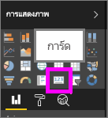
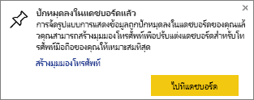
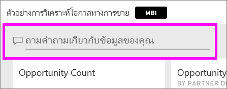
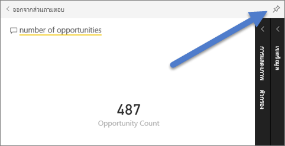
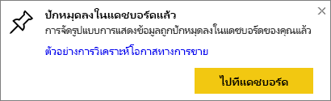
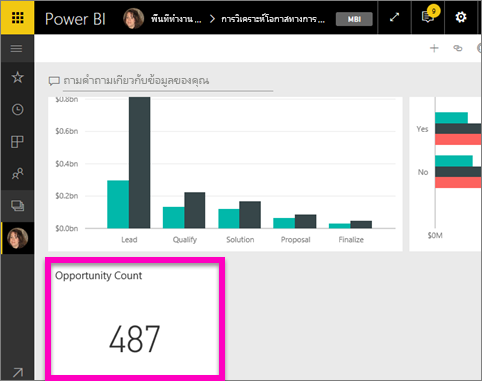
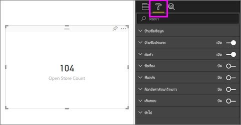
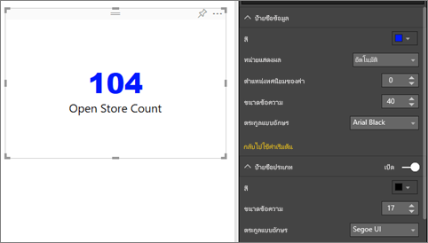
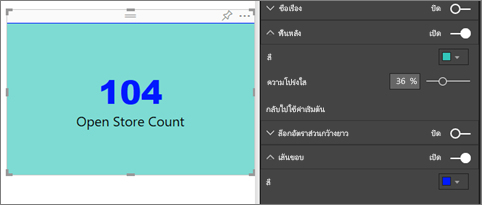

# การแสดงภาพการ์ด
บางครั้งตัวเลขเพียงตัวเดียวก็เป็นสิ่งสำคัญที่สุดที่คุณต้องการติดตามในแดชบอร์ด Power BI หรือรายงานของคุณ เช่น ยอดขายรวม ส่วนแบ่งตลาดแบบปีต่อปี ตลาดแชร์ปีปี หรือโอกาสทั้งหมด แสดงภาพชนิดนี้จะเรียกว่า*การ์ด* เช่นเดียวกับการแสดงภาพดั้งเดิมของ Power BI แทบจะทุกชนิด คุณสามารถสร้างการ์ดขึ้นได้ โดยใช้ตัวแก้ไขรายงาน หรือการถามตอบ

## สร้างการ์ดโดยใช้ตัวแก้ไขรายงาน
คำแนะนำเหล่านี้จะใช้ตัวอย่างการวิเคราะห์การค้าปลีก ถ้าต้องการทำตามคำแนะนำดังกล่าว ให้[ดาวน์โหลดตัวอย่าง](sample-datasets.md)สำหรับบริการของ Power BI (app.powerbi.com) หรือ Power BI Desktop   

1. เริ่มต้นจาก[หน้ารายงานว่าง](power-bi-report-add-page.md) แล้วเลือก**ร้านค้า** \> เขตข้อมูล**เปิดจำนวนร้านค้า** ถ้าคุณกำลังใช้บริการของ Power BI ให้ตรวจสอบให้แน่ใจว่าคุณได้เปิดรายงานใน[มุมมองการแก้ไข](service-interact-with-a-report-in-editing-view.md)แล้ว

    Power BI จะสร้างแผนภูมิคอลัมน์ที่มีตัวเลขเพียงตัวเลขเดียว

   
2. ในบานหน้าต่างการแสดงภาพ ให้เลือกไอคอนการ์ด

   
6. โฮเวอร์เหนือการ์ด แล้วเลือกไอคอนหมุดที่จะเพิ่มการแสดงภาพไปยังแดชบอร์ด

   
7. ปักหมุดไทล์ลงในแดชบอร์ดที่มีอยู่ หรือแดชบอร์ดใหม่

   * แดชบอร์ดที่มีอยู่ ให้เลือกชื่อของแดชบอร์ดจากรายการแบบดร๊อปดาวน์
   * แดชบอร์ดใหม่: พิมพ์ชื่อของแดชบอร์ดใหม่
8. เลือก**หมุด**

   ข้อความการดำเนินการสำเร็จ (ใกล้กับมุมบนขวา) ช่วยให้คุณทราบว่าได้เพิ่มการแสดงภาพเป็นไทล์ ลงในแดชบอร์ดของคุณแล้ว

   
9. เลือก**ไปยังแดชบอร์ด** ในส่วนนี้ คุณสามารถ[แก้ไขและย้าย](service-dashboard-edit-tile.md)การแสดงภาพที่ปักหมุดไว้ได้

## สร้างการ์ดจากกล่องคำถามการถามตอบ
กล่องคำถามการถามตอบเป็นวิธีที่ง่ายที่สุดในการสร้างการ์ด กล่องคำถามการถามตอบจะพร้อมใช้งานในบริการของ Power BI (app.powerbi.com) จากแดชบอร์ดหรือรายงาน ขั้นตอนด้านล่างนี้จะอธิบายถึงวิธีการสร้างการ์ดจากแดชบอร์ดบริการของ Power BI ถ้าคุณต้องการสร้างการ์ดโดยใช้การถามตอบใน Power BI Desktop [ให้ทำตามคำแนะนำเหล่านี้](https://powerbi.microsoft.com/en-us/blog/power-bi-desktop-december-feature-summary/#QandA)เกี่ยวกับการแสดงตัวอย่างการถามตอบสำหรับรายงานของ Desktop

1. สร้าง[แดชบอร์ด](service-dashboards.md)แล้ว[รับข้อมูล](service-get-data.md) ตัวอย่างนี้จะใช้[ตัวอย่างการวิเคราะห์โอกาส](sample-opportunity-analysis.md)

1. ที่ด้านบนในแดชบอร์ดของคุณ ให้เริ่มพิมพ์สิ่งที่คุณต้องการทราบเกี่ยวกับข้อมูลของคุณในกล่องคำถาม 

   

>**เคล็ดลับ**: ในส่วนรายงานของบริการของ Power BI ใน[มุมมองการแก้ไข](service-reading-view-and-editing-view.md) ให้เลือก**ถามคำถาม**จากแถบเมนูด้านบน ในส่วนรายงานของ Power BI Desktop ให้หาพื้นที่ว่างบางตำแหน่งในรายงาน แล้วดับเบิลคลิกเพื่อเปิดกล่องคำถาม

3. ตัวอย่างเช่น พิมพ์ "จำนวนโอกาส" ในกล่องคำถาม

   

   กล่องคำถามจะคอยช่วยเหลือคุณ โดยจะมีคำแนะนำรวมทั้งการกล่าวซ้ำ และสุดท้ายก็จะแสดงจำนวนรวม  
4. เลือกไอคอนหมุดในมุมขวาบที่จะเพิ่มการ์ดไปยังแดชบอร์ด

   
5. ปักหมุดการ์ดเป็นไทล์ลงในแดชบอร์ดที่มีอยู่ หรือแดชบอร์ดใหม่

   * แดชบอร์ดที่มีอยู่: เลือกชื่อของแดชบอร์ดจากรายการแบบหล่นลง ตัวเลือกของคุณจะถูกจำกัดให้ใช้งานเฉพาะกับแดชบอร์ดดังกล่าวภายในพื้นที่ทำงานปัจจุบัน
   * แดชบอร์ดใหม่: พิมพ์ชื่อของแดชบอร์ดใหม่ แล้วจะได้รับการเพิ่มไปยังพื้นที่ทำงานปัจจุบันของคุณ
6. เลือก**หมุด**

   ข้อความการดำเนินการสำเร็จ (ใกล้กับมุมบนขวา) ช่วยให้คุณทราบว่าได้เพิ่มการแสดงภาพเป็นไทล์ ลงในแดชบอร์ดของคุณแล้ว  

   
7. เลือก**ไปยังแดชบอร์ด** เมื่อต้องการดูไทล์ใหม่ ในส่วนนั้น คุณก็สามารถ[เปลี่ยนชื่อ ปรับขนาด เพิ่มการเชื่อมโยงหลายมิติ และจัดตำแหน่งไทล์ใหม่ และอื่นๆ](service-dashboard-edit-tile.md) ในแดชบอร์ดของคุณได้

   

## ข้อควรพิจารณาและการแก้ไขปัญหา
- ถ้าคุณไม่สามารถเห็นกล่องคำถามทั้งหมด โปรดติดต่อผู้ดูแลระบบหรือผู้ดูแลผู้เช่าของคุณ    
- ถ้าคุณกำลังใช้ Desktop และการดับเบิลคลิกพื้นที่ว่างในรายงานไม่สามารถเปิดการถามตอบได้ คุณก็อาจจะต้องเปิดใช้งานการถามตอบดังกล่าว  เลือก**ไฟล์ > ตัวเลือกและการตั้งค่า > ตัวเลือก > คุณลักษณะการแสดงตัวอย่าง > การถามตอบ**และรีสตาร์ต Desktop

## จัดรูปแบบการ์ด
คุณมีตัวเลือกมากมายสำหรับการเปลี่ยนป้ายชื่อ, ข้อความ, สี และอีกมาก วิธีดีที่สุดในการเรียนรู้คือ สร้างการ์ด จากนั้นสำรวจบานหน้าต่างการจัดรูปแบบ ต่อไปนี้เป็นเพียงบางตัวเลือกของการจัดรูปแบบที่มี 

1. เริ่มต้นด้วยการเลือกไอคอนรูปลูกกลิ้งทาสี เพื่อเปิดบานหน้าต่างการจัดรูปแบบ 

    
2. ขยาย**ป้ายชื่อข้อมูล** และเปลี่ยนสี, ขนาด และตระกูลแบบอักษร ถ้าคุณมีหลายพันร้านค้า คุณสามารถใช้**แสดงหน่วย**เพื่อแสดงจำนวนของร้านค้าเป็นหลักพัน และควบคุมตำแหน่งทศนิยมได้เช่นกัน ตัวอย่างเช่น แสดง 125.8K แทนที่จะเป็น 125,832.00

3.  ขยาย**ป้ายชื่อประเภท**และเปลี่ยนสีและขนาด

    

4. ขยาย**พื้นหลัง**และเลื่อนแถบเลื่อนเป็นเปิด  ตอนนี้คุณสามารถเปลี่ยนสีพื้นหลังและความโปร่งใส

    

5. ลองสำรวจตัวเลือกการจัดรูปแบบต่อไป จนกว่าการ์ดของคุณเป็นแบบที่คุณต้องการ 

    

## ขั้นตอนถัดไป
[ไทล์แดชบอร์ดใน Power BI](service-dashboard-tiles.md)

[แดชบอร์ดใน Power BI](service-dashboards.md)

[Power BI แนวคิดพื้นฐาน](service-basic-concepts.md)

มีคำถามเพิ่มเติมหรือไม่ [ลองไปที่ชุมชน Power BI](http://community.powerbi.com/)
