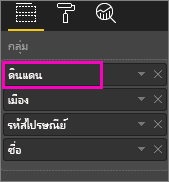
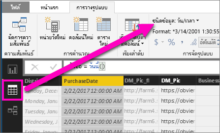

# การดูรายละเอียดแนวลึกในการแสดงภาพใน Power BI
## การดูรายละเอียดแนวลึก จำเป็นต้องมีลำดับชั้น
เมื่อวิชวลมีลำดับชั้น คุณสามารถเจาะลงไปเพื่อดูรายละเอียดเพิ่มเติม ตัวอย่างเช่น คุณอาจมีการแสดงภาพที่นับจำนวนเหรียญรางวัลโอลิมปิก โดยมีลำดับชั้นที่สร้างขึ้นจาก ชนิดกีฬา ประเภทกีฬา และรายการแข่งขัน ตามค่าเริ่มต้น การแสดงภาพจะแสดงจำนวนเหรียญรางวัลตามชนิดกีฬา - ยิมนาสติก, สกี, กีฬาทางน้ำ และอื่น ๆ แต่เนื่องจากมีลำดับชั้น เลือกองค์ประกอบหนึ่งของวิชวล (เช่น แท่ง เส้น หรือฟอง) จะแสดงรูปภาพที่มีรายละเอียดเพิ่มขึ้นเรื่อย ๆ เลือกองค์ประกอบ**กีฬาทางน้ำ** เพื่อดูข้อมูลสำหรับประเภทกีฬา ว่ายน้ำ กระโดดน้ำ และโปโลน้ำ  เลือกองค์ประกอบ**กระโดดน้ำ** เพื่อดูรายละเอียดสำหรับการแข่งขัน กระดานสปริงบอร์ด แพลตฟอร์ม และ กระโดดน้ำซิงโครไนซ์

คุณสามารถเพิ่มลำดับชั้นให้กับรายงานที่คุณเป็นเจ้าของ แต่ไม่สามาถทำได้กับรายงานที่แชร์ให้กับคุณ
ไม่แน่ใจว่าการแสดงภาพ Power BI ไหนมีลำดับชั้น?  โฮเวอร์เหนือการแสดงภาพ และถ้าคุณเห็นตัวควบคุมเพื่อดูรายละเอียดเหล่านี้ การแสดงภาพของคุณมีลำดับชั้น

    
   

วันที่ เป็นลำดับชั้นที่แตกต่างจากชนิดอื่น เมื่อคุณเพิ่มเขตข้อมูลวันที่ให้กับการแสดงภาพ Power BI จะเพิ่มลำดับชั้นเวลา ที่มี ปี, ไตรมาส, เดือน, วัน โดยอัตโนมัติ สำหรับข้อมูลเพิ่มเติม ดู[ลำดับชั้นในวิชวล และลักษณะการทำงานการดูรายละเอียดแนวลึก](guided-learning/visualizations.yml#step-18) หรือดูวิดีโอด้านล่างนี้

  <iframe width="560" height="315" src="https://www.youtube.com/embed/MNAaHw4PxzE?list=PL1N57mwBHtN0JFoKSR0n-tBkUJHeMP2cP" frameborder="0" allowfullscreen></iframe>

> [!NOTE]
> เพื่อเรียนรู้วิธีการสร้างลำดับชั้นโดยใช้ Power BI Desktop ดูวิดีโอ[วิธีการสร้าง และเพิ่มลำดับชั้น](https://youtu.be/q8WDUAiTGeU)
> 
> 

## สองวิธีการดูรายละเอียดแนวลึก
คุณมีสองวิธีที่จะดูรายละเอียดแนวลึก (และกลับขึ้นมา) ในการแสดงภาพของคุณ  ทั้งสองวิธีจะอธิบายในบทความนี้ ทั้งสองวิธีทำสิ่งเดียวกัน ดังนั้นจงใช้วิธีที่คุณชอบที่สุด

> [!NOTE]
> เพื่อทดลองติดตาม [เปิดตัวอย่างการวิเคราะห์การค้าปลีก](sample-datasets.md)ในบริการของ Power BI และสร้างแผนที่ต้นไม้ ที่ดู **หน่วยรวมปีนี้** (ค่า) ตาม**ดินแดน**, **เมือง**, **รหัสไปรษณีย์** และ**ชื่อ** (กลุ่ม)  
> 
> 

## การดูรายละเอียดแนวลึกวิธีแรก
วิธีนี้ใช้ไอคอนรายละเอียดที่ปรากฏมุมด้านบนของการแสดงภาพเอง

1. ใน Power BI เปิดรายงานใน[มุมมองการอ่าน หรือมุมมองการแก้ไข](service-reading-view-and-editing-view.md) การดูรายละเอียด ต้องการการแสดงภาพที่มีลำดับชั้น 
   
   ลำดับชั้นจะแสดงในภาพเคลื่อนไหวที่ด้านล่าง  การแสดงภาพมีลำดับชั้นที่ประกอบด้วย ดินแดน, เมือง, รหัสไปรษณีย์ และชื่อ แต่ละดินแดน มีหนึ่งหรือหลายเมือง แต่ละเมือง มีหนึ่งหรือหลายรหัสไปรษณีย์ และต่อไปเรื่อย ๆ ตามค่าเริ่มต้น การแสดงภาพจะแสดงเฉพาะข้อมูลดินแดน เนื่องจาก*ดินแดน*ปรากฏเป็นรายการแรกในลำดับชั้น
   
   
2. เพื่อเจาะลึกลงไปดูรายละเอียด เลือกไอคอนลูกศรในมุมบนขวาของการแสดงภาพ เมื่อไอคอนเป็นสีเข้ม การดูรายละเอียด จะเปิดใช้งาน ถ้าคุณไม่เปิดใช้งานการดูรายละเอียด การเลือกองค์ประกอบวิชวล (เช่นแท่ง หรือฟอง) จะกรองข้ามไปยังแผนภูมิอื่น ๆ บนหน้ารายงาน    
   
   
3. เพื่อเจาะดูรายละเอียด**ทีละหนึ่งเขตข้อมูล** เลือกองค์ประกอบในการแสดงภาพของคุณ ในแผนภูมิแท่ง นี่หมายถึง คลิกบนแท่งหนึ่ง ในแผนที่ต้นไม้ นี่หมายถึง คลิกบน**ใบไม้**ใบหนึ่ง สังเกตว่า ชื่อเรื่องเปลี่ยนไปขณะที่คุณเจาะลึกลงรายละเอียด และย้อนกลับขึ้นมาอีกครั้ง ในภาพเคลื่อนไหวนี้ จะเปลี่ยนจาก "หน่วยรวมปีนี้ตามดินแดน" ไปที่ "หน่วยรวมปีนี้ตามดินแดนและเมือง" จากนั้น "หน่วยรวมปีนี้ตามดินแดน เมือง และรหัสไปรษณีย์" เป็น "หน่วยรวมปีนี้ตามดินแดน เมือง รหัสไปรษณีย์ ชื่อ” และเพื่อย้อนกลับขึ้นไปข้อมูลสรุป เลือกไอคอน**ดูข้อมูลสรุป** ที่มุมบนซ้ายของการแสดงภาพ ตามที่แสดงด้านล่าง
   
   
4. เพื่อเจาะดูรายละเอียด***เขตข้อมูลทั้งหมดในครั้งเดียว*** เลือกลูกศรคู่ที่มุมบนซ้ายของการแสดงภาพ
   
   
5. เพื่อย้อนกลับไปข้อมูลสรุป เลือกลูกศรขึ้นที่มุมบนซ้ายของการแสดงภาพ
   
   

## การดูรายละเอียดแนวลึกวิธีที่สอง
วิธีนี้ใช้ดรอปดาวน์**สำรวจ** จากแถบเมนูด้านบนของ Power BI

1. ใน Power BI เปิดรายงานใน[มุมมองการอ่าน หรือมุมมองการแก้ไข](service-reading-view-and-editing-view.md) การดูรายละเอียด ต้องการการแสดงภาพที่มีลำดับชั้น 
   
   ลำดับชั้นจะแสดงในภาพด้านล่าง  การแสดงภาพมีลำดับชั้นที่ประกอบด้วย ดินแดน, เมือง, รหัสไปรษณีย์ และชื่อ แต่ละดินแดน มีหนึ่งหรือหลายเมือง แต่ละเมือง มีหนึ่งหรือหลายรหัสไปรษณีย์ และต่อไปเรื่อย ๆ ตามค่าเริ่มต้น การแสดงภาพจะแสดงเฉพาะข้อมูลดินแดน เนื่องจาก*ดินแดน*ปรากฏเป็นรายการแรกในลำดับชั้น
   
   
2. เพื่อเจาะลึกลงไปดูรายละเอียด เลือกการแสดงภาพที่ต้องการ แล้วจากแถบเมนูด้านบนของ Power BI เลือก**สำรวจ** > **ดูรายละเอียดแนวลึก** ไอคอนดูรายละเอียดแนวลึก ในมุมขวาบนของการเปลี่ยนพื้นหลังเป็นสีดำ   
   
   
3. เมื่อเปิดใช้งาน เจาะลึกลงในเขตข้อมูลในแต่ละครั้ง โดยการเลือกใบไม้บนแผนที่ต้นไม้ ในตัวอย่างนี้ ดินแดนที่ชื่อว่า **NC** ถูกเลือกเพื่อดูหน่วยรวมที่จำหน่ายได้ในปีนี้ในรัฐ North Carolina ตามเมือง
   
   
4. เมื่อต้องการเจาะลึกเขตข้อมูลทั้งหมดในครั้งเดียว เลือก**สำรวจ** > **แสดงระดับถัดไป**
   
   
5. เมื่อต้องการย้อนกลับขึ้นไปข้อมูลสรุป เลือก**สำรวจ** > **ดูข้อมูลสรุป**
   
   

6. เพื่อดูข้อมูลที่ใช้สำหรับสร้างวิชวล เลือก**ดูข้อมูล** ข้อมูลแสดงอยู่ในบานหน้าต่าง ข้างใต้วิชวล บานหน้าต่างนี้จะยังคงอยู่ เมื่อคุณเจาะดูรายละเอียดในวิชวล สำหรับข้อมูลเพิ่มเติม ดู[แสดงข้อมูลที่ใช้ในการสร้างวิชวล](service-reports-show-data.md)

## ทำความเข้าใจแกนลำดับชั้นและกลุ่มลำดับชั้น
คุณสามารถนึกถึง แกนลำดับชั้นและกลุ่มลำดับชั้น ว่าเป็นกลไกที่คุณสามารถเพิ่มและลด ความละเอียดของข้อมูลที่คุณต้องการดู ข้อมูลใด ๆ ที่สามารถจัดเป็นประเภทและประเภทย่อย สามารถมีลำดับชั้นได้ ซึ่งแน่นอน รวมไปถึงวันที่และเวลา

คุณสามารถสร้างการแสดงภาพใน Power BI ที่มีลำดับชั้น โดยการเลือกหนึ่งหรือหลายเขตข้อมูล เพื่อเพิ่มไปยัง**แกน**หรือ**กลุ่ม** พร้อมกับข้อมูลคุณที่ต้องการตรวจสอบ เป็นเขตข้อมูลใน**ค่า** คุณจะทราบว่าข้อมูลของคุณมีลำดับชั้น ถ้าไอคอนโหมดดูรายละเอียด ปรากฎบนมุมบนซ้ายและขวาของการแสดงภาพของคุณ 

โดยหลัก ๆ แล้ว สามารถคิดว่าลำดับชั้นของข้อมูลมีสองชนิด:
- ข้อมูลวันที่และเวลา - ถ้าคุณมีเขตข้อมูลชนิด วันที่เวลา คุณมีข้อมูลที่มีลำดับชั้นอยู่แล้ว Power BI สร้างลำดับชั้นสำหรับเขตข้อมูลใดก็ได้ ถ้าข้อมูลมีค่าที่สามารถแยกให้มีโครงสร้าง [วันที่เวลา](https://msdn.microsoft.com/library/system.datetime.aspx) คุณเพียงแค่เพิ่มเขตข้อมูล วันที่เวลา ไปยัง**แกน**หรือ**กลุ่ม**
- ข้อมูลประเภท - ถ้าข้อมูลของคุณมาจากคอลเลกชันที่ประกอบด้วยคอลเลกชันย่อย หรือมิฉะนั้น มีแถวของข้อมูลที่มีค่าร่วมกัน คุณมีข้อมูลแบบลำดับชั้น

Power BI ให้คุณสามารถขยายทีละหนึ่งชุดย่อย หรือชุดย่อยทั้งหมด คุณสามารถดูรายละเอียดข้อมูลของคุณ เพื่อดูชุดย่อยเดียวในแต่ละระดับ หรือดูทุกชุดย่อยพร้อมกันในแต่ละระดับ ตัวอย่างเช่น คุณสามารถดูรายละเอียดสำหรับปีที่ระบุ หรือดูผลลัพธ์ทั้งหมดสำหรับแต่ละปีเมื่อคุณลงมาตามลำดับชั้น ในทางกลับกัน คุณสามารถดูข้อมูลสรุปในลักษณะเดียวกัน

ส่วนต่อไปนี้อธิบายการดูรายละเอียดข้อมูล จากมุมมองสูงสุด มุมมองตรงกลาง และมุมมองต่ำสุด

### ข้อมูลลำดับชั้น วันที่และเวลา
สำหรับตัวอย่างนี้ ทดลองทำตามด้วย[ตัวอย่างการวิเคราะห์การค้าปลีก](sample-datasets.md) และสร้างการแสดงภาพแผนภูมิคอลัมน์แบบเรียงซ้อน ที่ดู**เดือน** (แกน) ตาม**ยอดขายรวม** (ค่า)  

แม้ว่าเขตข้อมูลของแกนจะเป็น**เดือน** ประเภท**ปี**ก็ยังถูกสร้างใน**แกน**ด้วย เนื่องจาก Power BI สร้างโครงสร้างวันที่และเวลาแบบเต็มสำหรับทุกค่าที่อ่าน ด้านบนสุดของลำดับชั้น แสดงข้อมูลสำหรับปี

ด้วยโหมดดูรายละเอียด คลิกที่แท่งในแผนภูมิจะลงไปตามลำดับชั้นหนึ่งระดับ คุณจะเห็นแท่งสามแท่ง สำหรับข้อมูลของไตรมาส จากนั้น ที่กลุ่มไอคอนมุมบนซ้าย เลือก**ขยายทั้งหมดลงหนึ่งระดับในลำดับชั้น** แล้วทำเหมือนเดิมอีกครั้ง เพื่อลงไปถึงระดับต่ำสุดของลำดับชั้น ซึ่งแสดงผลลัพธ์สำหรับแต่ละเดือน

นอกเหนือจากการแสดงภาพ เราสามารถเห็นลำดับชั้นในข้อมูลที่แสดงสำหรับแต่ละรายงานได้ ตารางต่อไปนี้แสดงผลลัพธ์ของ**ดูข้อมูล** ในรายงานที่ดูรายละเอียดเดือนเดียวหรือทุกเดือน 

สังเกตว่า ข้อมูลเหมือนกันทั้งรายงานไตรมาสและรายงานปี แต่เพื่อคุณดูรายละเอียดถึงระดับที่กำหนดใน**ค่า** คุณจะเห็นว่ารายงานมีความเฉพาะเจาะจงมากขึ้น และรายงาน "ทุกเดือน" มีข้อมูลมากกว่า

|โหมดขยาย|ปี|ไตรมาส|เดือน|วัน|
| ---|:---:|:---:|:---:|---|
|เดียว|||||
|ทั้งหมด|||||

### ข้อมูลลำดับชั้น ประเภท
ข้อมูลที่มีรูปแบบจากคอลเลกชันและคอลเลกชันย่อย มีลำดับชั้น ตัวอย่างที่ดีตัวอย่างหนึ่งคือ ข้อมูลตำแหน่งที่ตั้ง พิจารณาตารางในแหล่งข้อมูลที่มีคอลัมน์ ประเทศ รัฐ เมือง และรหัสไปรษณีย์ ข้อมูลที่มี ประเทศ รัฐ และเมือง เหมือนกัน ถือว่ามีลำดับขั้น

สำหรับตัวอย่างนี้ ลองทำตามด้วย[ตัวอย่างการวิเคราะห์การค้าปลีก](sample-datasets.md) สร้างภาพแผนภูมิคอลัมน์แบบเรียงซ้อน ที่ดู**หน่วยรวมปีนี้** (ค่า) ตาม**ดินแดน**, **เมือง**, **รหัสไปรษณีย์** และ**ชื่อ** (กลุ่ม)  

เมื่อเปิดโหมดดูรายละเอียด จากกลุ่มไอคอนที่ด้านซ้ายบน เลือก**ขยายทั้งหมดลงหนึ่งระดับในลำดับชั้น**สามครั้ง
คุณควรอยู่ในระดับต่ำสุดของลำดับชั้น ซึ่งแสดงผลลัพธ์สำหรับ ดินแดน เมือง และ รหัสไปรษณีย์

นอกเหนือจากการแสดงภาพ เราสามารถเห็นลำดับชั้นในข้อมูลที่แสดงสำหรับแต่ละรายงานได้ ตารางต่อไปนี้แสดงผลลัพธ์ของ**แสดงข้อมูล** ในรายงานที่ดูรายละเอียดสำหรับดินแดนเดียว หรือทุกดินแดน เมื่อคุณเจาะลึกลงในรายละเอียด คุณจะเห็นว่ารายงานมีความเฉพาะเจาะจงมากขึ้น และรายงาน "ดินแดนทั้งหมด" มีข้อมูลมากกว่า

| โหมดขยาย|ดินแดน|เมือง|รหัสไปรษณีย์|ชื่อ|
| ---|:---:|:---:|:---:|---|
|เดียว|||||
|ทั้งหมด|||||

## ข้อควรพิจารณาและข้อจำกัด
* ถ้าการเพิ่มเขตข้อมูลวันที่ ไม่สร้างลำดับชั้น เป็นไปได้ว่าเขตข้อมูล "วันที่" ไม่ได้ถูกบันทึกเป็นชนิดวันที่จริง ๆ ถ้าคุณเป็นเจ้าของชุดข้อมูล เปิดในมุมมอง*ข้อมูล*ใน Power BI Desktop เลือกคอลัมน์ที่มีวันที่ และในแท็บการวางรูปแบบ เปลี่ยน**ชนิดข้อมูล**เป็น**วันที่** หรือ**วันที่/เวลา** ถ้ารายงานมีแชร์ให้กับคุณ ติดต่อเจ้าของเพื่อขอให้เปลี่ยนแปลง  
  
  

## ขั้นตอนถัดไป
[การแสดงภาพในรายงาน Power BI](power-bi-report-visualizations.md)

[รายงาน Power BI](service-reports.md)

[Power BI - แนวคิดพื้นฐาน](service-basic-concepts.md)

มีคำถามเพิ่มเติมหรือไม่? [ลองไปที่ชุมชน Power BI](http://community.powerbi.com/)

