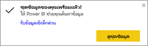
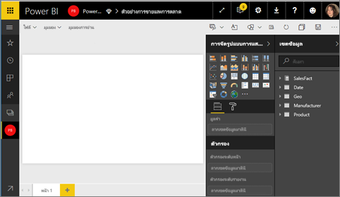
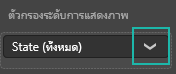
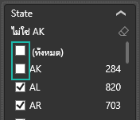
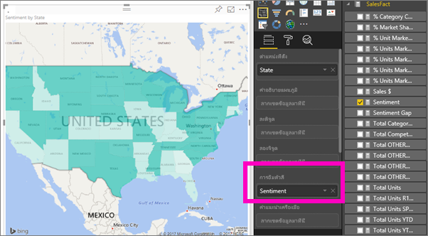
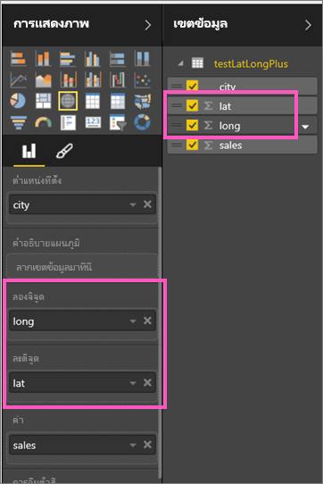

# แผนที่แถบสี (Choropleths) ใน Power BI
แผนที่แถบสีใช้เฉดสีหรือ หรือการปรับสีอ่อนแก่ หรือรูปแบบต่าง ๆ เพื่อแสดงว่าค่าแตกต่างกันมากเพียงใดในสัดส่วนทั่วทั้งภูมิศาสตร์หรือภูมิภาค  เพื่อแสดงความแตกต่างเหล่านี้ที่สัมพันธ์กับเฉดสีที่อยู่ในช่วงจากสีอ่อน (ความถี่น้อยกว่า/ต่ำกว่า) ไปถึงเข้ม (ความถี่มากกว่า/สูงกว่า) ได้อย่างรวดเร็ว    

## สิ่งที่จะถูกส่งไปยัง Bing
Power BI รวมเข้ากับ Bing เพื่อให้มีพิกัดแมปเริ่มต้น (กระบวนการที่เรียกว่า การกำหนดรหัสทางภูมิศาสตร์) เมื่อคุณสร้างการแสดงภาพของแผนที่ในบริการ Power BI หรือ Power BI Desktop ข้อมูลในบักเก็ต**ตำแหน่งที่ตั้ง** **ละติจูด** และ**ลองติจู** (ที่กำลังถูกใช้เพื่อสร้างการแสดงภาพนั้น) จะถูกส่งไปยัง Bing

คุณหรือผู้ดูแลระบบของคุณอาจจำเป็นต้องอัปเดตไฟร์วอลล์ของคุณเพื่ออนุญาตให้เข้าถึง URL ที่ Bing ใช้สำหรับการกำหนดพิกัดทางภูมิศาสตร์  URL เหล่านั้นคือ:
* https://dev.virtualearth.net/REST/V1/Locations
* https://platform.bing.com/geo/spatial/v1/public/Geodata
* https://www.bing.com/api/maps/mapcontrol

สำหรับข้อมูลเพิ่มเติมเกี่ยวกับข้อมูลที่ถูกส่งไปยัง Bing และสำหรับเคล็ดลับในการเพิ่มความสำเร็จการกำหนดรหัสทางภูมิศาสตร์ของคุณ ดู[คำแนะนำและเคล็ดลับสำหรับการแสดงภาพแผนที่](power-bi-map-tips-and-tricks.md)

## เมื่อใดควรใช้แผนที่แถบสี
แผนที่แถบสีเป็นทางเลือกที่เหมาะสมอย่างยิ่งในกรณีต่อไปนี้:

* เมื่อต้องแสดงข้อมูลเชิงปริมาณบนแผนที่
* เมื่อต้องแสดงรูปแบบเชิงพื้นที่และความสัมพันธ์
* เมื่อข้อมูลของคุณคือข้อมูลมาตรฐาน
* เมื่อทำงานกับข้อมูลด้านสังคมและเศรษฐกิจ
* เมื่อภูมิภาคที่กำหนดไว้มีความสำคัญ
* เมื่อต้องดูภาพรวมของการกระจายทั่วทั้งตำแหน่งที่ตั้งทางภูมิศาสตร์

### ข้อกำหนดเบื้องต้น
- บริการ Power BI หรือ Power BI Desktop
- ตัวอย่างการขายและการตลาด

เมื่อต้องการทำตาม บทช่วยสอนใช้บริการของ Power BI ไม่ใช่ Power BI Desktop ไม่

## สร้างแผนที่แถบสีพื้นฐาน
ในวิดีโอนี้ Kim สร้างแผนที่พื้นฐานและแปลงเป็นแผนที่แถบสี

<iframe width="560" height="315" src="https://www.youtube.com/embed/ajTPGNpthcg" frameborder="0" allowfullscreen></iframe>

1. ในการสร้างแผนที่แถบสีของคุณเอง [ดาวน์โหลดตัวอย่างยอดขายและการตลาด](sample-datasets.md)โดยลงชื่อเข้าใช้ Power BI และเลือก **รับข้อมูล\>ตัวอย่าง\>การขายและการตลาด\>เชื่อมต่อ**
2. เมื่อข้อความแสดงความสำเร็จปรากฏขึ้น เลือก**ดูแดชบอร์ด**

   
3. Power BI เปิดขึ้นพร้อมกับพื้นที่รายงานว่างเปล่าใน[มุมมองการแก้ไข](service-interact-with-a-report-in-editing-view.md)

    
4. จากช่องเขตข้อมูล เลือกเขตข้อมูลง**ทางภูมิศาสตร์** \> **รัฐ**    

   
5. [แปลงแผนภูมิ](power-bi-report-change-visualization-type.md)ให้เป็นแผนภูมิแถบสี โปรดสังเกตว่าตอนนี้**รัฐ**อยู่ในแอ่ง**ตำแหน่งที่ตั้ง** Bing Maps ใช้เขตข้อมูลในแอ่ง**ตำแหน่งที่ตั้ง**เพื่อสร้างแผนที่  ตำแหน่งที่ตั้งสามารถเป็นตำแหน่งที่ตั้งที่มีอยู่จริงต่าง ๆ: ประเทศ รัฐ เขต เมือง รหัสไปรษณีย์ หรืออื่น ๆ Bing Maps มีรูปร่างแผนผังแถบสีสำหรับตำแหน่งที่ตั้งต่าง ๆ ทั่วโลก หากรายการที่ใส่ในแอ่งตำแหน่งที่ตั้งไม่ถูกต้อง Power BI จะไม่สามารถสร้างแผนผังแถบสีได้  

   
6. กรองแผนที่เพื่อแสดงเฉพาะแผ่นดินใหญ่สหรัฐอเมริกา

   a.  ที่ด้านล่างของช่องการแสดงภาพ ค้นหาพื้นที่**ตัวกรอง**

   b.  เลื่อนไปเหนือ**รัฐ**และคลิกเครื่องหมายรูปตัววี (V) ที่ขยาย  
   

   c.  ทำเครื่องหมายถูกถัดจาก**ทั้งหมด** และลบเครื่องหมายถูกถัดจาก**AK**

   
7. เลือก**SalesFact** \> **ความคิดเห็น**เพื่อเพิ่มไปยังแอ่ง**ความเข้มสี**กัน เขตข้อมูลในแอ่ง**ความเข้มสี**ควบคุมเฉดสีของแผนที่  
   
8. แผนที่แถบสีจะเป็นสีเขียว โดยที่สีเขียวอ่อนเป็นตัวแทนตัวเลขความคิดเห็นที่ต่ำกว่า และสีเขียวเข้มแสดงตัวเลขความคิดเห็นที่สูงกว่า ซึ่งหมายความว่ามีความเห็นในเชิงบวกมากกว่า  ตรงนี้ฉันได้ไฮไลท์รัฐ Wyoming (WY) และเห็นหรือไม่ว่าความคิดเห็นนั้นดีมาก นั่นคือ 74  
   
9. [บันทึกรายงาน](service-report-save.md)

## การทำไฮไลท์และการกรองข้าม
สำหรับข้อมูลเกี่ยวกับการใช้พื้นที่ตัวกรอง โปรดดู[เพิ่มตัวกรองไปยังรายงาน](power-bi-report-add-filter.md)

การไฮไลต์ตำแหน่งที่ตั้งหนึ่งในแผนที่แถบสี จะกรองข้ามการแสดงภาพอื่น ๆ บนหน้ารายงานนั้น... และนอกจากนี้จะทำในทางกลับกันด้วย

ในการทำตามขั้นตอนนี้ ให้คัดลอกและวางแผนที่แถบสีของคุณลงบนหน้า**ความคิดเห็น**ของรายงาน*การขายและการตลาด*

1. บนแผนที่แถบสี เลือกหนึ่งรัฐ  ขั้นตอนนี้จะไฮไลต์การแสดงภาพอื่น ๆ บนหน้า ยกตัวอย่างเช่น การเลือก**เท็กซัส** จะแสดงให้เห็นว่าความคิดเห็นนั้นเป็น 74 เท็กซัสอยู่ในเขตกลาง\#23 และปริมาณการขายส่วนใหญ่มาจากเซ็กเมนต์ Moderation และ Convenience   
   
2. บนแผนภูมิเส้น สลับไปมาระหว่าง**ไม่ใช่**และ**ใช่** การทำเช่นนี้จะกรองแผนที่แถบสีเพื่อให้แสดงความคิดเห็นสำหรับ VanArsdel และสำหรับการแข่งขันของ VanArsdel  
   

## ข้อควรพิจารณาและการแก้ไขปัญหา
ข้อมูลในแผนที่อาจไม่ชัดเจน  ตัวอย่างเช่น มีปารีส ประเทศฝรั่งเศส และยังมีปารีส ในรัฐเท็กซัสด้วย ข้อมูลทางภูมิศาสตร์ของคุณถูกเก็บไว้ในคอลัมน์แยกต่างหาก ไม่ว่าจะเป็น คอลัมน์สำหรับชื่อเมือง คอลัมน์สำหรับชื่อรัฐหรือจังหวัด และอื่น ๆ ดังนั้น Bing อาจไม่สามารถบอกได้ว่าเป็นปารีสที่ไหน ถ้าชุดข้อมูลของคุณประกอบด้วยข้อมูลละติจูดและลองจิจูดอยู่แล้ว Power BI มีเขตข้อมูลพิเศษเพื่อช่วยทำให้ข้อมูลแผนที่ชัดเจนยิ่งขึ้น เพียงแค่ลากเขตข้อมูลที่ประกอบด้วยข้อมูลละติจูดของคุณลงในพื้นที่\>การแสดงภาพ > ละติจูด  และทำเช่นเดียวกันสำหรับข้อมูลลองจิจูดของคุณ  

ถ้าคุณมีสิทธิ์แก้ไขชุดข้อมูลใน Power BI Desktop ดูวิดีโอนี้สำหรับความช่วยเหลือในการแก้ไขแผนที่ที่ไม่ชัดเจน

<iframe width="560" height="315" src="https://www.youtube.com/embed/Co2z9b-s_yM" frameborder="0" allowfullscreen></iframe>

ถ้าคุณไม่สามารถเข้าถึงข้อมูลละติจูดและลองจิจูดได้ ให้[ทำตามคำแนะนำเหล่านี้เพื่ออัปเดตชุดข้อมูลของคุณ](https://support.office.com/article/Maps-in-Power-View-8A9B2AF3-A055-4131-A327-85CC835271F7)

สำหรับความช่วยเหลือเพิ่มเติมเกี่ยวกับการแสดงภาพของแผนที่ ดู[เคล็ดลับและคำแนะนำสำหรับการแสดงภาพของแผนที่](power-bi-map-tips-and-tricks.md)

## ขั้นตอนถัดไป
[เพิ่มแแผนที่แถบสีเป็นไทล์แดชบอร์ด (ปักหมุดภาพ)](service-dashboard-tiles.md)    
 [เพิ่มการแสดงภาพลงในรายงาน](power-bi-report-add-visualizations-i.md)  
 [ชนิดการแสดงภาพใน Power BI](power-bi-visualization-types-for-reports-and-q-and-a.md)    
 [เปลี่ยนชนิดของการแสดงภาพที่กำลังใช้อยู่](power-bi-report-change-visualization-type.md)      
มีคำถามเพิ่มเติมหรือไม่? [ลองไปที่ชุมชน Power BI](http://community.powerbi.com/)
