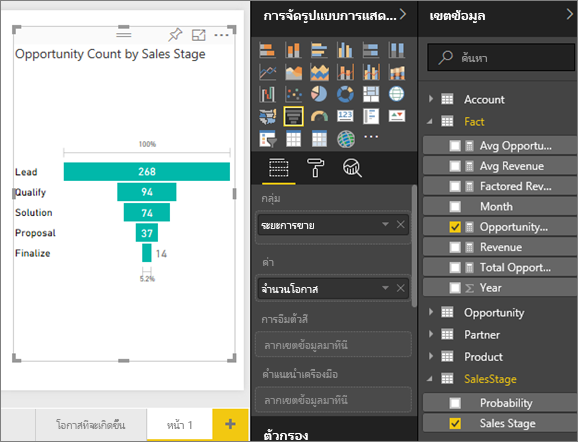
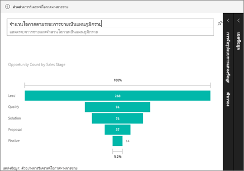

# แผนภูมิกรวย (บทช่วยสอน)
แผนภูมิกรวยช่วยให้คุณแสดงกระบวนการเส้นตรง ที่แบ่งเป็นขั้นตอนที่เชื่อมต่อกันตามลำดับ ตัวอย่างเช่น กรวยการขายที่ติดตามขั้นตอนของลูกค้า: เป้าหมาย \> เป้าหมายที่ผ่านคุณสมบัติ \> สนใจ \> ทำสัญญา \> ปิดการขาย  มองอย่างรวดเร็ว รูปร่างของกรวยบ่งบอกสุขภาพของกระบวนการที่คุณกำลังติดตาม

แต่ละขั้นตอนกรวยการแสดงเปอร์เซ็นต์ของผลรวม ดังนั้น ในกรณีส่วนใหญ่ แผนภูมิกรวยจะมีรูปเหมือนกรวย - ด้วยขั้นตอนแรกที่ใหญ่ที่สุด และขั้นตอนถัด ๆ มาเล็กกว่าขั้นตอนก่อนหน้า  แผนภูมิเป็นรูปต้นแพร์จะยังมีประโยชน์ -- สามารถใช้ระบุปัญหาในกระบวนการได้  แต่โดยทั่วไปแล้ว ขั้นแรกหรือขั้น "ทางเข้า" มีขนาดใหญ่ที่สุด

## เมื่อใดที่ใช้แผนภูมิกรวย
แผนภูมิกรวยเป็นตัวเลือกที่ดีสำหรับ:

* เมื่อข้อมูลมีลำดับ และผ่านไปตามลำดับขั้นอย่างน้อย 4 ขั้นตอน
* เมื่อจำนวนของ "รายการ" ในขั้นตอนแรกคาดว่า จะมีค่ามากกว่าจำนวนในขั้นตอนสุดท้าย
* เพื่อคำนวณโอกาสที่จะเกิดขึ้น (รายได้/ยอดขาย/ข้อตกลง/ฯลฯ) ตามลำดับขั้น
* เพื่อคำนวณและติดตาม อัตราการแปลงและการรักษาสถานภาพ
* เพื่อเปิดเผยปัญหาคอขวดในกระบวนการที่เป็นเส้นตรง
* เพื่อติดตามเวิร์กโฟลว์ของตะกร้าสินค้า
* เพื่อติดตามความคืบหน้าและความสำเร็จของแคมเปญ การคลิกโฆษณา/การตลาด

## การทำงานกับแผนภูมิกรวย
แผนภูมิกรวย:

* สามารถปักหมุด จากรายงาน และจากถามตอบ
* สามารถเรียงลำดับ
* สนับสนุนตัวเลขที่เป็นจำนวนเท่า
* สามารถไฮไลต์เชื่อมโยง และกรองข้าม จากการแสดงภาพอื่น ๆ บนหน้ารายงานเดียวกัน
* สามารถไฮไลต์เชื่อมโยง และกรองข้าม ไปยังการแสดงภาพอื่น ๆ บนหน้ารายงานเดียวกัน

## สร้างแผนภูมิกรวยพื้นฐาน
ดูวิดีโอนี้ เพื่อดู Will สร้างแผนภูมิกรวยโดยใช้ ตัวอย่างการขายและการตลาด

<iframe width="560" height="315" src="https://www.youtube.com/embed/qKRZPBnaUXM" frameborder="0" allow="autoplay; encrypted-media" allowfullscreen></iframe>

ตอนนี้ ลองสร้างแผนภูมิของคุณเอง ที่แสดงจำนวนโอกาสที่เรามีในแต่ละของขั้นตอนการขายของเรา

คำแนะนำเหล่านี้ใช้ตัวอย่างการวิเคราะห์โอกาสทางการขาย เพื่อทดลองทำตาม [ดาวน์โหลดตัวอย่าง](sample-datasets.md)สำหรับบริการของ Power BI (app.powerbi.com) หรือ Power BI Desktop   

1. เริ่มต้นจาก[หน้ารายงานเปล่า](power-bi-report-add-page.md) และเลือกเขตข้อมูล**ขั้นตอนการขาย** \> **ขั้นตอนการขาย** ถ้าคุณกำลังใช้บริการของ Power BI ตรวจสอบให้แน่ใจว่า คุณเปิดรายงานใน[มุมมองการแก้ไข](service-interact-with-a-report-in-editing-view.md)
   
    
2. [แปลงแผนภูมิ](power-bi-report-change-visualization-type.md)ให้เป็นแผนภูมิกรวย โปรดสังเกตว่า**ขั้นตอนการขาย**อยู่ใน**กลุ่ม** 
3. จากบานหน้าต่าง**เขตข้อมูล** เลือก**ข้อเท็จจริง** \> **จำนวนโอกาส**
   
    
4. โฮเวอร์เหนือแท่ง จะแสดงข้อมูลจำนวนมากออกมา
   
   * ชื่อของขั้นตอน
   * จำนวนโอกาสทางการขายในขั้นตอนนี้
   * อัตราการแปลงโดยรวม (% ของลูกค้าเป้าหมาย) 
   * ขั้นตอน-ถึง-ขั้นตอน (หรืออัตราการดรอป) ซึ่งก็เป็น % ของขั้นตอนก่อนหน้า (ในกรณีนี้ ขั้นตอนข้อเสนอ/ขั้นตอนโซลูชัน)
     
     
5. [เพิ่มกรวยเป็นไทล์แดชบอร์ด](service-dashboard-tiles.md) 
6. [บันทึกรายงาน](service-report-save.md)

## การไฮไลต์เชื่อมโยงและการกรองข้าม
สำหรับข้อมูลเกี่ยวกับการใช้บานหน้าต่างตัวกรอง ดู[เพิ่มตัวกรองไปยังรายงาน](power-bi-report-add-filter.md)

ไฮไลต์แท่งในแผนภูมิกรวย จะกรองข้ามการแสดงภาพอื่น ๆ บนหน้ารายงาน... และในทางกลับกัน เพื่อทำตาม เพิ่มวิชวลอีกสองสามวิชวล บนหน้ารายงานที่มีแผนภูมิกรวย

1. บนกรวย เลือกแท่ง**ข้อเสนอ** ซึ่งจะไฮไลต์เชื่อมโยงไปยังการแสดงภาพอื่น ๆ บนหน้า ใช้ CTRL เพื่อเลือกหลายค่า
   
   
2. เพื่อกำหนดลักษณะ การไฮไลต์เชื่อมโยง และการกรองข้าม ระหว่างวิชวล ดู[การโต้ตอบระหว่างวิชวลใน Power BI](service-reports-visual-interactions.md)

## สร้างแผนภูมิกรวยในถามตอบ
เปิดแดชบอร์ดตัวอย่างการวิเคราะห์โอกาสทางการขาย หรือแดชบอร์ดอื่น ๆ ที่มีการแสดงภาพอย่างน้อยหนึ่งภาพที่ปักหมุดจากชุดข้อมูล ตัวอย่างการวิเคราะห์โอกาสทางการขาย  เมื่อคุณพิมพ์คำถามในถามตอบ Power BI ค้นหาคำตอบในชุดข้อมูลทั้งหมดที่เชื่อมโยงกับ (มีไทล์ที่ปักหมุดไว้) แดชบอร์ดที่เลือก สำหรับข้อมูลเพิ่มเติมดู [Power BI - แนวคิดพื้นฐาน](service-basic-concepts.md)

1. บนแดชบอร์ดตัวอย่างการวิเคราะห์โอกาสทางการขาย เริ่มพิมพ์คำถามของคุณในกล่องคำถาม ถามตอบ
   
   
   
2. โปรดแน่ใจว่าได้เพิ่ม "เป็นกรวย" ตรงท้ายคำถาม เพื่อให้ Power BI ทราบชนิดการแสดงภาพที่คุณต้องการ

## ขั้นตอนถัดไป
[ชนิดการแสดงภาพใน Power BI](power-bi-visualization-types-for-reports-and-q-and-a.md)

[ปักหมุดการแสดงภาพไปยังแดชบอร์ด](service-dashboard-pin-tile-from-report.md)

[Power BI - แนวคิดพื้นฐาน](service-basic-concepts.md)

มีคำถามเพิ่มเติมหรือไม่? [ลองไปที่ชุมชน Power BI](http://community.powerbi.com/)

