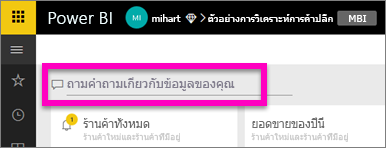
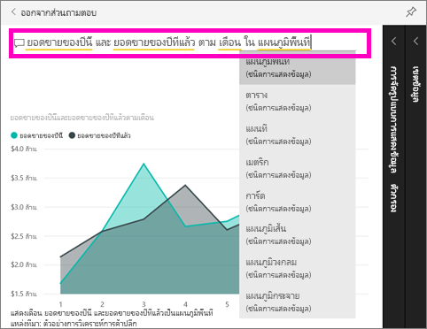

# เริ่มใช้งานกับการถามตอบ Power BI
## ใช้ถามตอบ Power BI ด้วยตัวอย่างการวิเคราะห์ร้านค้าปลีก
ในบางครั้ง วิธีที่เร็วที่สุดในการให้ได้คำตอบจากข้อมูลของคุณคือ การถามคำถามโดยใช้ภาษาธรรมชาติ  ในเริ่มใช้งานด่วนนี้ เราจะดู 2 วิธีีที่แตกต่างกันสำหรับการสร้างการแสดงภาพเดียวกัน: ก่อนอื่นให้สร้างในรายงานก่อน และประการที่สอง ถามคำถามกับถามตอบ (Q&A) เราจะใช้บริการ Power BI แต่กระบวนการเกือบจะเหมือนกันทั้งหมดกับการใช้ Power BI Desktop

ในการทำตาม คุณต้องใช้รายงานที่คุณสามารถแก้ไขได้ ดังนั้นเราจะใช้หนึ่งในตัวอย่างที่พร้อมใช้งานกับ Power BI

## วิธีที่ 1: ใช้ตัวแก้ไขรายงาน
1. จากพื้นที่ทำงานของ Power BI เลือก**รับข้อมูล** \> **ตัวอย่าง** \> **ตัวอย่างการวิเคราะห์ร้านค้าปลีก**  >   **เชื่อมต่อ**
   
    
2. แดชบอร์ดประกอบด้วยไทล์แผนภูมิพื้นที่สำหรับ "ยอดขายของปีที่แล้วและยอดขายของปีนี้"  เลือกไทล์นี้ 
   
   * ถ้าไทล์นี้ถูกสร้างขึ้นด้วยการถามตอบ การเลือกไทล์จะเปิดการถามตอบขึ้น 
   * แต่ไทล์นี้สร้างขึ้นในรายงาน ดังนั้นรายงานจะเปิดไปยังหน้าที่ประกอบด้วยการแสดงภาพนี้
3. เปิดรายงานในมุมมองการแก้ไขโดยการเลือก**แก้ไขรายงาน**  ถ้าคุณไม่ได้เป็นเจ้าของรายงาน คุณจะไม่มีตัวเลือกในการเปิดรายงานในมุมมองแก้ไข
   
    
4. เลือกแผนภูมิพื้นที่และตรวจทานการตั้งค่าในพื้นที่**เขตข้อมูล**  ผู้สร้างรายงานสร้างแผนภูมินี้โดยการเลือกทั้ง 3 ค่านี้ (**เวลา > FiscalMonth** **ยอดขาย > ยอดขายของปีนี้** **ยอดขาย > ยอดขายของปีที่แล้ว > ค่า**) และจัดระเบียบในแอ่ง**แกน**และ**ค่า**
   
    

## วิธีที่ 2: ใช้การถามตอบ
เราจะทำอย่างไรในการสร้างแผนภูมิเส้นเดียวกันนี้โดยใช้การถามตอบ?

1. นำทางกลับไปยังแดชบอร์ดตัวอย่างการวิเคราะห์ร้านค้าปลีก
2. ใช้ภาษาธรรมชาติ พิมพ์ลักษณะนี้ลงในกล่องคำถาม:
   
   **ยอดขายของปีนี้และปีที่แล้วแยกตามเดือนแสดงเป็นแผนภูมิพื้นที่เป็นอย่างไร**
   
   ขณะที่คุณพิมพ์คำถามของคุณ การถามตอบจะเลือกการแสดงภาพที่ดีที่สุดเพื่อแสดงคำตอบของคุณ และการแสดงภาพจะเปลี่ยนแปลงอย่างต่อเนื่องขณะที่คุณเปลี่ยนคำถามของคุณ นอกจากนี้ยัง การถามตอบยังช่วยให้คุณจัดรูปแบบคำถามของคุณด้วยคำแนะนำ การกรอกข้อมูลอัตโนมัติ และการแก้ไขการสะกด
   
   เมื่อคุณพิมพ์คำถามเสร็จสิ้น ผลลัพธ์คือ แผนภูมิเดียวกันกับที่เราเห็นในรายงานทุกประการ  แต่การสร้างด้วยวิธีนี้ทำได้เร็วกว่ามาก!
   
   
3. ซึ่งคล้ายกับการทำงานด้วยรายงาน ภายในการถามตอบ คุณสามารถเข้าถึงพื้นที่การแสดงภาพ ตัวกรอง และเขตข้อมูลได้  เปิดพื้นที่เหล่านี้เพื่อสำรวจเพิ่มเติมและปรับเปลี่ยนภาพของคุณ
4. เมื่อต้องการปักหมุดแผนภูมิไปยังแดชบอร์ด เลือกไอคอนหมุด

## ขั้นตอนถัดไป
[Q&A ใน Power BI](consumer/end-user-q-and-a.md)

[ทำให้ข้อมูลของคุณทำงานได้ดีกับการถามตอบใน Power BI](service-prepare-data-for-q-and-a.md)

มีคำถามเพิ่มเติมหรือไม่? [ลองไปที่ชุมชน Power BI](http://community.powerbi.com/)

