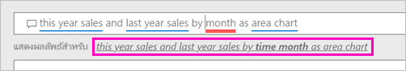
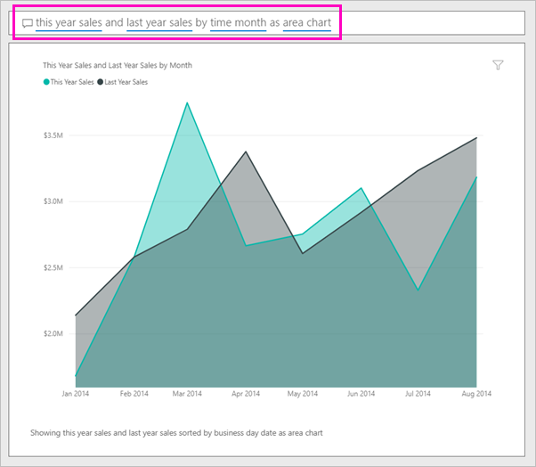

# สร้างวิชวล ด้วย Power BI q&a

ในบางครั้ง วิธีที่เร็วที่สุดในการให้ได้คำตอบจากข้อมูลของคุณคือ การถามคำถามโดยใช้ภาษาธรรมชาติ  ในบทความนี้ เราดูที่แตกต่างกันสองวิธีการสร้างการแสดงภาพเดียวกัน: ก่อน ถามคำถาม ด้วยการถามตอบ และสอง สร้างในรายงาน เราใช้บริการของ Power BI เพื่อสร้างวิชวลในรายงาน แต่กระบวนการเกือบเหมือนใช้ Power BI Desktop

ในการทำตาม คุณต้องใช้รายงานที่คุณสามารถแก้ไขได้ ดังนั้นเราจะใช้หนึ่งในตัวอย่างที่พร้อมใช้งานกับ Power BI

## สร้างวิชวล ด้วยการถามตอบ

เราทำเกี่ยวกับการสร้างแผนภูมิเส้นนี้ใช้ถามตอบหรือไม่

1. จากพื้นที่ทำงานของ Power BI เลือก**รับข้อมูล** \> **ตัวอย่าง** \> **ตัวอย่างการวิเคราะห์ร้านค้าปลีก**  >   **เชื่อมต่อ**

1. เปิดแดชบอร์ดตัวอย่างการวิเคราะห์ร้านค้าปลีก และวางเคอร์เซอร์ของคุณในกล่อง การถามตอบ**ถามคำถามเกี่ยวกับข้อมูลของคุณ**

    

2. ในกล่องตอบถาม พิมพ์ลักษณะคำถามนี้:
   
    **ยอดขายของปีนี้และยอดขายปีที่แล้วตามเดือนเป็นแผนภูมิพื้นที่**
   
    ขณะที่คุณพิมพ์คำถามของคุณ การถามตอบจะเลือกการแสดงภาพที่ดีที่สุดเพื่อแสดงคำตอบของคุณ และการแสดงภาพจะเปลี่ยนแปลงอย่างต่อเนื่องขณะที่คุณเปลี่ยนคำถามของคุณ นอกจากนี้ การถามตอบยังช่วยให้คุณสามารถจัดรูปแบบคำถามของคุณตามคำแนะนำ การกรอกข้อมูลอัตโนมัติ และการแก้ไขการสะกด ถามตอบแนะนำการเปลี่ยนแปลงคำขนาดเล็ก: "ยอดขายของปีนี้และยอดขายของปีที่แล้วโดย*เดือนเวลา*เป็นแผนภูมิพื้นที่"  

    

4. เลือกประโยคเพื่อยอมรับคำแนะนำ 
   
   เมื่อคุณเสร็จสิ้นการพิมพ์คำถามของคุณ ผลลัพธ์คือ แผนภูมิเดียวกันที่คุณเห็นในแดชบอร์ด
   
   

4. เมื่อต้องการปักหมุดแผนภูมิไปยังแดชบอร์ด เลือกไอคอนปักหมุด  ที่มุมขวาบน

## สร้างวิชวลในตัวแก้ไขรายงาน

1. นำทางกลับไปยังแดชบอร์ดตัวอย่างการวิเคราะห์ร้านค้าปลีก
   
2. แดชบอร์ดที่ประกอบด้วยไทล์แผนภูมิพื้นที่เดียวกันสำหรับ "ยอดขายของปีและยอดขายของปีนี้"  เลือกไทล์นี้ ไม่ได้เลือกไทล์คุณสร้างขึ้น ด้วยถามตอบ เลือกเปิดถามตอบ ไทล์แผนภูมิพื้นที่เดิมถูกสร้างขึ้นในรายงาน ดังนั้นรายงานเปิดหน้าที่ประกอบด้วยการแสดงภาพนี้

    

1. เปิดรายงานในมุมมองการแก้ไขโดยการเลือก**แก้ไขรายงาน**  ถ้าคุณไม่ได้เป็นเจ้าของรายงาน คุณจะไม่มีตัวเลือกในการเปิดรายงานในมุมมองแก้ไข
   
    
4. เลือกแผนภูมิพื้นที่และตรวจทานการตั้งค่าในพื้นที่**เขตข้อมูล**  ผู้สร้างรายงานสร้างแผนภูมินี้ โดยการเลือกค่าที่สามเหล่านี้ (**ยอดขายของปี**และ**ยอดขายปีนี้ > ค่า**จากการ**ขาย**ตาราง และ **เดือนงบประมาณ**จากตัว**เวลา**ตาราง) และจัดระเบียบในการ**แกน**และ**ค่า**บ่อ
   
    

    คุณเห็นพวกเขาสิ้นสุดลงทะเบียนกับวิชวลเดียวกัน สร้างด้วยวิธีนี้ไม่ซับซ้อนเกินไป แต่สร้าง ด้วยการถามตอบได้ง่ายขึ้น

## ขั้นตอนถัดไป

- [ใช้ถามตอบในแดชบอร์ดและรายงาน](power-bi-tutorial-q-and-a.md)  
- [Q&a สำหรับผู้บริโภค](consumer/end-user-q-and-a.md)
- [ทำให้ข้อมูลของคุณทำงานได้ดีกับการถามตอบใน Power BI](service-prepare-data-for-q-and-a.md)

มีคำถามเพิ่มเติมหรือไม่? [ลองไปที่ชุมชน Power BI](http://community.powerbi.com/)

