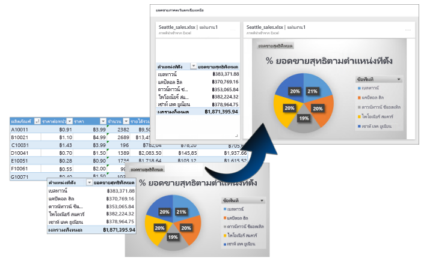
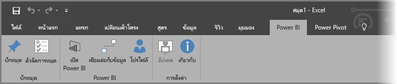
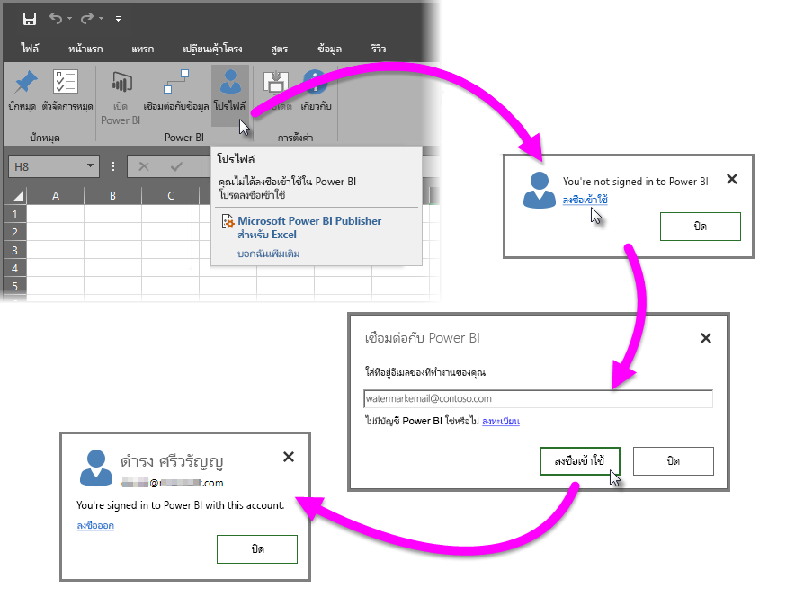
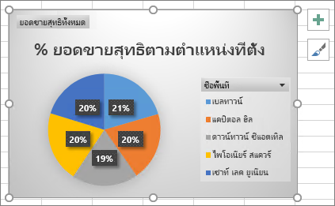
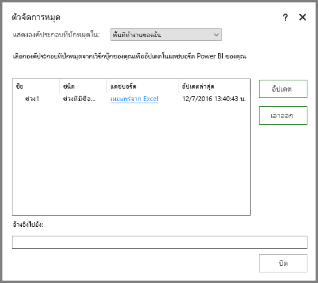
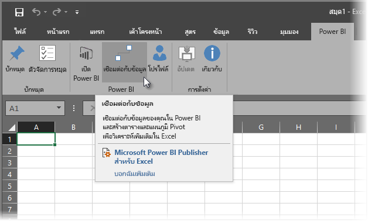
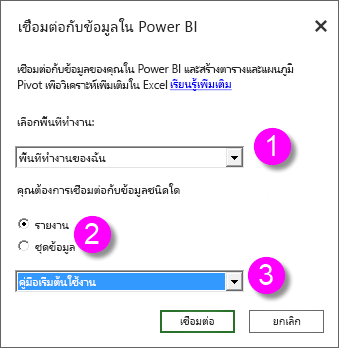
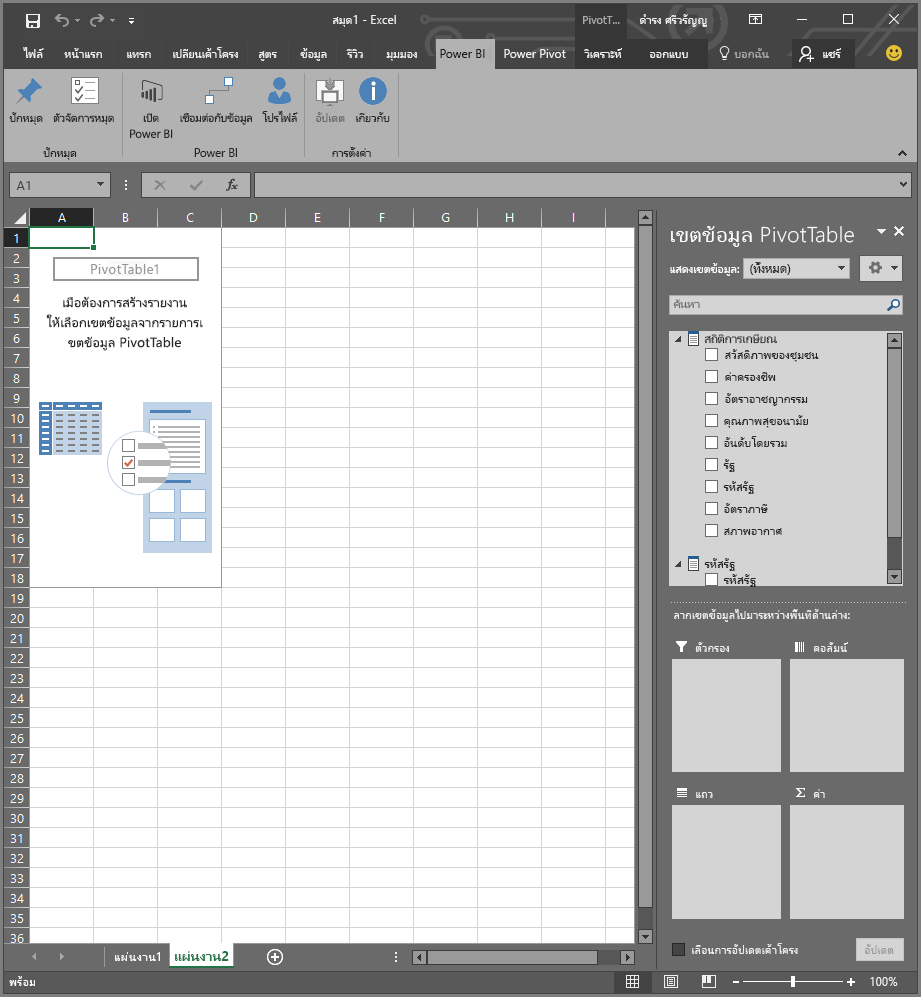
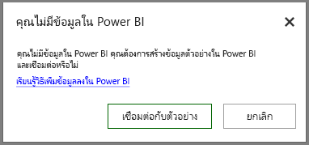

# Power BI Publisher สำหรับ Excel
ด้วย Microsoft **Power BI publisher สำหรับ Excel**คุณสามารถรับสแนปช็อตของข้อมูลเชิงลึกที่สำคัญที่สุดของคุณใน Excel เช่น Pivottable แผนภูมิ และช่วง และปักหมุดเหล่านั้นไปยังแดชบอร์ดใน Power BI ได้

คุณสามารถปักหมุดอะไรได้บ้าง ทุกอย่างในแผ่นงาน Excel คุณสามารถเลือกช่วงของเซลล์จากแบบง่าย ๆ แผ่นงานหรือตาราง PivotTable หรือ PivotChart ภาพประกอบ และรูป ภาพ ข้อความ

สิ่งที่คุณไม่สามารถปักหมุด: คุณไม่สามารถปักหมุดแผนที่สามมิติหรือจัดรูปแบบข้อมูลในแผ่นงาน Power View ได้ ยังมีองค์ประกอบบางอย่างคุณสามารถปักหมุด แต่จะไม่ค่อยมีถึง เช่นตัวกรองตัวแบ่งส่วนข้อมูลหรือไทม์ไลน์

เมื่อคุณปักหมุดองค์ประกอบจาก Excel ไทล์ใหม่จะถูกเพิ่มไปยังแดชบอร์ดใหม่ หรือที่มีอยู่ใน Power BI ไทล์ใหม่เป็นสแนปช็อต ดังนั้นจึงไม่ได้เป็นแบบไดนามิก แต่คุณยังคงสามารถอัปเดต ตัวอย่างเช่น ถ้าคุณทำการเปลี่ยนแปลงลงใน PivotTable หรือแผนภูมิที่คุณได้ปักหมุด ไทล์แดชบอร์ดใน Power BI ไม่ได้รับการปรับปรุงโดยอัตโนมัติ แต่คุณยังคงสามารถปรับปรุงองค์ประกอบที่ปักหมุดไว้ของคุณ โดยใช้**ตัวจัดการหมุด** คุณจะได้เรียนรู้เพิ่มเติมเกี่ยวกับ**ตัวจัดการหมุด**ในส่วนต่อไปนี้

## ดาวน์โหลด และติดตั้ง
Power BI publisher สำหรับ Excel คือ โปรแกรม add-in คุณสามารถดาวน์โหลด และติดตั้งบนเวอร์ชันสำหรับเดสก์ท็อป ของ Microsoft Excel 2007 และเวอร์ชันที่ใหม่กว่า

[Microsoft Power BI Publisher สำหรับ Excel](http://go.microsoft.com/fwlink/?LinkId=715729)

เมื่อคุณมีผู้เผยแพร่ติดตั้ง คุณจะเห็นใหม่**Power BI** ribbon ใน Excel ตำแหน่งที่คุณสามารถลงชื่อเข้าใช้ (หรือลงชื่อออก) ของ Power BI ปักหมุดองค์ประกอบลงในแดชบอร์ด และจัดการองค์ประกอบที่คุณได้ปักหมุด

การ**Power BI publisher สำหรับ Excel** add-in ในจะเปิดใช้งานตามค่าเริ่มต้น แต่ถ้าเหตุผลบางอย่าง คุณไม่เห็นแท็บ ribbon Power BI ใน Excel คุณจะต้องเปิดใช้งาน คลิก**แฟ้ม** > **ตัวเลือก** > **add-in ของ** > **add-in ของ COM** เลือก**Microsoft Power BI Publisher สำหรับ Excel**

## ปักหมุดช่วงไปยังแดชบอร์ด
คุณสามารถเลือกเซลล์ช่วงใดก็ได้จากแผ่นงานของคุณ และปักหมุดสแนปช็อตของที่อยู่ในช่วงที่มีอยู่หรือแดชบอร์ดใหม่ใน Power BI คุณสามารถปักหมุดสแนปช็อตเดียวกันกับหลายแดชบอร์ด เกินไป

เมื่อต้องการเริ่มต้น คุณจำเป็นต้องตรวจสอบให้แน่ใจว่า คุณกำลังลงชื่อเข้าใช้ Power BI

1. เลือก**โปรไฟล์**จาก**Power BI**แท็บ ribbon ใน Excel ถ้าคุณลงชื่อเข้าไปยัง Power BI คุณจะเห็นกล่องโต้ตอบที่แสดงบัญชีที่คุณกำลังลงชื่อเข้าใช้ในขณะนี้ ถ้าเป็นบัญชีคุณต้องการใช้ เยี่ยมเลย - ไปที่ขั้นตอนการปักหมุดช่วงของคุณชุดถัดไป เลือก*ลงชื่อออก*ถ้าคุณต้องการใช้บัญชี Power BI อื่น ถ้าคุณไม่ลงใน ไปยังขั้นตอนถัดไป (ขั้นตอนที่ 2)
   
   
2. ถ้าคุณไม่ลงใน เลือก**ลงชื่อเข้าใช้**ลิงก์ที่ปรากฏขึ้นเมื่อคุณเลือก**โปรไฟล์**จากการ**Power BI** ribbon แท็บใน Excel ในแบบ**เชื่อมต่อกับ Power BI**ชนิดกล่องโต้ตอบที่อยู่อีเมลของบัญชี Power BI คุณต้องการใช้ จาก นั้นเลือก**ลงชื่อเข้าใช้**
   
   

เมื่อคุณกำลังลงชื่อเข้าใช้ ทำตามขั้นตอนเหล่านี้เพื่อปักหมุดช่วงไปยังแดชบอร์ด:

1. ใน Excel เลือกแบบ**Power BI**แท็บ ribbon เพื่อดู**Pin**ปุ่ม ribbon
2. เลือกช่วงจากสมุดงาน Excel ของคุณ
3. คลิกปุ่ม**Pin**จากแถบข้อมูล**Power BI** เพื่อแสดง**ปักหมุดลงในกล่องโต้ตอบแดชบอร์ด** คุณไม่ได้ลงชื่อเข้าใช้ใน Power BI จะมีข้อความเตือนให้ลงชื่อเข้าใช้ เลือกพื้นที่ทำงานจาก**พื้นที่ทำงาน**รายการแบบหล่นลง ถ้าคุณต้องการปักหมุดลงในแดชบอร์ดของคุณเอง ตรวจสอบ**My Workspace**ไว้ ถ้าคุณต้องการปักหมุดไปยังแดชบอร์ดในเวิร์กสเปซกลุ่ม เลือกกลุ่มจากรายการดรอปดาวน์
4. เลือกว่า คุณต้องการปักหมุดไว้ผิด*แดชบอร์ดที่มีอยู่*หรือสร้างการ*แดชบอร์ดใหม่*
5. คลิก**โอเค**เพื่อปักหมุดในหน้าที่คุณเลือกเพื่อให้ปรากฎในแดชบอร์ด
6. ใน**ปักหมุดลงในแดชบอร์ด**เลือกแดชบอร์ดที่มีอยู่ในพื้นที่ทำงาน หรือสร้างขึ้นใหม่ และคลิกปุ่ม**ตกลง**
   
   

## ปักหมุดแผนภูมิไปยังแดชบอร์ด
เพียงแค่คลิกที่แผนภูมิ และจากนั้น คลิกปักหมุด

## จัดการองค์ประกอบที่ปักหมุด
ด้วย**ตัวจัดการหมุด**คุณสามารถปรับปรุงขององค์ประกอบ (รีเฟรช) ที่ปักหมุดไทล์ที่เกี่ยวข้องใน Power BI ได้ คุณยังสามารถเอา pin ระหว่างองค์ประกอบคุณได้ปักหมุดกับแดชบอร์ดใน Power BI

เมื่อต้องการปรับปรุงไทล์ในแดชบอร์ดของคุณ ใน**ตัวจัดการหมุด**เลือกองค์ประกอบอย่าง น้อยหนึ่งรายการ จากนั้น เลือก**อัปเดต**

เมื่อต้องเอาการแมประหว่างองค์ประกอบปักหมุดไว้ใน Excel และไทล์เกี่ยวข้องในแดชบอร์ด เอา**ลบ** เมื่อคุณเลือก**ลบ**คุณกำลัง*ไม่*เอาองค์ประกอบออกจากแผ่นงานของคุณใน Excel หรือลบไทล์เกี่ยวข้องในแดชบอร์ด คุณกำลังเอารหัส pin หรือ*แมป*ระหว่างกัน องค์ประกอบถูกเอาออกจะไม่ปรากฏใน**ตัวจัดการหมุด** ถ้าคุณปักหมุดองค์ประกอบอีก จะปรากฏเป็นไทล์ใหม่

เมื่อต้องการเอาองค์ประกอบปักหมุดไว้ (ไทล์) ออกจากแดชบอร์ด คุณจะต้องดำเนินการดังกล่าวใน Power BI ในไทล์คุณต้องการลบ เลือก**เปิดเมนู**ไอคอนแล้วเลือก**ลบไทล์**

## เชื่อมต่อกับข้อมูลใน Power BI
เริ่มต้น ด้วยการวางจำหน่าย 2016 กรกฎาคม**Power BI publisher สำหรับ Excel** (รวมถึงรุ่นปัจจุบัน เชื่อมโยงกับด้านบน), คุณสามารถเชื่อมต่อโดยตรงไปยังข้อมูลในบริการ Power BI และวิเคราะห์ข้อมูลใน Excel โดยใช้ PivotTables และ ใน Pivotchart คุณลักษณะนี้ทำให้ง่ายต่อการใช้ข้อมูล Power BI และ Excel เข้าด้วยกันเพื่อวิเคราะห์ข้อมูลที่สำคัญที่สุดสำหรับคุณ

การปรับปรุงประกอบไปด้วยสิ่งต่าง ๆ ต่อไปนี้:

* โปรแกรมควบคุมที่จำเป็นเพื่อเชื่อมต่อกับข้อมูลใน Power BI จะอัปเดตโดยอัตโนมัติ ด้วยแต่ละรุ่น - ไม่จำเป็นต้องติดตั้ง หรือจัดการโปรแกรมควบคุมเหล่านั้นด้วยตนเอง
* คุณไม่จำเป็นต้องดาวน์โหลดไฟล์.odc เมื่อต้องสร้างการเชื่อมต่อ - **Power BI publisher สำหรับ Excel**สร้างการเชื่อมต่อโดยอัตโนมัติเมื่อคุณเลือกรายงานหรือชุดข้อมูลที่คุณต้องการใช้
* ตอนนี้คุณสามารถสร้างการเชื่อมต่อและ PivotTables หลายในเวิร์กบุ๊กเดียวกัน
* ข้อผิดพลาดเป็นเฉพาะ และปรับปรุง**Power BI publisher สำหรับ Excel**แทนที่จะใช้ข้อความ Excel เริ่มต้น

### วิธีการเชื่อมต่อกับข้อมูล Power BI ใน Excel
เมื่อต้องการเชื่อมต่อกับข้อมูล Power BI โดยใช้**Power BI publisher สำหรับ Excel**ทำตามขั้นตอนเหล่านี้อย่างง่าย:

1. ตรวจสอบให้แน่ใจว่าคุณได้ลงชื่อเข้าใช้ใน Power BI ขั้นตอนที่อธิบายวิธี การลงชื่อเข้าใช้ (หรือเมื่อ ต้องการลงชื่อเข้าใช้ ด้วยบัญชีอื่น) ไว้ก่อนหน้าในบทความนี้
2. เมื่อคุณกำลังลงชื่อเข้าใช้ Power BI ด้วยบัญชีคุณต้องการใช้ เลือก**เชื่อมต่อกับข้อมูล**จาก**Power BI**แท็บ ribbon ใน Excel
   
   
3. Excel เชื่อมต่อกับ Power BI โดยใช้การเชื่อมต่อ HTTPS และแสดงใน**เชื่อมต่อกับข้อมูลใน Power BI**กล่องโต้ตอบ ซึ่งคุณสามารถเลือก*พื้นที่ทำงาน*จากที่ คุณต้องการเลือกข้อมูลของคุณ (1 ในรูปด้านล่าง), ซึ่ง*ชนิดของข้อมูล*คุณต้องการเชื่อมต่อกับ อย่างใดอย่างหนึ่ง**รายงาน**หรือ**ชุดข้อมูล** (2), และแบบหล่นลง (3) ที่ช่วยให้คุณสามารถเลือกที่ *รายงานที่พร้อมใช้งานหรือชุดข้อมูล*ที่จะเชื่อมต่อ
   
   
4. เมื่อคุณทำให้ตัวเลือกของคุณ และเลือก**เชื่อมต่อ**จาก**เชื่อมต่อกับข้อมูลใน Power BI**กล่องโต้ตอบ Excel จัดเตรียม PivotTable และแสดงการ**เขตข้อมูล PivotTable**บานหน้าต่าง ตำแหน่ง คุณสามารถเลือกเขตข้อมูลจากข้อมูล Power BI ของคุณเชื่อมต่อ และสร้างตาราง หรือแผนภูมิที่ช่วยให้คุณวิเคราะห์ข้อมูล
   
   

ถ้าคุณไม่มีข้อมูลใด ๆ ใน Power BI, Excel ตรวจพบที่อยู่ และมีการสร้างข้อมูลตัวอย่างสำหรับคุณเพื่อเชื่อมต่อ และลอง

มีบางสิ่งที่ต้องพิจารณาในรุ่นนี้**Power BI publisher สำหรับ Excel**:

* **ข้อมูลที่แชร์** -ข้อมูลที่ถูกแชร์กับคุณ แต่ไม่ได้โดยตรงมองเห็นได้ใน Power BI ไม่พร้อมใช้งานใน**เชื่อมต่อกับข้อมูล**
* **SSAS ภายในองค์กร** - ถ้าคุณเลือกชุดข้อมูลมาจากการภายในองค์กร SQL Server Analysis Services (SSAS) และชุดข้อมูลใน Power BI ใช้ DirectQuery ในการเข้าถึงข้อมูล**Power BI publisher สำหรับ Excel**เชื่อมต่อกับ ให้ข้อมูลผ่านภายในองค์กรเครือข่ายการเชื่อมต่อ และไม่*ไม่*ไปผ่านทาง Power BI เพื่อเชื่อมต่อกับข้อมูลนั้น ในกรณีนี้ ผู้ใช้ทุกคนที่พยายามเชื่อมต่อกับชุดข้อมูลดังกล่าวต้องเชื่อมต่อกับเครือข่ายภายในองค์กร และรับรองความถูกต้องสำหรับการเข้าถึงข้อมูลนั้นโดยใช้วิธีการรับรองความถูกต้องที่จ้าง โดยอินสแตนซ์ Analysis Services ที่เก็บข้อมูล
* **จำเป็นต้องมีโปรแกรมควบคุม** - **Power BI publisher สำหรับ Excel**ติดตั้งโปรแกรมควบคุมที่จำเป็นทั้งหมดสำหรับคุณลักษณะนี้เมื่อต้องการทำงาน และไม่ดังนั้นโดยอัตโนมัติ ระหว่างโปรแกรมควบคุมติดตั้งโดยอัตโนมัติเหล่านั้นคือไดรเวอร์ Excel OLE DB สำหรับ Analysis Services ถ้าโปรแกรมควบคุมที่ถูกเอาออก โดยผู้ใช้ (หรือเหตุผลอื่น), การเชื่อมต่อกับข้อมูล Power BI จะไม่ทำงาน
* **ชุดข้อมูลต้องมีหน่วยวัด**- ชุดข้อมูลต้องมีหน่วยวัดแบบจำลองที่กำหนดไว้ในลำดับสำหรับ Excel ถือว่าหน่วยวัดเป็นค่าใน Pivottable และวิเคราะห์ข้อมูลอย่างถูกต้อง เรียนรู้เพิ่มเติมเกี่ยวกับ[ การวัด](desktop-measures.md)
* **การสนับสนุนสำหรับกลุ่ม**-ชุดข้อมูลที่ใช้ร่วมกันกับบุคคลภายนอกกลุ่มที่ระบุไม่ได้รับการสนับสนุน และไม่สามารถเชื่อมต่อไป
* **ฟรีเทียบกับการสมัครใช้งาน Pro** -กิจกรรมที่เกี่ยวข้องกับกลุ่มไม่ได้รับการสนับสนุนสำหรับผู้ใช้ฟรีของ Power BI และจะไม่เห็นดังนั้น ทุกชุดข้อมูลหรือรายงานที่ใช้ร่วมกันกับกลุ่มในพื้นที่ทำงานของพวกเขาเอง
* **แชร์รายงานหรือชุดข้อมูล**-รายงานหรือชุดข้อมูลที่แชร์กับคุณไม่สามารถเชื่อมต่อไปได้
* **ใช้ตารางแทนตัวแบบข้อมูล**-ชุดข้อมูลและรายงานที่ถูกสร้างขึ้น โดยการนำเข้าตารางเท่านั้นจาก Excel (โดยไม่มีแบบจำลองข้อมูล) ไม่ได้รับการสนับสนุนในขณะนี้ และไม่สามารถเชื่อมต่อไป

เมื่อคุณสร้างแผนภูมิที่น่าสนใจหรือภาพอื่น ๆ เช่นช่วงของข้อมูล คุณสามารถได้อย่างง่ายดายปักหมุดกับแดชบอร์ดใน Power BI ตามที่อธิบายไว้ก่อนหน้าในบทความนี้

## บทความที่เกี่ยวข้อง
มีหลายวิธีในการใช้ Excel และ Power BI เข้าด้วยกัน และได้รับดีที่สุดจากทั้งสองอย่าง ดูที่บทความดังต่อไปนี้เพื่อดูรายละเอียดเพิ่มเติม

* [วิเคราะห์ใน excel](service-analyze-in-excel.md)
* [การแก้ไขปัญหาวิเคราะห์ใน Excel](desktop-troubleshooting-analyze-in-excel.md)

