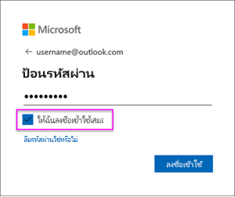

# รีเฟรชชุดข้อมูลที่สร้างขึ้นจากการไฟล์ .CSV บน OneDrive หรือ SharePoint Online
## มีข้อดีอะไรบ้าง?
เมื่อคุณเชื่อมต่อไปยังไฟล์ .csv บน OneDrive หรือ SharePoint Online ชุดข้อมูลจะถูกสร้างขึ้นใน Power BI จากนั้น ข้อมูลจากไฟล์ .csv จะถูกนำเข้าลงในชุดข้อมูลใน Power BI Power BI จะเชื่อมต่อไปยังไฟล์โดยอัตโนมัติ และรีเฟรชการเปลี่ยนแปลงใด ๆ กับชุดข้อมูลใน Power BI ถ้าคุณแก้ไขไฟล์ .csv ใน OneDrive หรือ SharePoint Online เมื่อคุณบันทึก การเปลี่ยนแปลงดังกล่าวจะปรากฏใน Power BI ซึ่งมักทำภายในประมาณหนึ่งชั่วโมง การแสดงภาพใด ๆ ใน Power BI ที่มาจากชุดข้อมูลจะถูกอัปเดตโดยอัตโนมัติด้วย

ถ้าไฟล์ของคุณอยู่ในโฟลเดอร์ที่แชร์บน OneDrive for Business หรือ SharePoint Online ผู้ใช้อื่น ๆ สามารถทำงานบนไฟล์เดียวกันได้ เมื่อบันทึก การเปลี่ยนแปลงจะถูกอัปเดตโดยอัตโนมัติใน Power BI ซึ่งมักทำภายในหนึ่งชั่วโมง

องค์กรจำนวนมากเรียกใช้กระบวนการที่คิวรีฐานข้อมูลโดยอัตโนมัติ แล้วบันทึกไปยังไฟล์ .csv ในแต่ละวัน ถ้าไฟล์ถูกจัดเก็บบน OneDrive หรือ SharePoint Online และไฟล์เดียวกันถูกเขียนทับในแต่ละวัน แทนที่จะสร้างไฟล์ใหม่ด้วยชื่อที่แตกต่างกันในแต่ละวัน คุณสามารถเชื่อมต่อไปยังไฟล์นั้นใน Power BI ชุดข้อมูลของคุณที่เชื่อมต่อกับไฟล์จะถูกซิงโครไนซ์ในไม่นาน หลังจากที่ไฟล์บน OneDrive หรือ SharePoint Online ถูกอัปเดต การแสดงภาพใด ๆ จากชุดข้อมูลนั้น จะถูกอัปเดตโดยอัตโนมัติเช่นกัน

## อะไรบ้างที่ได้รับการสนับสนุน?
แฟ้มค่าที่คั่นด้วยเครื่องหมายจุลภาค เป็นแฟ้มข้อความแบบง่าย ๆ ดังนั้นการเชื่อมต่อกับแหล่งข้อมูลภายนอก และรายงาน จะไม่ได้รับการสนับสนุน คุณไม่สามารถกำหนดการรีเฟรชตามเวลา บนชุดข้อมูลที่สร้างจากแฟ้มค่าที่คั่นด้วยเครื่องหมายจุลภาค แต่ถ้าไฟล์อยู่บน OneDrive หรือ SharePoint Online, Power BI จะซิงโครไนซ์การเปลี่ยนแปลงใด ๆ ของไฟล์ไปยังชุดข้อมูลประมาณทุกชั่วโมงโดยอัตโนมัติ

## OneDrive หรือ OneDrive for Business อะไรคือความแตกต่าง?
ถ้าคุณมีทั้ง OneDrive ส่วนบุคคลและ OneDrive for Business แนะนำให้คุณเก็บไฟล์ต่าง ๆ ที่คุณต้องการเชื่อมต่อใน Power BI บน OneDrive for Business นี่คือสาเหตุว่าทำไม: คุณน่าจะใช้บัญชีคนละบัญชีเพื่อลงชื่อเข้าใช้บริการทั้งสอง

การเชื่อมต่อกับ OneDrive for Business ใน Power BI มักทำได้อย่างราบรื่น เพราะบัญชีที่คุณลงชื่อเข้าใช้ Power BI มักเป็นบัญชีเดียวกับที่ลงชื่อเข้าใช้ใน OneDrive for Business แต่กับ OneDrive ส่วนบุคคล คุณน่าจะลงชื่อเข้าใช้ด้วย[บัญชี Microsoft](https://account.microsoft.com) อื่น

เมื่อคุณลงชื่อเข้าใช้บัญชี Microsoft ของคุณ ตรวจสอบให้แน่ใจว่าได้เลือก “คงการลงชื่อเข้าใช้ของฉันไว้เสมอ” จากนั้น Power BI ถึงสามารถแล้วซิงโครไนซ์การอัปเดตใด ๆ กับชุดข้อมูลใน Power BI ได้

ถ้าคุณทำการเปลี่ยนแปลงไฟล์ .csv ของคุณบน OneDrive ที่ไม่สามารถซิงโครไนซ์กับชุดข้อมูลใน Power BI ได้ เนื่องจากข้อมูลประจำตัวของบัญชี Microsoft ของคุณอาจมีการเปลี่ยนแปลง คุณจะต้องเชื่อมต่อกับไฟล์ และนำเข้าอีกครั้งจาก OneDrive ส่วนบุคคลของคุณ

## เมื่อเกิดสิ่งผิดปกติขึ้น
ถ้ามีการเปลี่ยนแปลงข้อมูลในไฟล์ .csv บน OneDrive และเปลี่ยนแปลงนั้นจะไม่ถูกแสดงใน Power BI สาเหตุน่าจะมาจาก Power BI ไม่สามารถเชื่อมต่อไปยัง OneDrive ของคุณ ลองเชื่อมต่อไปยังไฟล์และการนำเข้าอีกครั้ง ถ้าคุณได้รับพร้อมท์ให้ลงชื่อเข้าใช้ ตรวจสอบให้แน่ใจว่า คุณเลือก**คงการลงชื่อเข้าใช้ของฉันไว้เสมอ**

## ขั้นตอนถัดไป
[เครื่องมือสำหรับการแก้ไขปัญหาการรีเฟรช](service-gateway-onprem-tshoot.md)
[การแก้ไขปัญหาการรีเฟรซสถานการณ์ต่าง ๆ](refresh-troubleshooting-refresh-scenarios.md)

มีคำถามเพิ่มเติมหรือไม่? [ลองถามชุมชน Power BI](https://community.powerbi.com/)

