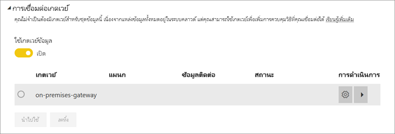
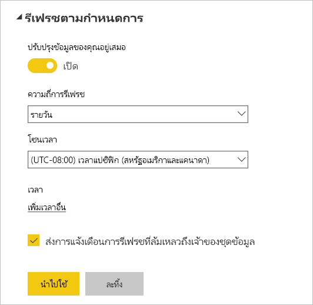

# การกำหนดค่าการรีเฟรชตามกำหนดการ

>[!NOTE]
>หลังจากสองเดือนที่ไม่ได้ใช้งาน การรีเฟรชตามกำหนดการบนชุดข้อมูลของคุณจะหยุดชั่วคราว ดูที่ส่วน[ *กำหนดเวลารีเฟรช* ](#schedule-refresh)ในบทความนี้สำหรับข้อมูลเพิ่มเติมในภายหลัง
> 
> 

ถ้าชุดข้อมูลของคุณสนับสนุนการรีเฟรชตามกำหนดการ จะมีข้อกำหนดและตั้งค่าที่สำคัญเพื่อทำให้การรีเฟรชสำเร็จ โดยใช้ “รีเฟรชตอนนี้” และ “กำหนดเวลารีเฟรช” นี่คือ**การเชื่อมต่อเกตเวย์**, **ข้อมูลประจำตัวของแหล่งข้อมูล**และ**กำหนดเวลารีเฟรช** มาดูรายละเอียดของแต่ละส่วนกัน:

สิ่งนี้จะอธิบายถึงตัวเลือกที่พร้อมใช้งานสำหรับทั้ง[Power BI Gateway – ส่วนบุคคล](service-gateway-personal-mode.md)และ[เกตเวย์ข้อมูลภายในองค์กร](service-gateway-onprem.md)

เมื่อต้องการไปยังหน้าจอกำหนดเวลารีเฟรช คุณสามารถทำตามต่อไปนี้

1. เลือก**จุดไข่ปลา (...)** ถัดจากชุดข้อมูลที่ระบุภายใต้**ชุดข้อมูล**
2. เลือก**กำหนดเวลารีเฟรช**
   
    

## การเชื่อมต่อเกตเวย์
คุณจะเห็นตัวเลือกที่แตกต่างกันต่อไปนี้โดยขึ้นอยู่กับว่าคุณมีเกตเวย์ส่วนบุคคล หรือ เกตเวย์องค์กรที่ออนไลน์ และพร้อมใช้งานหรือไม่

ถ้าไม่มีเกตเวย์ที่พร้อมใช้งาน คุณจะเห็น**การตั้งค่าเกตเวย์**ถูกปิดใช้งาน นอกจากนี้คุณจะเห็นข้อความระบุวิธีการติดตั้งเกตเวย์ส่วนบุคคล

ถ้าคุณกำหนดค่าเกตเวย์ส่วนบุคคลแล้ว คุณจะสามารถเลือกได้หากออนไลน์อยู่ ถ้ายังไม่พร้อมใช้งานจะแสดงเป็นออฟไลน์

คุณยังสามารถเลือกเกตเวย์องค์กร ถ้าหากเกตเวย์พร้อมใช้งานสำหรับคุณ คุณจะเห็นว่าเกตเวย์องค์กรพร้อมใช้งานเฉพาะเมื่อบัญชีของคุณจะแสดงอยู่ในแท็บ “ผู้ใช้” ของแหล่งข้อมูลที่กำหนดค่าไว้สำหรับเกตเวย์ที่ระบุ

## ข้อมูลประจำตัวของแหล่งข้อมูล
### Power BI Gateway - ส่วนบุคคล
ถ้าคุณกำลังใช้เกตเวย์ส่วนบุคคลเพื่อรีเฟรชข้อมูล คุณจะต้องใส่ข้อมูลประจำตัวที่ใช้ในการเชื่อมต่อกับแหล่งข้อมูลหลังบ้าน ถ้าคุณเชื่อมต่อกับชุดเนื้อหา ข้อมูลประจำตัวที่คุณใส่เพื่อเชื่อมต่อจะดำเนินการสำหรับการรีเฟรชตามกำหนดการจากบริการออนไลน์

คุณจำเป็นต้องลงชื่อเข้าใช้แหล่งข้อมูลในครั้งแรกที่คุณใช้การรีเฟรชบนชุดข้อมูลเท่านั้น เมื่อใส่แล้ว ข้อมูลประจำตัวเหล่านั้นจะยังคงอยู่กับชุดข้อมูล

> [!NOTE]
> สำหรับวิธีการรับรองความถูกต้องบางวิธี ถ้ารหัสผ่านที่คุณใช้เพื่อลงชื่อเข้าใช้แหล่งข้อมูลหมดอายุ หรือมีการเปลี่ยนแปลง คุณจะต้องเปลี่ยนรหัสผ่านสำหรับแหล่งข้อมูลในข้อมูลประจำตัวของแหล่งข้อมูลด้วย
> 
> 

เมื่อเกิดสิ่งผิดปกติขึ้น ซึ่งโดยปกติปัญหาแล้วจะเกี่ยวกับเกตเวย์ที่ออฟไลน์เนื่องจากไม่สามารถลงชื่อเข้าใช้ Windows และเริ่มบริการ หรือเกี่ยวกับ Power BI ไม่สามารถไม่ลงชื่อเข้าใช้แหล่งข้อมูลเพื่อคิวรีสำหรับข้อมูลที่อัปเดต ถ้าการรีเฟรชล้มเหลว ตรวจสอบการตั้งค่าของชุดข้อมูล ถ้าบริการเกตเวย์อยู่ในสถานะออฟไลน์ คุณจะเห็นข้อผิดพลาดที่สถานะเกตเวย์ ถ้า Power BI ไม่สามารถลงชื่อเข้าใช้แหล่งข้อมูล คุณจะเห็นข้อผิดพลาดในข้อมูลประจำตัวของแหล่งข้อมูล

### เกตเวย์ข้อมูลภายในองค์กร
ถ้าคุณกำลังใช้เกตเวย์ข้อมูลในองค์กรเพื่อรีเฟรชข้อมูล คุณไม่จำเป็นต้องใส่ข้อมูลประจำตัวเนื่องจากมีการกำหนดไว้แล้วสำหรับแหล่งข้อมูล โดยผู้ดูแลเกตเวย์

> [!NOTE]
> เมื่อเชื่อมต่อกับ SharePoint ภายในองค์กรสำหรับการรีเฟรชข้อมูล Power BI สนับสนุนเฉพาะกลไกพิสูจน์ตัวตน*Anonymous*, *Basic*และ*Windows (NTLM/Kerberos)* Power BI ไม่รองรับ *ADFS*หรือ*กลไลการพิสูจน์ตัวตนพื้นฐานแบบฟอร์ม*กลไกสำหรับการรีเฟรชข้อมูลของแหล่งข้อมูล SharePoint ภายในองค์กร
> 
> 

## กำหนดเวลารีเฟรช
คุณสามารถกำหนดความถี่ที่และช่วงเวลาเพื่อรีเฟรชชุดข้อมูลได้ที่ส่วนการรีเฟรชตามกำหนดการ แหล่งข้อมูลบางแหล่งไม่จำเป็นต้องมีเกตเวย์เพื่อให้สามารถใช้งานการกำหนดค่า แต่ส่วนอื่นๆจำเป็นต้องมีต้องใช้เกตเวย์

คุณต้องตั้งค่าแถบ**อัปเดตข้อมูลของคุณอยู่เสมอ**โดยเลื่อนไปที่**ใช่**เพื่อกำหนดค่าการตั้งค่า

> [!NOTE]
> บริการ Power BI ตั้งเป้าหมายเริ่มต้นการรีเฟรชข้อมูลของคุณภายใน**15 นาที**ของเวลาการรีเฟรชตามกำหนดการ
> 
> 

> [!NOTE]
> หลังจากสองเดือนที่ไม่ได้ใช้งาน การรีเฟรชตามกำหนดการบนชุดข้อมูลของคุณจะหยุดชั่วคราว หากไม่มีผู้ใช้เข้าเยี่ยมชมแดชบอร์ดหรือรายงานใด ๆ ที่สร้างบนชุดข้อมูล จะถือว่าชุดข้อมูลนั้นไม่ได้ใช้งาน ในเวลานั้น เจ้าของชุดข้อมูลจะได้รับอีเมล์ที่ระบุว่าการรีเฟรชตามกำหนดการจะหยุดชั่วคราว และกำหนดการรีเฟรชสำหรับชุดข้อมูลจะแสดงเป็น**ปิดใช้งาน** เมื่อต้องการทำการรีเฟรชตามกำหนดการต่อ เพียงแค่เข้าไปที่แดชบอร์ดหรือรายงานใด ๆ ที่สร้างบนชุดข้อมูลอีกครั้ง
> 
> 

## อะไรบ้างที่ได้รับการสนับสนุน
ชุดข้อมูลบางชุดได้รับการสนับสนุนเกตเวย์ที่แตกต่างกันสำหรับการรีเฟรชตามกำหนดการ นี่คือข้อมูลอ้างอิงเพื่อทำความเข้าใจว่ามีอะไรพร้อมใช้งานอยู่

### Power BI Gateway - ส่วนบุคคล
**Power BI Desktop**

* แหล่งข้อมูลออนไลน์ทั้งหมดที่แสดงใน “รับข้อมูลและตัวแก้ไขคิวรี” ของ Power BI Desktop
* แหล่งข้อมูลภายในองค์กรทั้งหมดที่แสดงอยู่ใน “รับข้อมูลและตัวแก้ไขคิวรี” ของ Power BI Desktop ยกเว้นไฟล์ Hadoop (HDFS) และ Microsoft Exchange

**Excel**

> [!NOTE]
> สำหรับ Excel 2016 และรุ่นใหม่กว่า Power Query จะแสดงอยู่บนส่วนของข้อมูลของ ribbon ใต้ “รับและแปลงข้อมูล” ในขณะนี้
> 
> 

* แหล่งข้อมูลออนไลน์ทั้งหมดที่แสดงใน Power Query
* แหล่งข้อมูลภายในองค์กรทั้งหมดที่แสดงอยู่ใน Power Query ยกเว้นไฟล์ Hadoop (HDFS) และ Microsoft Exchange
* แหล่งข้อมูลออนไลน์ทั้งหมดที่แสดงใน Power Pivot\*
* แหล่งข้อมูลภายในองค์กรทั้งหมดที่แสดงอยู่ใน Power Pivot ยกเว้นไฟล์ Hadoop (HDFS) และ Microsoft Exchange

<!-- Refresh Data sources-->
[!INCLUDE [refresh-datasources](./includes/refresh-datasources.md)]

## การแก้ไขปัญหา
การรีเฟรชข้อมูลอาจไม่เป็นไปตามที่คาดไว้ในบางครั้ง โดยทั่วไปแล้วจะเป็นปัญหาที่เกี่ยวข้องกับเกตเวย์ โปรดดูที่บทความแก้ไขปัญหาเกตเวย์สำหรับเครื่องมือและปัญหาที่ทราบแล้ว

[การแก้ไขปัญหาเกตเวย์ข้อมูลในองค์กร](service-gateway-onprem-tshoot.md)

[การแก้ไขปัญหา Power BI Gateway - ส่วนบุคคล](service-admin-troubleshooting-power-bi-personal-gateway.md)

## ขั้นตอนถัดไป
[การรีเฟรชข้อมูลใน Power BI](refresh-data.md)  
[Power BI Gateway - ส่วนบุคคล](service-gateway-personal-mode.md)  
[เกตเวย์ข้อมูลภายในองค์กร](service-gateway-onprem.md)  
[การแก้ไขปัญหาเกตเวย์ข้อมูลในองค์กร](service-gateway-onprem-tshoot.md)  
[แก้ไขปัญหาเกตเวย์ Power BI - ส่วนบุคคล](service-admin-troubleshooting-power-bi-personal-gateway.md)  

มีคำถามเพิ่มเติมหรือไม่? [ลองถามชุมชน Power BI](http://community.powerbi.com/)

