# สร้างรายงานแบบแบ่งหน้าโดยอ้างอิงจากชุดข้อมูลที่ใช้ร่วมกันของ Power BI

คุณสามารถใช้ชุดข้อมูลที่คุณสร้างใน Power BI Desktop เป็นแหล่งข้อมูลสำหรับรายงานแบบแบ่งหน้าจากตัวสร้างรายงาน Power BI นึกภาพสถานการณ์สมมตินี้: คุณได้สร้างรายงาน Power BI ใน Power BI Desktop คุณใช้เวลามากมายในการออกแบบแบบจำลองข้อมูล จากนั้นสร้างรายงาน Power BI ที่สวยงามพร้อมวิชวลที่ยอดเยี่ยมทุกประเภท รายงานของคุณมีเมทริกซ์ที่มีหลายแถว ดังนั้นคุณต้องเลื่อนเพื่อดูทั้งหมด ผู้อ่านรายงานของคุณต้องการรายงานที่พวกเขาสามารถพิมพ์ออกมาได้ ซึ่งจะแสดงแถวทั้งหมดในเมทริกซ์นั้น รายงานแบบแบ่งหน้าของ Power BI จะสามารถทำได้: พิมพ์ตารางหรือเมทริกซ์ที่รันไปหลายหน้า ด้วยส่วนหัวและส่วนท้ายของหน้าและเค้าโครงหน้าที่สมบูรณ์แบบที่คุณออกแบบ ซึ่งจะเติมเต็มรายงาน Power BI Desktop คุณต้องการให้รายงานยึดตามข้อมูลเดียวกันอย่างแม่นยำ ไม่มีความขัดแย้ง ดังนั้นคุณต้องใช้ชุดข้อมูลเดียวกัน

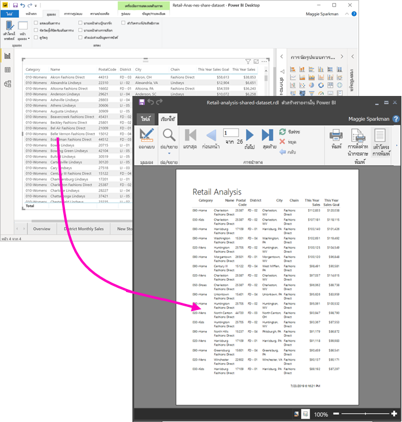

ชุดข้อมูลไม่จำเป็นต้องอยู่ในพื้นที่ทำงานในความจุแบบพรีเมียมและคุณไม่จำเป็นต้องเป็นสมาชิกของพื้นที่ทำงานนั้น คุณเพียงแค่ต้องมี[สิทธิ์ในการสร้าง](service-datasets-build-permissions.md)ชุดข้อมูล ในการเผยแพร่รายงานแบบแบ่งหน้า คุณจำเป็นต้องมีสิทธิ์การใช้งาน Power BI Pro นอกจากนี้คุณยังต้องมีบทบาทผู้สนับสนุนสำหรับพื้นที่ทำงานในความจุพรีเมียมด้วยเป็นอย่างน้อย

## สิ่งที่คุณจำเป็นต้องมี

ต่อไปนี้คือรายการของสิ่งที่คุณจำเป็นต้องและไม่จำเป็นต้องใช้ชุดข้อมูลที่ใช้ร่วมกันในตัวสร้างรายงาน Power BI

- ตัวสร้างรายงานใน Power BI [ดาวน์โหลดและติดตั้งตัวสร้างรายงานใน Power BI](https://go.microsoft.com/fwlink/?linkid=2086513)
- Power BI Desktop [ดาวน์โหลดและติดตั้ง Power BI Desktop](https://powerbi.microsoft.com/desktop/)
- หากต้องการเข้าถึงชุดข้อมูล Power BI คุณจะต้องมีสิทธิ์ในการสร้างชุดข้อมูล อ่านเกี่ยวกับ[สิทธิ์ในการสร้าง](service-datasets-build-permissions.md)
- คุณไม่จำเป็นต้องมีใบอนุญาต Power BI Pro เพื่อสร้างรายงานแบบแบ่งหน้าในตัวสร้างรายงาน 
- คุณจำเป็นต้องมีสิทธิ์การใช้งาน Power BI Pro เพื่อเผยแพร่รายงานแบบแบ่งหน้าของคุณ นอกจากนี้คุณยังต้องมีบทบาทผู้สนับสนุนสำหรับพื้นที่ทำงานในความจุพรีเมียมด้วยเป็นอย่างน้อย 
- ทางเลือก: ถ้าคุณต้องการทำตามบทความนี้ให้ดาวน์โหลดไฟล์ .pbix [ตัวอย่างการวิเคราะห์ด้านการขายปลีก](https://download.microsoft.com/download/9/6/D/96DDC2FF-2568-491D-AAFA-AFDD6F763AE3/Retail%20Analysis%20Sample%20PBIX.pbix)ของ Power BI Desktop จากนั้นเปิดไฟล์ใน Power BI Desktop และเพิ่มตารางที่มีคอลัมน์จำนวนมาก ในบานหน้าต่าง **รูปแบบ** ให้ปิด **ผลรวม** จากนั้นเผยแพร่ไปยังพื้นที่ทำงานในบริการของ Power BI

    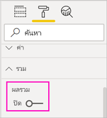

## เชื่อมต่อกับชุดข้อมูล Power BI

1. เกิดตัวสร้างรายงาน Power BI
1. เลือก **ลงชื่อเข้าใช้** ที่มุมบนขวาของตัวสร้างรายงานเพื่อลงชื่อเข้าใช้บัญชี Power BI ของคุณ
1. ในบานหน้าต่างข้อมูลรายงาน ให้เลือก **ใหม่** >  **การเชื่อมต่อชุดข้อมูล Power BI**

    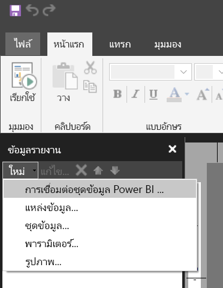

    > [!NOTE]
    > คุณไม่สามารถสร้างแหล่งข้อมูลหรือชุดข้อมูลสำหรับชุดข้อมูล Power BI ได้โดยใช้ตัวช่วยสร้างตาราง เมทริกซ์ หรือแผนภูมิของตัวสร้างรายงาน หลังจากที่คุณได้สร้างขึ้นแล้ว คุณสามารถใช้ตัวช่วยสร้างตาราง เมทริกซ์ หรือแผนภูมิที่ยึดตามรายงานเหล่านั้นได้

1. ค้นหาหรือเรียกดูชุดข้อมูลหรือพื้นที่ทำงานในที่ซึ่งมีชุดข้อมูลอยู่ > **เลือก**
    เติมตัวสร้างรายงานในชื่อชุดข้อมูล

    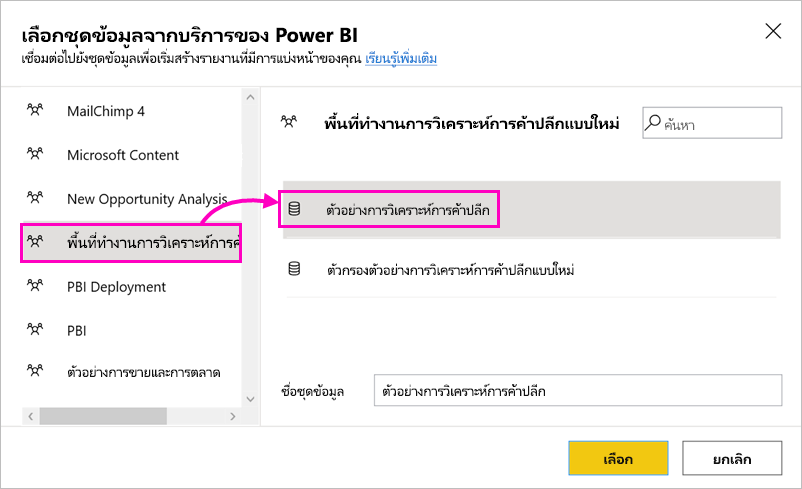
    
1. ชุดข้อมูลจะแสดงอยู่ภายใต้แหล่งข้อมูลในบานหน้าต่างข้อมูลรายงาน

    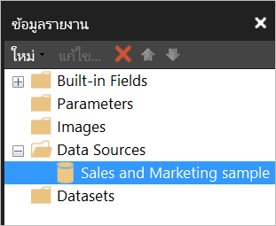

    โปรดจำไว้ว่าคุณสามารถเชื่อมต่อกับชุดข้อมูล Power BI หลายชุดและแหล่งข้อมูลอื่น ๆ ในรายงานแบบแบ่งหน้าเดียวกันได้

## รับคิวรี DAX สำหรับชุดข้อมูล

เมื่อคุณต้องการให้ข้อมูลในรายงาน Power BI ของคุณและในรายงานของตัวสร้างรายงานเป็นแบบเดียวกัน การเชื่อมต่อกับชุดข้อมูลจะไม่เพียงพอ คุณยังจำเป็นต้องมีคิวรีที่สร้างขึ้นบนชุดข้อมูลนั้นด้วย

### วิดีโอ: รับคิวรี DAX

ในวิดีโอต่อไปนี้ Chris Finlan สาธิตวิธีรับ DAX ที่คุณต้องการสำหรับรายงานที่มีการแบ่งหน้าของคุณ

<iframe width="400" height="450" src="https://www.youtube.com/embed/NfoOK4QRkhI" frameborder="0" allowfullscreen></iframe>

### ขั้นตอนในการรับคิวรี DAX

ในตอนนี้นี่คือขั้นตอนในการรับคิวรี

1. เปิดรายงาน Power BI (.pbix) ใน Power BI Desktop
1. ตรวจสอบให้แน่ใจว่าคุณมีตารางในรายงานที่มีข้อมูลทั้งหมดที่คุณต้องการในรายงานแบบแบ่งหน้า ตารางต้องมีคุณสมบัติตรงตามข้อกำหนดทั้งสองนี้:
    - ต้องเป็นตารางแบน ไม่ใช่เมทริกซ์หรือวิชวลอื่น ๆ หากไม่ใช่ตาราง ให้แปลงเป็นตารางตอนนี้ ทำตามขั้นตอนของ Performance Analyzer ที่ตามมา จากนั้นแปลงกลับเป็นวิชวลที่คุณต้องการ
    - สำหรับเขตข้อมูลแบบตัวเลข คุณจำเป็นต้องใช้ *หน่วยวัดที่กำหนดไว้ล่วงหน้า* หน่วยวัดดังกล่าวมีสัญลักษณ์เครื่องคิดเลขอยู่ข้างๆ อ่านเกี่ยวกับ [การสร้างหน่วยวัด](desktop-measures.md) 

        

1. บนริบบอน **มุมมอง** ให้เลือก **ตัววิเคราะห์ประสิทธิภาพ**

    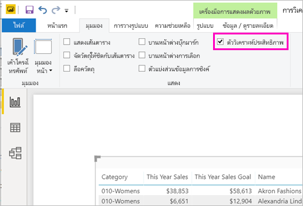

1. ในบานหน้าต่าง **ตัววิเคราะห์ประสิทธิภาพ** ให้เลือก **เริ่มการบันทึก** จากนั้นเลือก **รีเฟรชวิชวล**

    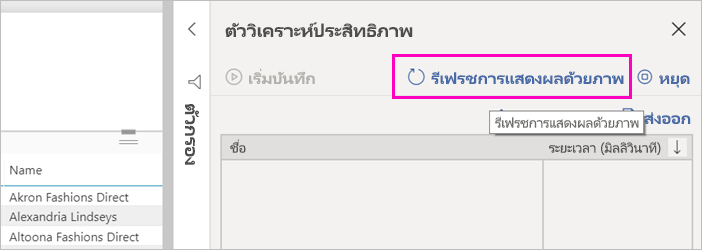

1. ขยายเครื่องหมายบวก ( **+** ) ที่อยู่ถัดจากชื่อตาราง แล้วเลือก**คัดลอกคิวรี** คิวรีเป็นสูตร DAX ที่คุณต้องการสำหรับชุดข้อมูลในตัวสร้างรายงานของ Power BI

    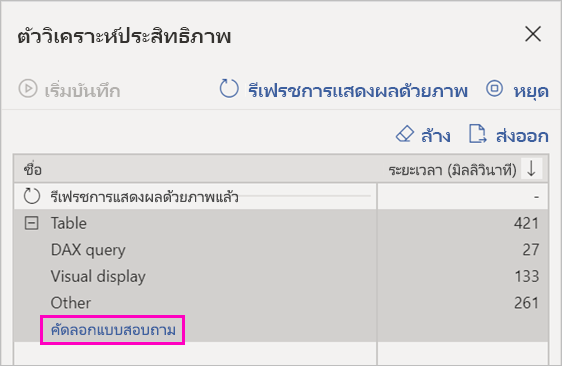

## สร้างชุดข้อมูลพร้อมคิวรี

1. กลับไปที่ตัวสร้างรายงานของ Power BI
1. คลิกขวาที่ชุดข้อมูลภายใต้**แหล่งข้อมูล**และเลือก**เพิ่มชุดข้อมูล**

    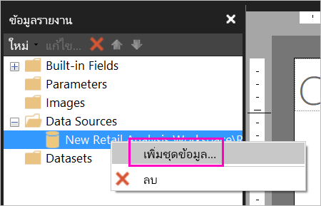

1. ในคุณสมบัติชุดข้อมูล ให้กำหนดชื่อ และเลือก**ตัวออกแบบคิวรี**

4. ตรวจสอบให้แน่ใจว่ามีการเลือก **DAX** และยกเลิกการเลือกไอคอน**โหมดการออกแบบ**

    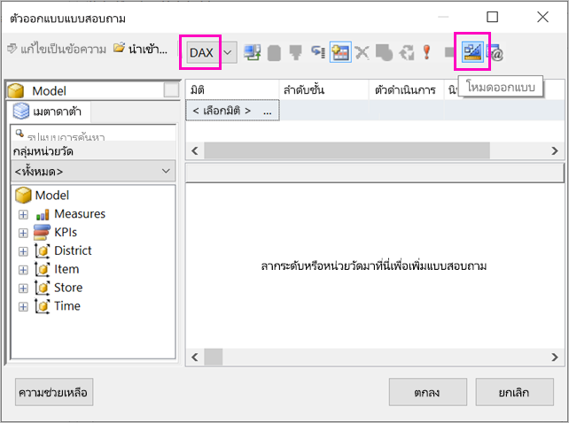

1. ในกล่องด้านบน ให้วางคิวรีที่คุณคัดลอกจาก Power BI Desktop

1. เลือก**ดำเนินการคิวรี** (เครื่องหมายอัศเจรีย์สีแดง !) เพื่อให้แน่ใจว่าคิวรีของคุณทำงาน 

    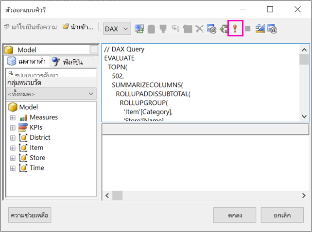

    คุณจะเห็นผลลัพธ์ของคิวรีในกล่องด้านล่าง

    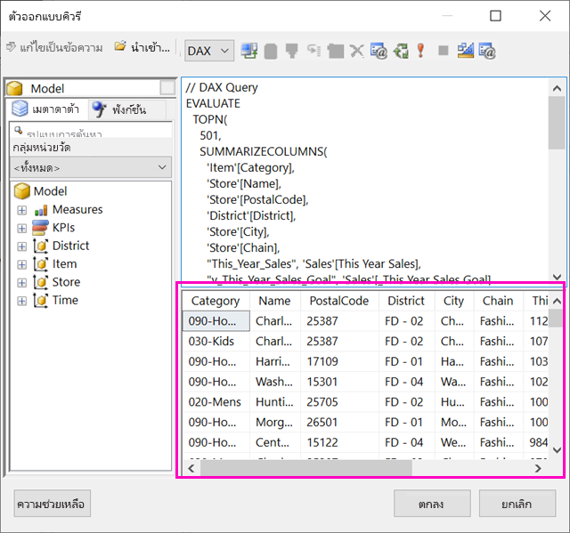

1. เลือก**ตกลง**

    คุณเห็นคิวรีของคุณในหน้าต่าง**คิวรี**ของกล่องโต้ตอบ**คุณสมบัติของชุดข้อมูล**

    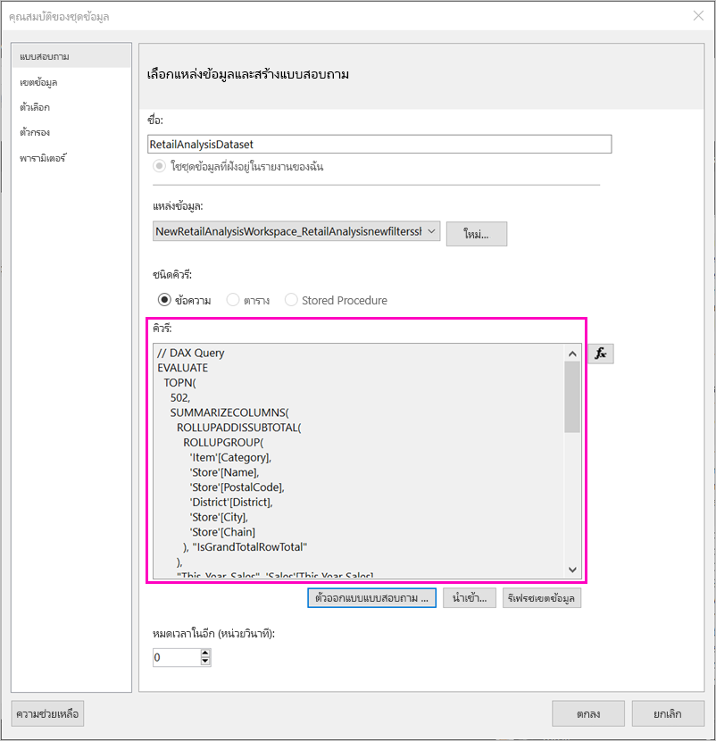

1. เลือก**ตกลง**

    ในตอนนี้คุณจะเห็นชุดข้อมูลใหม่ของคุณที่มีรายการของเขตข้อมูลในบานหน้าต่างข้อมูลรายงาน

    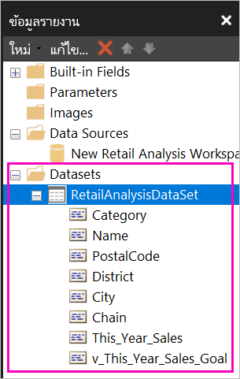

## สร้างตารางในรายงาน

หนึ่งในแนวทางที่รวดเร็วสำหรับการสร้างตารางคือ ใช้ตัวช่วยสร้างตาราง

1. บนริบบอน **แทรก** เลือก **ตาราง** > **ตัวช่วยสร้างตาราง**

    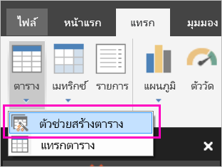

1. เลือกชุดข้อมูลที่คุณสร้างขึ้นด้วยคิวรี DAX > **ถัดไปt**

    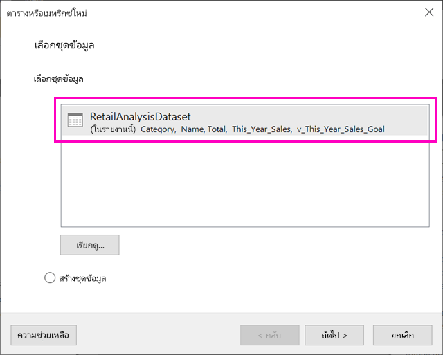

1. หากต้องการสร้างตารางแบน ให้เลือกเขตข้อมูลที่คุณต้องการใน**เขตข้อมูลที่พร้อมใช้งาน** คุณสามารถเลือกเขตข้อมูลหลายรายการในครั้งเดียวโดยการเลือกรายการแรกที่คุณต้องการ จากนั้นกดปุ่ม Shift ค้างไว้และเลือกรายการสุดท้าย

    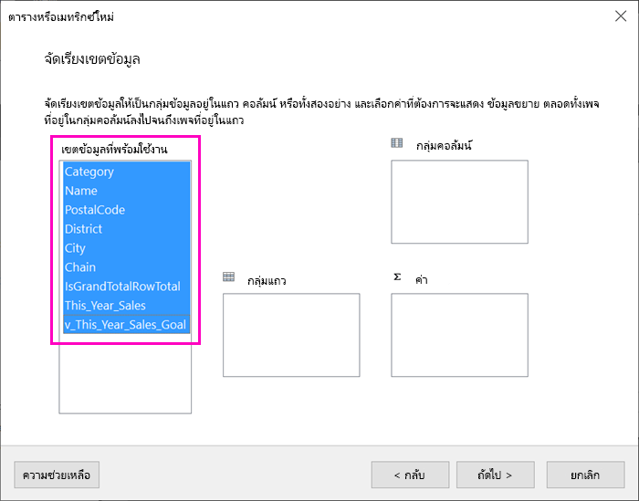

1. ลากเขตข้อมูลไปยังกล่อง**ค่า** > **ถัดไป**

    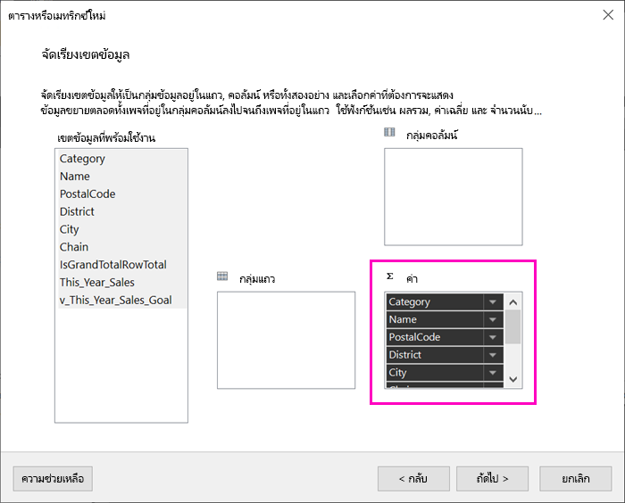

1. เลือกตัวเลือกเค้าโครงที่คุณต้องการ > **ถัดไป**

1. เลือก**เสร็จสิ้น**
    คุณจะเห็นตารางของคุณในมุมมองออกแบบ

    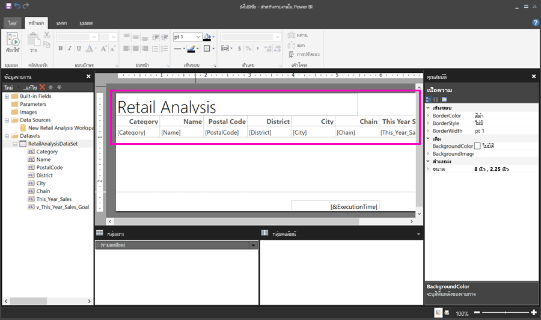

1. เลือก**คลิกเพื่อเพิ่มชื่อเรื่อง**และเพิ่มชื่อเรื่อง

1. เลือก**เรียกใช้** เพื่อแสดงตัวอย่างรายงาน

    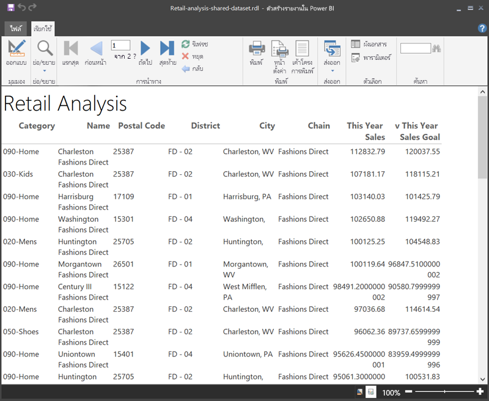

1. เลือก **พิมพ์เค้าโครง** เพื่อดูว่ารายงานของคุณจะมีลักษณะอย่างไร 

    เค้าโครงรายงานนี้ต้องการการทำงานบางอย่าง ซึ่งมี 54 หน้า เนื่องจากคอลัมน์และระยะขอบทำให้ตารางกว้างสองหน้า

    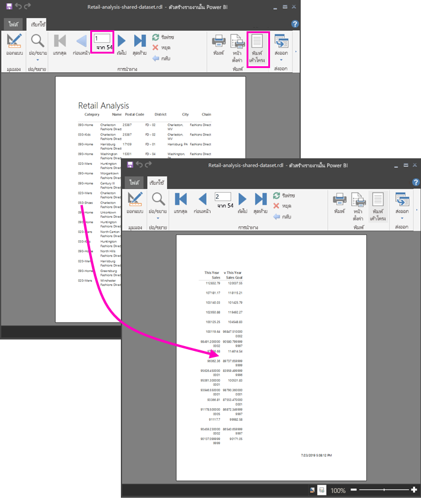

## จัดรูปแบบรายงาน

คุณมีตัวเลือกการจัดรูปแบบหลายตัวเลือกเพื่อทำให้ตารางของคุณพอดีกับหนึ่งหน้า 

1. คุณสามารถบีบระยะขอบของหน้าให้แคบลงได้ในบานหน้าต่างคุณสมบัติ หากคุณไม่เห็นบานหน้าต่างคุณสมบัติ บนริบบอน **มุมมอง** ให้เลือกช่องทำเครื่องหมาย **คุณสมบัติ**

1. เลือกรายงาน ไม่ใช่ตารางหรือชื่อเรื่อง
1. ในบานหน้าต่าง **คุณสมบัติของรายงาน** ภายใต้ **หน้า**, ขยาย **ระยะขอบ** และเปลี่ยนแต่ละรายการเป็น **0.75in**

    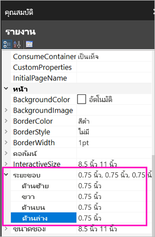

1. คุณยังสามารถทำให้คอลัมน์แคบลงได้อีกด้วย เลือกเส้นขอบคอลัมน์และลากด้านขวาไปทางซ้าย

    

1. ตัวเลือกอื่นคือ เพื่อตรวจสอบให้แน่ใจว่ามีการจัดรูปแบบค่าตัวเลขไว้อย่างดีแล้ว เลือกเซลล์ที่มีค่าตัวเลข 
    > [!TIP]
    > คุณสามารถจัดรูปแบบได้มากกว่าหนึ่งเซลล์ในครั้งเดียวโดยการกดแป้น Shift ค้างไว้ในขณะที่คุณเลือกเซลล์อื่นๆ

    

1. บนริบบอน **หน้าแรก** ในส่วน **ตัวเลข** ให้เปลี่ยนรูปแบบ **ค่าเริ่มต้น** เป็นรูปแบบตัวเลข เช่น **สกุลเงิน**

    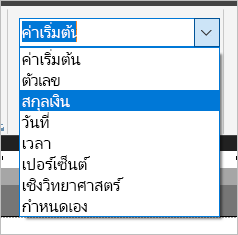

1. เปลี่ยนสไตล์ **ข้อความตัวอย่าง** เป็น **ค่าตัวอย่าง** เพื่อให้คุณเห็นการจัดรูปแบบในเซลล์ 

    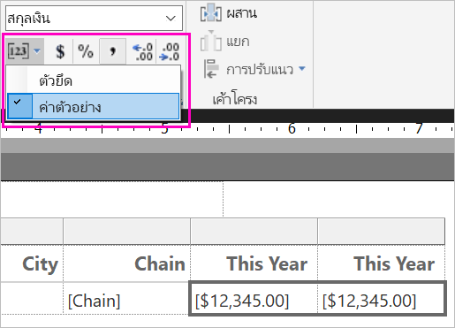

1. หากเหมาะสม ในส่วน **ตัวเลข** ให้ลดตำแหน่งทศนิยมเพื่อประหยัดพื้นที่มากขึ้น

### การกำจัดหน้าว่าง

แม้ว่าคุณจะทำให้ระยะขอบและคอลัมน์ของตารางแคบลง แต่รายงานของคุณก็อาจลงท้ายด้วยหน้าว่างเปล่าได้ ทำไม? เป็นเรื่องของคณิตศาสตร์ 

เมื่อคุณเพิ่มระยะขอบของหน้าตามที่คุณตั้งค่าไว้ รวมถึงความกว้างของ*เนื้อความ*ในรายงาน ซึ่งจะต้องมีค่าน้อยกว่าความกว้างของรูปแบบรายงาน

ตัวอย่างเช่น สมมติว่ารายงานของคุณมีรูปแบบ 8.5" X 11" และคุณได้ตั้งค่าระยะขอบด้านข้างแต่ละด้านเป็น 0.75 ระยะขอบทั้งสองบีบเข้าหากันรวม 1.5" ดังนั้นส่วนเนื้อความจะต้องมีความกว้างน้อยกว่า 7"

1. เลือกขอบด้านขวาของพื้นผิวการออกแบบรายงานและลาก ดังนั้นจึงมีค่าน้อยกว่าจำนวนที่ต้องการบนไม้บรรทัด 

    > [!TIP]
    > คุณสามารถตั้งค่าได้อย่างแม่นยำยิ่งขึ้นในคุณสมบัติ **เนื้อความ** ภายใต้ **ขนาด** ให้ตั้งค่าคุณสมบัติ **ความกว้าง**

    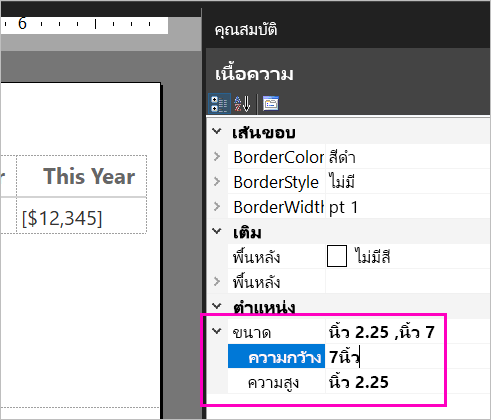

1. เลือก **เรียกใช้งาน** เพื่อดูตัวอย่างรายงานของคุณและตรวจสอบให้แน่ใจว่าคุณได้กำจัดหน้าว่างเปล่า ในตอนนี้ รายงานนี้มีเพียง 26 หน้าแทนที่จะเป็น 54 ตามเดิม สำเร็จ!

    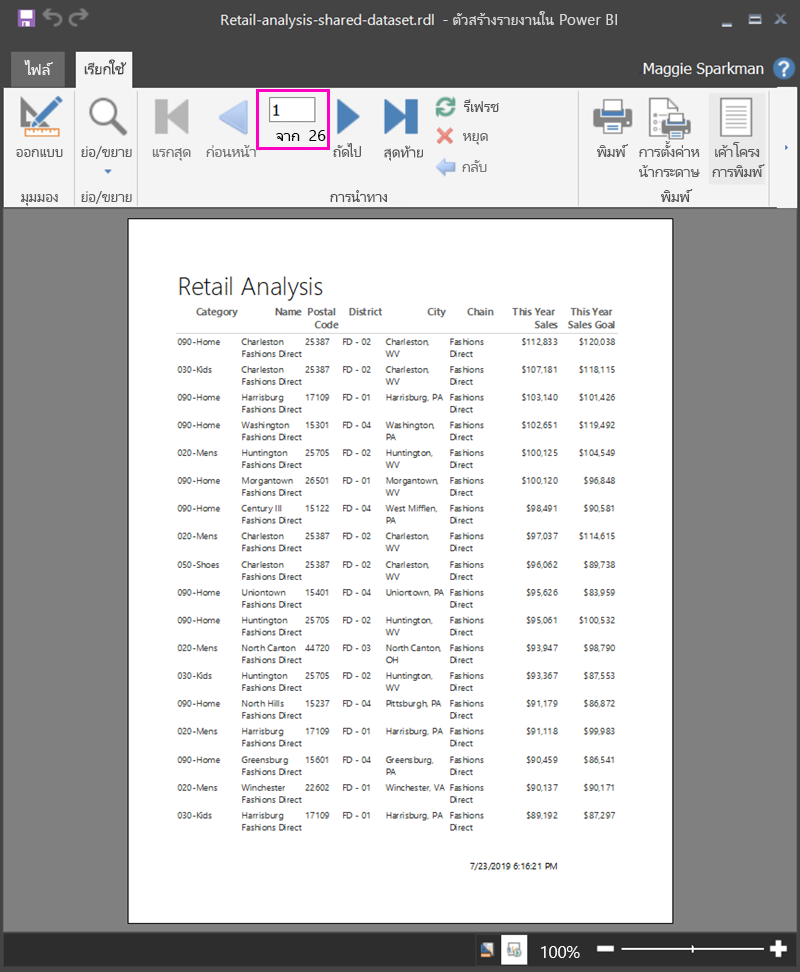

## ข้อจำกัดและข้อควรพิจารณา 

- สำหรับชุดข้อมูลที่ใช้การเชื่อมต่อสดไปยังบริการวิเคราะห์ข้อมูล คุณสามารถเชื่อมต่อโดยตรงโดยใช้การเชื่อมต่อบริการวิเคราะห์พื้นฐานแทนชุดข้อมูลที่ใช้ร่วมกัน
- ชุดข้อมูลที่มีการส่งเสริมหรือได้รับการรับรองจะปรากฏในรายการชุดข้อมูลที่มี แต่ไม่ได้ทำเครื่องหมายเช่นนั้น 
- คุณไม่สามารถฝังรายงานที่มีการแบ่งหน้าที่อ้างอิงตามชุดข้อมูลที่ใช้ร่วมกันของ Power BI ในสถานการณ์ "แอปเป็นเจ้าของข้อมูล"

## ขั้นตอนถัดไป

- [รายงานแบบแบ่งหน้าใน Power BI Premium คืออะไร](paginated-reports-report-builder-power-bi.md)