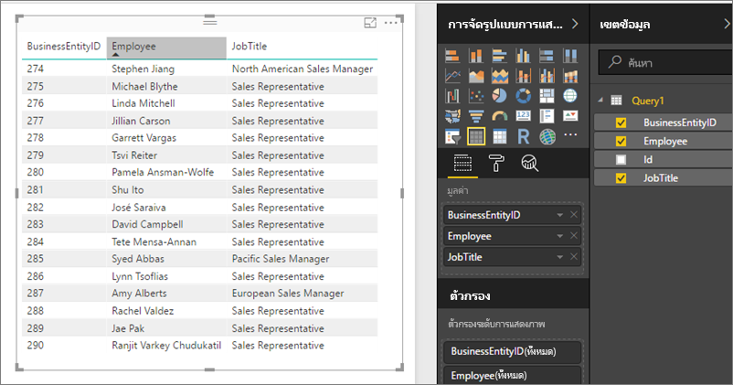

# เข้าถึงชุดข้อมูลที่ใช้ร่วมกันเป็นฟีด OData ในเซิร์ฟเวอร์รายงาน Power BI
คุณสามารถเข้าถึงชุดข้อมูลที่ใช้ร่วมกันจาก Power BI Desktop ด้วยฟีด OData

1. คุณสามารถเชื่อมต่อกับแหล่งข้อมูล OData ได้โดย URL ของฟีด OData
   
    
2. หลังจากที่คุณนำข้อมูลลงใน Power BI Desktop คุณจะสามารถปรับเปลี่ยนได้ในตัวแก้ไขแบบสอบถาม
   
    
3. คุณสามารถใช้ข้อมูลในการออกแบบรายงานได้ในขณะนี้
   
    

โปรดตรวจสอบให้แน่ใจว่าใช้**ตัวเลือกขั้นสูง**เพื่อที่คุณจะสามารถเปิดใช้งานคอลัมน์ชนิดเปิด และจัดรูปแบบคอลัมน์ตาม Power Query ตามความต้องการของคุณ

อ่านเพิ่มเติมเกี่ยวกับ[เชื่อมต่อกับฟีด OData ใน Power BI Desktop](../desktop-connect-odata.md)

คุณมีคำถามเพิ่มเติมหรือไม่ [ลองถามชุมชน Power BI](https://community.powerbi.com/)

